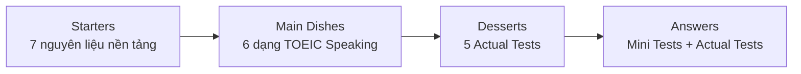
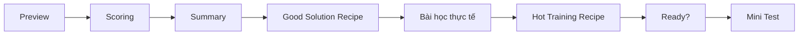

# Tomato TOEIC Speaking Flow - Course Pack

Bộ Markdown này được tái cấu trúc từ bản scan **Tomato TOEIC Speaking Flow** để dễ học theo bài thay vì phải lật toàn bộ PDF.

## Cách dùng

1. Bắt đầu bằng `00-lo-trinh-hoc.md` và `01-tong-quan-va-cau-truc-sach.md`.
2. Học 7 bài nền tảng trong thư mục `02-starters/`.
3. Học lần lượt 6 dạng câu hỏi trong `03-main-dishes/`.
4. Làm Mini Test ở cuối mỗi dạng trước khi sang dạng kế tiếp.
5. Làm 5 đề trong `04-actual-tests/` dưới điều kiện bấm giờ.
6. Chỉ mở `05-answer-key/` sau khi đã tự trả lời hoặc tự ghi âm.

## Cấu trúc nguồn

Sách dùng ẩn dụ nấu ăn:

Mỗi dạng trong phần **Main Dishes** nhìn chung đi theo chu trình:

## Assets

- `assets/pages/`: 318 ảnh trang được render từ bản scan gốc.
- `assets/contact/`: contact sheet theo từng phần để duyệt nhanh.
- Các bài `.md` liên kết tới trang nguồn bằng đường dẫn tương đối.

> Ghi chú: PDF gốc là bản scan hình ảnh nên gần như không có text layer. Vì vậy pack này ưu tiên **tái cấu trúc kiến thức, flow, chiến lược và trang tham chiếu**, thay vì cố OCR toàn bộ từng dòng và có nguy cơ làm sai nội dung.
