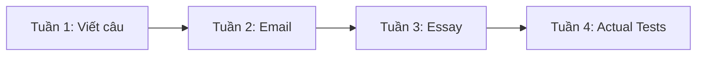

# Lộ trình học 4 tuần

## Tuần 1
Preview -> 5 Recipe ngữ pháp/cấu trúc -> Mini Test.

## Tuần 2
About Email -> 5 chức năng email -> Mini Test.

## Tuần 3
About Essay -> Preview -> 5 chủ đề -> Mini Test.

## Tuần 4
Actual Test 1-5 + Answers + error log.
