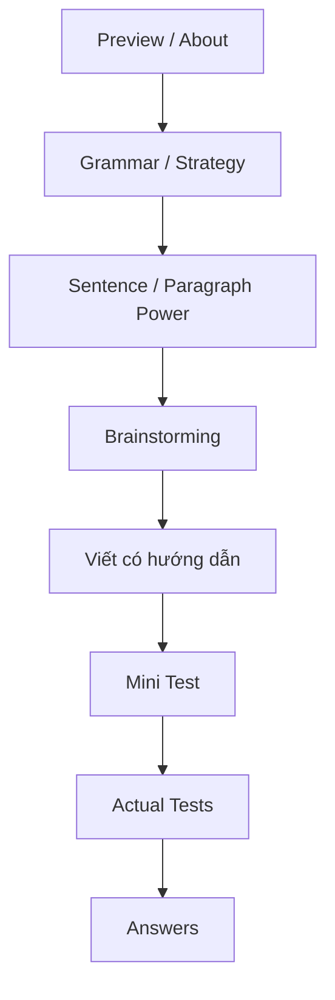
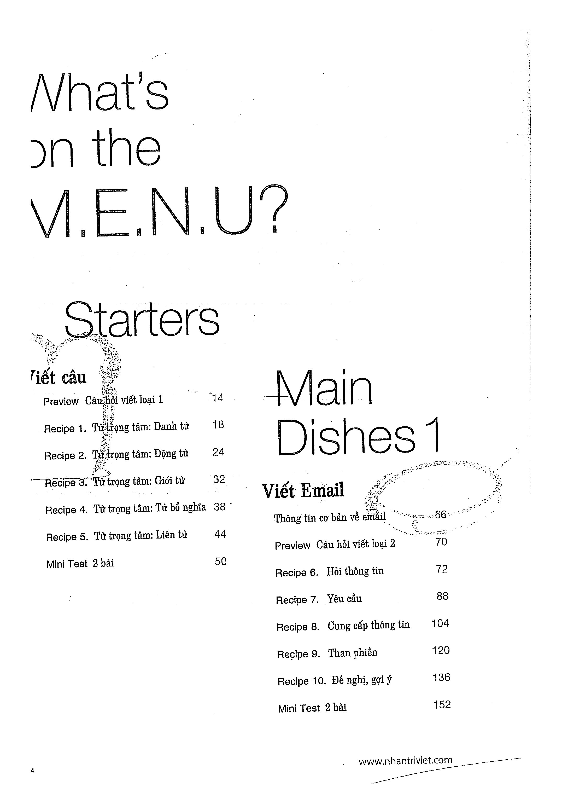
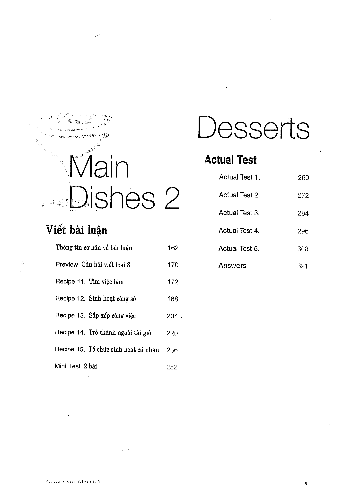
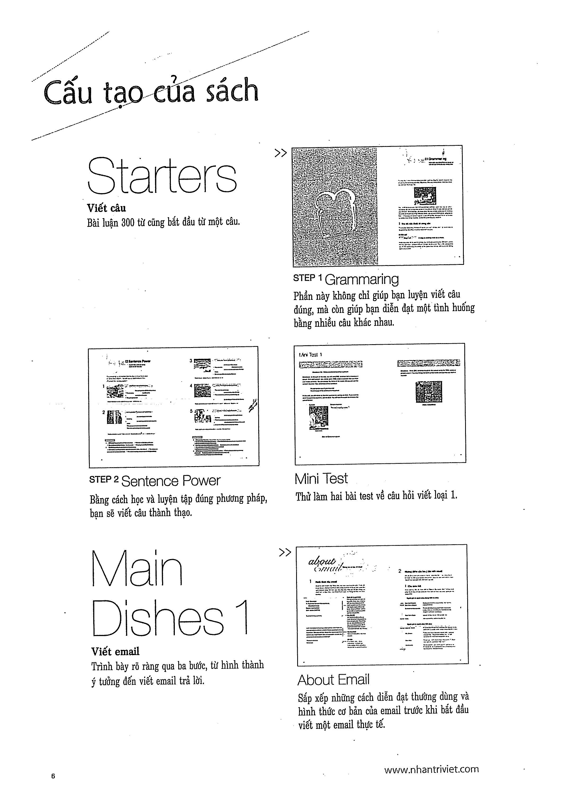
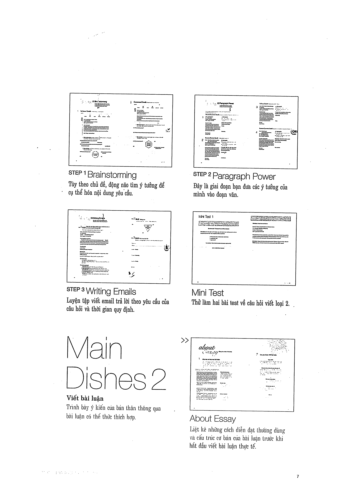
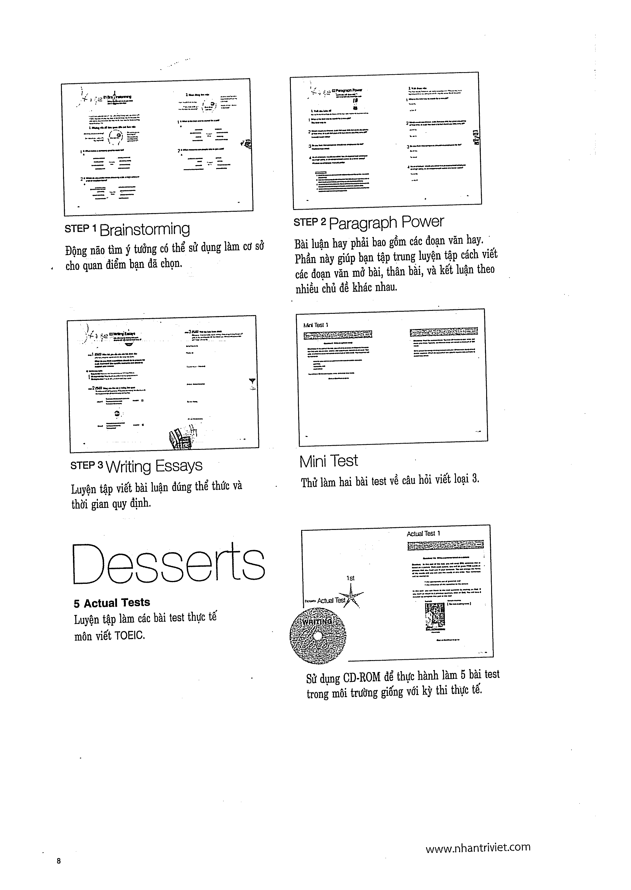

# Tổng quan và cấu trúc sách

## M.E.N.U
- **Starters** - Viết câu
- **Main Dishes 1** - Viết Email
- **Main Dishes 2** - Viết bài luận
- **Desserts** - Actual Tests

```mermaid
flowchart TD
    A[Preview / About] --> B[Grammar / Strategy]
    B --> C[Sentence / Paragraph Power]
    C --> D[Brainstorming]
    D --> E[Viết có hướng dẫn]
    E --> F[Mini Test]
    F --> G[Actual Tests]
    G --> H[Answers]
```

