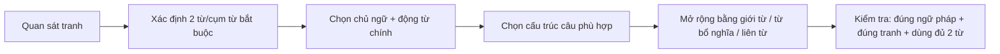
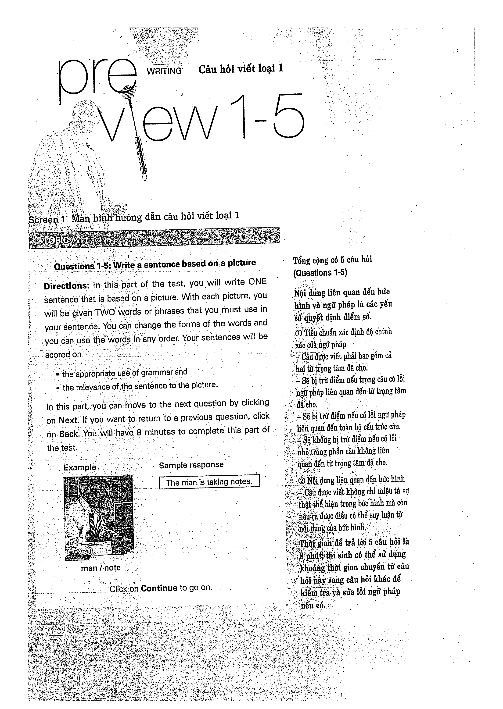
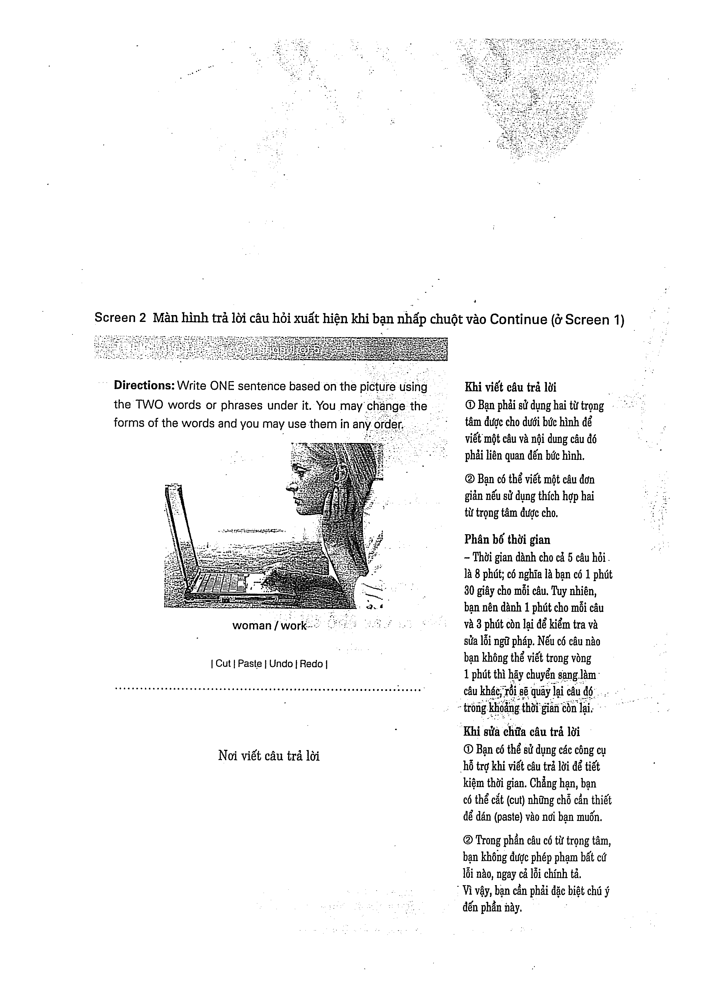

# Preview: Câu hỏi viết loại 1

## Mục tiêu
- Hiểu dạng **Questions 1-5: Write a sentence based on a picture**.
- Dùng đủ hai từ/cụm từ bắt buộc trong **một câu** liên quan đến tranh.

## Checklist
- [ ] Có chủ ngữ + động từ chính.
- [ ] Dùng đủ hai từ/cụm từ.
- [ ] Nội dung đúng với tranh.
- [ ] Kiểm tra số ít/số nhiều, thì, giới từ, liên từ.

## Trang nguồn

Phần này được trình bày lại từ **trang 14-17** của bản scan. Ảnh gốc đã được tách riêng trong `assets/pages/`.

> Đối chiếu toàn bộ: `assets/pages/page-014.png` -> `assets/pages/page-017.png`.
