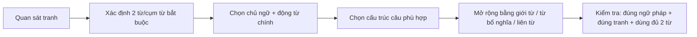
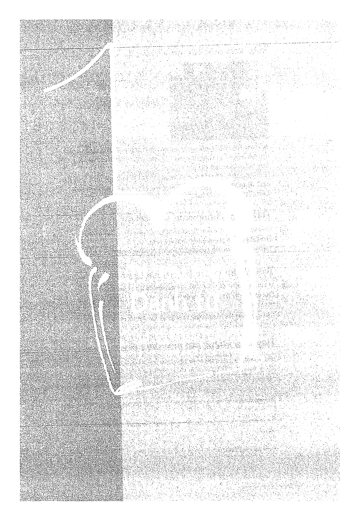
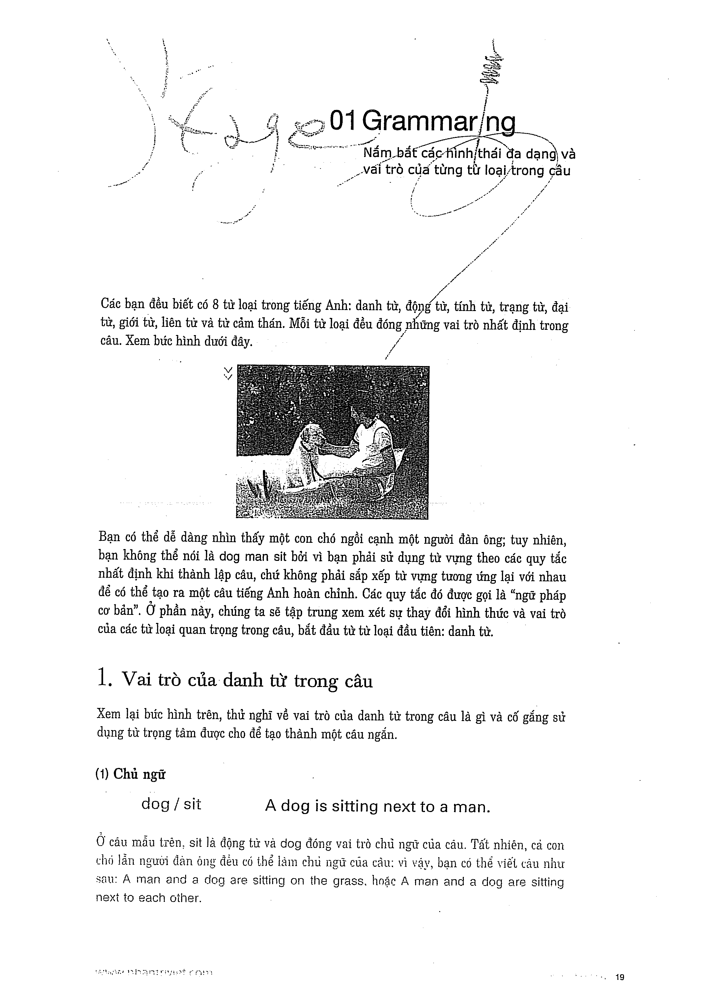

# Recipe 1 - Trọng tâm: Danh từ

## Trọng tâm
Nguồn luyện **vai trò và hình thái của danh từ** trong câu mô tả tranh.

- Danh từ làm **chủ ngữ**.
- Danh từ làm **tân ngữ**.
- Danh từ đứng sau **giới từ**.
- Số ít/số nhiều, đếm được/không đếm được và từ hạn định.

## Trang nguồn

Phần này được trình bày lại từ **trang 18-23** của bản scan. Ảnh gốc đã được tách riêng trong `assets/pages/`.

> Đối chiếu toàn bộ: `assets/pages/page-018.png` -> `assets/pages/page-023.png`.
