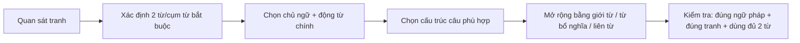
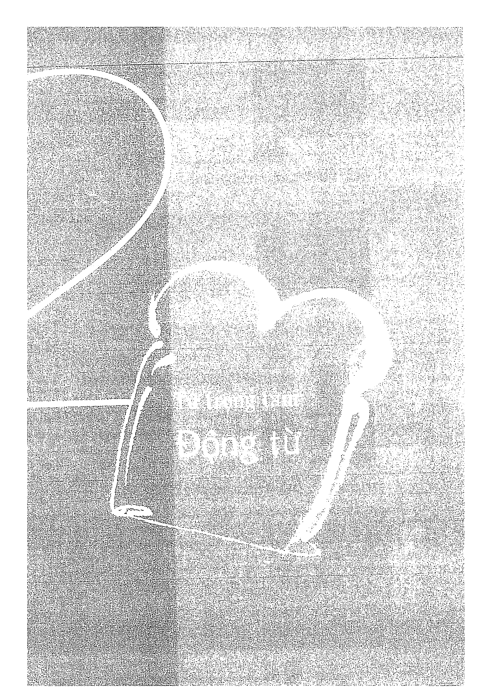
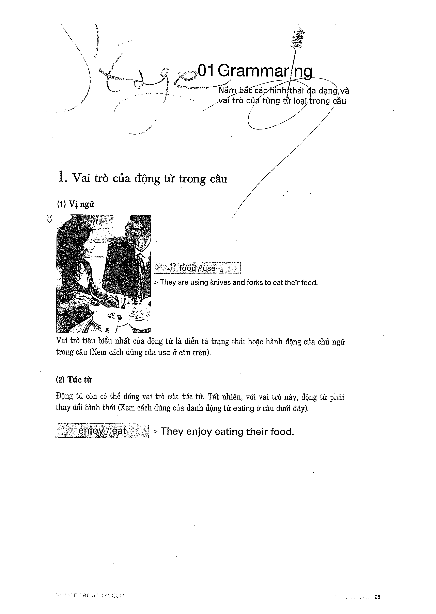

# Recipe 2 - Trọng tâm: Động từ

## Trọng tâm
Chọn động từ phù hợp với hình ảnh và biến đổi dạng động từ theo chủ ngữ, trạng thái hành động, chủ động/bị động.

## Tự kiểm tra
- Chủ ngữ số ít hay số nhiều?
- Hành động đang diễn ra hay đã hoàn tất?
- Cần chủ động hay bị động?

## Trang nguồn

Phần này được trình bày lại từ **trang 24-31** của bản scan. Ảnh gốc đã được tách riêng trong `assets/pages/`.

> Đối chiếu toàn bộ: `assets/pages/page-024.png` -> `assets/pages/page-031.png`.
