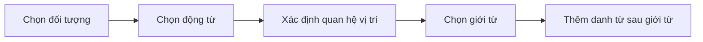
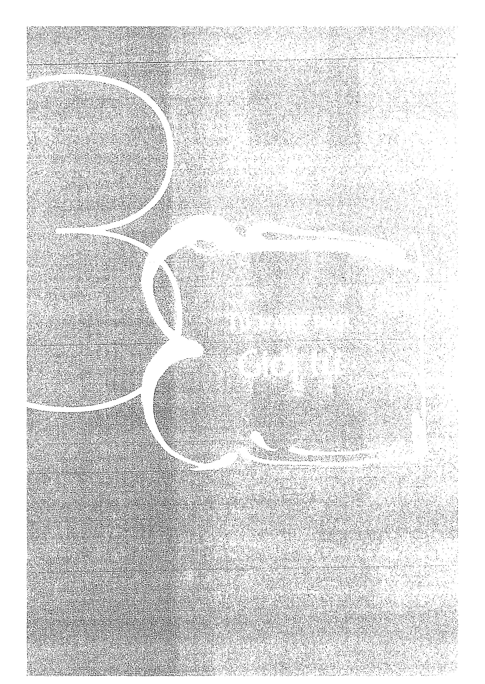
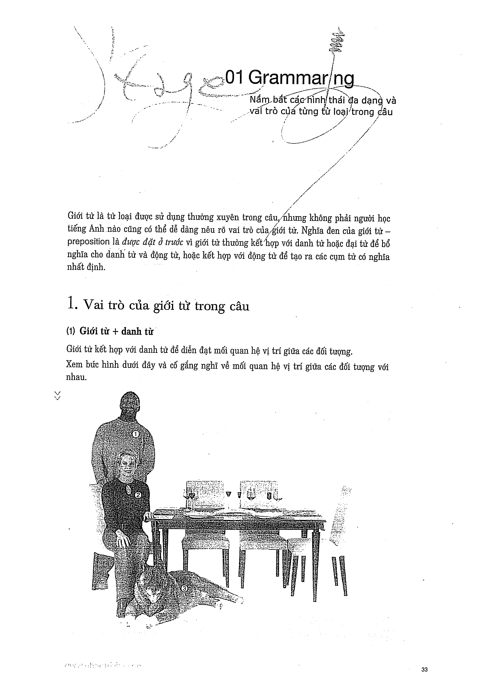

# Recipe 3 - Trọng tâm: Giới từ

## Trọng tâm
Dùng cụm giới từ để diễn tả vị trí và quan hệ giữa người/vật trong tranh.

## Trang nguồn

Phần này được trình bày lại từ **trang 32-37** của bản scan. Ảnh gốc đã được tách riêng trong `assets/pages/`.

> Đối chiếu toàn bộ: `assets/pages/page-032.png` -> `assets/pages/page-037.png`.
