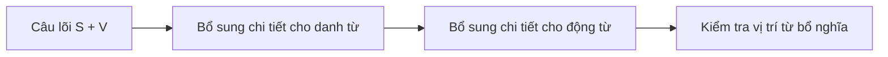
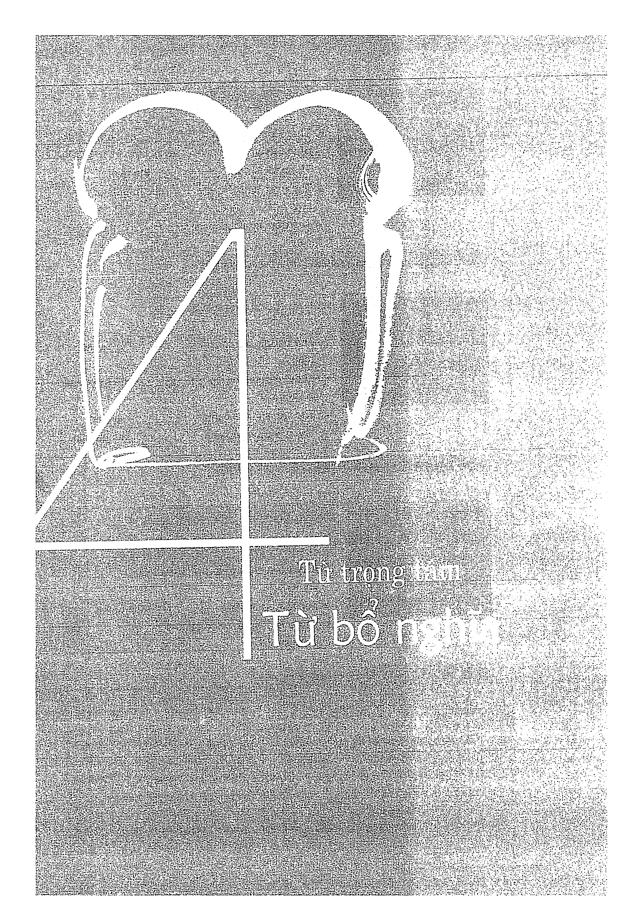
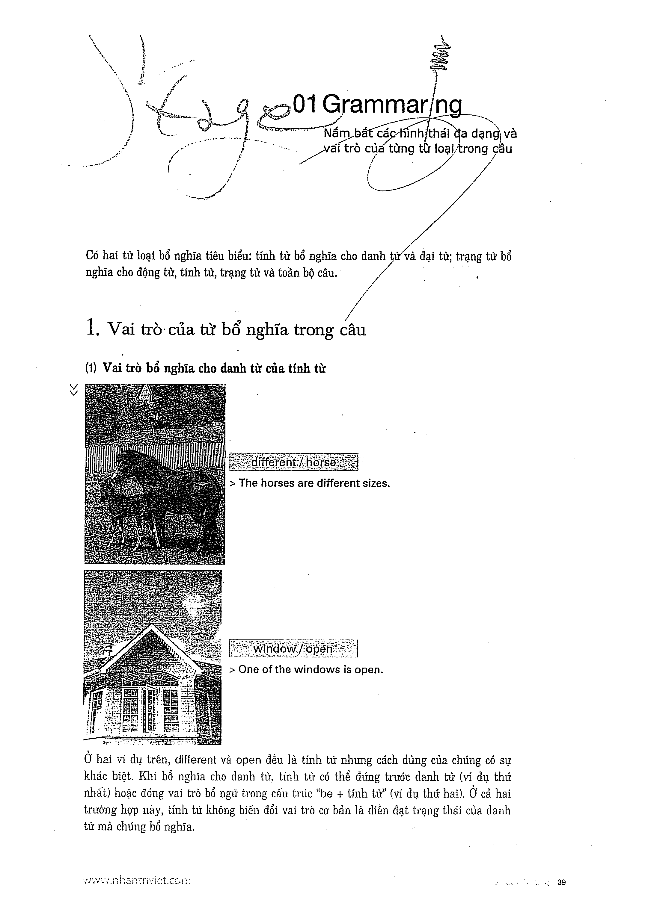

# Recipe 4 - Trọng tâm: Từ bổ nghĩa

## Trọng tâm
Mở rộng câu bằng từ bổ nghĩa cho danh từ hoặc động từ, nhưng vẫn giữ câu rõ và đúng với tranh.

## Trang nguồn

Phần này được trình bày lại từ **trang 38-43** của bản scan. Ảnh gốc đã được tách riêng trong `assets/pages/`.

> Đối chiếu toàn bộ: `assets/pages/page-038.png` -> `assets/pages/page-043.png`.
