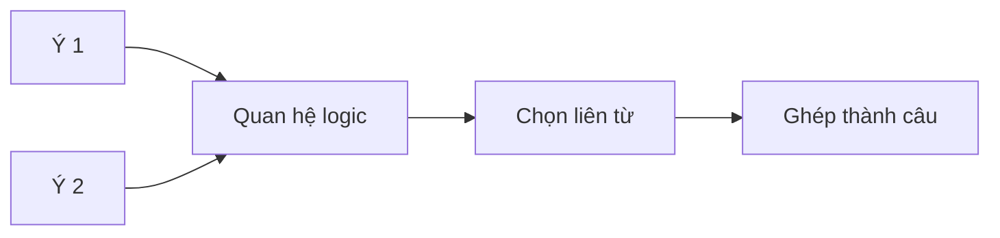
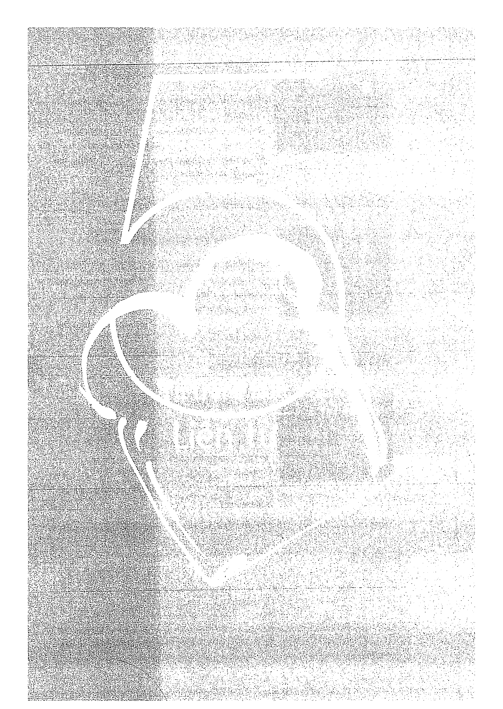
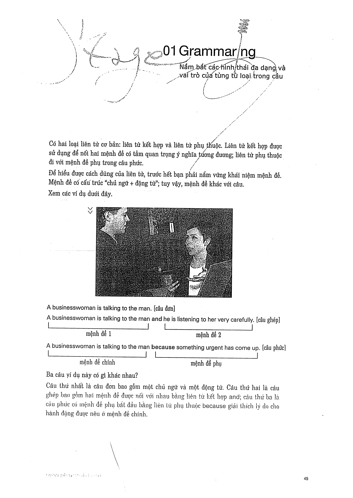

# Recipe 5 - Trọng tâm: Liên từ

## Trọng tâm
Dùng liên từ để nối hai ý có quan hệ logic trong cùng một câu.

## Trang nguồn

Phần này được trình bày lại từ **trang 44-49** của bản scan. Ảnh gốc đã được tách riêng trong `assets/pages/`.

> Đối chiếu toàn bộ: `assets/pages/page-044.png` -> `assets/pages/page-049.png`.
