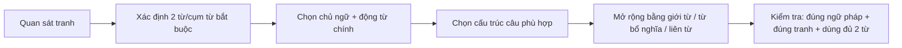
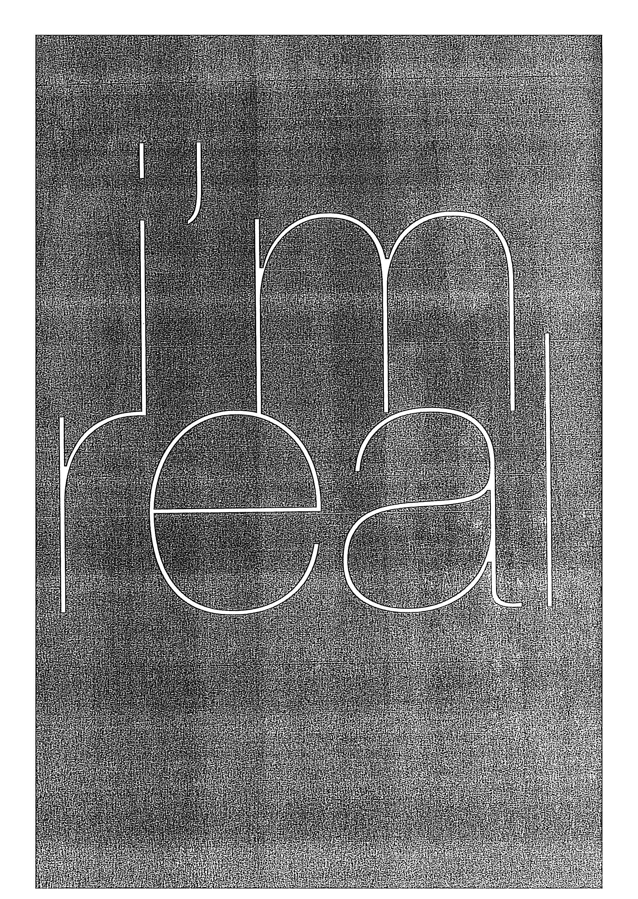
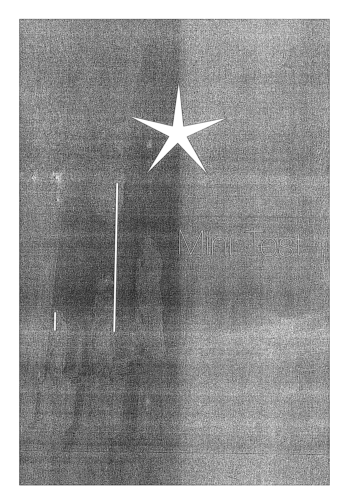

# Mini Test - Viết câu

Làm bài trước khi xem mẫu, sau đó phân loại lỗi và viết lại câu.

## Trang nguồn

Phần này được trình bày lại từ **trang 50-65** của bản scan. Ảnh gốc đã được tách riêng trong `assets/pages/`.

> Đối chiếu toàn bộ: `assets/pages/page-050.png` -> `assets/pages/page-065.png`.
