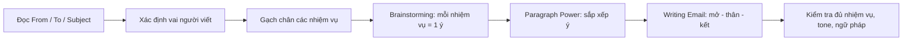
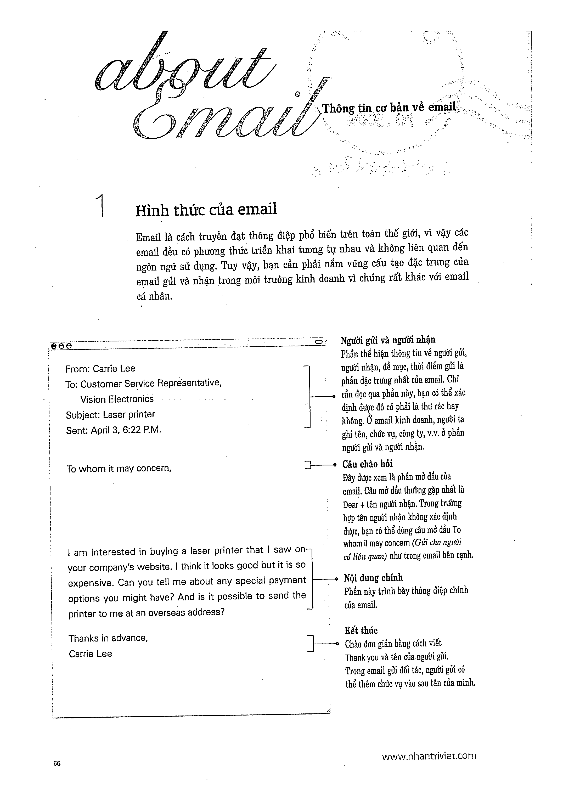
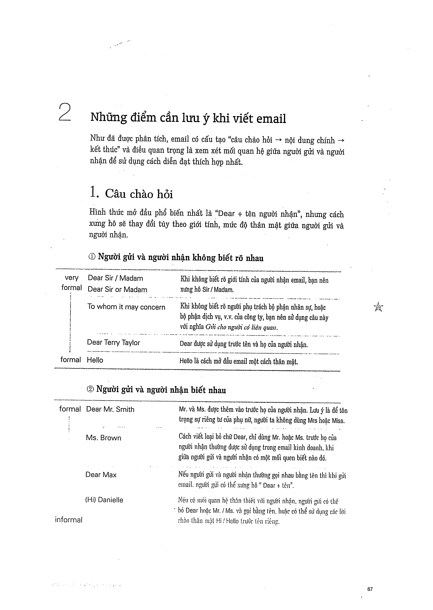

# About Email - Tổng quan câu hỏi viết loại 2

Sách tổ chức phần email theo **Brainstorming -> Paragraph Power -> Writing Emails**.

## Khi đọc đề
- Xác định người gửi/người nhận và vai của mình.
- Gạch chân toàn bộ nhiệm vụ bắt buộc.
- Chọn tone phù hợp.

## Trang nguồn

Phần này được trình bày lại từ **trang 66-71** của bản scan. Ảnh gốc đã được tách riêng trong `assets/pages/`.

> Đối chiếu toàn bộ: `assets/pages/page-066.png` -> `assets/pages/page-071.png`.
