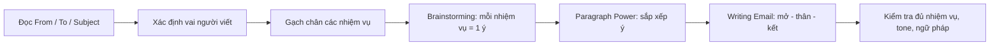
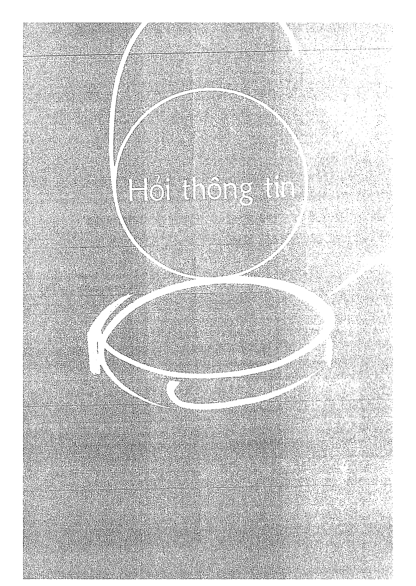
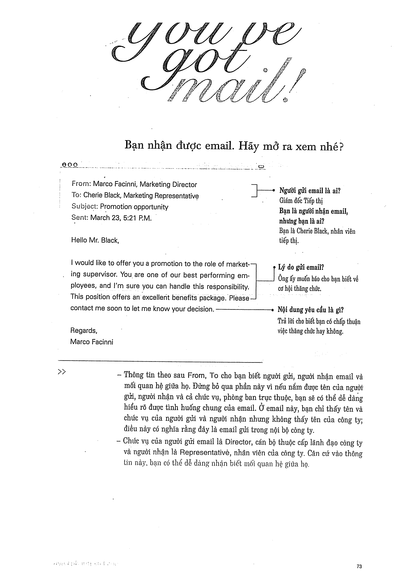

# Recipe 6 - Hỏi thông tin

## Mục tiêu
Viết email để **hỏi thông tin** rõ ràng, đủ số câu hỏi theo yêu cầu và giữ giọng điệu lịch sự.

## Trang nguồn

Phần này được trình bày lại từ **trang 72-87** của bản scan. Ảnh gốc đã được tách riêng trong `assets/pages/`.

> Đối chiếu toàn bộ: `assets/pages/page-072.png` -> `assets/pages/page-087.png`.
