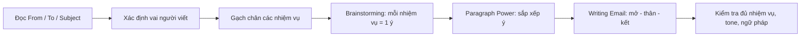
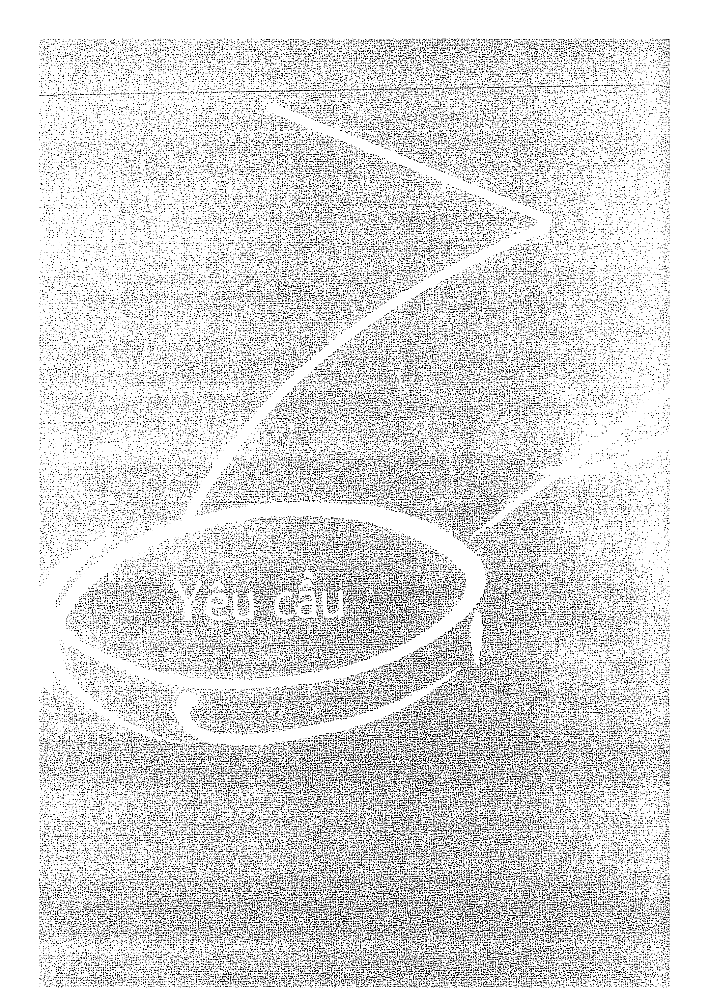
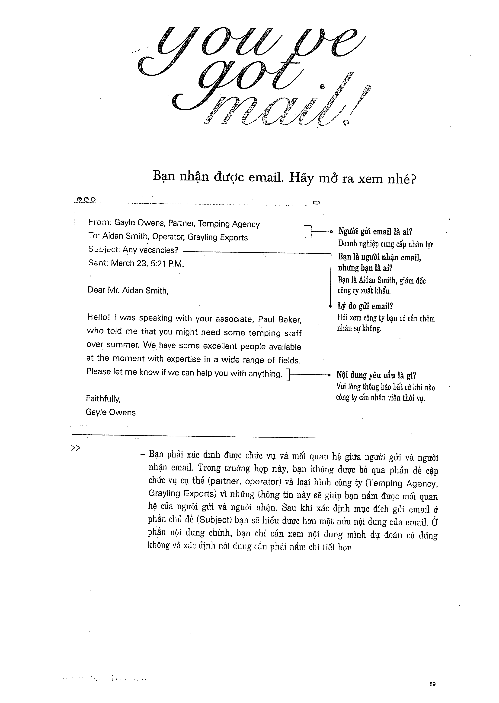

# Recipe 7 - Yêu cầu

## Mục tiêu
Viết email có **request**, nêu rõ hành động mong muốn và giữ giọng điệu phù hợp.

## Trang nguồn

Phần này được trình bày lại từ **trang 88-103** của bản scan. Ảnh gốc đã được tách riêng trong `assets/pages/`.

> Đối chiếu toàn bộ: `assets/pages/page-088.png` -> `assets/pages/page-103.png`.
