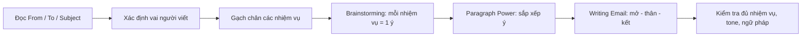
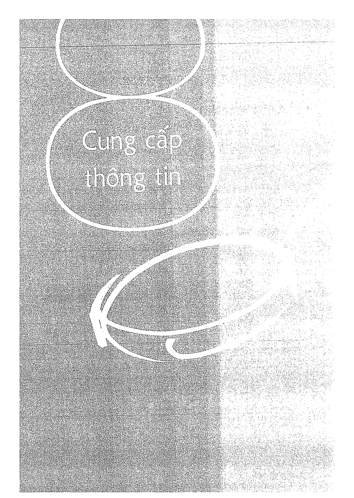
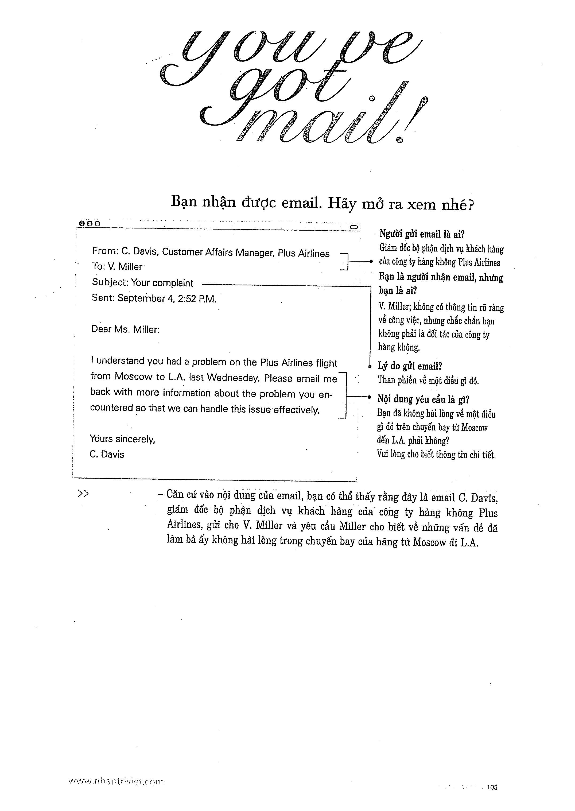

# Recipe 8 - Cung cấp thông tin

## Mục tiêu
Phản hồi đầy đủ những thông tin mà đề yêu cầu, sắp xếp theo thứ tự dễ đọc.

## Trang nguồn

Phần này được trình bày lại từ **trang 104-119** của bản scan. Ảnh gốc đã được tách riêng trong `assets/pages/`.

> Đối chiếu toàn bộ: `assets/pages/page-104.png` -> `assets/pages/page-119.png`.
