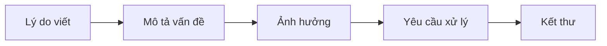
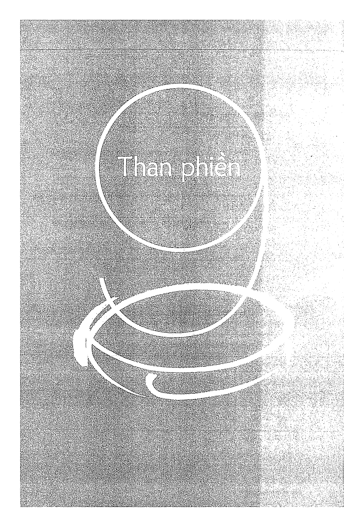
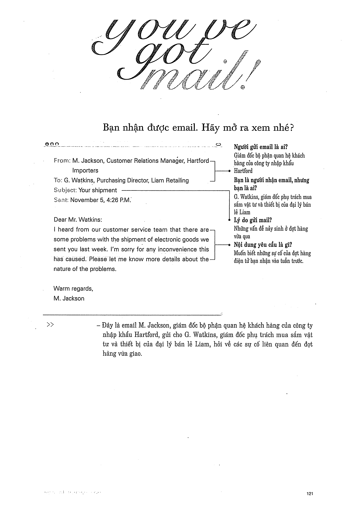

# Recipe 9 - Than phiền

## Mục tiêu
Nêu vấn đề cụ thể, ảnh hưởng và hướng xử lý mong muốn mà vẫn giữ tone phù hợp.

## Trang nguồn

Phần này được trình bày lại từ **trang 120-135** của bản scan. Ảnh gốc đã được tách riêng trong `assets/pages/`.

> Đối chiếu toàn bộ: `assets/pages/page-120.png` -> `assets/pages/page-135.png`.
