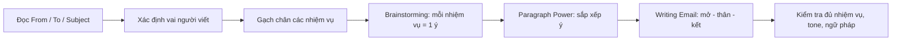
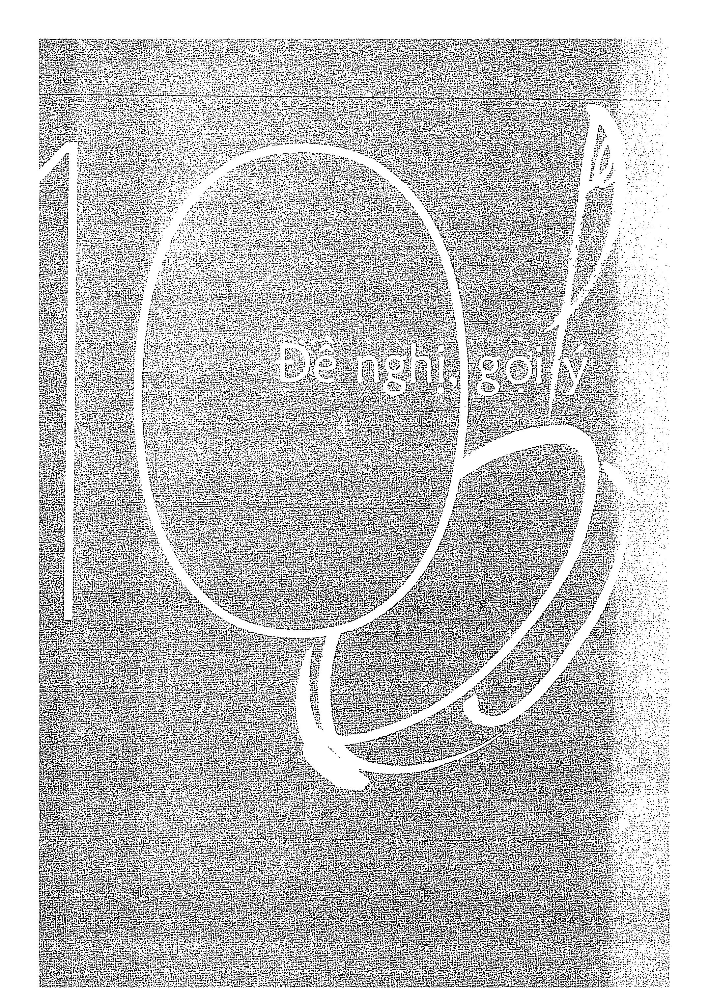
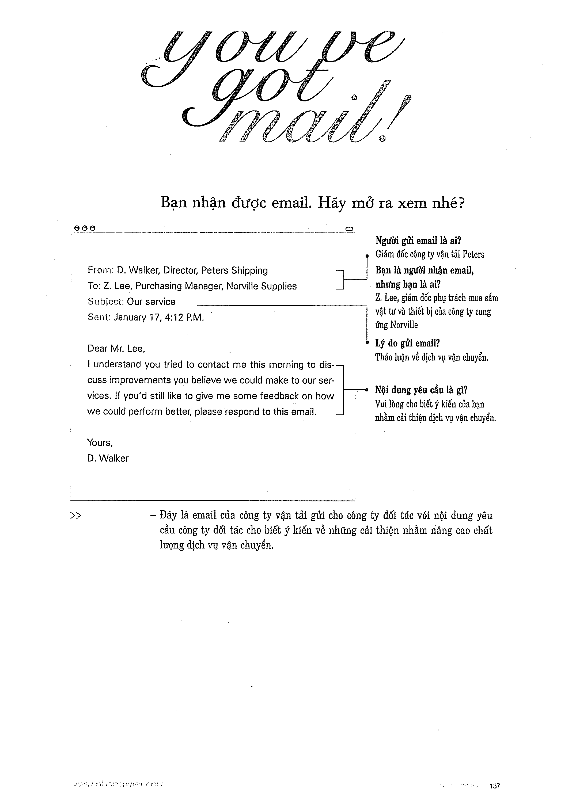

# Recipe 10 - Đề nghị, gợi ý

## Mục tiêu
Đưa ra một hoặc nhiều **suggestion** phù hợp với tình huống và giải thích ngắn gọn.

## Trang nguồn

Phần này được trình bày lại từ **trang 136-151** của bản scan. Ảnh gốc đã được tách riêng trong `assets/pages/`.

> Đối chiếu toàn bộ: `assets/pages/page-136.png` -> `assets/pages/page-151.png`.
