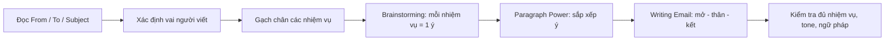
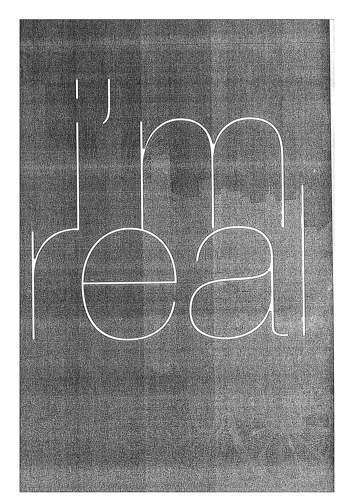
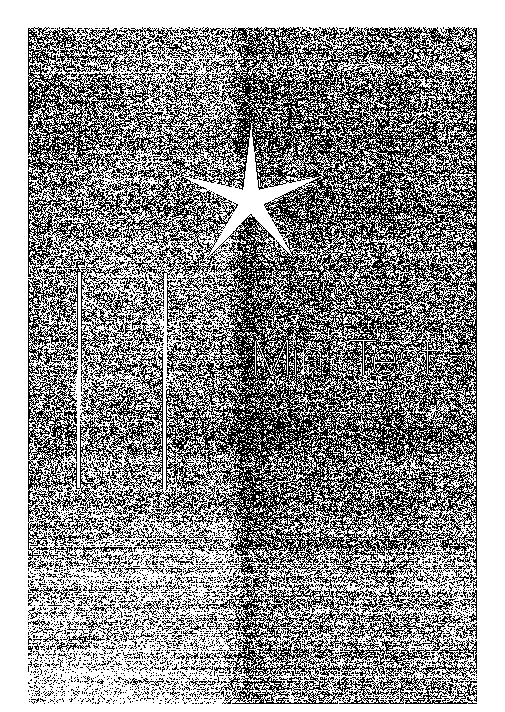

# Mini Test - Email

Làm bài theo đúng vai, đủ nhiệm vụ, sau đó tự chấm theo bố cục, tone và độ chính xác.

## Trang nguồn

Phần này được trình bày lại từ **trang 152-162** của bản scan. Ảnh gốc đã được tách riêng trong `assets/pages/`.

> Đối chiếu toàn bộ: `assets/pages/page-152.png` -> `assets/pages/page-162.png`.
