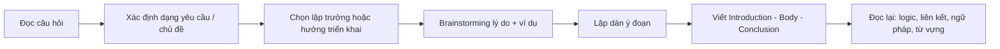
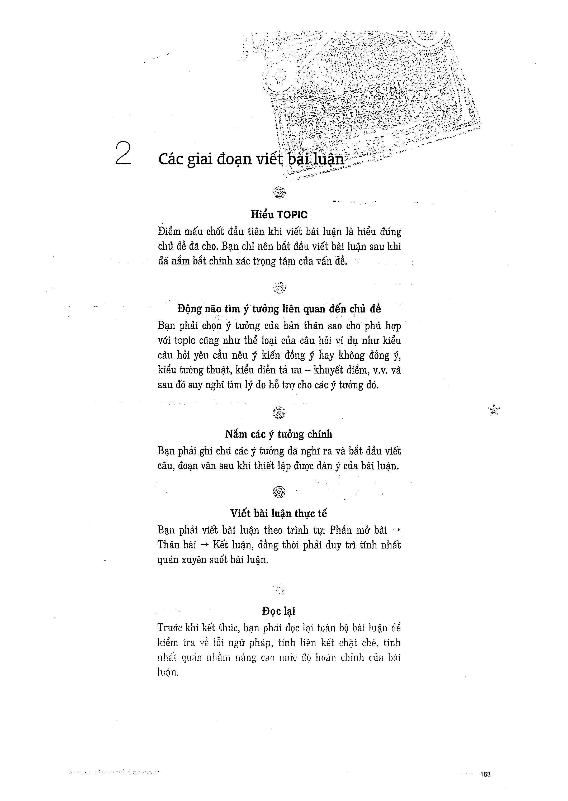
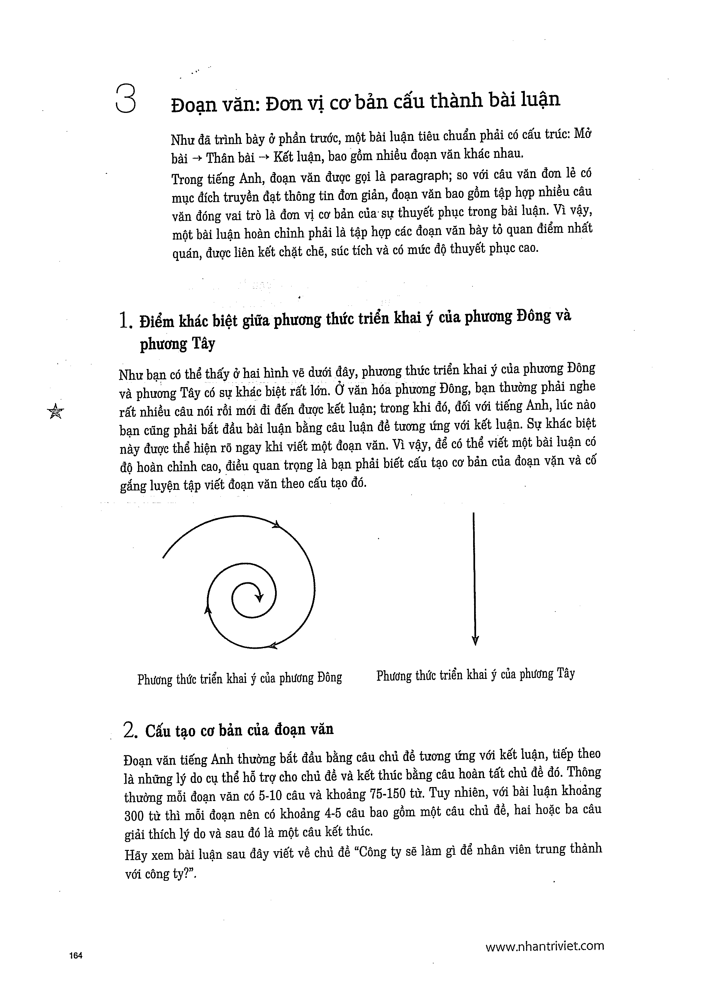

# About Essay - Tổng quan bài luận

Sách tổ chức phần luận theo **Brainstorming -> Paragraph Power -> Writing Essays**.

## Khung
- Introduction + thesis
- Body paragraphs: mỗi đoạn một ý chính + hỗ trợ
- Conclusion

## Trang nguồn

Phần này được trình bày lại từ **trang 163-169** của bản scan. Ảnh gốc đã được tách riêng trong `assets/pages/`.

> Đối chiếu toàn bộ: `assets/pages/page-163.png` -> `assets/pages/page-169.png`.
