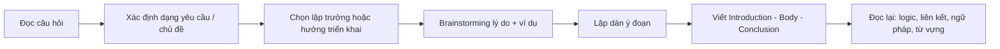
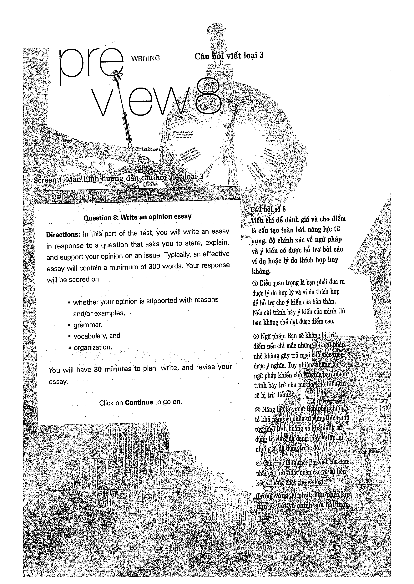
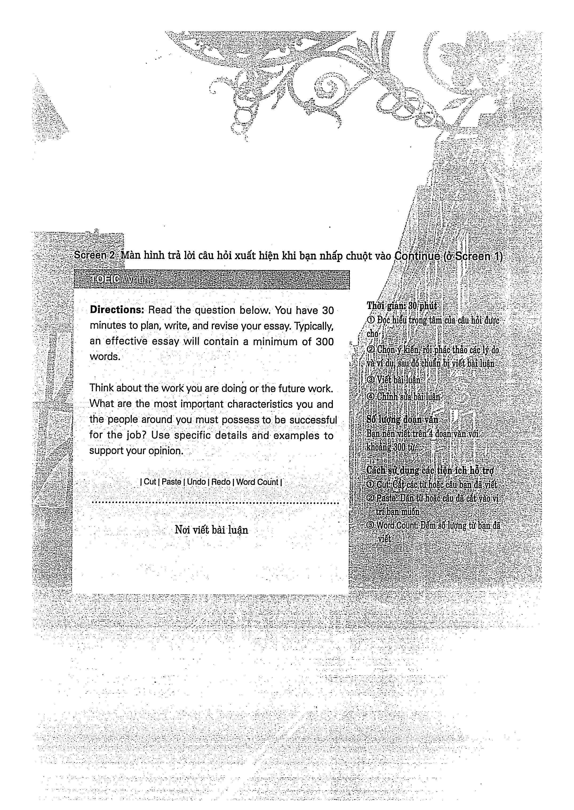

# Preview: Câu hỏi viết loại 3

Làm quen hướng dẫn, giao diện và cách triển khai bài luận trước khi vào các chủ đề.

## Trang nguồn

Phần này được trình bày lại từ **trang 170-171** của bản scan. Ảnh gốc đã được tách riêng trong `assets/pages/`.

> Đối chiếu toàn bộ: `assets/pages/page-170.png` -> `assets/pages/page-171.png`.
