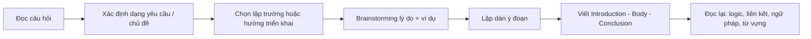
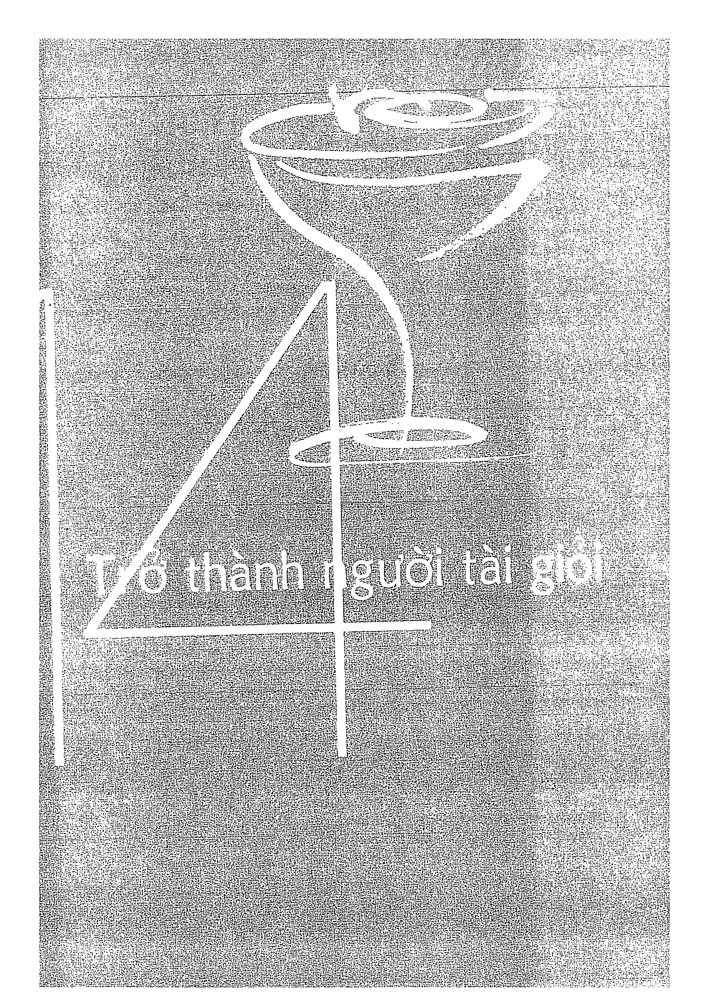
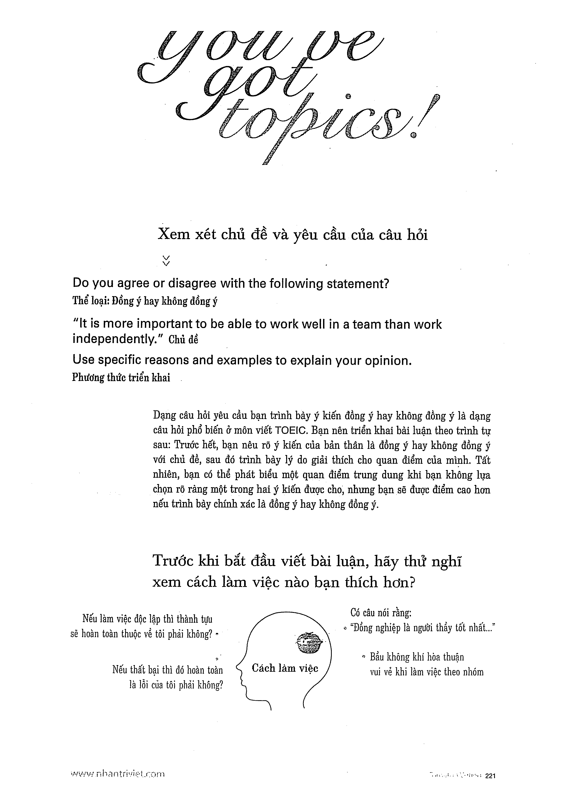

# Recipe 14 - Trở thành người tài giỏi

## Chủ đề luyện
**Trở thành người tài giỏi**

Dùng quy trình chung để phát triển ý, ví dụ và từ vựng theo chủ đề.

## Phiếu brainstorming
| Mục | Ghi chú |
|---|---|
| Câu hỏi chính | |
| Hướng trả lời | |
| Lý do 1 + ví dụ | |
| Lý do 2 + ví dụ | |
| Kết luận | |

## Trang nguồn

Phần này được trình bày lại từ **trang 220-235** của bản scan. Ảnh gốc đã được tách riêng trong `assets/pages/`.

> Đối chiếu toàn bộ: `assets/pages/page-220.png` -> `assets/pages/page-235.png`.
