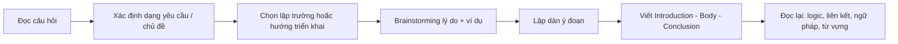
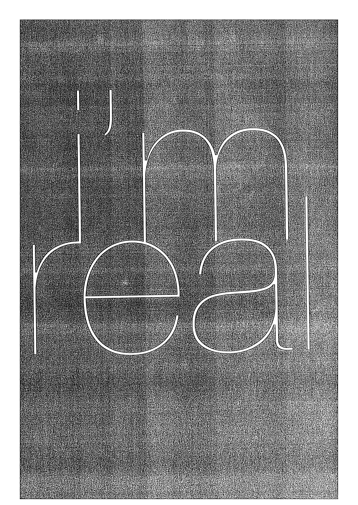
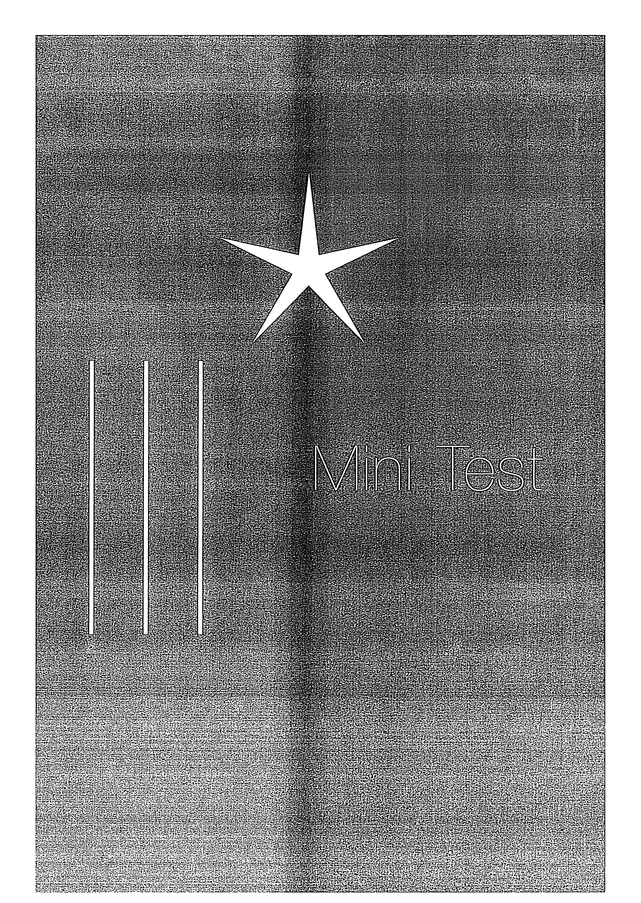

# Mini Test - Essay

Viết như thi thật: đọc đề, lập dàn ý ngắn, viết hoàn chỉnh, đọc lại.

## Trang nguồn

Phần này được trình bày lại từ **trang 252-259** của bản scan. Ảnh gốc đã được tách riêng trong `assets/pages/`.

> Đối chiếu toàn bộ: `assets/pages/page-252.png` -> `assets/pages/page-259.png`.
