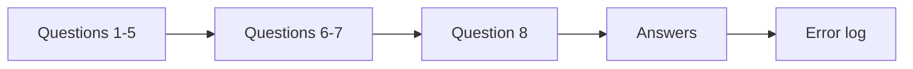
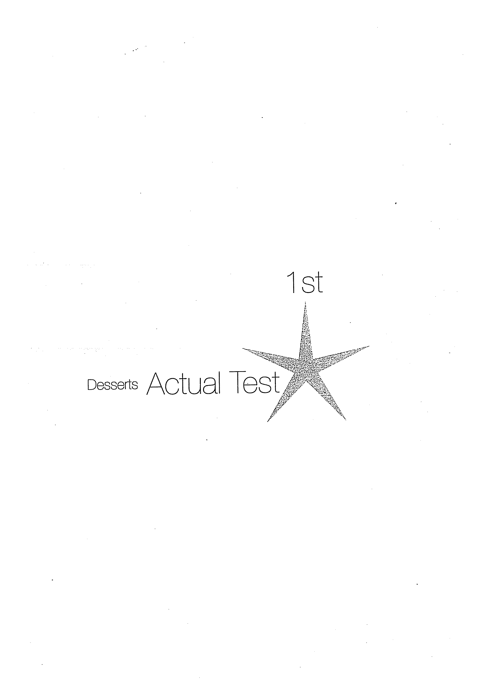
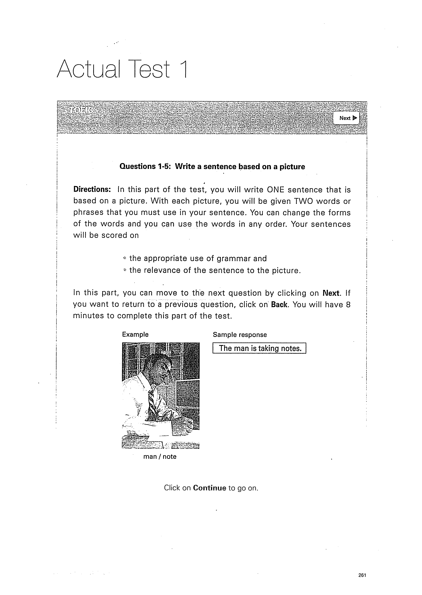

# Actual Test 1

Làm liên tục như một lần thi thử, không mở Answers trước.

## Trang nguồn

Phần này được trình bày lại từ **trang 260-271** của bản scan. Ảnh gốc đã được tách riêng trong `assets/pages/`.

> Đối chiếu toàn bộ: `assets/pages/page-260.png` -> `assets/pages/page-271.png`.
