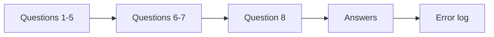
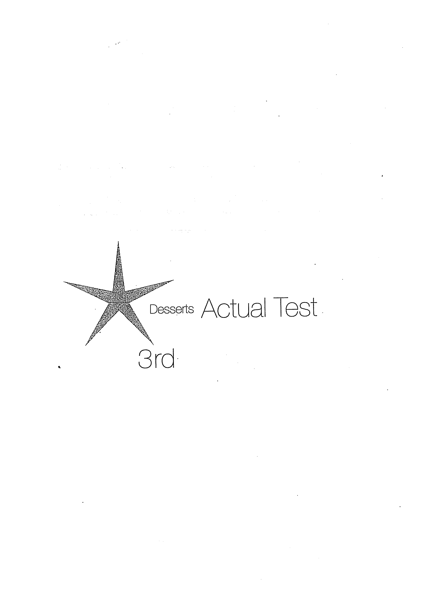
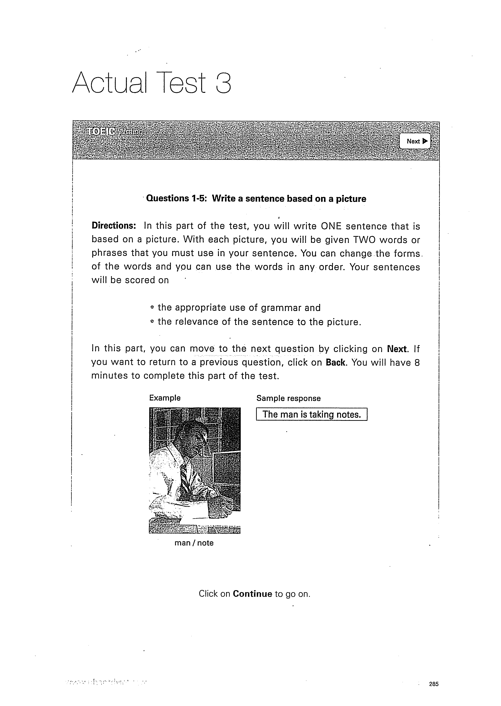

# Actual Test 3

Làm liên tục như một lần thi thử, không mở Answers trước.

## Trang nguồn

Phần này được trình bày lại từ **trang 284-295** của bản scan. Ảnh gốc đã được tách riêng trong `assets/pages/`.

> Đối chiếu toàn bộ: `assets/pages/page-284.png` -> `assets/pages/page-295.png`.
