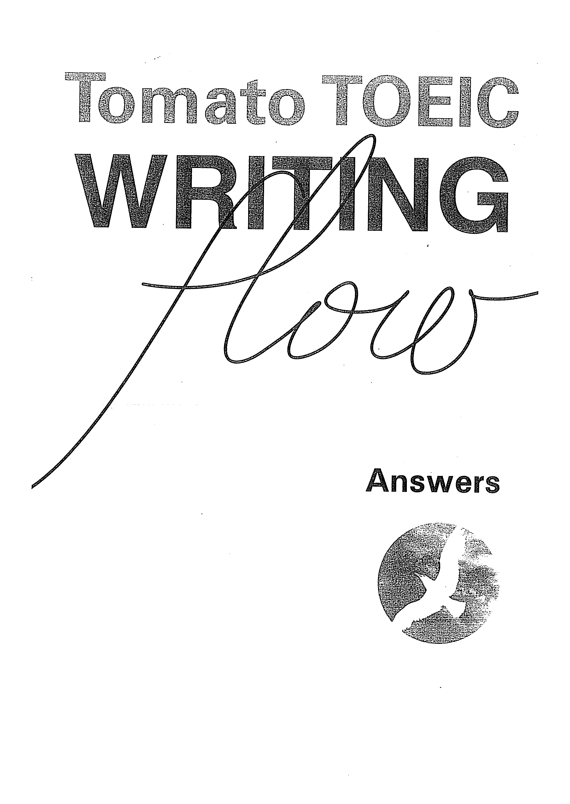
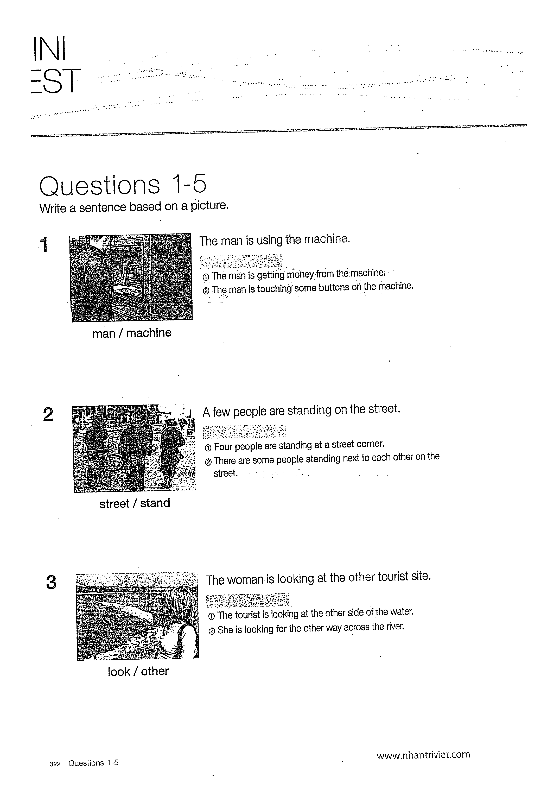

# Answers

Dùng phần này để đối chiếu sau khi hoàn thành Mini Test/Actual Test; ghi lại lỗi và viết lại câu/email/essay.

## Trang nguồn

Phần này được trình bày lại từ **trang 321-350** của bản scan. Ảnh gốc đã được tách riêng trong `assets/pages/`.

> Đối chiếu toàn bộ: `assets/pages/page-321.png` -> `assets/pages/page-350.png`.
