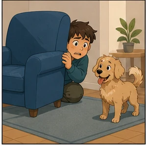
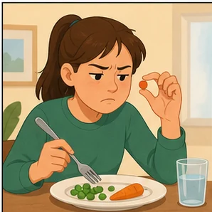
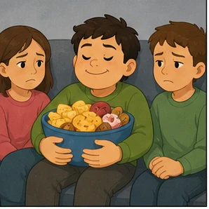
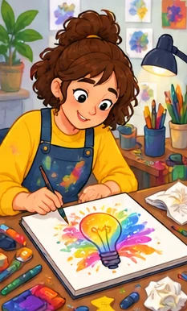
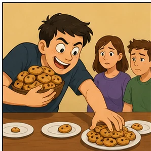
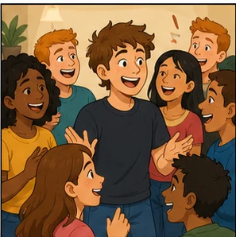
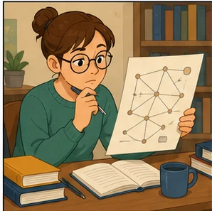
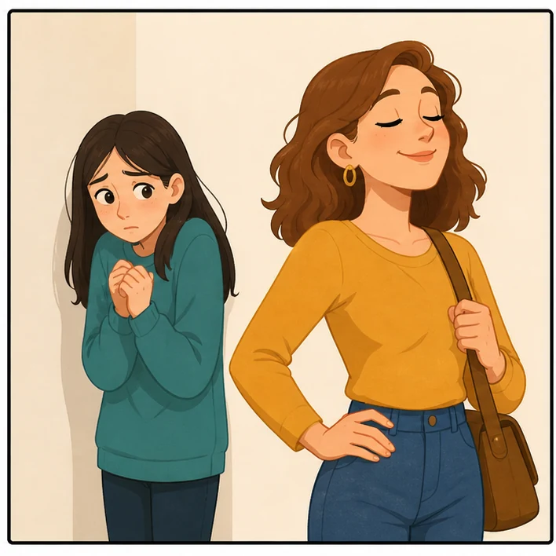
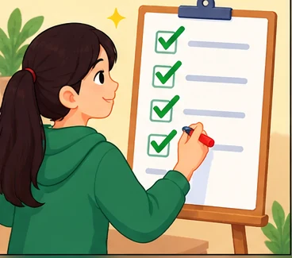

# TOPIC 1 — CHARACTER

## Bài 1: Character — Tính cách

---

## 1. Mục tiêu bài học

Sau bài này, người học có thể:

- [ ] Nhận diện và phát âm đúng các từ vựng chủ đề **Character / Personality**.
- [ ] Hiểu **nghĩa tiếng Việt** và **định nghĩa bằng tiếng Anh** của từng từ.
- [ ] Biết các **synonyms — từ đồng nghĩa** thường gặp.
- [ ] Nhận biết **word forms / word family** của từng từ.
- [ ] Phân biệt những từ gần nghĩa như `clever`, `bright`, `intelligent`.
- [ ] Phân biệt các cặp dễ nhầm như `sensible` và `sensitive`.
- [ ] Đặt câu để mô tả tính cách bản thân và người khác.
- [ ] Sử dụng từ vựng Character trong Speaking và Writing.

> **Lưu ý:** Danh sách gốc có `careless` xuất hiện hai lần. Trong bài hoàn chỉnh này chỉ giữ **một mục** để tránh học trùng.

---

## Cấu trúc bài học

1. Vocabulary — 67 từ vựng có ảnh minh họa cục bộ.
2. Phân nhóm và phân biệt các từ dễ nhầm.
3. Cụm từ, câu mẫu và đoạn văn mẫu.
4. Speaking, bài tập, word family và từ trái nghĩa.
5. Ôn tập theo lịch lặp lại và checklist hoàn thành.

> Ảnh từ vựng nằm trong `asset/vocabulary/`; ảnh minh họa cho các phần học nằm trong `asset/illustration/`.

## 2. Vocabulary — Character

### 1. absent-minded


**IPA:** /ˌæbsənt ˈmaɪndɪd/

**Từ loại:** adjective (adj)

**Nghĩa tiếng Việt:** đãng trí, hay quên, thiếu tập trung.

**English meaning:** often forgetting things or failing to notice what is happening because you are thinking about something else.

**Synonyms:**

- forgetful
- distracted
- inattentive

**Word forms:**

- `absent-minded` — adj: đãng trí
- `absent-mindedly` — adv: một cách đãng trí
- `absent-mindedness` — n: tính đãng trí

**Example:**

> My grandfather is a little absent-minded and often forgets where he puts his glasses.

**Dịch:** Ông tôi hơi đãng trí và thường quên mình để kính ở đâu.

---

### 2. adventurous


**IPA:** /ədˈventʃərəs/

**Từ loại:** adjective

**Nghĩa tiếng Việt:** thích phiêu lưu, thích khám phá và thử những điều mới.

**English meaning:** willing to try new, exciting, unusual, or sometimes risky experiences.

**Synonyms:**

- daring
- bold
- venturesome

**Word forms:**

- `adventure` — n: cuộc phiêu lưu
- `adventurer` — n: người thích phiêu lưu
- `adventurous` — adj: thích phiêu lưu
- `adventurously` — adv

**Example:**

> She is adventurous and enjoys travelling to unfamiliar places.

**Dịch:** Cô ấy thích phiêu lưu và thích đi đến những nơi xa lạ.

---

### 3. aggressive


**IPA:** /əˈɡresɪv/

**Từ loại:** adjective

**Nghĩa tiếng Việt:** hung hăng, hiếu chiến, có xu hướng gây hấn.

**English meaning:** behaving in an angry, threatening, or forceful way.

**Synonyms:**

- hostile
- belligerent
- confrontational

**Word forms:**

- `aggression` — n: sự hung hăng
- `aggressive` — adj
- `aggressively` — adv
- `aggressiveness` — n

**Example:**

> He becomes aggressive when someone challenges his opinion.

**Dịch:** Anh ta trở nên hung hăng khi có người phản đối quan điểm của mình.

---

### 4. ambitious


**IPA:** /æmˈbɪʃəs/

**Từ loại:** adjective

**Nghĩa tiếng Việt:** tham vọng, có chí tiến thủ, có mục tiêu lớn.

**English meaning:** strongly determined to become successful or achieve an important goal.

**Synonyms:**

- driven
- aspiring
- determined

**Word forms:**

- `ambition` — n: tham vọng
- `ambitious` — adj
- `ambitiously` — adv

**Example:**

> She is ambitious and hopes to become a successful engineer.

**Dịch:** Cô ấy có chí tiến thủ và hy vọng trở thành một kỹ sư thành công.

---

### 5. amusing


**IPA:** /əˈmjuːzɪŋ/

**Từ loại:** adjective

**Nghĩa tiếng Việt:** vui nhộn, gây buồn cười.

**English meaning:** funny and entertaining.

**Synonyms:**

- funny
- entertaining
- humorous

**Word forms:**

- `amuse` — v: làm ai vui
- `amused` — adj: cảm thấy thích thú
- `amusing` — adj: gây thích thú
- `amusement` — n: sự thích thú

**Example:**

> He always tells amusing stories at parties.

**Dịch:** Anh ấy luôn kể những câu chuyện vui nhộn trong các bữa tiệc.

#### Phân biệt

- **amusing** → vật/người **gây ra** cảm giác vui.
- **amused** → người **cảm thấy** vui hoặc thích thú.

---

### 6. arrogant


**IPA:** /ˈærəɡənt/

**Từ loại:** adjective

**Nghĩa tiếng Việt:** kiêu căng, kiêu ngạo, cho rằng mình hơn người khác.

**English meaning:** behaving as if you are more important or better than other people.

**Synonyms:**

- conceited
- haughty
- overbearing

**Word forms:**

- `arrogance` — n
- `arrogant` — adj
- `arrogantly` — adv

**Example:**

> He is intelligent, but his arrogant attitude makes him difficult to work with.

**Dịch:** Anh ấy thông minh nhưng thái độ kiêu ngạo khiến người khác khó làm việc cùng.

---

### 7. brave


**IPA:** /breɪv/

**Từ loại:** adjective

**Nghĩa tiếng Việt:** dũng cảm, can đảm.

**English meaning:** willing to face danger, pain, or difficult situations without giving in to fear.

**Synonyms:**

- courageous
- fearless
- bold

**Word forms:**

- `brave` — adj/v
- `bravery` — n
- `bravely` — adv

**Example:**

> It was brave of her to speak in front of hundreds of people.

**Dịch:** Cô ấy thật dũng cảm khi phát biểu trước hàng trăm người.

---

### 8. bright


**IPA:** /braɪt/

**Từ loại:** adjective

**Nghĩa tiếng Việt:** sáng dạ, nhanh hiểu, thông minh.

**English meaning:** intelligent and able to learn or understand things quickly.

**Synonyms:**

- clever
- intelligent
- smart

**Word forms:**

- `bright` — adj
- `brightly` — adv
- `brightness` — n
- `brighten` — v

**Example:**

> Minh is a bright student who learns new concepts very quickly.

**Dịch:** Minh là một học sinh sáng dạ và tiếp thu các khái niệm mới rất nhanh.

---

### 9. careless


**IPA:** /ˈkeələs/

**Từ loại:** adjective

**Nghĩa tiếng Việt:** bất cẩn, cẩu thả, thiếu chú ý.

**English meaning:** not giving enough attention or thought to what you are doing.

**Synonyms:**

- negligent
- inattentive
- reckless

**Word forms:**

- `care` — n/v
- `careful` — adj: cẩn thận
- `carefully` — adv
- `careless` — adj
- `carelessly` — adv
- `carelessness` — n

**Example:**

> His careless mistake caused the program to crash.

**Dịch:** Sai lầm bất cẩn của anh ấy khiến chương trình bị lỗi.

---

### 10. cheeky


**IPA:** /ˈtʃiːki/

**Từ loại:** adjective

**Nghĩa tiếng Việt:** láu lỉnh, tinh nghịch; đôi khi hỗn hoặc hơi xấc xược.

**English meaning:** slightly rude or disrespectful, often in an amusing or playful way.

**Synonyms:**

- mischievous
- impudent
- saucy

**Word forms:**

- `cheek` — n
- `cheeky` — adj
- `cheekily` — adv
- `cheekiness` — n

**Example:**

> The boy gave his teacher a cheeky smile.

**Dịch:** Cậu bé nở một nụ cười láu lỉnh với giáo viên.

---

### 11. clever


**IPA:** /ˈklevə(r)/

**Từ loại:** adjective

**Nghĩa tiếng Việt:** thông minh, lanh lợi, giỏi tìm giải pháp.

**English meaning:** quick to understand, learn, or solve problems.

**Synonyms:**

- intelligent
- smart
- bright

**Word forms:**

- `clever` — adj
- `cleverly` — adv
- `cleverness` — n

**Example:**

> That's a clever way to solve the problem.

**Dịch:** Đó là một cách thông minh để giải quyết vấn đề.

---

### 12. confident


**IPA:** /ˈkɒnfɪdənt/

**Từ loại:** adjective

**Nghĩa tiếng Việt:** tự tin.

**English meaning:** believing in your abilities, qualities, or decisions.

**Synonyms:**

- self-assured
- assured
- self-confident

**Word forms:**

- `confidence` — n
- `confident` — adj
- `confidently` — adv
- `self-confidence` — n

**Example:**

> She feels confident when speaking English.

**Dịch:** Cô ấy cảm thấy tự tin khi nói tiếng Anh.

---

### 13. cowardly



**IPA:** /ˈkaʊədli/

**Từ loại:** adjective

**Nghĩa tiếng Việt:** hèn nhát, nhát gan.

**English meaning:** lacking courage and being too afraid to face danger or difficulty.

**Synonyms:**

- fearful
- faint-hearted
- timid

**Word forms:**

- `coward` — n
- `cowardly` — adj
- `cowardice` — n

**Example:**

> Leaving your friends in danger would be cowardly.

**Dịch:** Bỏ mặc bạn bè trong nguy hiểm là một hành động hèn nhát.

---

### 14. decisive


**IPA:** /dɪˈsaɪsɪv/

**Từ loại:** adjective

**Nghĩa tiếng Việt:** quyết đoán, dứt khoát.

**English meaning:** able to make decisions quickly and confidently.

**Synonyms:**

- determined
- resolute
- firm

**Word forms:**

- `decide` — v
- `decision` — n
- `decisive` — adj
- `decisively` — adv
- `decisiveness` — n

**Example:**

> A good manager should be decisive in difficult situations.

**Dịch:** Một người quản lý giỏi nên quyết đoán trong những tình huống khó khăn.

---

### 15. easy-going


**IPA:** /ˌiːzi ˈɡəʊɪŋ/

**Từ loại:** adjective

**Nghĩa tiếng Việt:** dễ tính, thoải mái, dễ gần.

**English meaning:** relaxed, calm, and not easily worried or annoyed.

**Synonyms:**

- relaxed
- laid-back
- easygoing

**Word forms:**

- `easy-going / easygoing` — adj
- `easygoingness` — n *(ít dùng)*

**Example:**

> My roommate is easy-going, so we rarely argue.

**Dịch:** Bạn cùng phòng của tôi rất dễ tính nên chúng tôi hiếm khi cãi nhau.

---

### 16. friendly


**IPA:** /ˈfrendli/

**Từ loại:** adjective

**Nghĩa tiếng Việt:** thân thiện, dễ gần.

**English meaning:** behaving in a pleasant, kind, and welcoming way.

**Synonyms:**

- amiable
- warm
- approachable

**Word forms:**

- `friend` — n
- `friendly` — adj
- `friendliness` — n
- `friendship` — n
- `unfriendly` — adj

**Example:**

> The new student is friendly and quickly makes friends.

**Dịch:** Học sinh mới rất thân thiện và nhanh chóng kết bạn.

---

### 17. fussy



**IPA:** /ˈfʌsi/

**Từ loại:** adjective

**Nghĩa tiếng Việt:** cầu kỳ, kén chọn, khó chiều.

**English meaning:** difficult to please or too concerned about small details.

**Synonyms:**

- picky
- choosy
- finicky

**Word forms:**

- `fuss` — n/v
- `fussy` — adj
- `fussily` — adv
- `fussiness` — n

**Example:**

> He is very fussy about what he eats.

**Dịch:** Anh ấy rất kén chọn trong chuyện ăn uống.

---

### 18. generous


**IPA:** /ˈdʒenərəs/

**Từ loại:** adjective

**Nghĩa tiếng Việt:** rộng lượng, hào phóng.

**English meaning:** willing to give money, time, help, or other things freely.

**Synonyms:**

- giving
- charitable
- open-handed

**Word forms:**

- `generous` — adj
- `generously` — adv
- `generosity` — n

**Example:**

> She is generous with both her time and money.

**Dịch:** Cô ấy hào phóng cả về thời gian lẫn tiền bạc.

---

### 19. grateful


**IPA:** /ˈɡreɪtfəl/

**Từ loại:** adjective

**Nghĩa tiếng Việt:** biết ơn.

**English meaning:** feeling or showing thanks because somebody has helped you.

**Synonyms:**

- thankful
- appreciative

**Word forms:**

- `grateful` — adj
- `gratefully` — adv
- `gratitude` — n
- `ungrateful` — adj

**Example:**

> I am grateful for everything my parents have done for me.

**Dịch:** Tôi biết ơn tất cả những gì bố mẹ đã làm cho tôi.

---

### 20. honest


**IPA:** /ˈɒnɪst/

**Từ loại:** adjective

**Nghĩa tiếng Việt:** trung thực, thật thà.

**English meaning:** telling the truth and not trying to deceive other people.

**Synonyms:**

- truthful
- sincere
- frank

**Word forms:**

- `honest` — adj
- `honestly` — adv
- `honesty` — n
- `dishonest` — adj
- `dishonesty` — n

**Example:**

> An honest person admits their mistakes.

**Dịch:** Một người trung thực sẽ thừa nhận lỗi của mình.

---

### 21. kind


**IPA:** /kaɪnd/

**Từ loại:** adjective

**Nghĩa tiếng Việt:** tốt bụng, tử tế.

**English meaning:** caring about other people and wanting to help them.

**Synonyms:**

- caring
- considerate
- compassionate

**Word forms:**

- `kind` — adj
- `kindly` — adv
- `kindness` — n
- `unkind` — adj

**Example:**

> She is always kind to animals and children.

**Dịch:** Cô ấy luôn tử tế với động vật và trẻ em.

---

### 22. loyal


**IPA:** /ˈlɔɪəl/

**Từ loại:** adjective

**Nghĩa tiếng Việt:** trung thành, tận tâm.

**English meaning:** continuing to support somebody or something faithfully.

**Synonyms:**

- faithful
- devoted
- steadfast

**Word forms:**

- `loyal` — adj
- `loyally` — adv
- `loyalty` — n
- `disloyal` — adj

**Example:**

> He has always been loyal to his closest friends.

**Dịch:** Anh ấy luôn trung thành với những người bạn thân nhất của mình.

---

### 23. mature


**IPA:** /məˈtʃʊə(r)/

**Từ loại:** adjective

**Nghĩa tiếng Việt:** trưởng thành, chín chắn.

**English meaning:** behaving in a sensible and responsible way.

**Synonyms:**

- responsible
- sensible
- grown-up

**Word forms:**

- `mature` — adj/v
- `maturity` — n
- `immature` — adj
- `immaturity` — n

**Example:**

> She is very mature for her age.

**Dịch:** Cô ấy rất chín chắn so với tuổi của mình.

---

### 24. mean


**IPA:** /miːn/

**Từ loại:** adjective

**Nghĩa tiếng Việt:** xấu tính, không tử tế; đôi khi còn mang nghĩa keo kiệt.

**English meaning:** unkind or unpleasant towards other people.

**Synonyms:**

- unkind
- nasty
- cruel

**Word forms:**

- `mean` — adj
- `meanness` — n
- `mean-spirited` — adj

**Example:**

> Don't be mean to your younger brother.

**Dịch:** Đừng xấu tính với em trai của bạn.

---

### 25. modest


**IPA:** /ˈmɒdɪst/

**Từ loại:** adjective

**Nghĩa tiếng Việt:** khiêm tốn, không khoe khoang.

**English meaning:** not talking proudly about your abilities, achievements, or possessions.

**Synonyms:**

- humble
- unassuming
- unpretentious

**Word forms:**

- `modest` — adj
- `modestly` — adv
- `modesty` — n

**Example:**

> Despite being very talented, she remains modest.

**Dịch:** Dù rất tài năng, cô ấy vẫn khiêm tốn.

---

### 26. nasty


**IPA:** /ˈnɑːsti/

**Từ loại:** adjective

**Nghĩa tiếng Việt:** xấu tính, khó chịu, ác ý.

**English meaning:** unpleasant, unkind, or cruel.

**Synonyms:**

- mean
- unpleasant
- spiteful

**Word forms:**

- `nasty` — adj
- `nastily` — adv
- `nastiness` — n

**Example:**

> He made a nasty comment about his classmate.

**Dịch:** Anh ta đưa ra một nhận xét ác ý về bạn cùng lớp.

---

### 27. nice


**IPA:** /naɪs/

**Từ loại:** adjective

**Nghĩa tiếng Việt:** tốt bụng, dễ mến, thân thiện.

**English meaning:** kind, friendly, polite, or pleasant.

**Synonyms:**

- kind
- pleasant
- friendly

**Word forms:**

- `nice` — adj
- `nicely` — adv
- `niceness` — n

**Example:**

> Our new neighbour is a really nice person.

**Dịch:** Người hàng xóm mới của chúng tôi là một người rất dễ mến.

---

### 28. patient


**IPA:** /ˈpeɪʃənt/

**Từ loại:** adjective

**Nghĩa tiếng Việt:** kiên nhẫn.

**English meaning:** able to wait or deal with problems without becoming annoyed.

**Synonyms:**

- tolerant
- calm
- forbearing

**Word forms:**

- `patience` — n
- `patient` — adj
- `patiently` — adv
- `impatient` — adj
- `impatience` — n

**Example:**

> Teachers need to be patient with young learners.

**Dịch:** Giáo viên cần kiên nhẫn với những người học nhỏ tuổi.

---

### 29. reliable


**IPA:** /rɪˈlaɪəbl/

**Từ loại:** adjective

**Nghĩa tiếng Việt:** đáng tin cậy.

**English meaning:** able to be trusted to do what is expected.

**Synonyms:**

- dependable
- trustworthy
- responsible

**Word forms:**

- `rely` — v
- `reliable` — adj
- `reliably` — adv
- `reliability` — n
- `unreliable` — adj

**Example:**

> Lan is reliable and always keeps her promises.

**Dịch:** Lan rất đáng tin cậy và luôn giữ lời hứa.

---

### 30. reserved


**IPA:** /rɪˈzɜːvd/

**Từ loại:** adjective

**Nghĩa tiếng Việt:** kín đáo, dè dặt, ít bộc lộ cảm xúc.

**English meaning:** quiet and unwilling to show your feelings or thoughts easily.

**Synonyms:**

- quiet
- reticent
- restrained

**Word forms:**

- `reserve` — n/v
- `reserved` — adj
- `reservedness` — n

**Example:**

> He is reserved around people he does not know well.

**Dịch:** Anh ấy khá dè dặt khi ở cạnh những người chưa quen thân.

---

### 31. rude


**IPA:** /ruːd/

**Từ loại:** adjective

**Nghĩa tiếng Việt:** thô lỗ, bất lịch sự.

**English meaning:** behaving in a way that is not polite or respectful.

**Synonyms:**

- impolite
- disrespectful
- discourteous

**Word forms:**

- `rude` — adj
- `rudely` — adv
- `rudeness` — n

**Example:**

> It is rude to interrupt people while they are speaking.

**Dịch:** Ngắt lời người khác khi họ đang nói là bất lịch sự.

---

### 32. selfish



**IPA:** /ˈselfɪʃ/

**Từ loại:** adjective

**Nghĩa tiếng Việt:** ích kỷ, chỉ quan tâm đến lợi ích của bản thân.

**English meaning:** caring mainly about yourself and not enough about other people.

**Synonyms:**

- self-centred
- egocentric
- inconsiderate

**Word forms:**

- `selfish` — adj
- `selfishly` — adv
- `selfishness` — n
- `selfless` — adj
- `selflessness` — n

**Example:**

> It was selfish of him to keep all the food for himself.

**Dịch:** Anh ta thật ích kỷ khi giữ toàn bộ thức ăn cho riêng mình.

---

### 33. sensible


**IPA:** /ˈsensɪbl/

**Từ loại:** adjective

**Nghĩa tiếng Việt:** biết suy xét, hợp lý, thực tế.

**English meaning:** showing good judgment and practical understanding.

**Synonyms:**

- reasonable
- practical
- level-headed

**Word forms:**

- `sense` — n/v
- `sensible` — adj
- `sensibly` — adv

**Example:**

> Taking an umbrella was a sensible decision.

**Dịch:** Mang theo ô là một quyết định hợp lý.

---

### 34. spiteful


**IPA:** /ˈspaɪtfəl/

**Từ loại:** adjective

**Nghĩa tiếng Việt:** ác ý, hằn học, cay độc.

**English meaning:** deliberately trying to hurt or upset another person.

**Synonyms:**

- malicious
- vindictive
- mean

**Word forms:**

- `spite` — n/v
- `spiteful` — adj
- `spitefully` — adv
- `spitefulness` — n

**Example:**

> She made a spiteful remark because she was jealous.

**Dịch:** Cô ấy đưa ra một lời nhận xét cay độc vì ghen tị.

---

### 35. stubborn


**IPA:** /ˈstʌbən/

**Từ loại:** adjective

**Nghĩa tiếng Việt:** bướng bỉnh, ngoan cố.

**English meaning:** refusing to change your opinion, decision, or behaviour.

**Synonyms:**

- obstinate
- headstrong
- inflexible

**Word forms:**

- `stubborn` — adj
- `stubbornly` — adv
- `stubbornness` — n

**Example:**

> He is too stubborn to admit that he is wrong.

**Dịch:** Anh ấy quá bướng bỉnh để thừa nhận rằng mình sai.

---

### 36. stupid


**IPA:** /ˈstjuːpɪd/

**Từ loại:** adjective

**Nghĩa tiếng Việt:** ngu ngốc, thiếu suy nghĩ.

**English meaning:** showing a lack of intelligence or good judgment.

**Synonyms:**

- foolish
- silly
- unintelligent

**Word forms:**

- `stupid` — adj
- `stupidly` — adv
- `stupidity` — n

**Example:**

> It was stupid to drive so fast in the rain.

**Dịch:** Lái xe nhanh như vậy dưới trời mưa là một việc ngu ngốc.

> `stupid` có thể mang tính xúc phạm khi dùng trực tiếp để gọi một người.

---

### 37. tense


**IPA:** /tens/

**Từ loại:** adjective

**Nghĩa tiếng Việt:** căng thẳng, bồn chồn, không thư giãn.

**English meaning:** nervous, worried, and unable to relax.

**Synonyms:**

- anxious
- nervous
- stressed

**Word forms:**

- `tense` — adj/v
- `tensely` — adv
- `tension` — n

**Example:**

> He looked tense before the job interview.

**Dịch:** Anh ấy trông căng thẳng trước buổi phỏng vấn xin việc.

---

### 38. tired


**IPA:** /ˈtaɪəd/

**Từ loại:** adjective

**Nghĩa tiếng Việt:** mệt mỏi.

**English meaning:** needing rest or sleep because you have little energy.

**Synonyms:**

- exhausted
- weary
- fatigued

**Word forms:**

- `tire` — v
- `tired` — adj
- `tiring` — adj
- `tiredness` — n

**Example:**

> She was too tired to continue studying.

**Dịch:** Cô ấy quá mệt để tiếp tục học.

---

### 39. tolerant


**IPA:** /ˈtɒlərənt/

**Từ loại:** adjective

**Nghĩa tiếng Việt:** khoan dung, biết chấp nhận sự khác biệt.

**English meaning:** willing to accept opinions, beliefs, or behaviour that are different from your own.

**Synonyms:**

- accepting
- open-minded
- forbearing

**Word forms:**

- `tolerate` — v
- `tolerance` — n
- `tolerant` — adj
- `intolerant` — adj
- `intolerance` — n

**Example:**

> A tolerant person respects people with different beliefs.

**Dịch:** Một người khoan dung tôn trọng những người có niềm tin khác mình.

---

### 40. trust


**IPA:** /trʌst/

**Từ loại:** noun / verb

**Nghĩa tiếng Việt:**

- **noun:** lòng tin, sự tin tưởng
- **verb:** tin tưởng

**English meaning:** belief that somebody is honest, reliable, or capable; or to believe that somebody can be relied on.

**Synonyms:**

- confidence
- faith
- believe in
- rely on

**Word forms:**

- `trust` — n/v
- `trusting` — adj: dễ tin người
- `trustworthy` — adj: đáng tin cậy
- `untrustworthy` — adj: không đáng tin
- `distrust` — n/v

**Example:**

> I trust her because she has never lied to me.

**Dịch:** Tôi tin cô ấy vì cô ấy chưa bao giờ nói dối tôi.

#### Ghi nhớ

`trust` **không phải adjective** trong cách dùng thông thường.

Nếu muốn mô tả tính cách, thường dùng:

- **trusting** → dễ tin người
- **trustworthy** → đáng tin cậy

---

### 41. bigoted


**IPA:** /ˈbɪɡətɪd/

**Từ loại:** adjective

**Nghĩa tiếng Việt:** đầy thành kiến, cố chấp, không khoan dung.

**English meaning:** having strong and unreasonable prejudices against people with different beliefs or backgrounds.

**Synonyms:**

- prejudiced
- intolerant
- narrow-minded

**Word forms:**

- `bigot` — n
- `bigoted` — adj
- `bigotry` — n

**Example:**

> Bigoted attitudes can cause discrimination.

**Dịch:** Những thái độ đầy thành kiến có thể gây ra sự phân biệt đối xử.

---

### 42. bitchy


**IPA:** /ˈbɪtʃi/

**Từ loại:** adjective — informal

**Nghĩa tiếng Việt:** cay độc, xấu tính, hay nói lời ác ý.

**English meaning:** saying unpleasant or malicious things about other people.

**Synonyms:**

- spiteful
- catty
- malicious

**Word forms:**

- `bitchy` — adj
- `bitchiness` — n

**Example:**

> She sometimes makes bitchy comments about her colleagues.

**Dịch:** Đôi khi cô ấy đưa ra những lời nhận xét cay độc về đồng nghiệp.

> Đây là từ **informal** và có thể mang tính xúc phạm.

---

### 43. bossy


**IPA:** /ˈbɒsi/

**Từ loại:** adjective

**Nghĩa tiếng Việt:** hách dịch, hống hách, thích sai khiến người khác.

**English meaning:** always telling other people what to do in an annoying way.

**Synonyms:**

- domineering
- controlling
- overbearing

**Word forms:**

- `boss` — n/v
- `bossy` — adj
- `bossily` — adv
- `bossiness` — n

**Example:**

> My older sister can be bossy sometimes.

**Dịch:** Đôi khi chị gái tôi khá hách dịch.

---

### 44. conceited


**IPA:** /kənˈsiːtɪd/

**Từ loại:** adjective

**Nghĩa tiếng Việt:** tự phụ, tự cao, đánh giá bản thân quá cao.

**English meaning:** having an excessively high opinion of yourself.

**Synonyms:**

- vain
- arrogant
- self-important

**Word forms:**

- `conceit` — n
- `conceited` — adj
- `conceitedly` — adv

**Example:**

> He became conceited after winning several awards.

**Dịch:** Anh ấy trở nên tự phụ sau khi giành được nhiều giải thưởng.

---

### 45. creative



**IPA:** /kriˈeɪtɪv/

**Từ loại:** adjective

**Nghĩa tiếng Việt:** sáng tạo.

**English meaning:** able to produce new and original ideas.

**Synonyms:**

- imaginative
- inventive
- original

**Word forms:**

- `create` — v
- `creator` — n
- `creation` — n
- `creative` — adj
- `creatively` — adv
- `creativity` — n

**Example:**

> She is a creative designer with many original ideas.

**Dịch:** Cô ấy là một nhà thiết kế sáng tạo với nhiều ý tưởng độc đáo.

---

### 46. dull


**IPA:** /dʌl/

**Từ loại:** adjective

**Nghĩa tiếng Việt:** tẻ nhạt; chậm hiểu, thiếu nhanh nhạy.

**English meaning:** not interesting or exciting; sometimes slow to understand things.

**Synonyms:**

- boring
- uninteresting
- slow-witted

**Word forms:**

- `dull` — adj/v
- `dully` — adv
- `dullness` — n

**Example:**

> The speaker was knowledgeable, but his presentation was dull.

**Dịch:** Người nói có kiến thức nhưng bài thuyết trình của ông ấy khá tẻ nhạt.

---

### 47. garrulous


**IPA:** /ˈɡærələs/

**Từ loại:** adjective

**Nghĩa tiếng Việt:** nói nhiều, lắm lời, ba hoa.

**English meaning:** talking a lot, especially about unimportant things.

**Synonyms:**

- talkative
- loquacious
- chatty

**Word forms:**

- `garrulous` — adj
- `garrulously` — adv
- `garrulity` — n

**Example:**

> Our garrulous neighbour can talk for hours.

**Dịch:** Người hàng xóm lắm lời của chúng tôi có thể nói chuyện hàng giờ.

---

### 48. gentle


**IPA:** /ˈdʒentl/

**Từ loại:** adjective

**Nghĩa tiếng Việt:** dịu dàng, hiền lành, hòa nhã.

**English meaning:** calm, kind, and not rough or violent.

**Synonyms:**

- mild
- tender
- kind

**Word forms:**

- `gentle` — adj
- `gently` — adv
- `gentleness` — n

**Example:**

> She has a gentle voice and a calm personality.

**Dịch:** Cô ấy có giọng nói dịu dàng và tính cách điềm tĩnh.

---

### 49. greedy



**IPA:** /ˈɡriːdi/

**Từ loại:** adjective

**Nghĩa tiếng Việt:** tham lam.

**English meaning:** wanting more money, food, power, or possessions than you need.

**Synonyms:**

- grasping
- avaricious
- selfish

**Word forms:**

- `greed` — n
- `greedy` — adj
- `greedily` — adv
- `greediness` — n

**Example:**

> The greedy businessman wanted to keep all the profits.

**Dịch:** Người doanh nhân tham lam muốn giữ toàn bộ lợi nhuận.

---

### 50. gregarious



**IPA:** /ɡrɪˈɡeəriəs/

**Từ loại:** adjective

**Nghĩa tiếng Việt:** thích giao du, thích ở cùng nhiều người.

**English meaning:** enjoying the company of other people and being very sociable.

**Synonyms:**

- sociable
- outgoing
- convivial

**Word forms:**

- `gregarious` — adj
- `gregariously` — adv
- `gregariousness` — n

**Example:**

> He is naturally gregarious and enjoys meeting new people.

**Dịch:** Anh ấy vốn thích giao du và thích gặp gỡ người mới.

---

### 51. heartless


**IPA:** /ˈhɑːtləs/

**Từ loại:** adjective

**Nghĩa tiếng Việt:** vô tâm, nhẫn tâm, không có lòng trắc ẩn.

**English meaning:** showing no sympathy or kindness towards other people's suffering.

**Synonyms:**

- cruel
- callous
- unfeeling

**Word forms:**

- `heart` — n
- `heartless` — adj
- `heartlessly` — adv
- `heartlessness` — n

**Example:**

> It was heartless to abandon the injured animal.

**Dịch:** Bỏ mặc con vật bị thương là một hành động nhẫn tâm.

---

### 52. industrious


**IPA:** /ɪnˈdʌstriəs/

**Từ loại:** adjective

**Nghĩa tiếng Việt:** cần cù, chăm chỉ, siêng năng.

**English meaning:** working hard and carefully.

**Synonyms:**

- hard-working
- diligent
- assiduous

**Word forms:**

- `industrious` — adj
- `industriously` — adv
- `industriousness` — n

**Example:**

> She is an industrious student who studies every evening.

**Dịch:** Cô ấy là một học sinh chăm chỉ và học mỗi tối.

---

### 53. intelligent



**IPA:** /ɪnˈtelɪdʒənt/

**Từ loại:** adjective

**Nghĩa tiếng Việt:** thông minh, có khả năng hiểu và suy luận tốt.

**English meaning:** able to learn, understand, think, and reason effectively.

**Synonyms:**

- clever
- smart
- bright

**Word forms:**

- `intelligence` — n
- `intelligent` — adj
- `intelligently` — adv
- `unintelligent` — adj

**Example:**

> She is highly intelligent and learns new concepts quickly.

**Dịch:** Cô ấy rất thông minh và học các khái niệm mới nhanh chóng.

---

### 54. lazy


**IPA:** /ˈleɪzi/

**Từ loại:** adjective

**Nghĩa tiếng Việt:** lười biếng.

**English meaning:** unwilling to work or make an effort.

**Synonyms:**

- idle
- indolent
- slothful

**Word forms:**

- `lazy` — adj
- `lazily` — adv
- `laziness` — n

**Example:**

> He is too lazy to clean his own room.

**Dịch:** Anh ấy quá lười để tự dọn phòng.

---

### 55. loving


**IPA:** /ˈlʌvɪŋ/

**Từ loại:** adjective

**Nghĩa tiếng Việt:** yêu thương, trìu mến, giàu tình cảm.

**English meaning:** showing a lot of love and affection.

**Synonyms:**

- affectionate
- caring
- tender

**Word forms:**

- `love` — n/v
- `loving` — adj
- `lovingly` — adv
- `lovable` — adj

**Example:**

> She grew up in a loving and supportive family.

**Dịch:** Cô ấy lớn lên trong một gia đình yêu thương và luôn hỗ trợ nhau.

---

### 56. optimistic


**IPA:** /ˌɒptɪˈmɪstɪk/

**Từ loại:** adjective

**Nghĩa tiếng Việt:** lạc quan.

**English meaning:** expecting good things to happen in the future.

**Synonyms:**

- hopeful
- positive
- upbeat

**Word forms:**

- `optimist` — n
- `optimism` — n
- `optimistic` — adj
- `optimistically` — adv

**Example:**

> She remains optimistic even when things are difficult.

**Dịch:** Cô ấy vẫn lạc quan ngay cả khi mọi thứ trở nên khó khăn.

---

### 57. pessimistic


**IPA:** /ˌpesɪˈmɪstɪk/

**Từ loại:** adjective

**Nghĩa tiếng Việt:** bi quan.

**English meaning:** expecting bad things to happen or believing that things will probably go wrong.

**Synonyms:**

- negative
- gloomy
- defeatist

**Word forms:**

- `pessimist` — n
- `pessimism` — n
- `pessimistic` — adj
- `pessimistically` — adv

**Example:**

> Don't be too pessimistic about your exam results.

**Dịch:** Đừng quá bi quan về kết quả kỳ thi của bạn.

---

### 58. picky


**IPA:** /ˈpɪki/

**Từ loại:** adjective

**Nghĩa tiếng Việt:** kén chọn, khó tính trong việc lựa chọn.

**English meaning:** difficult to please because you are very particular about what you choose.

**Synonyms:**

- fussy
- choosy
- finicky

**Word forms:**

- `pick` — n/v
- `picky` — adj
- `pickiness` — n

**Example:**

> My brother is a picky eater and refuses to eat vegetables.

**Dịch:** Em trai tôi rất kén ăn và không chịu ăn rau.

---

### 59. punctual


**IPA:** /ˈpʌŋktʃuəl/

**Từ loại:** adjective

**Nghĩa tiếng Việt:** đúng giờ.

**English meaning:** arriving or doing something at the expected or agreed time.

**Synonyms:**

- prompt
- timely
- on time

**Word forms:**

- `punctual` — adj
- `punctually` — adv
- `punctuality` — n
- `unpunctual` — adj

**Example:**

> She is always punctual for meetings.

**Dịch:** Cô ấy luôn đến đúng giờ trong các cuộc họp.

---

### 60. self-centred


**IPA:** /ˌself ˈsentəd/

**Từ loại:** adjective

**Nghĩa tiếng Việt:** chỉ biết đến bản thân, lấy mình làm trung tâm.

**English meaning:** mainly interested in yourself and your own needs.

**Synonyms:**

- selfish
- egocentric
- self-absorbed

**Word forms:**

- `self-centred` — BrE
- `self-centered` — AmE
- `self-centredness` — n

**Example:**

> He is so self-centred that he rarely asks how other people feel.

**Dịch:** Anh ấy quá coi mình là trung tâm đến mức hiếm khi hỏi người khác cảm thấy thế nào.

---

### 61. sensitive


**IPA:** /ˈsensətɪv/

**Từ loại:** adjective

**Nghĩa tiếng Việt:** nhạy cảm; tinh tế với cảm xúc của người khác.

**English meaning:** easily affected emotionally, or aware of and caring about other people's feelings.

**Synonyms:**

- empathetic
- perceptive
- delicate
- touchy *(trong nghĩa dễ tự ái)*

**Word forms:**

- `sensitive` — adj
- `sensitively` — adv
- `sensitivity` — n
- `insensitive` — adj
- `insensitivity` — n

**Example:**

> She is sensitive to other people's feelings.

**Dịch:** Cô ấy rất tinh tế với cảm xúc của người khác.

---

### 62. sociable


**IPA:** /ˈsəʊʃəbl/

**Từ loại:** adjective

**Nghĩa tiếng Việt:** hòa đồng, thích giao tiếp.

**English meaning:** enjoying spending time and talking with other people.

**Synonyms:**

- outgoing
- friendly
- gregarious

**Word forms:**

- `social` — adj
- `socialize` — v
- `sociable` — adj
- `sociably` — adv
- `sociability` — n

**Example:**

> She's very sociable and makes friends easily.

**Dịch:** Cô ấy rất hòa đồng và dễ kết bạn.

---

### 63. stingy


**IPA:** /ˈstɪndʒi/

**Từ loại:** adjective

**Nghĩa tiếng Việt:** keo kiệt, bủn xỉn.

**English meaning:** unwilling to spend, give, or share money or possessions.

**Synonyms:**

- miserly
- tight-fisted
- mean

**Word forms:**

- `stingy` — adj
- `stingily` — adv
- `stinginess` — n

**Example:**

> He is too stingy to buy his friends a drink.

**Dịch:** Anh ấy quá keo kiệt đến mức không muốn mua đồ uống cho bạn bè.

---

### 64. tetchy


**IPA:** /ˈtetʃi/

**Từ loại:** adjective

**Nghĩa tiếng Việt:** dễ cáu, hay bực mình, cáu kỉnh.

**English meaning:** easily annoyed or made angry.

**Synonyms:**

- irritable
- touchy
- bad-tempered

**Word forms:**

- `tetchy` — adj
- `tetchily` — adv
- `tetchiness` — n

**Example:**

> He becomes tetchy when he has not had enough sleep.

**Dịch:** Anh ấy trở nên cáu kỉnh khi không ngủ đủ.

---

### 65. timid



**IPA:** /ˈtɪmɪd/

**Từ loại:** adjective

**Nghĩa tiếng Việt:** rụt rè, nhút nhát, thiếu tự tin.

**English meaning:** shy, nervous, and lacking courage or confidence.

**Synonyms:**

- shy
- fearful
- bashful

**Word forms:**

- `timid` — adj
- `timidly` — adv
- `timidity` — n

**Example:**

> The timid student was afraid to speak in front of the class.

**Dịch:** Học sinh nhút nhát ấy sợ phải nói trước lớp.

---

### 66. vain


**IPA:** /veɪn/

**Từ loại:** adjective

**Nghĩa tiếng Việt:** tự phụ, quá tự hào về ngoại hình hoặc khả năng của bản thân.

**English meaning:** too proud of your appearance, abilities, or achievements.

**Synonyms:**

- conceited
- self-important
- narcissistic

**Word forms:**

- `vain` — adj
- `vainly` — adv
- `vanity` — n

**Example:**

> He is very vain about his appearance.

**Dịch:** Anh ấy rất tự phụ về ngoại hình của mình.

---

### 67. witty


**IPA:** /ˈwɪti/

**Từ loại:** adjective

**Nghĩa tiếng Việt:** hóm hỉnh, dí dỏm, nhanh trí trong lời nói.

**English meaning:** clever and funny, especially when speaking or writing.

**Synonyms:**

- humorous
- clever
- quick-witted

**Word forms:**

- `wit` — n
- `witty` — adj
- `wittily` — adv
- `wittiness` — n

**Example:**

> Her witty comments always make everyone laugh.

**Dịch:** Những lời nhận xét dí dỏm của cô ấy luôn khiến mọi người bật cười.

---

## 3. Phân nhóm từ vựng theo tính cách

### 3.1. Positive personality traits — Tính cách tích cực

| Từ          | Nghĩa           |
| ----------- | --------------- |
| adventurous | thích phiêu lưu |
| ambitious   | có chí tiến thủ |
| amusing     | vui tính        |
| brave       | dũng cảm        |
| bright      | sáng dạ         |
| clever      | thông minh      |
| confident   | tự tin          |
| decisive    | quyết đoán      |
| easy-going  | dễ tính         |
| friendly    | thân thiện      |
| generous    | hào phóng       |
| grateful    | biết ơn         |
| honest      | trung thực      |
| kind        | tốt bụng        |
| loyal       | trung thành     |
| mature      | chín chắn       |
| modest      | khiêm tốn       |
| nice        | dễ mến          |
| patient     | kiên nhẫn       |
| reliable    | đáng tin cậy    |
| sensible    | biết suy xét    |
| tolerant    | khoan dung      |
| creative    | sáng tạo        |
| gentle      | dịu dàng        |
| gregarious  | thích giao du   |
| industrious | chăm chỉ        |
| intelligent | thông minh      |
| loving      | giàu tình cảm   |
| optimistic  | lạc quan        |
| punctual    | đúng giờ        |
| sensitive   | tinh tế         |
| sociable    | hòa đồng        |
| witty       | dí dỏm          |

---

### 3.2. Negative personality traits — Tính cách tiêu cực

| Từ           | Nghĩa                 |
| ------------ | --------------------- |
| aggressive   | hung hăng             |
| arrogant     | kiêu ngạo             |
| careless     | bất cẩn               |
| cowardly     | hèn nhát              |
| mean         | xấu tính              |
| nasty        | ác ý                  |
| rude         | thô lỗ                |
| selfish      | ích kỷ                |
| spiteful     | hằn học               |
| stubborn     | bướng bỉnh            |
| stupid       | ngu ngốc              |
| bigoted      | đầy thành kiến        |
| bitchy       | cay độc               |
| bossy        | hách dịch             |
| conceited    | tự phụ                |
| greedy       | tham lam              |
| heartless    | nhẫn tâm              |
| lazy         | lười biếng            |
| pessimistic  | bi quan               |
| self-centred | chỉ nghĩ đến bản thân |
| stingy       | keo kiệt              |
| tetchy       | dễ cáu                |
| vain         | tự phụ                |

---

### 3.3. Neutral / context-dependent traits

| Từ            | Nghĩa              |
| ------------- | ------------------ |
| absent-minded | đãng trí           |
| cheeky        | láu lỉnh / hơi hỗn |
| fussy         | cầu kỳ             |
| reserved      | dè dặt             |
| tense         | căng thẳng         |
| tired         | mệt mỏi            |
| garrulous     | nói nhiều          |
| picky         | kén chọn           |
| timid         | nhút nhát          |

---

## 4. Các nhóm từ dễ nhầm

### 4.1. bright vs clever vs intelligent


#### bright

**Sáng dạ, học nhanh.**

> She is a bright student.

#### clever

**Thông minh trong việc giải quyết vấn đề hoặc nghĩ ra giải pháp.**

> That's a clever solution.

#### intelligent

**Thông minh theo nghĩa rộng: có khả năng học, hiểu và suy luận tốt.**

> He is highly intelligent.

#### Tóm tắt

```text
bright
→ học nhanh, sáng dạ

clever
→ nhanh trí, giải quyết vấn đề tốt

intelligent
→ trí thông minh nói chung
```

---

### 4.2. friendly vs sociable vs gregarious


#### friendly

Thân thiện với người khác.

#### sociable

Thích giao tiếp và gặp gỡ người khác.

#### gregarious

Rất thích ở trong nhóm đông người và giao du nhiều.

```text
friendly
    ↓
thân thiện

sociable
    ↓
thích giao tiếp

gregarious
    ↓
rất thích giao du
```

---

## 5. sensible vs sensitive


Đây là cặp rất dễ nhầm.

### sensible

**Nghĩa:** biết suy xét, hợp lý, thực tế.

> It was sensible to save some money.

→ Tiết kiệm một ít tiền là điều hợp lý.

### sensitive

**Nghĩa:** nhạy cảm hoặc tinh tế với cảm xúc.

> She is sensitive to criticism.

→ Cô ấy nhạy cảm với những lời phê bình.

```text
SENSIBLE
→ sense
→ judgment
→ biết suy xét

SENSITIVE
→ emotion
→ feelings
→ nhạy cảm
```

---

## 6. arrogant vs conceited vs vain


### arrogant

Cho rằng mình giỏi hoặc quan trọng hơn người khác.

### conceited

Có ý kiến quá cao về chính bản thân mình.

### vain

Đặc biệt tự hào quá mức về:

- ngoại hình
- tài năng
- thành tích

```text
arrogant
→ "Tôi hơn người khác."

conceited
→ "Tôi rất tuyệt."

vain
→ "Tôi trông thật tuyệt / Tôi rất tài giỏi."
```

---

## 7. fussy vs picky


Hai từ đều có nghĩa **kén chọn**, nhưng sắc thái hơi khác nhau.

#### fussy

Khó chiều hoặc quá quan tâm đến chi tiết nhỏ.

> He's fussy about his clothes.

#### picky

Rất kén khi chọn một thứ gì đó.

> She's a picky eater.

**picky eater** = người kén ăn.

---

## 8. mean vs stingy


### mean

Có thể mang nghĩa:

- xấu tính
- không tử tế
- đôi khi: keo kiệt

> He was mean to his younger brother.

→ Anh ta xấu tính với em trai.

### stingy

Tập trung rõ vào nghĩa:

**keo kiệt, không muốn chi tiền hoặc chia sẻ.**

> He's stingy with money.

→ Anh ấy rất keo kiệt tiền bạc.

---

## 9. brave vs confident

### brave

Dám đối mặt với:

- nguy hiểm
- khó khăn
- nỗi sợ

### confident

Tin tưởng vào:

- khả năng
- kiến thức
- quyết định của chính mình

> She was nervous but brave enough to speak.

> She was confident that she could do it.

---

## 10. optimistic vs pessimistic

```text
OPTIMISTIC
        ↓
expect good things
        ↓
LẠC QUAN

PESSIMISTIC
        ↓
expect bad things
        ↓
BI QUAN
```

#### Example

> She's optimistic about her future.

→ Cô ấy lạc quan về tương lai.

> He's pessimistic about the result.

→ Anh ấy bi quan về kết quả.

---

## 11. patient vs tolerant

### patient

Có khả năng chờ đợi hoặc chịu đựng khó khăn mà không cáu giận.

### tolerant

Chấp nhận những:

- ý kiến khác nhau
- niềm tin khác nhau
- cách sống khác nhau

---

## 12. selfish vs self-centred

### selfish

Ưu tiên lợi ích của mình dù điều đó ảnh hưởng đến người khác.

### self-centred

Luôn tập trung vào bản thân và ít chú ý đến suy nghĩ hoặc cảm xúc của người khác.

---

## 13. Cụm từ cần nhớ


### 1. be confident about something

**Nghĩa:** tự tin về điều gì.

> I'm confident about the exam.

---

### 2. be confident in somebody

**Nghĩa:** tin tưởng vào khả năng của ai.

> I am confident in my team.

---

### 3. be ambitious about something

**Nghĩa:** có nhiều tham vọng liên quan đến điều gì.

---

### 4. be grateful to somebody for something

**Nghĩa:** biết ơn ai vì điều gì.

> I'm grateful to you for your help.

---

### 5. be loyal to somebody

**Nghĩa:** trung thành với ai.

> He is loyal to his friends.

---

### 6. be patient with somebody

**Nghĩa:** kiên nhẫn với ai.

> Be patient with beginners.

---

### 7. be rude to somebody

**Nghĩa:** thô lỗ với ai.

> Don't be rude to your parents.

---

### 8. be sensitive to something

**Nghĩa:** nhạy cảm với điều gì.

> She's sensitive to criticism.

---

### 9. be optimistic about something

**Nghĩa:** lạc quan về điều gì.

> I'm optimistic about the future.

---

### 10. be pessimistic about something

**Nghĩa:** bi quan về điều gì.

---

### 11. be fussy about something

**Nghĩa:** cầu kỳ về điều gì.

---

### 12. be picky about something

**Nghĩa:** kén chọn về điều gì.

---

### 13. be generous with something

**Nghĩa:** hào phóng với thứ gì.

---

### 14. be honest with somebody

**Nghĩa:** thành thật với ai.

---

### 15. be mean to somebody

**Nghĩa:** xấu tính với ai.

---

## 14. Câu mẫu mô tả tính cách


### Cấu trúc 1

**S + be + adjective.**

> She is friendly.

Cô ấy thân thiện.

---

### Cấu trúc 2

**S + be + adjective + and + adjective.**

> He is intelligent and ambitious.

Anh ấy thông minh và có chí tiến thủ.

---

### Cấu trúc 3

**S + be + adjective + but + adjective.**

> She is friendly but rather reserved.

Cô ấy thân thiện nhưng khá dè dặt.

---

### Cấu trúc 4

**S + can be + adjective + sometimes.**

> He can be stubborn sometimes.

Đôi khi anh ấy khá bướng bỉnh.

---

### Cấu trúc 5

**People describe + object + as + adjective.**

> My friends describe me as easy-going.

Bạn bè mô tả tôi là một người dễ tính.

---

### Cấu trúc 6

**One of + possessive adjective + best qualities + is + noun / that-clause.**

> One of her best qualities is her honesty.

Một trong những phẩm chất tốt nhất của cô ấy là sự trung thực.

---

## 15. Đoạn văn mẫu


### Describe your personality

> I would describe myself as friendly, ambitious, and easy-going. I enjoy meeting new people and learning new things. My friends say that I am reliable because I always try to keep my promises. I am also quite creative and optimistic. However, I can sometimes be stubborn when I strongly believe that I am right. I would like to become more patient and confident in the future.

#### Dịch

Tôi sẽ mô tả bản thân là một người thân thiện, có chí tiến thủ và dễ tính. Tôi thích gặp gỡ những người mới và học hỏi những điều mới. Bạn bè nói rằng tôi là người đáng tin cậy vì tôi luôn cố gắng giữ lời hứa. Tôi cũng khá sáng tạo và lạc quan. Tuy nhiên, đôi khi tôi có thể khá bướng bỉnh khi tin chắc rằng mình đúng. Tôi muốn trở nên kiên nhẫn và tự tin hơn.

---

## 16. Speaking


### Chủ đề

**Describe your personality.**

Nói trong khoảng **60–90 giây** và cố gắng sử dụng ít nhất **10 từ mới**.

#### Gợi ý

1. Bạn là người như thế nào?
2. Ba tính cách nổi bật nhất của bạn là gì?
3. Bạn bè thường nhận xét gì về bạn?
4. Điểm mạnh trong tính cách của bạn là gì?
5. Điểm nào bạn muốn cải thiện?

#### Khung nói

> I would describe myself as ________, ________, and ________.
>
> I think my best quality is that I am ________.
>
> My friends usually describe me as ________.
>
> However, I can sometimes be ________.
>
> I would like to become more ________ and less ________.

---

## 17. Bài tập A — Nối từ với nghĩa

|  # | Từ        | Nghĩa           |
| -: | --------- | --------------- |
|  1 | ambitious | a. ích kỷ       |
|  2 | reliable  | b. tham vọng    |
|  3 | stubborn  | c. đáng tin cậy |
|  4 | generous  | d. bướng bỉnh   |
|  5 | selfish   | e. hào phóng    |
|  6 | witty     | f. dí dỏm       |
|  7 | timid     | g. nhút nhát    |
|  8 | arrogant  | h. kiêu ngạo    |
|  9 | punctual  | i. đúng giờ     |
| 10 | tolerant  | j. khoan dung   |

<details>
<summary><strong>Đáp án</strong></summary>

1. b
2. c
3. d
4. e
5. a
6. f
7. g
8. h
9. i
10. j

</details>

---

## 18. Bài tập B — Điền từ

Sử dụng các từ:

`confident` · `punctual` · `lazy` · `sensitive` · `loyal` · `picky` · `patient` · `aggressive` · `creative` · `reserved`

1. Sarah always arrives exactly on time. She is very ________.
2. Tom doesn't like working. He is extremely ________.
3. Anna believes strongly in her abilities. She is ________.
4. My dog has remained ________ to our family for many years.
5. Teachers should be ________ with young children.
6. My brother only eats a few kinds of food. He is very ________.
7. She is very ________ to criticism.
8. He becomes ________ when people disagree with him.
9. The designer always produces original ideas. She is very ________.
10. Peter doesn't talk much when meeting new people. He is quite ________.

<details>
<summary><strong>Đáp án</strong></summary>

1. punctual
2. lazy
3. confident
4. loyal
5. patient
6. picky
7. sensitive
8. aggressive
9. creative
10. reserved

</details>

---

## 19. Bài tập C — Chọn từ đúng

### 1.

She understands other people's emotions very well.

- A. sensible
- B. sensitive

**Đáp án:** B. sensitive

---

### 2.

Taking an umbrella was a very ________ decision.

- A. sensible
- B. sensitive

**Đáp án:** A. sensible

---

### 3.

He thinks he is better than everyone else.

- A. modest
- B. arrogant

**Đáp án:** B. arrogant

---

### 4.

She is always willing to share her money with other people.

- A. generous
- B. greedy

**Đáp án:** A. generous

---

### 5.

He refuses to change his opinion even when he is clearly wrong.

- A. easy-going
- B. stubborn

**Đáp án:** B. stubborn

---

### 6.

She loves meeting and talking to new people.

- A. sociable
- B. reserved

**Đáp án:** A. sociable

---

### 7.

He never wants to spend money.

- A. generous
- B. stingy

**Đáp án:** B. stingy

---

### 8.

She always believes that things will improve.

- A. optimistic
- B. pessimistic

**Đáp án:** A. optimistic

---

## 20. Bài tập D — Word forms

Điền dạng đúng của từ trong ngoặc.

1. She answered the question very ________. `(CONFIDENT)`
2. His ________ makes him a good leader. `(DECISIVE)`
3. Thank you for your ________. `(GENEROUS)`
4. I admire her ________. `(HONEST)`
5. We appreciate your ________. `(PATIENT)`
6. His ________ caused several mistakes. `(CARELESS)`
7. Children need love and ________. `(KIND)`
8. She showed great ________ during the emergency. `(BRAVE)`
9. Her ________ allows her to create excellent designs. `(CREATIVE)`
10. The company values punctuality and ________. `(RELIABLE)`

<details>
<summary><strong>Đáp án</strong></summary>

1. confidently
2. decisiveness
3. generosity
4. honesty
5. patience
6. carelessness
7. kindness
8. bravery
9. creativity
10. reliability

</details>

---

## 21. Word Family cần ghi nhớ

### confident

```text
confidence (n)
      ↓
confident (adj)
      ↓
confidently (adv)
```

---

### patient

```text
patience (n)
    ↓
patient (adj)
    ↓
patiently (adv)

Opposite:

impatience
    ↓
impatient
```

---

### honest

```text
honesty
   ↓
honest
   ↓
honestly

Opposite:

dishonesty
   ↓
dishonest
```

---

### reliable

```text
rely (v)
   ↓
reliable (adj)
   ↓
reliably (adv)
   ↓
reliability (n)
```

---

### creative

```text
create (v)
   │
   ├── creator (n)
   ├── creation (n)
   │
   └── creative (adj)
           │
           ├── creatively (adv)
           └── creativity (n)
```

---

### optimistic

```text
optimism (n)
   │
optimist (n)
   │
optimistic (adj)
   │
optimistically (adv)
```

---

### pessimistic

```text
pessimism (n)
   │
pessimist (n)
   │
pessimistic (adj)
   │
pessimistically (adv)
```

---

## 22. Những từ trái nghĩa quan trọng

| Từ                         | Trái nghĩa           |
| -------------------------- | -------------------- |
| brave                      | cowardly             |
| generous                   | stingy               |
| optimistic                 | pessimistic          |
| hard-working / industrious | lazy                 |
| polite                     | rude                 |
| selfish                    | selfless             |
| tolerant                   | intolerant           |
| honest                     | dishonest            |
| reliable                   | unreliable           |
| patient                    | impatient            |
| kind                       | unkind               |
| confident                  | insecure             |
| sociable                   | unsociable           |
| careful                    | careless             |
| modest                     | arrogant / conceited |

---

## 23. Ôn tập

Thực hiện từng mốc dưới đây và đánh dấu ngay sau khi hoàn thành. Không cần học lại toàn bộ 67 từ trong một lần; chia thành các nhóm 15–20 từ.


### Ngày 1

- [ ] Học nghĩa tiếng Việt.
- [ ] Đọc IPA.
- [ ] Nghe và bắt chước phát âm.
- [ ] Học khoảng 15–20 từ.

### Ngày 2

- [ ] Che nghĩa tiếng Việt.
- [ ] Nhìn từ tiếng Anh và tự nhớ nghĩa.
- [ ] Học synonyms.

### Ngày 4

- [ ] Đặt ít nhất 20 câu mới.
- [ ] Ôn word forms.

### Ngày 7

- [ ] Làm lại bài tập.
- [ ] Tự mô tả tính cách trong 60 giây.

### Ngày 14

- [ ] Ôn các từ dễ nhầm.
- [ ] Kiểm tra synonyms và antonyms.

### Ngày 30

- [ ] Viết một đoạn 100–150 từ về tính cách.
- [ ] Nói 2 phút mà không nhìn tài liệu.

---

## 24. Checklist hoàn thành bài

Chỉ đánh dấu khi bạn có thể tự nhớ và tự sử dụng, không chỉ khi đã đọc qua tài liệu.



- [ ] Biết nghĩa của toàn bộ từ.
- [ ] Phát âm đúng ít nhất 80% số từ.
- [ ] Nhớ ít nhất một synonym cho mỗi từ quan trọng.
- [ ] Nhận biết noun / adjective / adverb của các word family chính.
- [ ] Phân biệt được `sensible` và `sensitive`.
- [ ] Phân biệt được `bright`, `clever` và `intelligent`.
- [ ] Phân biệt được `arrogant`, `conceited` và `vain`.
- [ ] Phân biệt được `friendly`, `sociable` và `gregarious`.
- [ ] Phân biệt được `mean` và `stingy`.
- [ ] Viết được một đoạn mô tả tính cách.
- [ ] Nói được ít nhất 60 giây về chủ đề **Character**.

---

## 25. Ghi chú cá nhân

**Từ dễ nhầm:**
....................................................................................

**Từ khó phát âm:**
....................................................................................

**Word forms cần học lại:**
....................................................................................

**Câu muốn ghi nhớ:**
....................................................................................

**Những từ mô tả đúng tính cách của bản thân:**
....................................................................................

---

# Bài luyện tập

## Mục tiêu


## Đề bài


## Yêu cầu hoàn thành

- [ ] 
- [ ] 
- [ ] 

## Kết quả / lời giải


## Ghi chú
