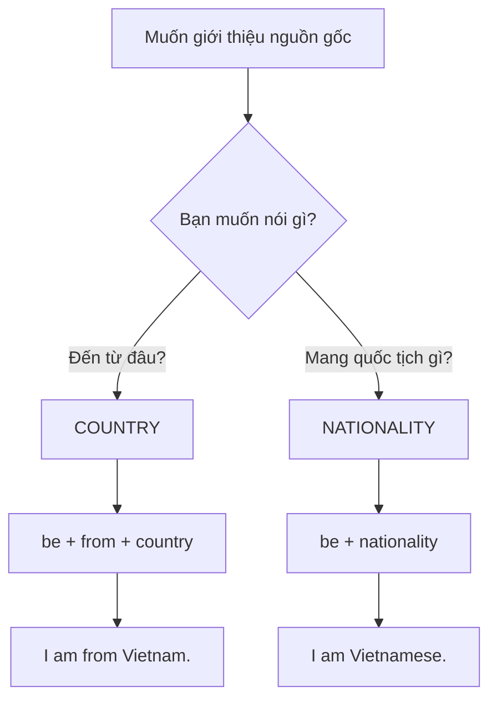
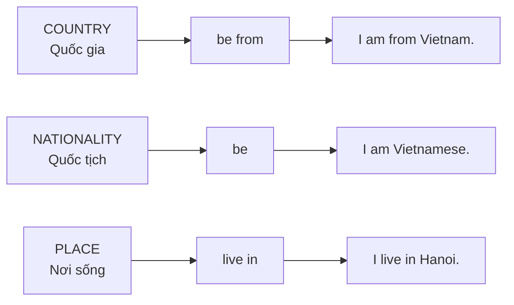

# Bài 01 — Quốc gia và quốc tịch

**Countries and Nationalities**

## 1. Mục tiêu bài học

Sau bài này, bạn có thể:

* Phân biệt **country** (quốc gia) và **nationality** (quốc tịch).
* Nói được mình **đến từ đâu**.
* Nói được mình **mang quốc tịch gì**.
* Hỏi người khác về quốc gia và quốc tịch.
* Sử dụng đúng cấu trúc **be from + country** và **be + nationality**.
* Nhận biết một số nhóm hậu tố thường gặp của từ chỉ quốc tịch.

Bài học gốc mở đầu bằng hai ví dụ điển hình: *“I’m from Vietnam. I’m Vietnamese.”* và *“I’m from Egypt. I’m Egyptian.”*, qua đó nhấn mạnh sự khác nhau giữa tên quốc gia và quốc tịch. 

---

## 2. Kiến thức cốt lõi: Country và Nationality

### 2.1. Country — Quốc gia

**Country** là tên của một đất nước.

Ví dụ:

| Country            | Nghĩa          |
| ------------------ | -------------- |
| Vietnam            | Việt Nam       |
| Japan              | Nhật Bản       |
| China              | Trung Quốc     |
| South Korea        | Hàn Quốc       |
| the United States  | Hoa Kỳ         |
| the United Kingdom | Vương quốc Anh |

Khi muốn nói **đến từ quốc gia nào**, dùng:

> **Subject + be + from + country**

Ví dụ:

* I am from **Vietnam**.
* She is from **Japan**.
* They are from **China**.

Cấu trúc *“chủ ngữ + to be + from + danh từ [quốc gia]”* cũng được nhấn mạnh trong bản chép lời. 

---

### 2.2. Nationality — Quốc tịch

**Nationality** cho biết một người thuộc quốc gia nào hoặc mang quốc tịch nào.

Ví dụ:

| Country            | Nationality |
| ------------------ | ----------- |
| Vietnam            | Vietnamese  |
| Japan              | Japanese    |
| China              | Chinese     |
| South Korea        | Korean      |
| the United States  | American    |
| the United Kingdom | British     |

Khi nói quốc tịch:

> **Subject + be + nationality**

Ví dụ:

* I am **Vietnamese**.
* She is **Japanese**.
* He is **American**.

---

## 3. Sơ đồ phân biệt nhanh



### Công thức nhớ nhanh

```text
WHERE?  → COUNTRY
WHO?    → NATIONALITY

I am from Vietnam.
          ↓
       COUNTRY

I am Vietnamese.
     ↓
 NATIONALITY
```

---

## 4. Từ vựng trọng tâm

| English                | Từ loại | Nghĩa                              | Ví dụ                              |
| ---------------------- | ------- | ---------------------------------- | ---------------------------------- |
| **country**            | n.      | quốc gia                           | Vietnam is a beautiful country.    |
| **nationality**        | n.      | quốc tịch                          | What is your nationality?          |
| **Vietnam**            | n.      | Việt Nam                           | I live in Vietnam.                 |
| **Vietnamese**         | n./adj. | người Việt; thuộc Việt Nam         | She is Vietnamese.                 |
| **Japan**              | n.      | Nhật Bản                           | My friend is from Japan.           |
| **Japanese**           | n./adj. | người Nhật; thuộc Nhật Bản         | He speaks Japanese.                |
| **China**              | n.      | Trung Quốc                         | China is a large country.          |
| **Chinese**            | n./adj. | người Trung Quốc; thuộc Trung Quốc | They eat Chinese food.             |
| **South Korea**        | n.      | Hàn Quốc                           | My sister works in South Korea.    |
| **Korean**             | n./adj. | người Hàn; thuộc Hàn Quốc          | I like Korean music.               |
| **the United States**  | n.      | Hoa Kỳ                             | Tom is from the United States.     |
| **American**           | n./adj. | người Mỹ; thuộc Mỹ                 | She is American.                   |
| **the United Kingdom** | n.      | Vương quốc Anh                     | London is in the United Kingdom.   |
| **British**            | n./adj. | người Anh; thuộc Vương quốc Anh    | He is British.                     |
| **foreigner**          | n.      | người nước ngoài                   | The hotel has many foreign guests. |

---

## 5. Học Country → Nationality theo nhóm

Thay vì cố học thuộc một danh sách rất dài, bài giảng gợi ý **học các quốc gia và quốc tịch theo nhóm hậu tố** để dễ ghi nhớ hơn. 

### Nhóm `-ese`

| Country | Nationality |
| ------- | ----------- |
| Vietnam | Vietnamese  |
| Japan   | Japanese    |
| China   | Chinese     |

### Nhóm `-an / -ian`

| Country                     | Nationality |
| --------------------------- | ----------- |
| America / the United States | American    |
| Korea                       | Korean      |
| Egypt                       | Egyptian    |

### Một số dạng đặc biệt

| Country            | Nationality |
| ------------------ | ----------- |
| the United Kingdom | British     |
| France             | French      |

> **Lưu ý:** Không phải mọi từ quốc tịch đều có thể suy ra chính xác chỉ bằng cách thêm hậu tố. Vì vậy cần ghi nhớ những trường hợp đặc biệt.

---

# 6. Cụm từ cần nhớ

### `be from + country`

**Nghĩa:** đến từ quốc gia nào.

* I am from Vietnam.
* She is from Japan.
* Tom is from the United States.

---

### `be + nationality`

**Nghĩa:** là người/mang quốc tịch nào.

* I am Vietnamese.
* She is Japanese.
* Tom is American.

---

### `Where are you from?`

**Bạn đến từ đâu?**

**A:** Where are you from?
**B:** I’m from Vietnam.

---

### `What nationality are you?`

**Bạn mang quốc tịch gì?**

**A:** What nationality are you?
**B:** I’m Vietnamese.

---

### `I live in + place`

**Tôi sống ở...**

* I live in Vietnam.
* I live in Hanoi.
* She lives in Japan.

> **`be from` và `live in` không hoàn toàn giống nhau:** một người có thể đến từ một quốc gia nhưng hiện sống tại quốc gia khác.

---

# 7. Ba thông tin dễ nhầm

Một người có thể có ba thông tin khác nhau:

```text
Quốc gia xuất thân
      │
      ▼
I'm from Vietnam.
      │
      ├──────────────┐
      ▼              ▼
Quốc tịch          Nơi sống
Vietnamese         the United States
      │              │
      ▼              ▼
I'm Vietnamese.   I live in the United States.
```

Ví dụ:

> **My friend is Japanese, but he lives in the United States.**

* **Japan** → country
* **Japanese** → nationality
* **the United States** → nơi đang sống

---

# 8. Cách dùng từ chỉ quốc tịch

Một từ như **French**, **Vietnamese**, **Chinese** có thể xuất hiện trong nhiều ngữ cảnh.

Ví dụ trong bài giảng có mẫu:

> *She is from France. She is French, and she speaks French.* 

Ta có:

| Câu                     | Chức năng          |
| ----------------------- | ------------------ |
| She is from **France**. | France = quốc gia  |
| She is **French**.      | French = quốc tịch |
| She speaks **French**.  | French = ngôn ngữ  |

Tương tự:

* I am from **Vietnam**.
* I am **Vietnamese**.
* I speak **Vietnamese**.

---

# 9. Mẫu câu trọng tâm

### Mẫu 1 — Hỏi quốc gia

**Where are you from?**
→ I’m from Vietnam.

Công thức:

```text
Where + be + subject + from?
```

---

### Mẫu 2 — Hỏi quốc tịch

**What nationality are you?**
→ I’m Vietnamese.

Hoặc:

**What nationality is your teacher?**
→ She is British.

Công thức:

```text
What nationality + be + subject?
```

---

### Mẫu 3 — Quốc tịch và nơi sống

**My friend is Japanese, but he lives in the United States.**

Cấu trúc:

```text
Subject + be + NATIONALITY
        + but
        + subject + live(s) in + PLACE
```

---

# 10. Hội thoại mẫu

### Hội thoại 1

**A:** Hello! Where are you from?
**B:** I’m from Vietnam.
**A:** So you’re Vietnamese?
**B:** Yes, I am.

---

### Hội thoại 2

**A:** Where is Ken from?
**B:** He is from Japan.
**A:** What nationality is he?
**B:** He is Japanese.

---

### Hội thoại 3

**A:** Where are you from?
**B:** I’m from China, but I live in South Korea.
**A:** Are you Chinese?
**B:** Yes, I am.

---

# 11. Lỗi thường gặp

### ❌ Sai: dùng nationality sau `from`

```text
I am from Vietnamese.
```

### ✅ Đúng

```text
I am from Vietnam.
```

---

### ❌ Sai: dùng country trực tiếp sau `be`

```text
I am Vietnam.
```

### ✅ Đúng

```text
I am Vietnamese.
```

---

### Quy tắc vàng

```text
FROM → COUNTRY
BE   → NATIONALITY
```

Ví dụ:

```text
I am FROM Vietnam.
I am Vietnamese.
```

---

# 12. Luyện tập

## A. Điền từ

1. I am __________. I come from Vietnam.
2. __________ are you from? — I’m from Japan.
3. Lisa is from China. She is __________.
4. Tom is from the United States. He is __________.
5. Ken is __________ Japan.

### Đáp án

1. **Vietnamese**
2. **Where**
3. **Chinese**
4. **American**
5. **from**

---

## B. Chọn Country hay Nationality

Điền dạng đúng.

1. I am from **Vietnam / Vietnamese**.
2. She is **Japan / Japanese**.
3. Tom is from **the United States / American**.
4. My teacher is **the United Kingdom / British**.
5. Lisa lives in **China / Chinese**.

### Đáp án

1. **Vietnam**
2. **Japanese**
3. **the United States**
4. **British**
5. **China**

---

## C. Chuyển đổi Country → Nationality

| Country            | Nationality |
| ------------------ | ----------- |
| Vietnam            | __________  |
| Japan              | __________  |
| China              | __________  |
| South Korea        | __________  |
| the United States  | __________  |
| the United Kingdom | __________  |

**Đáp án:** Vietnamese · Japanese · Chinese · Korean · American · British

---

# 13. Thực hành nói và viết

Viết **5 câu** giới thiệu bản thân theo mẫu:

```text
My name is __________.
I am from __________.
I am __________.
I live in __________.
I speak __________.
```

### Ví dụ

> My name is Nam.
> I am from Vietnam.
> I am Vietnamese.
> I live in Hanoi.
> I speak Vietnamese and English.

Sau đó cố gắng nói toàn bộ phần giới thiệu trong khoảng **30 giây mà không nhìn bài**.

---

# 14. Tổng kết bài học



### Ghi nhớ 3 công thức

```text
1. be from + COUNTRY
   I am from Vietnam.

2. be + NATIONALITY
   I am Vietnamese.

3. live in + PLACE
   I live in Hanoi.
```

---

# 15. Checklist

* [ ] Phân biệt được **country** và **nationality**.
* [ ] Dùng đúng **be from + country**.
* [ ] Dùng đúng **be + nationality**.
* [ ] Hỏi được **Where are you from?**
* [ ] Hỏi được **What nationality are you?**
* [ ] Nhớ ít nhất 6 cặp quốc gia — quốc tịch.
* [ ] Tự giới thiệu quốc gia, quốc tịch và nơi sống trong 30 giây.

---

# 16. Lịch ôn tập

Ôn lại bài sau:

**1 ngày → 2 ngày → 4 ngày → 7 ngày → 14 ngày**

Mỗi lần ôn, thay quốc gia trong cùng một mẫu:

```text
Vietnam → Vietnamese
Japan → Japanese
China → Chinese
South Korea → Korean
the United States → American
the United Kingdom → British
```

**Mẹo nhớ cuối bài:**

> **FROM → tên nước**
> **BE → quốc tịch**
> **LIVE IN → nơi đang sống**
