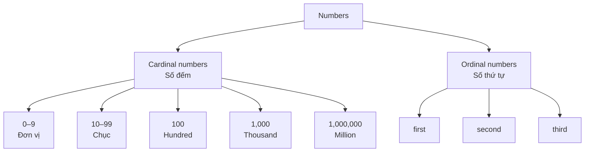
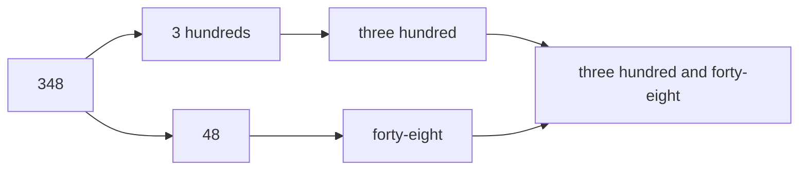
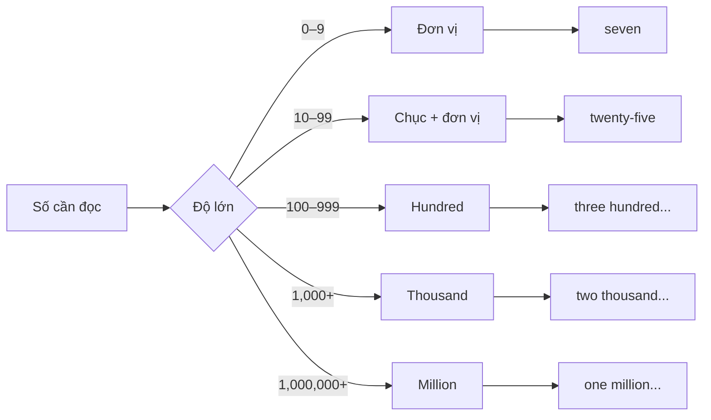
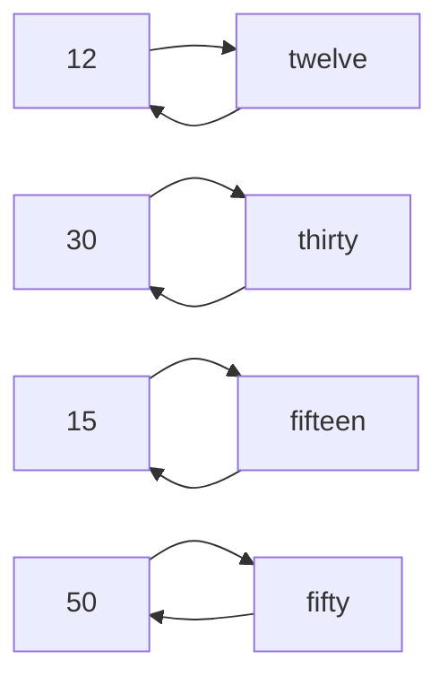

# Bài 02 — Số đếm

**Numbers**

## 1. Mục tiêu bài học

Sau bài này, bạn có thể:

* Đọc và viết các **số đếm cơ bản** trong tiếng Anh.
* Nắm quy tắc tạo số ở **hàng đơn vị, hàng chục, hàng trăm, hàng nghìn và hàng triệu**.
* Nói tuổi, số điện thoại, giá tiền và số lượng đơn giản.
* Phân biệt một số cặp số dễ nghe nhầm.
* Nhận biết và sử dụng các **số thứ tự cơ bản** như `first`, `second`, `third`.
* Đọc một chuỗi số dài chính xác hơn khi giao tiếp và làm bài nghe.

Bản chép lời tổ chức nội dung từ **hàng đơn vị → hàng chục → hàng trăm/nghìn/triệu → lỗi phổ biến → ứng dụng**, nên có thể học số theo từng tầng thay vì cố ghi nhớ từng số riêng lẻ.  

---

# 2. Hai loại số cần phân biệt

## 2.1. Cardinal numbers — Số đếm

Dùng để nói:

* số lượng;
* tuổi;
* giá tiền;
* số điện thoại;
* số người;
* số trang;
* số đồ vật.

Ví dụ:

* **one** book
* **two** cats
* **twenty** dollars
* **thirty** years old

---

## 2.2. Ordinal numbers — Số thứ tự

Dùng để chỉ **vị trí hoặc thứ tự**.

| Số | Số đếm | Số thứ tự  | Nghĩa    |
| -: | ------ | ---------- | -------- |
|  1 | one    | **first**  | thứ nhất |
|  2 | two    | **second** | thứ hai  |
|  3 | three  | **third**  | thứ ba   |

Ví dụ:

* This is my **first** class.
* She lives on the **second** floor.
* The library is on the **third** floor.

---

# 3. Sơ đồ tổng quan



---

# 4. Số từ 0 đến 10

Đây là nền tảng để hình thành những số lớn hơn. Bài giảng cũng bắt đầu bằng việc ôn lại các số ở hàng đơn vị trước khi chuyển sang các nhóm khác. 

| Số | English   | Nghĩa |
| -: | --------- | ----- |
|  0 | **zero**  | không |
|  1 | **one**   | một   |
|  2 | **two**   | hai   |
|  3 | **three** | ba    |
|  4 | **four**  | bốn   |
|  5 | **five**  | năm   |
|  6 | **six**   | sáu   |
|  7 | **seven** | bảy   |
|  8 | **eight** | tám   |
|  9 | **nine**  | chín  |
| 10 | **ten**   | mười  |

### Ví dụ

* I have **one** brother.
* She has **two** cats.
* There are **ten** students here.

---

# 5. Các số từ 11 đến 19

Các số **11–12** cần học riêng:

| Số | English    |
| -: | ---------- |
| 11 | **eleven** |
| 12 | **twelve** |

Từ **13 đến 19**, phần lớn có đuôi:

> **`-teen`**

| Số | English   |
| -: | --------- |
| 13 | thirteen  |
| 14 | fourteen  |
| 15 | fifteen   |
| 16 | sixteen   |
| 17 | seventeen |
| 18 | eighteen  |
| 19 | nineteen  |

Bản chép lời cũng dành riêng một phần để đi qua nhóm **11–19** trước khi chuyển sang hàng chục. 

### Công thức nhớ

```text
13 → thir + teen  → thirteen
14 → four + teen  → fourteen
16 → six + teen   → sixteen
```

Tuy nhiên có một số biến đổi chính tả:

```text
three → thirteen
five  → fifteen
eight → eighteen
```

---

# 6. Hàng chục

| Số | English    | Nghĩa     |
| -: | ---------- | --------- |
| 20 | **twenty** | hai mươi  |
| 30 | **thirty** | ba mươi   |
| 40 | **forty**  | bốn mươi  |
| 50 | **fifty**  | năm mươi  |
| 60 | sixty      | sáu mươi  |
| 70 | seventy    | bảy mươi  |
| 80 | eighty     | tám mươi  |
| 90 | ninety     | chín mươi |

> **Chú ý:** `40 = forty`, không phải ~~fourty~~.

---

# 7. Cách tạo số từ 21 đến 99

Công thức:

```text
HÀNG CHỤC + HÀNG ĐƠN VỊ
```

Ví dụ:

| Số | Cách viết   |
| -: | ----------- |
| 21 | twenty-one  |
| 24 | twenty-four |
| 35 | thirty-five |
| 48 | forty-eight |
| 59 | fifty-nine  |
| 76 | seventy-six |
| 99 | ninety-nine |

### Sơ đồ

```text
35
│
├── 30 → thirty
│
└── 5  → five

→ thirty-five
```

Thông thường khi viết số từ **21–99** mà hàng đơn vị khác 0, dùng dấu gạch nối:

> **twenty-one**, **thirty-five**, **ninety-nine**

---

# 8. Phân biệt `-teen` và `-ty`

Đây là nhóm cực kỳ dễ nghe nhầm.

| Số | `-teen`   | Số | `-ty`   |
| -: | --------- | -: | ------- |
| 13 | thirteen  | 30 | thirty  |
| 14 | fourteen  | 40 | forty   |
| 15 | fifteen   | 50 | fifty   |
| 16 | sixteen   | 60 | sixty   |
| 17 | seventeen | 70 | seventy |
| 18 | eighteen  | 80 | eighty  |
| 19 | nineteen  | 90 | ninety  |

### Ví dụ

```text
13 ≠ 30
thirteen ≠ thirty

14 ≠ 40
fourteen ≠ forty

15 ≠ 50
fifteen ≠ fifty
```

Khi luyện nghe, nên luyện các cặp này cạnh nhau thay vì học tách biệt.

---

# 9. Hàng trăm

## `hundred` — trăm

```text
100 = one hundred
200 = two hundred
300 = three hundred
```

### Số phức hợp

```text
125
= one hundred + twenty-five
```

```text
348
= three hundred + forty-eight
```

Có thể hình dung:



---

# 10. Hàng nghìn

## `thousand` — nghìn

|     Số | English       |
| -----: | ------------- |
|  1,000 | one thousand  |
|  2,000 | two thousand  |
|  5,000 | five thousand |
| 10,000 | ten thousand  |

Bài giảng cũng giới thiệu **1,000** với `a/one thousand` khi chuyển sang nhóm số lớn hơn. 

### Ví dụ

```text
1,500
→ one thousand five hundred
```

```text
2,350
→ two thousand three hundred and fifty
```

---

# 11. Hàng triệu

## `million` — triệu

```text
1,000,000
= one million
```

```text
2,000,000
= two million
```

```text
5,000,000
= five million
```

### Cấu trúc số lớn

```text
1,234,567
│
├── 1 million
├── 234 thousand
└── 567

→ one million
   two hundred and thirty-four thousand
   five hundred and sixty-seven
```

---

# 12. Sơ đồ đọc số lớn



---

# 13. Từ vựng trọng tâm

| English          | Từ loại | Nghĩa     | Ví dụ                                 |
| ---------------- | ------- | --------- | ------------------------------------- |
| **zero**         | n.      | số không  | The answer is zero.                   |
| **one**          | n.      | một       | I have one brother.                   |
| **two**          | n.      | hai       | She has two cats.                     |
| **ten**          | n.      | mười      | There are ten students here.          |
| **eleven**       | n.      | mười một  | My class starts at eleven.            |
| **twelve**       | n.      | mười hai  | There are twelve months in a year.    |
| **twenty**       | n.      | hai mươi  | The ticket costs twenty dollars.      |
| **thirty**       | n.      | ba mươi   | He is thirty years old.               |
| **forty**        | n.      | bốn mươi  | The room has forty chairs.            |
| **fifty**        | n.      | năm mươi  | Fifty people joined the event.        |
| **one hundred**  | n.      | một trăm  | The book has one hundred pages.       |
| **one thousand** | n.      | một nghìn | The phone costs one thousand dollars. |
| **first**        | ordinal | thứ nhất  | This is my first class.               |
| **second**       | ordinal | thứ hai   | She lives on the second floor.        |
| **third**        | ordinal | thứ ba    | Today is the third of May.            |

---

# 14. Ứng dụng 1 — Nói tuổi

### Câu hỏi

**How old are you?**
→ Bạn bao nhiêu tuổi?

### Công thức

```text
Subject + be + NUMBER + years old.
```

Ví dụ:

* I’m **twenty years old**.
* She is **eighteen years old**.
* He is **thirty years old**.

Trong hội thoại thông thường có thể trả lời ngắn:

> **I’m twenty.**

---

# 15. Ứng dụng 2 — Số điện thoại

### Câu hỏi

**What is your phone number?**

### Trả lời

> My phone number is **0903 123 456**.

Số điện thoại là một ứng dụng được đề cập trực tiếp trong bài giảng; bản chép lời đưa ví dụ một chuỗi số điện thoại dài để luyện nghe và ghi lại chính xác. 

### Cách đọc

Không đọc:

> ~~nine hundred and three million...~~

Mà đọc **từng chữ số**:

```text
0 → zero
9 → nine
0 → zero
3 → three
```

Ví dụ:

```text
0903
→ zero nine zero three
```

---

# 16. Ứng dụng 3 — Giá tiền

### Câu hỏi

**How much is it?**
→ Nó giá bao nhiêu?

Ví dụ:

**A:** How much is it?
**B:** It’s **twenty dollars**.

Hoặc:

* The ticket costs **fifty dollars**.
* The phone costs **one thousand dollars**.

---

# 17. Ứng dụng 4 — Số lượng

Cấu trúc:

> **There are + number + plural noun**

Ví dụ:

* There are **ten students**.
* There are **twenty chairs**.
* There are **fifty people**.

### So sánh

```text
There is one student.
There are two students.
```

---

# 18. Ứng dụng 5 — Số thứ tự và tầng

### Cấu trúc

> **on the + ordinal number + floor**

Ví dụ:

* on the **first floor**
* on the **second floor**
* on the **third floor**

### Mẫu câu

> The library is on the **third floor**.

---

# 19. Số đếm và số thứ tự

| Số | Cardinal | Ordinal |
| -: | -------- | ------- |
|  1 | one      | first   |
|  2 | two      | second  |
|  3 | three    | third   |
|  4 | four     | fourth  |
|  5 | five     | fifth   |
|  6 | six      | sixth   |
|  7 | seven    | seventh |
|  8 | eight    | eighth  |
|  9 | nine     | ninth   |
| 10 | ten      | tenth   |

Ba số đầu cần đặc biệt ghi nhớ:

```text
one   → first
two   → second
three → third
```

Không phải:

```text
❌ on the two floor
✅ on the second floor
```

---

# 20. Những lỗi dễ mắc

Bản chép lời dành riêng một phần cho **các lỗi phổ biến khi sử dụng số đếm**, cho thấy đây không chỉ là bài học thuộc lòng từ vựng. 

### Lỗi 1 — `forty`

```text
❌ fourty
✅ forty
```

### Lỗi 2 — nhầm `-teen` và `-ty`

```text
13 = thirteen
30 = thirty
```

### Lỗi 3 — đọc số điện thoại như một số lớn

```text
0903

❌ đọc như một số nguyên lớn
✅ zero – nine – zero – three
```

### Lỗi 4 — thêm `-s` không đúng

Khi có số cụ thể:

```text
✅ two hundred
✅ five thousand
✅ three million
```

Không viết:

```text
❌ two hundreds
❌ five thousands
❌ three millions
```

---

# 21. Mẫu câu trọng tâm

### Mẫu 1 — Tuổi

> **How old are you? — I’m twenty years old.**

---

### Mẫu 2 — Điện thoại

> **What is your phone number? — My phone number is 0903 123 456.**

---

### Mẫu 3 — Giá tiền

> **How much is it? — It’s fifty dollars.**

---

### Mẫu 4 — Số lượng

> **There are twenty students in the class.**

---

### Mẫu 5 — Số thứ tự

> **The library is on the third floor.**

---

# 22. Luyện tập

## A. Viết số bằng chữ

1. `12` = __________
2. `30` = __________
3. `100` = __________
4. `15` = __________
5. `50` = __________
6. `1,000` = __________

### Đáp án

1. **twelve**
2. **thirty**
3. **one hundred**
4. **fifteen**
5. **fifty**
6. **one thousand**

---

# 23. Bài tập phân biệt `-teen / -ty`

Điền số tương ứng:

1. thirteen = ______
2. thirty = ______
3. fourteen = ______
4. forty = ______
5. fifteen = ______
6. fifty = ______

### Đáp án

```text
thirteen → 13
thirty   → 30

fourteen → 14
forty    → 40

fifteen  → 15
fifty    → 50
```

---

# 24. Đọc số lớn

Viết bằng chữ:

1. `125`
2. `350`
3. `1,000`
4. `2,500`
5. `10,000`

### Gợi ý

```text
125
→ one hundred and twenty-five

350
→ three hundred and fifty

1,000
→ one thousand

2,500
→ two thousand five hundred

10,000
→ ten thousand
```

---

# 25. Nói và viết

## Bài tập thực hành

Đọc thành tiếng:

* tuổi của bạn;
* một số điện thoại giả định;
* giá của ba món đồ;
* số lượng đồ vật trong phòng.

Sau đó viết **5 câu** có sử dụng:

* `one`
* `two`
* `first`
* `second`
* `third`

### Ví dụ

> I have **one** brother.
> I have **two** notebooks.
> This is my **first** English class.
> My room is on the **second** floor.
> The library is on the **third** floor.

---

# 26. Phương pháp luyện nghe số

Không nên chỉ luyện:

```text
1 → one
2 → two
3 → three
```

Mà nên luyện **hai chiều**:



Tức là:

**Nhìn số → đọc chữ**

và:

**Nghe/nhìn chữ → viết số**

---

# 27. Tổng kết bài học

```text
0–9
  ↓
one, two, three...

10–19
  ↓
ten, eleven, twelve, thirteen...

20–90
  ↓
twenty, thirty, forty...

21–99
  ↓
tens + units
twenty-one

100
  ↓
hundred

1,000
  ↓
thousand

1,000,000
  ↓
million
```

### Công thức quan trọng

```text
35
= thirty-five

125
= one hundred and twenty-five

1,500
= one thousand five hundred
```

---

# 28. Checklist

* [ ] Đọc được số **0–10**.
* [ ] Nhớ các số **11–19**.
* [ ] Phân biệt được `-teen` và `-ty`.
* [ ] Nhớ `twenty`, `thirty`, `forty`, `fifty`.
* [ ] Tạo được số từ **21–99**.
* [ ] Đọc được `hundred`, `thousand`, `million`.
* [ ] Nói được tuổi.
* [ ] Đọc được số điện thoại từng chữ số.
* [ ] Nói được giá tiền và số lượng.
* [ ] Phân biệt `one/two/three` với `first/second/third`.

---

# 29. Ôn tập

Ôn bài theo chu kỳ:

**1 ngày → 2 ngày → 4 ngày → 7 ngày → 14 ngày**

Mỗi lần ôn nên thực hiện 4 bài nhỏ:

```text
1. Nhìn số   → đọc bằng tiếng Anh.
2. Nhìn chữ  → viết thành số.
3. Nghe số   → ghi nhanh.
4. Tự nói tuổi / giá / điện thoại / số lượng.
```

### Nhóm đặc biệt cần luyện nhiều

```text
13 ↔ 30
14 ↔ 40
15 ↔ 50
16 ↔ 60
17 ↔ 70
18 ↔ 80
19 ↔ 90
```

> **Mẹo nhớ:** Đừng chỉ học cách **đếm**. Hãy luyện đồng thời **nhìn – đọc – nghe – viết** số, đặc biệt với chuỗi số dài và các cặp `-teen / -ty`.
