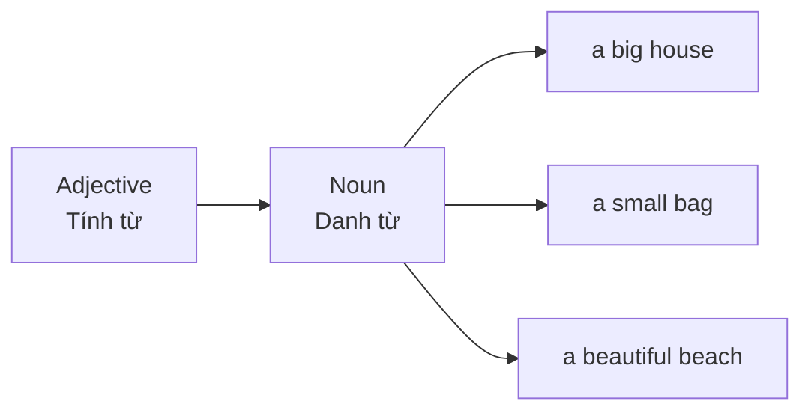
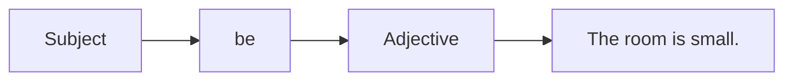
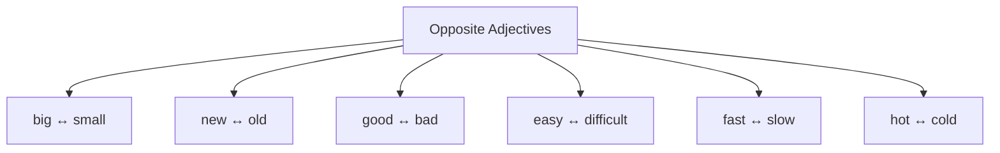
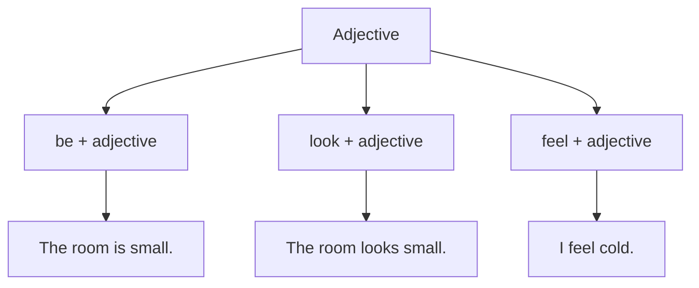
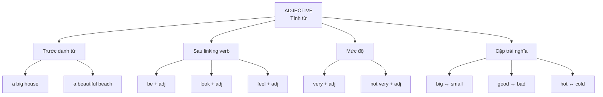

# Bài 03 — Các tính từ phổ biến

**Common Adjectives**

## 1. Mục tiêu bài học

Sau bài này, bạn có thể:

* Mô tả **người, đồ vật, địa điểm và tình huống** bằng các tính từ cơ bản.
* Dùng tính từ đúng vị trí sau động từ **`be`**.
* Dùng tính từ **trước danh từ**.
* Sử dụng các cấu trúc **`very + adjective`**, **`look + adjective`**, **`feel + adjective`**.
* Nhận biết và ghi nhớ tính từ theo **cặp trái nghĩa**.
* Viết một đoạn mô tả ngắn về căn phòng, một người bạn hoặc thành viên gia đình.

Bản chép lời của bài học cũng triển khai chủ đề **common adjectives** thông qua một ngữ cảnh rất gần gũi: mô tả các thành viên trong gia đình, thay vì học từng tính từ một cách tách rời. 

---

# 2. Adjective — Tính từ là gì?

**Adjective (adj.)** là từ dùng để mô tả đặc điểm, trạng thái hoặc tính chất của:

* người;
* đồ vật;
* địa điểm;
* sự việc;
* tình huống.

Ví dụ:

```text
a big house
→ một ngôi nhà lớn

a beautiful beach
→ một bãi biển đẹp

a friendly person
→ một người thân thiện
```

Hoặc:

```text
The house is big.
The beach is beautiful.
She is friendly.
```

---

# 3. Hai vị trí cơ bản của tính từ

## 3.1. Tính từ đứng trước danh từ

Công thức:

```text
adjective + noun
```

Ví dụ:

* a **big house**
* a **small bag**
* a **new phone**
* an **old building**
* a **good student**
* a **beautiful beach**

### Sơ đồ



> Trong tiếng Anh, tính từ **không thay đổi theo số ít hay số nhiều**.

```text
a big house
two big houses
```

Không dùng:

```text
❌ two bigs houses
```

---

# 4. Tính từ sau động từ `be`

Đây là cấu trúc quan trọng nhất của bài.

## Công thức

```text
Subject + be + adjective
```

Ví dụ:

* The room **is small**.
* The soup **is hot**.
* My hands **are cold**.
* Our neighbors **are friendly**.
* This exercise **is easy**.

### Sơ đồ



---

# 5. Từ vựng trọng tâm

| English       | Từ loại   | Nghĩa      | Ví dụ                       |
| ------------- | --------- | ---------- | --------------------------- |
| **big**       | adj.      | to, lớn    | They live in a big house.   |
| **small**     | adj.      | nhỏ        | I have a small bag.         |
| **new**       | adj.      | mới        | This is my new phone.       |
| **old**       | adj.      | cũ; già    | That is an old building.    |
| **good**      | adj.      | tốt        | She is a good student.      |
| **bad**       | adj.      | xấu; tệ    | The weather is bad today.   |
| **easy**      | adj.      | dễ         | This question is easy.      |
| **difficult** | adj.      | khó        | English is not difficult.   |
| **fast**      | adj./adv. | nhanh      | This train is fast.         |
| **slow**      | adj./adv. | chậm       | The bus is slow today.      |
| **hot**       | adj.      | nóng       | The soup is hot.            |
| **cold**      | adj.      | lạnh       | My hands are cold.          |
| **beautiful** | adj.      | đẹp        | The beach is beautiful.     |
| **friendly**  | adj.      | thân thiện | Our neighbors are friendly. |
| **cheap**     | adj.      | rẻ         | This shirt is cheap.        |

---

# 6. Học tính từ theo cặp trái nghĩa

Học theo cặp giúp nhớ nhanh hơn thay vì học từng từ riêng biệt.

| Tính từ  | Nghĩa | Trái nghĩa    | Nghĩa |
| -------- | ----- | ------------- | ----- |
| **big**  | lớn   | **small**     | nhỏ   |
| **new**  | mới   | **old**       | cũ    |
| **good** | tốt   | **bad**       | tệ    |
| **easy** | dễ    | **difficult** | khó   |
| **fast** | nhanh | **slow**      | chậm  |
| **hot**  | nóng  | **cold**      | lạnh  |

### Sơ đồ ghi nhớ



---

# 7. `very + adjective`

## Công thức

```text
very + adjective
```

**Very** = rất.

Ví dụ:

* very big → rất lớn
* very small → rất nhỏ
* very beautiful → rất đẹp
* very friendly → rất thân thiện
* very cold → rất lạnh

### Trong câu

> The house is **very big**.

> She is **very friendly**.

> The water is **very cold**.

Bản chép lời cũng sử dụng cách mô tả này khi nói người bố **“is very clever”**, tức là rất thông minh. 

---

# 8. `not very + adjective`

Cấu trúc này mang nghĩa:

> **không quá / không được ... lắm**

## Công thức

```text
Subject + be + not very + adjective
```

Ví dụ:

* The room is **not very big**.
  → Căn phòng không quá lớn.

* This exercise is **not very difficult**.
  → Bài tập này không quá khó.

* The bus is **not very fast**.
  → Xe buýt không nhanh lắm.

Cách diễn đạt **“không quá...”** cũng xuất hiện trong bản chép lời khi giải thích tính từ `lazy`. 

---

# 9. Tính từ trước danh từ

## Công thức

```text
a/an + adjective + noun
```

Ví dụ:

```text
a big house
a small room
a new phone
an old building
a good student
a beautiful beach
```

### So sánh hai cách

```text
This is a big house.
        ↓
 adjective + noun
```

và:

```text
This house is big.
              ↓
          be + adjective
```

Hai câu đều mô tả ngôi nhà **lớn**, nhưng vị trí của tính từ khác nhau.

---

# 10. `look + adjective`

**Look + adjective** dùng để mô tả **một người hoặc vật trông có vẻ như thế nào**.

## Công thức

```text
Subject + look(s) + adjective
```

Ví dụ:

* You **look tired**.
* She **looks beautiful**.
* The room **looks small**.
* This phone **looks new**.

### Mẫu câu

> **You look tired. Are you okay?**

→ Bạn trông có vẻ mệt. Bạn ổn chứ?

---

# 11. `feel + adjective`

Dùng để diễn tả **cảm giác hoặc trạng thái**.

## Công thức

```text
Subject + feel(s) + adjective
```

Ví dụ:

* I **feel cold**.
* She **feels tired**.
* I **feel good** today.
* He **feels bad** about the mistake.

### Phân biệt nhanh

```text
look tired
→ người khác nhìn bạn và thấy bạn có vẻ mệt

feel tired
→ chính bạn cảm thấy mệt
```

---

# 12. `be`, `look` và `feel`



| Cấu trúc      | Ý nghĩa                | Ví dụ            |
| ------------- | ---------------------- | ---------------- |
| `be + adj.`   | có đặc điểm/trạng thái | The soup is hot. |
| `look + adj.` | trông có vẻ            | You look tired.  |
| `feel + adj.` | cảm thấy               | I feel cold.     |

---

# 13. Kết nối hai tính từ bằng `and`

Khi hai đặc điểm cùng hướng hoặc bổ sung cho nhau:

```text
adjective + and + adjective
```

Ví dụ:

* My room is **small and comfortable**.
* She is **beautiful and friendly**.
* The car is **new and fast**.

---

# 14. Kết nối hai ý tương phản bằng `but`

**But** = nhưng.

Ví dụ:

> My room is **small but comfortable**.

> This exercise is **easy, but the next one is difficult**.

> The shirt is **beautiful but expensive**.

### Sơ đồ

```text
Ý 1                Ý đối lập
 ↓                     ↓
small       BUT    comfortable
easy        BUT    difficult
```

---

# 15. Mẫu câu trọng tâm

### Mẫu 1 — `be + adjective`

> **My room is small but comfortable.**

---

### Mẫu 2 — So sánh hai trạng thái

> **This exercise is easy, but the next one is difficult.**

---

### Mẫu 3 — `look + adjective`

> **You look tired. Are you okay?**

---

### Mẫu 4 — `very + adjective`

> **The beach is very beautiful.**

---

### Mẫu 5 — Tính từ trước danh từ

> **They live in a big house.**

---

# 16. Ngữ cảnh mô tả người

Một cách học hiệu quả là gắn tính từ vào một người cụ thể.

Ví dụ:

```text
My father is friendly.
He is very clever.

My mother is kind.
She is friendly.

My friend is quiet.
She is very friendly.
```

Bản chép lời gốc cũng dùng **gia đình** làm ngữ cảnh xuyên suốt để người học suy đoán nghĩa và ghi nhớ các tính từ, thay vì chỉ học danh sách từ riêng lẻ. 

---

# 17. Từ mở rộng từ bản chép lời

Ngoài nhóm từ vựng chính trong bài được biên soạn ở trên, bản chép lời gốc còn giới thiệu một nhóm **10 từ phổ biến** qua câu chuyện gia đình. Nội dung tổng kết có các từ như `clever`, `angry`, `kind`, `lazy`, `terrible`, `beautiful`, `famous`, `single`, `unlucky` và `special`. 

| Từ            | Nghĩa            |
| ------------- | ---------------- |
| **clever**    | thông minh       |
| **angry**     | tức giận         |
| **kind**      | tốt bụng, ân cần |
| **lazy**      | lười biếng       |
| **terrible**  | rất tệ           |
| **beautiful** | xinh đẹp         |
| **famous**    | nổi tiếng        |
| **single**    | độc thân         |
| **unlucky**   | không may mắn    |
| **special**   | đặc biệt         |

Trong phần tổng kết, bản chép lời xác nhận rõ nhóm `angry`, `kind`, `lazy`. 

---

# 18. Một số cụm từ mở rộng hữu ích

### `famous for + noun`

→ nổi tiếng vì...

```text
She is famous for her beauty.
```

`famous for something` cũng được nhấn mạnh trong phần tổng kết của bản chép lời. 

---

### `get + adjective`

Dùng để diễn tả **trở nên** có trạng thái nào đó.

```text
get angry
→ trở nên tức giận
```

Ví dụ trong ngữ cảnh bài giảng:

> He can get really angry when something is broken. 

---

# 19. Lỗi thường gặp

## Lỗi 1 — Thêm `is` khi tính từ đứng trước danh từ

```text
❌ a big is house
✅ a big house
```

---

## Lỗi 2 — Quên `be` khi tính từ đứng sau chủ ngữ

```text
❌ The house big.
✅ The house is big.
```

---

## Lỗi 3 — Dùng trạng từ sau `be` khi cần tính từ

```text
❌ The train is quickly.
✅ The train is fast.
```

---

## Lỗi 4 — Thêm số nhiều cho tính từ

```text
❌ two bigs houses
✅ two big houses
```

Tính từ tiếng Anh không đổi hình thức theo số lượng của danh từ.

---

# 20. Luyện tập A — Chọn từ phù hợp

1. An elephant is usually **(big / small)**.
2. Ice is **(hot / cold)**.
3. A kind person is often **(friendly / bad)**.
4. A new sports car can be **(fast / slow)**.
5. This question has a simple answer. It is **(easy / difficult)**.
6. The opposite of `good` is **(bad / beautiful)**.

### Đáp án

1. **big**
2. **cold**
3. **friendly**
4. **fast**
5. **easy**
6. **bad**

---

# 21. Luyện tập B — Điền tính từ trái nghĩa

| Từ   | Trái nghĩa |
| ---- | ---------- |
| big  | ______     |
| new  | ______     |
| good | ______     |
| easy | ______     |
| fast | ______     |
| hot  | ______     |

### Đáp án

```text
big       ↔ small
new       ↔ old
good      ↔ bad
easy      ↔ difficult
fast      ↔ slow
hot       ↔ cold
```

---

# 22. Luyện tập C — Sắp xếp câu

### 1.

```text
is / room / small / my
```

→ **My room is small.**

### 2.

```text
very / friendly / she / is
```

→ **She is very friendly.**

### 3.

```text
new / a / phone / this / is
```

→ **This is a new phone.**

### 4.

```text
tired / you / look
```

→ **You look tired.**

---

# 23. Nói và viết

## Mô tả căn phòng

Sử dụng ít nhất **8 tính từ**.

Ví dụ:

> My room is **small**, but it is **beautiful** and comfortable.
> My desk is **old**, but my computer is **new**.
> The room is usually **cold** in the morning and **hot** in the afternoon.
> My internet connection is **fast**.

---

## Mô tả một người

Có thể theo khung:

```text
This is my __________.

He/She is __________.
He/She is very __________.
He/She looks __________.
He/She is not very __________.

I think he/she is a __________ person.
```

Phương pháp tự tạo một **ngữ cảnh liên quan đến gia đình** để ghi nhớ từ lâu hơn cũng chính là bài tập được khuyến nghị ở cuối bản chép lời. 

---

# 24. Sơ đồ tổng kết



---

# 25. Công thức cần nhớ

```text
1. adjective + noun
   a big house

2. Subject + be + adjective
   The house is big.

3. very + adjective
   very beautiful

4. not very + adjective
   not very difficult

5. look + adjective
   You look tired.

6. feel + adjective
   I feel cold.
```

---

# 26. Checklist

* [ ] Hiểu tính từ dùng để làm gì.
* [ ] Đặt được tính từ trước danh từ.
* [ ] Dùng được `be + adjective`.
* [ ] Dùng được `very + adjective`.
* [ ] Dùng được `not very + adjective`.
* [ ] Phân biệt `look + adjective` và `feel + adjective`.
* [ ] Nhớ các cặp `big/small`, `new/old`, `good/bad`.
* [ ] Nhớ `easy/difficult`, `fast/slow`, `hot/cold`.
* [ ] Mô tả được một người bằng ít nhất 5 tính từ.
* [ ] Mô tả được căn phòng bằng ít nhất 8 tính từ.

---

# 27. Ôn tập

Tạo flashcard **hai chiều**, ưu tiên học theo cặp:

```text
big        ↔ small
new        ↔ old
good       ↔ bad
easy       ↔ difficult
fast       ↔ slow
hot        ↔ cold
```

Sau đó đưa từng từ vào **ngữ cảnh thật**:

```text
big
→ My school is big.

cold
→ The water is cold.

friendly
→ My teacher is very friendly.

beautiful
→ My hometown is beautiful.
```

> **Mẹo nhớ:** Đừng chỉ học `big = lớn`. Hãy học luôn **`a big house`** và **`The house is big`**. Như vậy bạn đồng thời nhớ được **nghĩa + vị trí + cách dùng** của tính từ.

---

# Bài luyện tập

## Mục tiêu


## Đề bài


## Yêu cầu hoàn thành

- [ ] 
- [ ] 
- [ ] 

## Kết quả / lời giải


## Ghi chú
