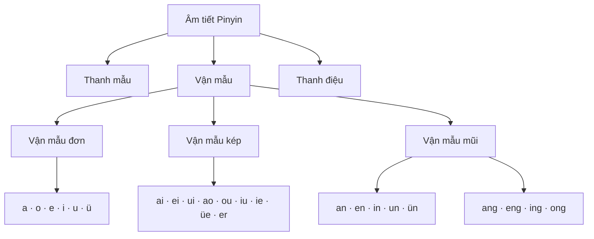
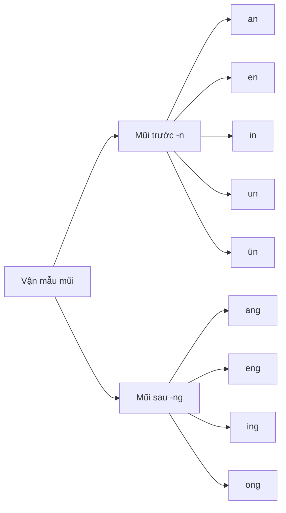

# Bài 03 — Làm chủ vận mẫu tiếng Trung

> **Module 02 — Xây nền phát âm và chữ Hán**
> **Phần:** PHẦN 1 — NỀN TẢNG TIẾNG TRUNG
> **Vị trí:** bài 03/08 của module
> **Trọng tâm:** Vận mẫu đơn · Vận mẫu kép · Vận mẫu mũi
> **Trạng thái:** ✅ Đã biên soạn nội dung

---

## 1. Mục tiêu bài học

Sau bài này, bạn có thể:

* [ ] Hiểu **vận mẫu (韵母 — yùnmǔ)** là gì và vị trí của vận mẫu trong một âm tiết Pinyin.
* [ ] Phát âm đúng **6 vận mẫu đơn**: `a, o, e, i, u, ü`.
* [ ] Nhận biết và phát âm **9 vận mẫu kép**: `ai, ei, ui, ao, ou, iu, ie, üe, er`.
* [ ] Nhận biết và phát âm **9 vận mẫu mũi**: `an, en, in, un, ün, ang, eng, ing, ong`.
* [ ] Phân biệt được các cặp dễ nhầm như `u / ü`, `an / ang`, `en / eng`, `in / ing`.
* [ ] Ghép **thanh mẫu + vận mẫu** để tự đọc những âm tiết Pinyin đơn giản.

> **Lưu ý:** Bài này tập trung vào **hình dạng và cách phát âm vận mẫu**.
> **Bốn thanh điệu và thanh nhẹ** sẽ được học chi tiết trong **Bài 04**.

---

## 2. Vận mẫu là gì?

Một âm tiết tiếng Trung thường có cấu trúc:

```text
Thanh mẫu + Vận mẫu + Thanh điệu
   b           a           1
        → bā
```

Ví dụ:

```text
m + a → ma
l + ü → lü
h + ao → hao
zh + ong → zhong
```

Trong đó:

* **Thanh mẫu (声母 — shēngmǔ):** phần phụ âm đứng đầu.
* **Vận mẫu (韵母 — yùnmǔ):** phần nguyên âm hoặc tổ hợp nguyên âm ở phía sau.
* **Thanh điệu (声调 — shēngdiào):** cao độ của âm tiết.

### Sơ đồ tổng quát



> Không phải âm tiết nào cũng có thanh mẫu.
> Ví dụ `ài`, `ān`, `è` có thể bắt đầu trực tiếp bằng vận mẫu.

---

# 3. Sáu vận mẫu đơn

Đây là nhóm nền tảng quan trọng nhất.

| Vận mẫu | Cách đọc gần đúng                                  | Khẩu hình                           | Ví dụ    |
| ------- | -------------------------------------------------- | ----------------------------------- | -------- |
| **a**   | gần “a”                                            | Miệng mở rộng                       | 大 **dà** |
| **o**   | gần “ô/o” tròn môi                                 | Môi tròn                            | 我 **wǒ** |
| **e**   | âm đặc trưng của tiếng Trung                       | Miệng hơi mở, lưỡi lùi              | 饿 **è**  |
| **i**   | gần “i”                                            | Môi hơi kéo ngang                   | 你 **nǐ** |
| **u**   | gần “u”                                            | Môi tròn, đưa ra trước              | 不 **bù** |
| **ü**   | không có âm tương đương hoàn toàn trong tiếng Việt | Lưỡi ở vị trí `i`, môi tròn như `u` | 绿 **lǜ** |

---

## 3.1. Vận mẫu `a`

Phát âm khá gần âm **a** tiếng Việt.

```text
a → a → a
```

Ví dụ:

* `ba`
* `ma`
* `da`
* `la`

### Luyện đọc

```text
ba   pa   ma   fa
da   ta   na   la
```

---

## 3.2. Vận mẫu `o`

Môi tròn tự nhiên.

```text
o → môi tròn
```

Ví dụ:

```text
bo
po
mo
fo
```

Không nên đọc thành âm **ô** quá khép của tiếng Việt.

---

## 3.3. Vận mẫu `e`

Đây là một trong những âm người Việt dễ đọc sai nhất.

Không nên đọc đơn giản thành:

```text
ê
```

hoặc

```text
e
```

của tiếng Việt.

Khi phát âm:

1. Miệng hơi mở.
2. Lưỡi hơi kéo về phía sau.
3. Không tròn môi.
4. Phát âm âm `e` sâu từ phía sau khoang miệng.

### Luyện đọc

```text
ge
ke
he
```

---

## 3.4. Vận mẫu `i`

Gần âm **i** tiếng Việt.

```text
i → miệng hơi kéo ngang
```

Ví dụ:

```text
mi
li
ni
```

> Sau một số thanh mẫu như `zh, ch, sh, r, z, c, s`, chữ **i** có cách phát âm đặc biệt. Phần này sẽ được luyện kỹ hơn khi ghép âm.

---

## 3.5. Vận mẫu `u`

Gần âm **u** tiếng Việt.

Môi:

* tròn;
* đưa nhẹ ra phía trước.

Ví dụ:

```text
bu
pu
mu
lu
```

---

## 3.6. Vận mẫu đặc biệt `ü`

`ü` là âm cực kỳ quan trọng.

### Cách tạo âm

Hãy thực hiện hai bước:

```text
Bước 1: giữ lưỡi ở vị trí phát âm "i"
                     ↓
Bước 2: vẫn giữ lưỡi như vậy nhưng tròn môi như "u"
                     ↓
                     ü
```

Có thể tập:

```text
i → ü
i → ü
i → ü
```

### Không đọc `ü` giống `u`

Hai âm:

```text
lu
lü
```

là **hai âm tiết khác nhau**.

Ví dụ:

| Chữ Hán | Pinyin | Nghĩa       |
| ------- | ------ | ----------- |
| 路       | lù     | đường       |
| 绿       | lǜ     | màu xanh lá |

### Bài tập khẩu hình

Giữ nguyên lưỡi:

```text
iiiiiiii
```

Sau đó từ từ tròn môi:

```text
iiii → üüüü
```

Lặp lại:

```text
i → ü
i → ü
i → ü
```

---

# 4. Chín vận mẫu kép

Vận mẫu kép được tạo thành khi **hai hoặc nhiều nguyên âm kết hợp với nhau**.

Có 9 vận mẫu thường gặp ở cấp độ này:

```text
ai   ei   ui

ao   ou   iu

ie   üe   er
```

---

## 4.1. Nhóm `ai – ei – ui`

### `ai`

Chuyển từ:

```text
a → i
```

Đọc liền thành:

```text
ai
```

Ví dụ:

> 太 — **tài** — quá, rất

---

### `ei`

Chuyển dần:

```text
e → i
```

Ví dụ:

> 没 — **méi** — không có

---

### `ui`

`ui` thực chất có nguồn gốc từ:

```text
uei
```

Khi đứng sau thanh mẫu, cách viết được rút gọn thành:

```text
ui
```

Ví dụ:

> 水 — **shuǐ** — nước

Không nên đọc tách cứng:

```text
u + i
```

mà cần đọc thành **một chuyển động âm liên tục**.

---

## 4.2. Nhóm `ao – ou – iu`

### `ao`

```text
a → o
```

Ví dụ:

> 好 — **hǎo** — tốt

---

### `ou`

```text
o → u
```

Ví dụ:

> 都 — **dōu** — đều, tất cả

---

### `iu`

`iu` là dạng viết rút gọn của:

```text
iou
```

Ví dụ:

> 六 — **liù** — sáu

Khi đọc không nên chỉ đọc:

```text
iu
```

một cách máy móc, mà phải nghe được chuyển động nguyên âm bên trong.

---

## 4.3. Nhóm `ie – üe – er`

### `ie`

Bắt đầu ở vị trí `i`, sau đó chuyển sang `e`.

```text
i → e
```

Ví dụ:

> 谢 — **xiè** — cảm ơn

---

### `üe`

Bắt đầu từ `ü`, rồi chuyển sang `e`.

```text
ü → e
```

Ví dụ:

> 学 — **xué** — học

---

### `er`

Đây là một vận mẫu đặc biệt.

Ví dụ:

> 二 — **èr** — hai

Khi phát âm:

* bắt đầu bằng phần nguyên âm;
* đầu lưỡi hơi cong về phía sau;
* không đọc thành hai âm riêng biệt kiểu `e + r`.

```text
er
```

không phải:

```text
e + r
```

---

# 5. Chín vận mẫu mũi

Vận mẫu mũi được chia thành hai nhóm chính.

## 5.1. Âm kết thúc bằng `-n`

```text
an
en
in
un
ün
```

## 5.2. Âm kết thúc bằng `-ng`

```text
ang
eng
ing
ong
```

Sơ đồ:



---

# 6. Phân biệt `-n` và `-ng`

Đây là phần rất quan trọng.

## Âm `-n`

Khi kết thúc bằng `n`:

* đầu lưỡi tiến về phía trước;
* đầu lưỡi chạm hoặc tiến sát vùng ngay sau răng trên;
* âm vang ở vùng phía trước.

Ví dụ:

```text
an
en
in
```

## Âm `-ng`

Khi kết thúc bằng `ng`:

* đầu lưỡi không chạm phía trước;
* phần sau của lưỡi nâng lên;
* âm vang sâu hơn trong khoang mũi.

Ví dụ:

```text
ang
eng
ing
```

### So sánh

```text
an   ↔   ang
en   ↔   eng
in   ↔   ing
```

> `-ng` trong Pinyin là một **âm mũi /ŋ/**.
> Không đọc thêm một âm `g` mạnh ở cuối.

---

# 7. Các vận mẫu mũi cần nhớ

| Vận mẫu | Ví dụ | Pinyin    |
| ------- | ----- | --------- |
| an      | 三     | **sān**   |
| en      | 人     | **rén**   |
| in      | 您     | **nín**   |
| un      | 春     | **chūn**  |
| ün      | 云     | **yún**   |
| ang     | 忙     | **máng**  |
| eng     | 冷     | **lěng**  |
| ing     | 名     | **míng**  |
| ong     | 中     | **zhōng** |

---

# 8. Bảng tổng hợp toàn bộ vận mẫu của bài

## Vận mẫu đơn

```text
a   o   e   i   u   ü
```

## Vận mẫu kép

```text
ai   ei   ui

ao   ou   iu

ie   üe   er
```

## Vận mẫu mũi

```text
an   en   in   un   ün

ang  eng  ing  ong
```

Tổng cộng trong bài:

```text
6 vận mẫu đơn
       +
9 vận mẫu kép
       +
9 vận mẫu mũi
       ↓
24 vận mẫu trọng tâm
```

---

# 9. Quy tắc chính tả Pinyin quan trọng

## Quy tắc 1 — `iou → iu`

Khi có thanh mẫu phía trước:

```text
l + iou
→ liu
```

Ví dụ:

> 六 — liù

Không viết:

```text
liou
```

---

## Quy tắc 2 — `uei → ui`

```text
sh + uei
→ shui
```

Ví dụ:

> 水 — shuǐ

---

## Quy tắc 3 — `uen → un`

```text
ch + uen
→ chun
```

Ví dụ:

> 春 — chūn

---

## Quy tắc 4 — `ü` sau `j, q, x, y`

Khi `ü` đi sau:

```text
j
q
x
y
```

hai dấu chấm của `ü` thường **bị lược bỏ trong cách viết**.

Ví dụ:

```text
j + ü → ju
q + ü → qu
x + ü → xu
y + ü → yu
```

Nhưng âm vẫn là **ü**, không phải `u`.

Ví dụ:

> 学 — xué

Trong `xue`, phần `u` thực chất được phát âm với âm **ü**.

### Mẹo nhớ

```text
j q x gặp ü
hai chấm bỏ đi
âm ü vẫn giữ.
```

---

# 10. Từ vựng trọng tâm

|  # | Chữ Hán | Pinyin | Từ loại      | Nghĩa tiếng Việt                      |
| -: | ------- | ------ | ------------ | ------------------------------------- |
|  1 | 太       | tài    | Phó từ       | quá, rất                              |
|  2 | 好       | hǎo    | Tính từ      | tốt                                   |
|  3 | 水       | shuǐ   | Danh từ      | nước                                  |
|  4 | 学       | xué    | Động từ      | học                                   |
|  5 | 中       | zhōng  | Danh/Tính từ | giữa, trung, Trung Quốc trong từ ghép |

> Ở bài này hãy tập trung vào **vận mẫu** trong các từ:
>
> `ai · ao · ui · üe · ong`

---

# 11. Ngữ pháp / Mẫu ghép âm

Vì đây là bài phát âm nên phần này tập trung vào **mẫu ghép Pinyin** thay vì ngữ pháp câu.

## Mẫu 1 — Thanh mẫu + vận mẫu

* **Công thức:**

```text
Thanh mẫu + Vận mẫu → Âm tiết
```

* **Ví dụ:**

```text
m + a   → ma
l + i   → li
h + ao  → hao
sh + ui → shui
zh + ong → zhong
```

* **Giải thích:**
  Thanh mẫu và vận mẫu phải được nối thành **một âm tiết liền mạch**, không đọc tách rời.

* **Lưu ý:**

Sai:

```text
h ... ao
```

Đúng:

```text
hao
```

---

## Mẫu 2 — Một vận mẫu có thể ghép với nhiều thanh mẫu

* **Công thức:**

```text
Thanh mẫu khác nhau + cùng vận mẫu
```

Ví dụ với `a`:

```text
ba
pa
ma
fa
```

Ví dụ với `u`:

```text
bu
pu
mu
fu
```

Ví dụ với `ao`:

```text
bao
pao
mao
dao
tao
```

* **Giải thích:**
  Đây là cách luyện rất hiệu quả để làm quen với bảng Pinyin.

* **Lưu ý:**
  Không phải mọi thanh mẫu đều có thể ghép với mọi vận mẫu. Các tổ hợp Pinyin tuân theo hệ thống âm tiết tiếng Trung.

---

# 12. Ví dụ minh họa

| Chữ Hán | Pinyin | Nghĩa tiếng Việt | Vận mẫu |
| ------- | ------ | ---------------- | ------- |
| 太       | tài    | quá, rất         | ai      |
| 好       | hǎo    | tốt              | ao      |
| 水       | shuǐ   | nước             | ui      |
| 六       | liù    | sáu              | iu      |
| 谢       | xiè    | cảm ơn           | ie      |
| 学       | xué    | học              | üe      |
| 人       | rén    | người            | en      |
| 忙       | máng   | bận              | ang     |
| 名       | míng   | tên              | ing     |
| 中       | zhōng  | giữa, trung      | ong     |

---

# 13. Hội thoại mẫu

> Chưa cần tập trung vào ngữ pháp. Hãy chú ý cách vận mẫu xuất hiện trong lời nói.

```text
A：你好！
   Nǐ hǎo!
   Xin chào!

B：你好！
   Nǐ hǎo!
   Xin chào!

A：你叫什么名字？
   Nǐ jiào shénme míngzi?
   Bạn tên là gì?

B：我叫悠悠。
   Wǒ jiào Yōuyōu.
   Tôi tên là Yoyo.
```

### Vận mẫu cần chú ý

```text
hǎo    → ao
jiào   → iao
shén   → en
míng   → ing
wǒ     → o
```

---

# 14. Luyện khẩu hình

## 14.1. Sáu vận mẫu đơn

Đọc mỗi âm 3 lần:

```text
a   a   a

o   o   o

e   e   e

i   i   i

u   u   u

ü   ü   ü
```

Sau đó đọc liền:

```text
a – o – e – i – u – ü
```

---

## 14.2. Luyện `u ↔ ü`

```text
u   ü
u   ü
u   ü
```

Tiếp tục:

```text
lu   lü
nu   nü
```

Hãy chú ý:

```text
u → lưỡi lùi hơn

ü → lưỡi giữ ở vị trí của "i",
    nhưng môi tròn.
```

---

# 15. Luyện vận mẫu kép

Đọc chậm trước:

```text
a → i     = ai
e → i     = ei
u → i     = ui

a → o     = ao
o → u     = ou
i → u     = iu

i → e     = ie
ü → e     = üe
```

Sau đó đọc liên tục:

```text
ai   ei   ui
ao   ou   iu
ie   üe   er
```

### Mục tiêu

Không đọc:

```text
a...i
```

mà chuyển liên tục:

```text
ai
```

---

# 16. Luyện vận mẫu mũi

## Nhóm `-n`

```text
an
en
in
un
ün
```

Đọc 3 vòng.

### Vòng 1

```text
an – en – in – un – ün
```

### Vòng 2

```text
an – en – in – un – ün
```

### Vòng 3

```text
an – en – in – un – ün
```

---

## Nhóm `-ng`

```text
ang
eng
ing
ong
```

Đọc:

```text
ang – eng – ing – ong
```

---

# 17. Luyện phân biệt âm

## Cặp 1

```text
an ↔ ang
```

Đọc:

```text
an   ang
an   ang
an   ang
```

---

## Cặp 2

```text
en ↔ eng
```

Đọc:

```text
en   eng
en   eng
en   eng
```

---

## Cặp 3

```text
in ↔ ing
```

Đọc:

```text
in   ing
in   ing
in   ing
```

---

## Cặp 4

```text
u ↔ ü
```

Đọc:

```text
lu   lü
lu   lü
lu   lü
```

---

# 18. Bài tập

## Bài 1 — Phân loại vận mẫu

Hãy chia các vận mẫu sau thành ba nhóm:

```text
ang   ai   ü   en   ao   i   ong   ie   u   ing   ei   a
```

### Điền vào bảng

| Vận mẫu đơn | Vận mẫu kép | Vận mẫu mũi |
| ----------- | ----------- | ----------- |
|             |             |             |
|             |             |             |
|             |             |             |
|             |             |             |

---

## Bài 2 — Xác định vận mẫu

Tìm vận mẫu trong các âm tiết:

1. `ma` → ______
2. `hao` → ______
3. `shui` → ______
4. `xue` → ______
5. `ren` → ______
6. `mang` → ______
7. `ming` → ______
8. `zhong` → ______

---

## Bài 3 — Ghép âm

Ghép thanh mẫu và vận mẫu:

```text
m + a    = ______

l + i    = ______

h + ao   = ______

sh + ui  = ______

l + iu   = ______

x + üe   = ______

r + en   = ______

m + ing  = ______

zh + ong = ______
```

---

## Bài 4 — Chọn âm khác nhóm

### Câu 1

```text
a   o   e   ai
```

Âm khác nhóm: ______

### Câu 2

```text
ai   ei   ao   ang
```

Âm khác nhóm: ______

### Câu 3

```text
an   en   ing   un
```

Âm khác nhóm: ______

### Câu 4

```text
ang   eng   ing   ong
```

Nhóm này thuộc: __________________

---

## Bài 5 — Đọc thành tiếng

Đọc chậm:

```text
ma
mi
mu

bao
bei
shui

hao
dou
liu

xie
xue

san
ren
nin

mang
leng
ming
zhong
```

Sau đó thử đọc lại với tốc độ tự nhiên hơn.

---

## Bài 6 — Nghe – nhắc lại

Thực hiện theo chu trình:

```text
Nghe
 ↓
Nhận diện vận mẫu
 ↓
Quan sát khẩu hình
 ↓
Nhắc lại
 ↓
Ghi âm
 ↓
So sánh
 ↓
Sửa lỗi
```

Mỗi vận mẫu nên luyện ít nhất **3–5 lần**.

---

## Bài 7 — Dịch Việt → Trung

Dựa vào các từ đã học:

1. tốt → ______
2. nước → ______
3. học → ______
4. người → ______
5. sáu → ______

---

# 19. Đáp án tự kiểm tra

## Bài 1

**Vận mẫu đơn:**

```text
ü   i   u   a
```

**Vận mẫu kép:**

```text
ai   ao   ie   ei
```

**Vận mẫu mũi:**

```text
ang   en   ong   ing
```

## Bài 2

```text
1. ma     → a
2. hao    → ao
3. shui   → ui
4. xue    → üe
5. ren    → en
6. mang   → ang
7. ming   → ing
8. zhong  → ong
```

## Bài 3

```text
m + a     = ma
l + i     = li
h + ao    = hao
sh + ui   = shui
l + iu    = liu
x + üe    = xue
r + en    = ren
m + ing   = ming
zh + ong  = zhong
```

## Bài 4

```text
1. ai
2. ang
3. ing
4. Vận mẫu mũi kết thúc bằng -ng
```

## Bài 7

```text
tốt    → 好 hǎo
nước   → 水 shuǐ
học    → 学 xué
người  → 人 rén
sáu    → 六 liù
```

---

# 20. Chữ Hán cần viết

| Chữ | Số nét | Bộ thủ | Ghi nhớ                       |
| --- | -----: | ------ | ----------------------------- |
| 人   |      2 | 人      | Hình người đang đứng          |
| 大   |      3 | 大      | Người dang rộng hai tay → lớn |
| 中   |      4 | 丨      | Một nét xuyên qua chính giữa  |
| 好   |      6 | 女      | Nghĩa cơ bản: tốt             |
| 学   |      8 | 子      | Liên tưởng đến việc học       |

> Phần trọng tâm của bài vẫn là **phát âm Pinyin**. Không cần dành quá nhiều thời gian cho chữ Hán nếu chưa quen với quy tắc viết nét.

---

# 21. Ghi chú & lỗi thường gặp

## Lỗi 1 — Đọc `ü` thành `u`

Sai:

```text
lü → lu
```

Cách sửa:

```text
đọc "i"
→ giữ nguyên vị trí lưỡi
→ tròn môi
→ ü
```

---

## Lỗi 2 — Đọc `e` giống hoàn toàn tiếng Việt

`e` trong Pinyin có khẩu hình khác `e/ê` tiếng Việt.

Hãy nghe âm chuẩn nhiều lần thay vì cố thay thế bằng một âm tiếng Việt.

---

## Lỗi 3 — Đọc vận mẫu kép thành hai âm rời

Sai:

```text
a ... i
```

Đúng:

```text
ai
```

Vận mẫu kép là **một chuyển động liên tục của khẩu hình**.

---

## Lỗi 4 — Không phân biệt `-n` và `-ng`

Ví dụ:

```text
an ≠ ang
en ≠ eng
in ≠ ing
```

Hãy chú ý vị trí của lưỡi.

---

## Lỗi 5 — Đọc âm `g` ở cuối `-ng`

Không đọc:

```text
ang-g
```

Mà kết thúc bằng âm mũi:

```text
ang
```

---

## Lỗi 6 — Thấy `ju, qu, xu` rồi đọc `u`

Trong:

```text
ju
qu
xu
```

chữ `u` được phát âm như **ü**.

Hãy nhớ:

```text
j + ü → ju
q + ü → qu
x + ü → xu
```

---

## Lỗi 7 — Chỉ nhìn chữ mà không luyện tai

Học phát âm cần đồng thời:

```text
Nhìn
 +
Nghe
 +
Bắt chước
 +
Ghi âm
 +
So sánh
```

Không nên chỉ đọc bảng Pinyin bằng mắt.

---

# 22. Phương pháp luyện 10 phút mỗi ngày

## Phút 1–2 — Vận mẫu đơn

```text
a o e i u ü
```

## Phút 3–5 — Vận mẫu kép

```text
ai ei ui
ao ou iu
ie üe er
```

## Phút 6–8 — Vận mẫu mũi

```text
an en in un ün
ang eng ing ong
```

## Phút 9 — Cặp dễ nhầm

```text
u / ü
an / ang
en / eng
in / ing
```

## Phút 10 — Ghép âm

Chọn ngẫu nhiên 5 tổ hợp:

```text
ma
hao
shui
liu
xue
ren
ming
zhong
```

và đọc thành tiếng.

---

# 23. Bảng ghi nhớ nhanh

```text
┌──────────────────────────────────────────────┐
│             VẬN MẪU PINYIN                   │
├──────────────────────────────────────────────┤
│ ĐƠN                                          │
│ a  o  e  i  u  ü                             │
│                                              │
│ KÉP                                          │
│ ai  ei  ui                                   │
│ ao  ou  iu                                   │
│ ie  üe  er                                   │
│                                              │
│ MŨI -N                                       │
│ an  en  in  un  ün                           │
│                                              │
│ MŨI -NG                                      │
│ ang  eng  ing  ong                           │
└──────────────────────────────────────────────┘
```

### Ba điểm quan trọng nhất

```text
① ü ≠ u

② -n ≠ -ng

③ Vận mẫu kép phải được đọc liền,
   không tách từng chữ cái.
```

---

# 24. Checklist tự đánh giá

* [ ] Tôi đọc được `a, o, e, i, u, ü`.
* [ ] Tôi tạo được âm `ü` đúng khẩu hình.
* [ ] Tôi đọc được 9 vận mẫu kép.
* [ ] Tôi đọc được 9 vận mẫu mũi.
* [ ] Tôi phân biệt được `u` và `ü`.
* [ ] Tôi phân biệt được `an` và `ang`.
* [ ] Tôi phân biệt được `en` và `eng`.
* [ ] Tôi phân biệt được `in` và `ing`.
* [ ] Tôi biết `iu`, `ui`, `un` là các dạng viết rút gọn.
* [ ] Tôi biết `ju`, `qu`, `xu` chứa âm `ü`, không phải âm `u`.
* [ ] Tôi có thể tự ghép thanh mẫu với vận mẫu.
* [ ] Tôi đã đọc thành tiếng toàn bộ bảng vận mẫu ít nhất 3 lần.
* [ ] Tôi đã ghi âm và nghe lại cách phát âm của mình.
* [ ] Tôi hoàn thành phần luyện tập.

---

## 25. Tổng kết

Trong bài này, chúng ta đã hoàn thành ba nhóm vận mẫu quan trọng:

```text
Vận mẫu
   │
   ├── Đơn
   │   └── a o e i u ü
   │
   ├── Kép
   │   └── ai ei ui ao ou iu ie üe er
   │
   └── Mũi
       ├── -n  → an en in un ün
       └── -ng → ang eng ing ong
```

Để phát âm tốt, đừng cố học thuộc bằng mắt. Hãy luôn thực hiện:

```text
NGHE
 ↓
NHÌN KHẨU HÌNH
 ↓
BẮT CHƯỚC
 ↓
ĐỌC THÀNH TIẾNG
 ↓
GHI ÂM
 ↓
SO SÁNH
 ↓
SỬA
```

Khi đã quen với thanh mẫu và vận mẫu, bước tiếp theo là thêm **thanh điệu** để tạo nên cách phát âm hoàn chỉnh của một âm tiết tiếng Trung.

---

⬅ [Bài 02 — Nhận diện và phát âm thanh mẫu](./bai-02.md) · 📚 [Danh sách bài](./README.md) · [Bài 04 — Bốn thanh điệu và thanh nhẹ](./bai-04.md) ➡ · 🏠 [Mục lục khóa học](../README.md)
