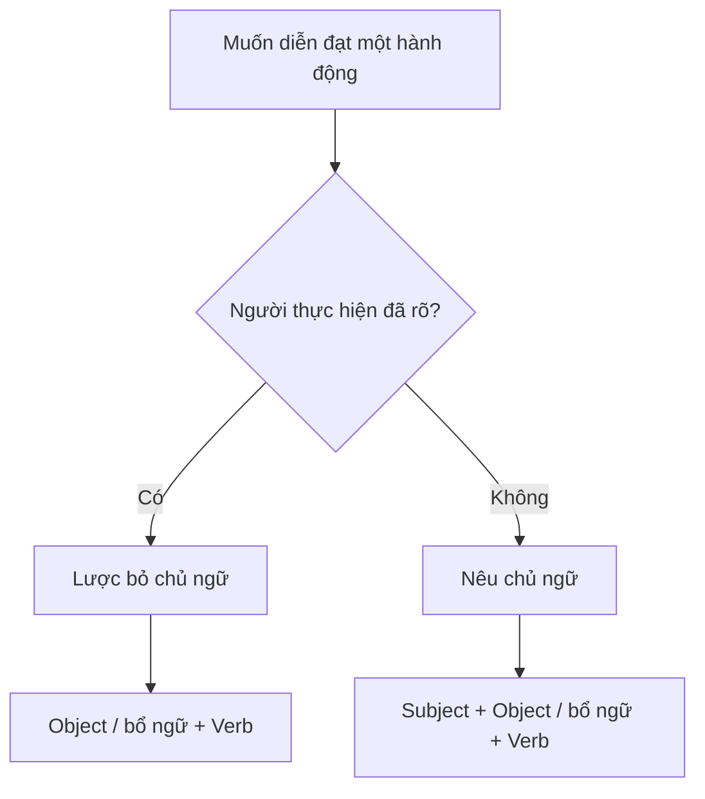

# 003 - Giới thiệu ngữ pháp tiếng Nhật

**Khóa học:** Introduction to Japanese
**Bài:** 003 - Introduction to Japanese Grammar
**Chủ đề:** Grammar
**Nguồn:** JapanesePod101.com

---

## 1. Tóm tắt

Ngữ pháp tiếng Nhật có cách tổ chức câu khác đáng kể so với tiếng Anh. Trong phạm vi bài nhập môn này, điểm quan trọng nhất là **trật tự từ cơ bản SOV**:

```text
Subject → Object → Verb
Chủ ngữ → Tân ngữ → Động từ
```

Trong khi tiếng Anh thường sử dụng cấu trúc **SVO**:

```text
Subject → Verb → Object
Chủ ngữ → Động từ → Tân ngữ
```

Ví dụ, câu tiếng Anh:

> I ate an apple.

có thể được biểu diễn theo thứ tự:

```text
I → ate → apple
S     V       O
```

Trong tiếng Nhật, câu tương ứng được giới thiệu trong bài học là:

> 私がりんごを食べました。
> *Watashi ga ringo o tabemashita.*

với thứ tự:

```text
私 → りんご → 食べました
I     apple      ate
S       O         V
```

Nguồn bài học sử dụng ví dụ này để giới thiệu trật tự **SOV** của tiếng Nhật.

Một đặc điểm quan trọng khác là chủ ngữ thường có thể bị lược bỏ khi người nghe đã biết ai hoặc cái gì đang được nói tới. Vì vậy, trong hội thoại thực tế, thay vì luôn nói đầy đủ:

> 私がりんごを食べました。

người Nhật có thể chỉ nói:

> りんごを食べました。

nếu ngữ cảnh đã cho biết người thực hiện hành động là ai.

---

## 2. Mục tiêu học tập

Sau bài học này, người học có thể:

* giải thích khái niệm **word order** — trật tự từ trong câu;
* phân biệt cấu trúc **SVO** của tiếng Anh với **SOV** được dùng để giới thiệu tiếng Nhật;
* phân tích các thành phần chủ ngữ, tân ngữ và động từ trong một câu tiếng Nhật đơn giản;
* hiểu vai trò cơ bản của các particle `が` và `を` trong ví dụ của bài;
* giải thích vì sao chủ ngữ thường được lược bỏ trong hội thoại tiếng Nhật;
* tạo câu hành động đơn giản theo mẫu `Object + を + Verb`;
* nhận biết khi nào cần giữ lại chủ ngữ để làm rõ hoặc nhấn mạnh người thực hiện hành động.

---

## 3. Trật tự từ cơ bản trong tiếng Nhật

### 3.1. SVO trong tiếng Anh

**Word order** là thứ tự các từ hoặc thành phần được sắp xếp để tạo thành câu trong một ngôn ngữ.

Xét câu:

> I ate an apple.

Để tập trung vào trật tự từ, bài học tạm bỏ mạo từ `an`:

> I ate apple.

Ta có:

| Thành phần | Từ    | Vai trò |
| ---------- | ----- | ------- |
| Subject    | I     | Chủ ngữ |
| Verb       | ate   | Động từ |
| Object     | apple | Tân ngữ |

Thứ tự là:

```text
I → ate → apple
S     V       O
```

Do đó, mô hình cơ bản được sử dụng cho tiếng Anh là:

```text
SVO = Subject + Verb + Object
```

Hay:

```text
Chủ ngữ + Động từ + Tân ngữ
```

### 3.2. SOV trong tiếng Nhật

Câu tương ứng trong tiếng Nhật là:

> 私がりんごを食べました。
> *Watashi ga ringo o tabemashita.*
> Tôi đã ăn một quả táo.

Tạm thời bỏ các particle để quan sát thứ tự của các từ chính:

```text
私 → りんご → 食べました
watashi → ringo → tabemashita
I → apple → ate
```

Ta có:

| Thành phần | Tiếng Nhật | Romaji      | Nghĩa |
| ---------- | ---------- | ----------- | ----- |
| Subject    | 私          | watashi     | tôi   |
| Object     | りんご        | ringo       | táo   |
| Verb       | 食べました      | tabemashita | đã ăn |

Thứ tự là:

```text
S → O → V
```

Do đó, trong phạm vi bài nhập môn:

```text
SOV = Subject + Object + Verb
```

Điểm cần nhớ nhất là:

> **Động từ thường đứng ở cuối cấu trúc câu cơ bản được trình bày trong bài học.**

Nguồn bài học mô tả sự khác biệt này bằng cách đối chiếu `"I ate apple"` với cách hình dung gần nghĩa đen `"I apple ate"` trong tiếng Nhật.

### 3.3. Phân tích câu mẫu

Xét câu đầy đủ:

> 私がりんごを食べました。

Có thể chia thành:

```text
私      が      りんご      を      食べました
watashi ga      ringo       o       tabemashita
tôi     [particle] táo      [particle] đã ăn
```

Trong ví dụ này:

* `私` (*watashi*) là “tôi”;
* `が` (*ga*) đánh dấu chủ ngữ trong câu mẫu;
* `りんご` (*ringo*) là “quả táo”;
* `を` được phát âm gần như *o* khi dùng làm particle và đánh dấu tân ngữ trực tiếp;
* `食べました` (*tabemashita*) là dạng lịch sự quá khứ của hành động “ăn”.

Có thể hình dung cấu trúc:

```text
私が        りんごを          食べました
Subject     Object            Verb
    │           │                │
    └───────────┴────────────────┘
                SOV
```

> **Lưu ý:** Bài học này chỉ sử dụng các particle ở mức cần thiết để hiểu cấu trúc câu. Hệ thống particle của tiếng Nhật cần được học riêng ở mức sâu hơn.

---

## 4. Chủ ngữ và trọng tâm của câu

### 4.1. Cách bài học mô tả tiếng Anh

Bài học gọi tiếng Anh là một ngôn ngữ **subject-prominent**, tức ngôn ngữ mà chủ ngữ có vai trò nổi bật trong cấu trúc câu.

Xét:

> I ate an apple.

Nếu bỏ chủ ngữ:

> Ate an apple.

câu trở nên thiếu tự nhiên khi đứng độc lập.

Nếu bỏ tân ngữ:

> I ate...

cấu trúc vẫn có thể được hiểu như phần đầu của một phát biểu hợp lệ.

Bài học sử dụng sự đối chiếu này để minh họa vai trò nổi bật của chủ ngữ trong tiếng Anh.

### 4.2. Cách bài học mô tả tiếng Nhật

Bài học giới thiệu tiếng Nhật là một ngôn ngữ **topic-prominent**, trong đó nội dung đã được thiết lập trong ngữ cảnh có ảnh hưởng lớn tới việc thành phần nào cần được nói ra.

Ví dụ đầy đủ:

> 私がりんごを食べました。

Nếu người nghe đã biết người đang nói chính là người thực hiện hành động, câu có thể trở thành:

> りんごを食べました。

Nghĩa vẫn được hiểu theo ngữ cảnh là:

> Tôi đã ăn một quả táo.

Trong trường hợp này, thông tin cần truyền đạt chủ yếu là:

```text
りんごを食べました
apple + ate
```

còn `私` có thể không cần xuất hiện.

Nguồn bài học nhấn mạnh rằng khi chủ ngữ đã rõ hoặc đã được thiết lập trước đó, việc lược bỏ chủ ngữ trong tiếng Nhật là rất bình thường.

> **Điểm cần phân biệt:** Phần này đang giới thiệu cách ngữ cảnh cho phép lược bỏ chủ ngữ. Không nên hiểu đơn giản rằng “topic” và “subject” luôn là cùng một khái niệm ngữ pháp.

---

## 5. Lược bỏ chủ ngữ trong tiếng Nhật

Trong hội thoại một-một, người nghe thường có thể xác định ai đang thực hiện hành động dựa trên ngữ cảnh.

Ví dụ, nếu đang kể về những gì mình đã làm hôm nay, không nhất thiết phải lặp lại:

> 私は...
> 私は...
> 私は...

trong mọi câu.

Câu đầy đủ:

> 私がりんごを食べました。
> *Watashi ga ringo o tabemashita.*

có thể được rút gọn thành:

> りんごを食べました。
> *Ringo o tabemashita.*

Ý nghĩa trong ngữ cảnh thích hợp vẫn có thể là:

> Tôi đã ăn một quả táo.

Bài học đưa ra thêm các câu có chủ ngữ được hiểu từ ngữ cảnh:

> 箱を開けました。
> *Hako o akemashita.*
> Đã mở chiếc hộp.

> 電車で帰りました。
> *Densha de kaerimashita.*
> Đã về bằng tàu điện.

Các ví dụ này trong tài liệu nguồn đều được trình bày mà không cần ghi rõ `私`.

Có thể hình dung:



Sơ đồ thể hiện nguyên tắc cơ bản của bài học: nếu người nghe đã biết chủ thể của hành động, người nói có thể tập trung vào thông tin mới thay vì lặp lại chủ ngữ.

---

## 6. Khi nào cần nêu chủ ngữ?

Không phải lúc nào chủ ngữ cũng được bỏ.

Chủ ngữ nên xuất hiện khi:

* người nghe chưa biết ai thực hiện hành động;
* có nhiều người có khả năng là người thực hiện;
* cần thay đổi chủ thể đang được nói tới;
* cần nhấn mạnh chính người đó là người thực hiện hành động.

Ví dụ, trong một nhóm người, nếu cần nhấn mạnh:

> **Tôi** là người đã ăn quả táo.

bài học sử dụng:

> 私がりんごを食べました。
> *Watashi ga ringo o tabemashita.*

Nguồn giải thích rằng khi chủ ngữ không rõ hoặc người nói muốn nhấn mạnh chủ ngữ, thành phần này sẽ được đưa trở lại câu.

Có thể ghi nhớ:

```text
Chủ ngữ đã rõ
    ↓
Có thể lược bỏ

Chủ ngữ chưa rõ
    ↓
Nên nói rõ

Muốn nhấn mạnh ai thực hiện
    ↓
Nêu chủ ngữ
```

---

## 7. Tạo câu hành động đơn giản

Một mẫu quan trọng trong bài là:

```text
Object + を + Verb
```

Ví dụ bài học yêu cầu tạo câu:

> Tôi đã ăn một chiếc hot dog.

Các thành phần được cho là:

```text
食べました
ホットドッグ
を
```

Ta thực hiện theo thứ tự sau:

1. Xác định tân ngữ: `ホットドッグ`.
2. Đặt tân ngữ trước.
3. Đặt particle `を` sau tân ngữ.
4. Đặt động từ `食べました` cuối câu.

Kết quả:

> ホットドッグを食べました。
> *Hottodoggu o tabemashita.*
> Tôi đã ăn một chiếc hot dog.

Đây cũng chính là bài tập được sử dụng trong transcript để củng cố thứ tự tân ngữ trước và động từ cuối.

Cấu trúc:

```text
ホットドッグ      を      食べました
hot dog          o       ate
Object                    Verb
```

Có thể rút thành công thức nhập môn:

```text
Danh từ + を + Động từ
```

Ví dụ khác từ tài liệu:

> 箱を開けました。
> *Hako o akemashita.*

Phân tích:

```text
箱      を      開けました
hako    o       akemashita
hộp             đã mở
Object           Verb
```

---

## 8. Những điểm dễ nhầm

* **Không đặt động từ theo thói quen tiếng Anh.** Với mẫu SOV của bài học, động từ được đặt cuối.
* **Không bắt buộc thêm `私` vào mọi câu.** Khi người thực hiện đã rõ, việc lặp lại chủ ngữ có thể không cần thiết.
* **Không bỏ particle `を` trong mẫu đang học.** Bài giảng chỉ bỏ particle tạm thời khi giải thích trật tự từ; câu tiếng Nhật thực tế trong ví dụ vẫn sử dụng particle.
* **Không hiểu `SOV` là công thức duy nhất cho mọi loại câu.** Đây là mô hình cơ bản dùng để giới thiệu trật tự thành phần trong bài học.
* **Không đồng nhất hoàn toàn “topic” với “subject”.** Bài này mới giới thiệu sự khác biệt ở mức nhập môn; các cấu trúc topic marker và subject marker cần học sâu hơn ở bài ngữ pháp sau.
* **Không suy ra chủ ngữ bị thiếu một cách máy móc.** Người nghe xác định chủ thể dựa trên ngữ cảnh hội thoại.

---

## 9. Bài thực hành

### 9.1. Sắp xếp câu

Sắp xếp các thành phần sau thành câu đúng theo mẫu của bài học:

```text
を
ホットドッグ
食べました
```

Sau đó xác định:

* tân ngữ;
* particle;
* động từ.

Tiếp tục với:

```text
開けました
箱
を
```

### 9.2. Phân tích câu

Phân tích câu:

> 私がりんごを食べました。

Hãy xác định:

1. Từ nào là chủ ngữ?
2. Từ nào là tân ngữ?
3. Động từ nằm ở vị trí nào?
4. Particle nào đứng sau chủ ngữ?
5. Particle nào đứng sau tân ngữ?

Sau đó so sánh với:

> りんごを食べました。

Trả lời:

* Thành phần nào đã bị lược bỏ?
* Vì sao người nghe vẫn có thể hiểu câu?
* Trong tình huống nào cần đưa thành phần đó trở lại?

### 9.3. Kết quả mong đợi

Sau bài thực hành, người học cần tạo và phân tích được:

```text
ホットドッグを食べました。
Object + を + Verb
```

và:

```text
箱を開けました。
Object + を + Verb
```

Đồng thời giải thích được sự khác nhau giữa:

```text
私がりんごを食べました。
```

và:

```text
りんごを食べました。
```

---

## 10. Checklist hoàn thành

* [ ] Tôi giải thích được `SVO` là gì.
* [ ] Tôi giải thích được `SOV` là gì.
* [ ] Tôi biết động từ nằm ở đâu trong mẫu câu cơ bản của bài học.
* [ ] Tôi phân tích được `私がりんごを食べました`.
* [ ] Tôi nhận biết được vai trò cơ bản của `が` trong câu mẫu.
* [ ] Tôi nhận biết được vai trò của `を` trong mẫu `Object + を + Verb`.
* [ ] Tôi hiểu vì sao `私` có thể được lược bỏ trong hội thoại.
* [ ] Tôi biết trường hợp nào cần nói rõ chủ ngữ.
* [ ] Tôi tự sắp xếp được `ホットドッグを食べました`.
* [ ] Tôi có thể tự tạo ít nhất một câu đơn giản theo mẫu đã học.

---

## 11. Câu hỏi tự kiểm tra

1. Sự khác nhau cơ bản giữa trật tự `SVO` và `SOV` là gì?
2. Trong câu `私がりんごを食べました`, từ nào đứng cuối và nó có vai trò gì?
3. Vì sao `りんごを食べました` vẫn có thể được hiểu là “Tôi đã ăn một quả táo” dù không có `私`?
4. Khi nào người nói nên sử dụng lại chủ ngữ trong câu tiếng Nhật?
5. Hãy sắp xếp `食べました`, `を`, `ホットドッグ` thành một câu đúng và giải thích thứ tự của từng thành phần.

---

## 12. Tổng kết

Trong bài này, người học đã làm quen với những nguyên tắc nhập môn quan trọng của ngữ pháp tiếng Nhật:

```text
Tiếng Anh
Subject → Verb → Object
SVO

Tiếng Nhật trong mẫu cơ bản của bài
Subject → Object → Verb
SOV
```

Ví dụ:

```text
私がりんごを食べました。
I + apple + ate
S + O + V
```

Tuy nhiên, khi chủ ngữ đã rõ từ ngữ cảnh, tiếng Nhật thường có thể lược bỏ chủ ngữ:

```text
りんごを食べました。
apple + ate
```

Từ nguyên tắc này, người mới học có thể bắt đầu xây dựng các câu hành động đơn giản theo mẫu:

```text
Object + を + Verb
```

Ví dụ:

> ホットドッグを食べました。
> *Hottodoggu o tabemashita.*
> Tôi đã ăn một chiếc hot dog.

Transcript kết thúc bài bằng ba điểm chính: tiếng Nhật được giới thiệu với trật tự `SOV`, trọng tâm câu phụ thuộc mạnh vào topic/ngữ cảnh, và chủ ngữ thường không cần xuất hiện khi đã rõ. Bài tiếp theo của khóa học được giới thiệu là phần cơ bản về hệ thống chữ viết tiếng Nhật.
