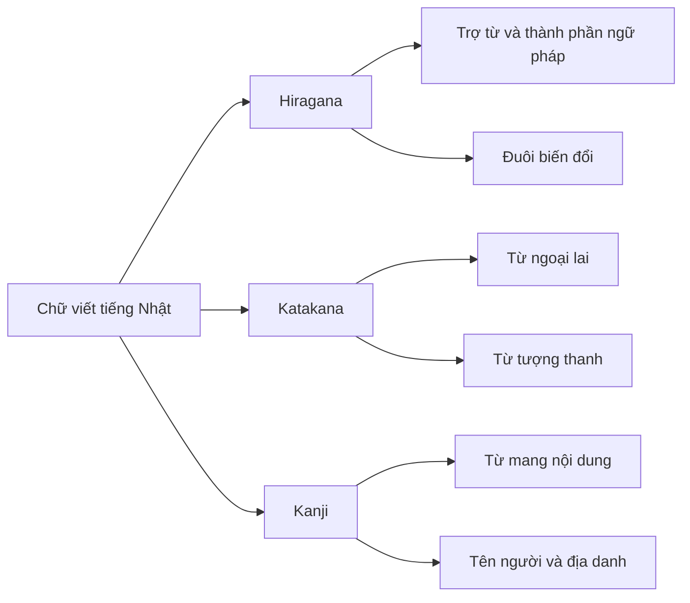
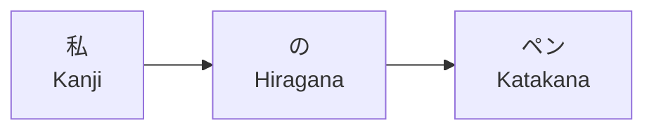

# 4 - Giới thiệu hệ thống chữ viết tiếng Nhật

**Khóa học:** Introduction to Japanese
**Bài gốc:** Introduction to Japanese #4
**Tên bài gốc:** Introduction to Japanese Writing
**Loại bài:** lesson

> **Phạm vi bài học:** Nội dung cốt lõi của bài bám theo *Lesson Notes* và *Lesson Transcript* đi kèm. Một số phần giải thích, bài tập và hướng dẫn học bên dưới được bổ sung để giúp người học luyện tập và hệ thống hóa kiến thức.

---

## 1. Tóm tắt

Tiếng Nhật không sử dụng duy nhất một bảng chữ cái như tiếng Anh. Khi viết tiếng Nhật, ba hệ thống chữ được sử dụng kết hợp với nhau:

* **Hiragana:** ひらがな
* **Katakana:** カタカナ
* **Kanji:** 漢字

Trong bài học gốc, Hiragana và Katakana được giới thiệu như hai hệ thống chữ biểu diễn âm tiết, trong khi Kanji là hệ thống chữ có nguồn gốc từ chữ Hán và biểu đạt ý nghĩa hoặc khái niệm. Tiếng Nhật hiện đại kết hợp cả ba hệ thống trong cùng một câu.  

Ba hệ thống không tồn tại để thay thế lẫn nhau. Mỗi hệ thống thường đảm nhiệm những vai trò khác nhau:

| Hệ thống chữ | Vai trò chính trong bài học                                |
| ------------ | ---------------------------------------------------------- |
| Hiragana     | Từ chức năng, trợ từ, phần biến đổi của động từ và tính từ |
| Katakana     | Từ ngoại lai, tên nước ngoài, từ tượng thanh               |
| Kanji        | Nhiều danh từ, gốc động từ/tính từ, tên người và địa danh  |

Bài học này tập trung vào việc giúp người mới hiểu **ba loại chữ là gì, khác nhau ở đâu và tại sao cần học cả ba**.

---

## 2. Mục tiêu học tập

Sau bài học, người học có thể:

* kể tên ba hệ thống chữ viết chính của tiếng Nhật;
* nhận diện cơ bản Hiragana, Katakana và Kanji bằng hình thức chữ;
* giải thích vai trò cơ bản của từng hệ thống;
* phân biệt Hiragana và Katakana;
* nhận biết năm nguyên âm cơ bản của tiếng Nhật;
* giải thích vì sao Kanji khác với một bảng chữ cái;
* nhận diện một số ví dụ đơn giản về từ ngoại lai, trợ từ, danh từ và địa danh;
* xác định thứ tự học phù hợp cho người mới bắt đầu;
* phân tích sơ bộ một câu tiếng Nhật có sử dụng nhiều hệ thống chữ.

---

## 3. Ba hệ thống chữ viết tiếng Nhật

### 3.1. Hiragana

**Hiragana** viết là:

```text
ひらがな
```

Trong bài học, Hiragana được mô tả như hệ thống chữ cơ bản của tiếng Nhật. Mỗi ký tự đại diện cho một âm tiết hoặc một đơn vị âm tương ứng trong hệ thống kana. 

Năm nguyên âm cơ bản được giới thiệu là:

| Hiragana | Romaji | Cách đọc gần đúng |
| -------- | ------ | ----------------- |
| あ        | a      | a                 |
| い        | i      | i                 |
| う        | u      | u                 |
| え        | e      | e                 |
| お        | o      | o                 |

```text
あ　い　う　え　お
a   i   u   e   o
```

Các hàng khác thường hình thành bằng cách kết hợp một phụ âm với các nguyên âm trên.

Ví dụ trong bài:

```text
か　き　く　け　こ
ka  ki  ku  ke  ko
```

```text
さ　し　す　せ　そ
sa  shi su  se  so
```

Hiragana thường có các nét cong và mềm hơn Katakana. 

---

### 3.2. Katakana

**Katakana** viết là:

```text
カタカナ
```

Katakana biểu diễn hệ thống âm gần tương ứng với Hiragana nhưng sử dụng bộ ký tự khác.

Ví dụ:

```text
ア　イ　ウ　エ　オ
a   i   u   e   o
```

```text
カ　キ　ク　ケ　コ
ka  ki  ku  ke  ko
```

So với Hiragana, Katakana thường có:

* nhiều nét thẳng hơn;
* nhiều góc nhọn hơn;
* hình thức mang cảm giác vuông và sắc hơn.

Sự khác biệt hình thức này cũng được nhấn mạnh trong bài học gốc. 

Ví dụ so sánh:

| Âm | Hiragana | Katakana |
| -- | -------- | -------- |
| a  | あ        | ア        |
| i  | い        | イ        |
| u  | う        | ウ        |
| e  | え        | エ        |
| o  | お        | オ        |
| ka | か        | カ        |
| ki | き        | キ        |
| ku | く        | ク        |
| ke | け        | ケ        |
| ko | こ        | コ        |

> **Điểm cần nhớ:** Hiragana và Katakana có thể biểu diễn nhiều âm giống nhau, nhưng hình dạng ký tự và phạm vi sử dụng thường khác nhau.

---

### 3.3. Kanji

**Kanji** viết là:

```text
漢字
```

Kanji sử dụng các ký tự có nguồn gốc từ chữ Hán trong hệ thống chữ viết tiếng Nhật.

Khác với Hiragana và Katakana, Kanji không hoạt động đơn giản như một bảng ký tự âm tiết. Theo bài học, một ký tự Kanji có thể đại diện cho một ý tưởng hoặc khái niệm và có tính chất gần với một đơn vị mang nghĩa hơn là một chữ cái riêng lẻ. 

Ví dụ:

```text
人
```

```text
学校
```

```text
東京
```

```text
大阪
```

Một đặc điểm quan trọng của Kanji là một ký tự có thể có nhiều cách đọc. Cách phát âm có thể thay đổi tùy từ và ngữ cảnh. 

Vì vậy, khi học Kanji, người học không nên chỉ ghi nhớ:

```text
Kanji → một cách phát âm
```

Mà cần học theo hướng:

```text
Kanji
   ↓
Ý nghĩa
   ↓
Từ vựng chứa Kanji
   ↓
Cách đọc trong từ đó
   ↓
Ngữ cảnh sử dụng
```

---

## 4. Vai trò của từng hệ thống chữ

### 4.1. Hiragana dùng để làm gì?

Hiragana được sử dụng rất rộng rãi trong tiếng Nhật.

Theo bài học, Hiragana có thể được dùng cho:

* nhiều từ chức năng;
* các trợ từ ngữ pháp;
* những từ không có dạng Kanji thông dụng;
* những trường hợp Kanji quá khó hoặc không phù hợp với người đọc;
* phần biến đổi đi kèm gốc Kanji của động từ và tính từ. 

Ví dụ về trợ từ sở hữu:

```text
私のペン。
```

Trong đó:

```text
の
```

là trợ từ được viết bằng Hiragana.

Có thể hiểu câu trên ở mức cơ bản là:

```text
私 + の + ペン
tôi + của + bút
```

Ví dụ khác:

```text
学校にいる。
```

Trong đó:

```text
に
```

được viết bằng Hiragana.

Ví dụ:

```text
ジョンは学生です。
```

Trong đó:

```text
は
```

là một trợ từ.

> **Lưu ý:** Trong tiếng Nhật, cách đọc của một ký tự khi đóng vai trò trợ từ có thể khác với cách đọc thông thường của ký tự đó. Đây là nội dung người học sẽ tiếp tục gặp trong phần ngữ pháp.

---

### 4.2. Katakana dùng để làm gì?

Bài học tập trung vào hai nhóm ứng dụng quan trọng của Katakana:

* từ và tên có nguồn gốc nước ngoài;
* từ tượng thanh, tượng thanh động vật hoặc âm thanh mô phỏng. 

Ví dụ từ ngoại lai:

```text
コンピューター
```

Romaji:

```text
konpyuutaa
```

Nghĩa:

```text
computer
```

Ví dụ:

```text
ビール
```

Romaji:

```text
biiru
```

Ví dụ tên địa danh và tên người nước ngoài:

```text
ロンドン
```

```text
ジョン
```

Các ví dụ này lần lượt thể hiện cách tiếng Nhật chuyển âm những tên như London và John sang Katakana.

Ví dụ từ tượng thanh:

```text
ワンワン
```

```text
ニャン
```

Đây là những ví dụ được bài học sử dụng để minh họa âm thanh của động vật. 

---

### 4.3. Kanji dùng để làm gì?

Theo bài học, Kanji thường được dùng để viết:

* nhiều từ có nguồn gốc Nhật;
* nhiều từ có nguồn gốc lịch sử từ tiếng Trung;
* phần lớn danh từ;
* phần gốc của nhiều động từ;
* phần gốc của nhiều tính từ;
* nhiều tên người;
* nhiều địa danh. 

Ví dụ danh từ:

```text
人
学校
```

Ví dụ động từ:

```text
見る
行く
```

Có thể quan sát:

```text
見 + る
行 + く
```

Trong các ví dụ trên:

* phần đầu sử dụng Kanji;
* phần đuôi sử dụng Hiragana.

Ví dụ tính từ:

```text
赤い
怖い
```

Có thể quan sát:

```text
赤 + い
怖 + い
```

Ví dụ tên người và địa danh:

```text
田中
博子
東京
大阪
```

Bài học nhấn mạnh rằng mặc dù Kanji khó hơn hai hệ thống kana và có số lượng ký tự rất lớn, Kanji vẫn là một phần không thể thiếu trong chữ viết tiếng Nhật. 

---

## 5. Vì sao tiếng Nhật sử dụng cả ba hệ thống?

Ba hệ thống chữ có thể xuất hiện cùng nhau vì chúng đảm nhiệm những vai trò khác nhau.

Một cách hình dung đơn giản:



Sơ đồ không có nghĩa rằng mỗi hệ thống chỉ được phép sử dụng đúng cho các trường hợp trên. Đây là mô hình đơn giản dành cho người mới bắt đầu.

Trong thực tế, điều quan trọng ở giai đoạn này là hiểu:

```text
Kanji      → thường giúp nhận diện phần mang nghĩa chính
Hiragana   → thường hỗ trợ ngữ pháp và biến đổi
Katakana   → thường giúp nhận diện từ ngoại lai hoặc nhóm từ đặc biệt
```

Nhờ việc phối hợp ba hệ thống, người đọc có thêm tín hiệu trực quan để phân chia các thành phần trong câu.

---

## 6. Hiragana và Katakana giống và khác nhau thế nào?

| Đặc điểm                          | Hiragana                 | Katakana                  |
| --------------------------------- | ------------------------ | ------------------------- |
| Thuộc hệ thống kana               | Có                       | Có                        |
| Có ký tự cho `a, i, u, e, o`      | Có                       | Có                        |
| Biểu diễn nhiều âm tương ứng nhau | Có                       | Có                        |
| Hình dạng                         | Mềm, nhiều nét cong      | Góc cạnh, nhiều nét thẳng |
| Từ chức năng và trợ từ            | Thường dùng              | Không phải vai trò chính  |
| Từ ngoại lai                      | Không phải vai trò chính | Thường dùng               |
| Từ tượng thanh                    | Có thể gặp               | Được bài học nhấn mạnh    |
| Thứ tự học được bài gợi ý         | Học trước                | Học sau Hiragana          |

Bài học gốc khuyến nghị người mới nên học Hiragana trước và sau đó chuyển sang Katakana do hai hệ thống có nhiều điểm tương đồng. 

---

## 7. Hiragana và Kanji phối hợp với nhau

Một trong những đặc điểm quan trọng nhất của chữ viết tiếng Nhật là một từ có thể bao gồm cả Kanji và Hiragana.

Ví dụ từ bài học:

```text
見る
```

Có thể tách:

```text
見 + る
```

Trong đó:

* `見` là Kanji;
* `る` là Hiragana.

Ví dụ:

```text
押す
```

Tách thành:

```text
押 + す
```

Ví dụ với tính từ:

```text
白い
```

Tách thành:

```text
白 + い
```

Ví dụ:

```text
古い
```

Tách thành:

```text
古 + い
```

Bài học sử dụng các ví dụ này để cho thấy Hiragana có thể đóng vai trò phần đuôi biến đổi đi cùng Kanji. 

Mô hình cơ bản:

```text
Kanji + Hiragana
   ↓
gốc từ + phần ngữ pháp/biến đổi
```

Đây là một trong những lý do người học không thể chỉ học Kanji mà bỏ qua Hiragana.

---

## 8. Phân tích một số ví dụ trong bài

### 8.1. 私のペン。

Câu:

```text
私のペン。
```

Có thể nhận diện ba phần:

```text
私 | の | ペン
```

| Thành phần | Hệ thống chữ | Vai trò cơ bản        |
| ---------- | ------------ | --------------------- |
| `私`        | Kanji        | Thành phần mang nghĩa |
| `の`        | Hiragana     | Trợ từ                |
| `ペン`       | Katakana     | Từ ngoại lai          |

Đây là một ví dụ rất hữu ích vì chỉ trong một cụm ngắn đã xuất hiện cả ba hệ thống chữ.

Cấu trúc:



Qua ví dụ này, có thể thấy Hiragana, Katakana và Kanji không phải ba lựa chọn độc lập. Chúng thường được phối hợp trực tiếp trong cùng một biểu thức.

---

### 8.2. ジョンは学生です。

Câu:

```text
ジョンは学生です。
```

Có thể tách sơ bộ:

```text
ジョン | は | 学生 | です
```

| Thành phần | Hệ thống chữ |
| ---------- | ------------ |
| `ジョン`      | Katakana     |
| `は`        | Hiragana     |
| `学生`       | Kanji        |
| `です`       | Hiragana     |

Người mới chưa cần phân tích toàn bộ ngữ pháp của câu này. Điều quan trọng trong bài hiện tại là **nhận diện loại chữ**.

---

## 9. Cách nhận diện nhanh ba hệ thống

Khi nhìn một câu tiếng Nhật lần đầu, người mới có thể sử dụng các dấu hiệu sau.

**Hiragana**

Ví dụ:

```text
あ  の  に  は  る  す  い
```

Dấu hiệu:

* nhiều nét cong;
* thường xuất hiện giữa hoặc sau Kanji;
* thường xuất hiện ở các thành phần ngữ pháp.

**Katakana**

Ví dụ:

```text
ア  カ  コンピューター  ジョン
```

Dấu hiệu:

* nét thẳng và góc cạnh;
* thường gặp trong tên nước ngoài;
* thường gặp trong từ vay mượn.

**Kanji**

Ví dụ:

```text
私
人
学校
東京
大阪
```

Dấu hiệu:

* cấu trúc thường phức tạp hơn kana;
* một ký tự có thể chứa nhiều nét;
* thường đóng vai trò quan trọng trong việc biểu đạt nghĩa của từ.

> **Lưu ý:** Đây chỉ là phương pháp nhận diện ban đầu. Không nên cố đoán cách đọc hoặc nghĩa của mọi Kanji chỉ dựa trên hình dạng.

---

## 10. Thứ tự học dành cho người mới

Bài học gốc khuyến nghị học Hiragana trước và Katakana sau. Kanji cần được học dần vì có số lượng lớn và nhiều cách đọc. 

Một lộ trình phù hợp với nội dung bài là:

1. Học năm nguyên âm Hiragana.
2. Học toàn bộ Hiragana cơ bản.
3. Luyện đọc các chuỗi Hiragana ngắn.
4. Học Katakana dựa trên những âm đã biết.
5. Luyện nhận diện từ ngoại lai bằng Katakana.
6. Bắt đầu Kanji cơ bản theo từ vựng.
7. Học Kanji trong từ và câu thay vì chỉ ghi nhớ ký tự riêng lẻ.
8. Luyện đọc câu có cả Hiragana, Katakana và Kanji.

Có thể hình dung:

```text
Hiragana
    ↓
Katakana
    ↓
Từ vựng cơ bản
    ↓
Kanji cơ bản
    ↓
Câu hoàn chỉnh
    ↓
Đọc tiếng Nhật thực tế
```

---

## 11. Những nhầm lẫn thường gặp

### 11.1. Cho rằng Hiragana là toàn bộ chữ viết tiếng Nhật

**Hiện tượng:** Người học thuộc Hiragana rồi cho rằng đã biết bảng chữ cái tiếng Nhật hoàn chỉnh.

**Nguyên nhân:** Hiragana thường được giới thiệu đầu tiên và có thể dùng để biểu diễn rất nhiều âm tiếng Nhật.

**Cách hiểu đúng:** Chữ viết tiếng Nhật thực tế sử dụng đồng thời Hiragana, Katakana và Kanji. Bài học nhấn mạnh rằng cả ba được sử dụng cùng nhau. 

---

### 11.2. Cho rằng Katakana có cách phát âm hoàn toàn khác Hiragana

**Hiện tượng:** Người học cố học Katakana như một hệ thống âm hoàn toàn mới.

**Nguyên nhân:** Hình dạng Katakana khác Hiragana khá rõ.

**Cách xử lý:** Hãy học theo cặp âm:

```text
あ ↔ ア
い ↔ イ
う ↔ ウ
え ↔ エ
お ↔ オ
```

và:

```text
か ↔ カ
き ↔ キ
く ↔ ク
け ↔ ケ
こ ↔ コ
```

---

### 11.3. Cho rằng mỗi Kanji chỉ có một cách đọc

**Hiện tượng:** Người học cố gắn một cách phát âm duy nhất cho từng Kanji.

**Nguyên nhân:** Thói quen học bảng chữ cái khiến người học kỳ vọng mỗi ký tự tương ứng cố định với một âm.

**Cách hiểu đúng:** Bài học lưu ý rằng Kanji có nhiều cách đọc và cách phát âm thay đổi theo ngữ cảnh. 

Vì vậy nên ưu tiên học:

```text
Kanji + từ vựng + cách đọc + ngữ cảnh
```

thay vì:

```text
Kanji = một âm cố định
```

---

## 12. Phương pháp học hiệu quả

### 12.1. Đối với Hiragana và Katakana

Không nên chỉ nhìn bảng chữ và đọc đi đọc lại.

Nên kết hợp:

* nhìn ký tự;
* đọc thành tiếng;
* viết bằng tay;
* nhận diện ngẫu nhiên;
* chuyển từ kana sang romaji;
* chuyển từ romaji sang kana;
* đọc từ ngắn thay vì chỉ học ký tự riêng lẻ.

Ví dụ:

```text
あ → a
か → ka
き → ki
```

Sau đó chuyển sang chuỗi:

```text
あか
```

hoặc:

```text
カキ
```

Mục tiêu là giảm dần việc phụ thuộc vào romaji.

---

### 12.2. Đối với Kanji

Không nên cố học hàng nghìn Kanji ngay từ đầu.

Một đơn vị học thực tế hơn là:

```text
Kanji
+
Từ vựng
+
Cách đọc
+
Ý nghĩa
+
Câu ví dụ
```

Ví dụ từ bài học:

```text
学校
```

Người học nên lưu từ này như một đơn vị hoàn chỉnh thay vì chỉ cố nhớ từng ký tự mà không có ngữ cảnh.

Tương tự:

```text
東京
大阪
```

có thể được học như những địa danh hoàn chỉnh.

---

## 13. Bài thực hành

### 13.1. Nhận diện hệ thống chữ

Xác định mỗi nhóm thuộc Hiragana, Katakana hay Kanji.

1. `あいうえお`
2. `アイウエオ`
3. `学校`
4. `コンピューター`
5. `田中`
6. `の`
7. `大阪`
8. `ジョン`

Không cần dịch nghĩa tất cả các từ. Mục tiêu là nhận diện hệ thống chữ.

---

### 13.2. Ghép Hiragana và Katakana theo âm

Ghép các ký tự tương ứng:

```text
あ    カ
い    オ
う    ア
え    イ
お    ウ
か    エ
```

Sau khi ghép xong, đọc thành tiếng từng cặp.

---

### 13.3. Phân tích câu

Cho câu:

```text
私のペン。
```

Thực hiện:

1. Tách câu thành các thành phần chữ.
2. Xác định phần viết bằng Kanji.
3. Xác định phần viết bằng Hiragana.
4. Xác định phần viết bằng Katakana.
5. Giải thích vì sao câu này cho thấy ba hệ thống chữ có thể được dùng cùng nhau.

**Kết quả mong đợi:** Người học nhận diện được:

```text
私 → Kanji
の → Hiragana
ペン → Katakana
```

---

## 14. Artifact học tập

Sau bài này, hãy tạo một trang ghi chú có tên gợi ý:

```text
japanese-writing-systems.md
```

Nội dung nên gồm:

* bảng so sánh Hiragana, Katakana và Kanji;
* năm nguyên âm Hiragana;
* năm nguyên âm Katakana;
* ít nhất năm ví dụ Hiragana;
* ít nhất năm ví dụ Katakana;
* ít nhất năm Kanji lấy từ bài;
* một câu có nhiều hơn một hệ thống chữ;
* ghi chú ngắn về thứ tự học.

Ví dụ cấu trúc:

```text
Japanese Writing Systems
├── Hiragana
│   ├── あいうえお
│   └── かきくけこ
├── Katakana
│   ├── アイウエオ
│   └── カキクケコ
└── Kanji
    ├── 人
    ├── 学校
    ├── 東京
    └── 大阪
```

---

## 15. Checklist hoàn thành

* [ ] Tôi kể tên được Hiragana, Katakana và Kanji.
* [ ] Tôi nhận diện được `ひらがな` là Hiragana.
* [ ] Tôi nhận diện được `カタカナ` là Katakana.
* [ ] Tôi nhận diện được `漢字` là Kanji.
* [ ] Tôi đọc được `あ、い、う、え、お`.
* [ ] Tôi nhận ra các cặp như `あ` và `ア` biểu diễn âm tương ứng.
* [ ] Tôi giải thích được vai trò cơ bản của Hiragana.
* [ ] Tôi giải thích được vai trò cơ bản của Katakana.
* [ ] Tôi giải thích được Kanji khác kana như thế nào.
* [ ] Tôi biết Kanji có thể có nhiều cách đọc tùy ngữ cảnh.
* [ ] Tôi phân loại được chữ trong `私のペン`.
* [ ] Tôi hoàn thành bài thực hành nhận diện ba hệ thống chữ.
* [ ] Tôi đã tạo ghi chú tổng hợp cho bài học.

---

## 16. Câu hỏi tự kiểm tra

1. Ba hệ thống chữ chính được sử dụng trong tiếng Nhật là gì?
2. Hiragana và Katakana giống nhau ở điểm nào và khác nhau ở điểm nào?
3. Vì sao người mới thường được khuyến nghị học Hiragana trước Katakana?
4. Katakana thường được sử dụng cho những nhóm từ nào?
5. Vì sao không nên coi Kanji giống một bảng chữ cái thông thường?

---

## 17. Tổng kết

Tiếng Nhật sử dụng ba hệ thống chữ chính:

```text
ひらがな → Hiragana
カタカナ → Katakana
漢字     → Kanji
```

Hiragana thường được sử dụng cho nhiều thành phần ngữ pháp, từ chức năng và phần biến đổi của từ. Katakana đặc biệt thường gặp trong các từ ngoại lai, tên nước ngoài và từ tượng thanh. Kanji được sử dụng rộng rãi trong các từ mang nội dung như danh từ, gốc động từ, gốc tính từ, tên người và địa danh. 

Điểm quan trọng nhất không phải là chọn một trong ba hệ thống để học, mà là hiểu rằng chúng **phối hợp với nhau** trong chữ viết tiếng Nhật:

```text
Kanji
   +
Hiragana
   +
Katakana
   ↓
Câu tiếng Nhật hoàn chỉnh
```

Ở giai đoạn tiếp theo, người học nên tập trung trước vào việc đọc và viết Hiragana, sau đó chuyển sang Katakana và bắt đầu tích lũy Kanji từng bước thông qua từ vựng thực tế.
