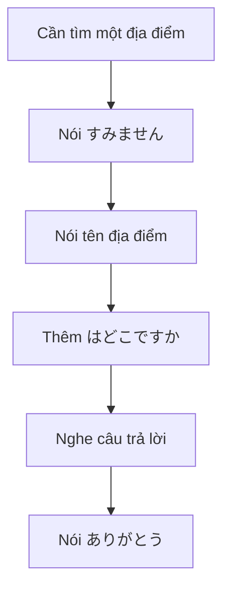

# 005 - Basic Bootcamp: Các câu tiếng Nhật thiết yếu cho người mới bắt đầu

**Khóa học:** Introduction to Japanese
**Bài:** Introduction to Japanese #5
**Tên bài gốc:** Basic Bootcamp
**Đối tượng:** Người mới bắt đầu tuyệt đối
**Trọng tâm:** Giao tiếp cơ bản, phát âm, hỏi vị trí và phương pháp học tiếng Nhật

---

## 1. Tóm tắt

Bài học này tập trung vào một số câu tiếng Nhật có tính ứng dụng rất cao đối với người mới bắt đầu:

* nói **cảm ơn** bằng `ありがとう`;
* nói **xin lỗi / xin phép / làm phiền** bằng `すみません`;
* hỏi **một địa điểm hoặc đồ vật ở đâu** bằng mẫu `○○はどこですか。`;
* luyện một số từ vựng cơ bản như nhà vệ sinh, nhà ga, khách sạn và cửa hàng tiện lợi;
* củng cố cách phát âm âm `り`;
* hình thành thói quen học tiếng Nhật qua nội dung giao tiếp thực tế.

Bài gốc nhấn mạnh việc người học phải **lặp lại thành tiếng** sau người bản xứ thay vì chỉ đọc thầm. 

Đây cũng là bài cuối của chuỗi *Introduction to Japanese*, sau khi người học đã được giới thiệu những kiến thức nền tảng về phát âm, ngữ pháp và hệ thống chữ viết tiếng Nhật. 

---

## 2. Mục tiêu học tập

Sau khi hoàn thành bài học, người học có thể:

* phát âm và sử dụng `ありがとう` trong tình huống cảm ơn cơ bản;
* hiểu đặc điểm phát âm của âm `り`;
* sử dụng `すみません` để xin lỗi, xin phép hoặc thu hút sự chú ý;
* phân tích được cấu trúc `○○はどこですか。`;
* hỏi vị trí của một số địa điểm quen thuộc;
* thay thế `○○` bằng từ vựng mới để tự tạo câu hỏi;
* phân biệt vai trò cơ bản của `は`, `どこ`, `です` và `か`;
* thực hiện hội thoại hỏi đường ngắn;
* xây dựng thói quen luyện nghe và bắt chước tiếng Nhật giao tiếp tự nhiên.

---

## 3. Hai câu giao tiếp quan trọng

### 3.1. `ありがとう` — Cảm ơn

Câu đầu tiên cần ghi nhớ là:

**ありがとう**

**Romaji:** `arigatou`
**Nghĩa:** Cảm ơn.

Bài học xem đây là một trong những câu quan trọng nhất đối với người mới học vì nó cho phép người nói thể hiện lòng biết ơn ngay cả khi vốn từ còn rất hạn chế. 

Ví dụ:

**A:**

ありがとう。

*Arigatou.*

Cảm ơn.

### Luyện phát âm

Đọc thành tiếng:

> ありがとう
> *a-ri-ga-tou*

Lặp lại nhiều lần:

1. `ありがとう`
2. `ありがとう`
3. `ありがとう`

Không nên đọc từng âm quá tách biệt. Mục tiêu cuối cùng là tạo thành một nhịp nói tự nhiên:

> `ありがとう`

---

### 3.2. `すみません` — Xin lỗi / Xin phép / Làm phiền

Câu thứ hai là:

**すみません**

**Romaji:** `sumimasen`

Tùy tình huống, câu này có thể được hiểu là:

* xin lỗi;
* xin phép;
* làm phiền một chút;
* excuse me.

Bài học đưa ra các tình huống như gọi sự chú ý của nhân viên phục vụ hoặc bắt chuyện với một người trên phố để hỏi đường. 

Ví dụ khi muốn hỏi đường:

**A:**

すみません。

*Sumimasen.*

Xin lỗi / Làm phiền một chút.

Sau đó mới tiếp tục câu hỏi:

**A:**

すみません。駅はどこですか。

*Sumimasen. Eki wa doko desu ka.*

Xin lỗi, nhà ga ở đâu?

> **Ghi nhớ:** `すみません` là một câu mở đầu rất hữu ích trước khi hỏi người lạ một vấn đề nào đó.

---

## 4. Phát âm âm `り`

Âm:

**り**

được viết bằng romaji là:

`ri`

Tuy nhiên, âm `r` trong tiếng Nhật không được phát âm giống hoàn toàn với âm `r` trong tiếng Anh.

Bài học mô tả âm này là âm nằm giữa cảm giác của `R` và `L`. Đầu lưỡi thực hiện một cú chạm rất nhanh vào vùng lợi phía trên, tương tự chuyển động lưỡi trong cách phát âm nhanh một số âm giữa của những từ tiếng Anh như *ladder* hoặc *butter*. 

Có thể hình dung:

```text
Đầu lưỡi
    ↓
chạm nhanh vào vùng lợi trên
    ↓
rời ra ngay
    ↓
り
```

Không nên:

* rung lưỡi mạnh như một số cách phát âm `r`;
* cố biến âm thành `l` hoàn toàn;
* giữ lưỡi quá lâu tại vị trí tiếp xúc.

Hãy luyện:

> り
> り
> り
> ありがとう

Trong từ:

`ありがとう`

âm `り` phải được phát âm nhanh và nhẹ.

---

## 5. Mẫu câu hỏi vị trí

Mẫu câu trung tâm của bài là:

**○○はどこですか。**

**Romaji:**

`○○ wa doko desu ka.`

**Nghĩa:**

> ○○ ở đâu?

Bài học hướng dẫn đặt tên địa điểm hoặc đối tượng cần hỏi vào vị trí `○○`, sau đó thêm `はどこですか`. 

Công thức:

```text
Địa điểm / đối tượng
        +
        は
        +
       どこ
        +
       です
        +
        か
```

Hay ngắn gọn:

```text
○○ + は + どこ + です + か
```

Ví dụ:

**トイレはどこですか。**

*Toire wa doko desu ka.*

Nhà vệ sinh ở đâu?

---

## 6. Phân tích cấu trúc câu

### 6.1. `は` — Trợ từ chủ đề

Trong:

**トイレはどこですか。**

`は` đứng sau `トイレ`.

Ở đây, `は` đánh dấu chủ đề mà người nói đang hỏi đến.

Có thể hiểu:

```text
トイレ + は
nhà vệ sinh + còn về...
```

Một điểm rất quan trọng:

> Khi `は` được sử dụng làm trợ từ trong trường hợp này, nó được phát âm là **wa**, không phải **ha**.

Vì vậy:

**トイレは**

đọc là:

`toire wa`

không phải:

`toire ha`.

---

### 6.2. `どこ` — Ở đâu

**どこ**

**Romaji:** `doko`

**Nghĩa:** đâu / ở đâu.

Ví dụ:

**どこですか。**

*Doko desu ka.*

Ở đâu vậy?

Trong cấu trúc đầy đủ:

**駅はどこですか。**

`どこ` chính là phần dùng để hỏi vị trí của `駅`.

---

### 6.3. `です` và `か`

**です**

**Romaji:** `desu`

`です` là thành phần thường xuất hiện trong câu nói lịch sự cơ bản.

Trong bài học, nó được giải thích gần tương đương với ý nghĩa của từ “is” trong tiếng Anh, mặc dù không nên hiểu rằng `です` luôn tương ứng trực tiếp với động từ “to be”.

**か**

**Romaji:** `ka`

Khi đứng cuối câu trong mẫu này, `か` đánh dấu câu hỏi.

Bài học gợi ý người mới có thể tạm hình dung `か` giống như một “dấu hỏi bằng lời nói”. 

Cấu trúc:

```text
○○     は     どこ     です     か
 │      │       │        │       │
đối    chủ     ở đâu    lịch    câu
tượng  đề               sự      hỏi
```

---

## 7. Từ vựng cần nhớ

| Tiếng Nhật | Cách đọc         | Nghĩa             |
| ---------- | ---------------- | ----------------- |
| `トイレ`      | `toire`          | Nhà vệ sinh       |
| `駅`        | `eki`            | Nhà ga            |
| `東京駅`      | `Toukyou-eki`    | Ga Tokyo          |
| `ホテル`      | `hoteru`         | Khách sạn         |
| `ヒルトンホテル`  | `Hiruton hoteru` | Khách sạn Hilton  |
| `コンビニ`     | `konbini`        | Cửa hàng tiện lợi |

Các ví dụ địa điểm này xuất hiện trực tiếp trong bài học gốc.  

### Ghi chú về Katakana

Các từ:

* `トイレ`;
* `ホテル`;
* `コンビニ`;

đều được viết bằng **Katakana**.

Katakana thường được sử dụng đối với nhiều từ vay mượn từ ngôn ngữ nước ngoài.

Ví dụ:

```text
hotel
   ↓
hoteru
   ↓
ホテル
```

---

## 8. Các câu hỏi vị trí quan trọng

### 8.1. Hỏi nhà vệ sinh

**トイレはどこですか。**

*Toire wa doko desu ka.*

Nhà vệ sinh ở đâu?

Đây là một trong những câu thực tế nhất đối với người đi du lịch.

Có thể mở đầu lịch sự:

**すみません。トイレはどこですか。**

*Sumimasen. Toire wa doko desu ka.*

Xin lỗi, nhà vệ sinh ở đâu?

---

### 8.2. Hỏi nhà ga

**駅はどこですか。**

*Eki wa doko desu ka.*

Nhà ga ở đâu?

Theo bài học, nếu chỉ hỏi `駅`, người nghe thông thường sẽ chỉ cho bạn nhà ga gần nhất. Nếu muốn hỏi một nhà ga cụ thể, hãy đặt tên địa điểm trước `駅`. 

Ví dụ:

**東京駅はどこですか。**

*Toukyou-eki wa doko desu ka.*

Ga Tokyo ở đâu?

Cấu tạo:

```text
東京 + 駅
Tokyo + nhà ga
      ↓
   東京駅
   Ga Tokyo
```

---

## 9. Hỏi khách sạn và cửa hàng tiện lợi

### 9.1. Khách sạn

**ホテルはどこですか。**

*Hoteru wa doko desu ka.*

Khách sạn ở đâu?

Nếu muốn hỏi một khách sạn cụ thể, đặt tên khách sạn trước `ホテル`.

Ví dụ trong bài:

**ヒルトンホテルはどこですか。**

*Hiruton hoteru wa doko desu ka.*

Khách sạn Hilton ở đâu? 

---

### 9.2. Cửa hàng tiện lợi

**コンビニはどこですか。**

*Konbini wa doko desu ka.*

Cửa hàng tiện lợi ở đâu?

`コンビニ` là cách gọi ngắn rất phổ biến của *convenience store* trong tiếng Nhật.

Bài học sử dụng từ này để minh họa rằng người học có thể thay thế `○○` bằng nhiều địa điểm khác nhau nhưng vẫn giữ nguyên cấu trúc:

**○○はどこですか。** 

---

## 10. Cơ chế tạo câu mới

Khi đã thuộc:

**○○はどこですか。**

người học không cần ghi nhớ mỗi câu như một đơn vị hoàn toàn riêng biệt.

Chỉ cần thực hiện ba bước:

1. Xác định địa điểm cần hỏi.
2. Đặt địa điểm đó trước `は`.
3. Giữ nguyên `どこですか`.

Ví dụ:

```text
トイレ
   ↓
トイレ + はどこですか
   ↓
トイレはどこですか。
```

Tương tự:

```text
駅
   ↓
駅はどこですか。
```

```text
ホテル
   ↓
ホテルはどこですか。
```

```text
コンビニ
   ↓
コンビニはどこですか。
```

Đây là tư duy quan trọng khi học ngôn ngữ:

> Không chỉ học thuộc từng câu riêng lẻ, hãy học **mẫu câu có thể tái sử dụng**.

---

## 11. Flow giao tiếp khi hỏi đường

Một tình huống hỏi đường đơn giản có thể diễn ra như sau:



Ví dụ đầy đủ:

**A:**

すみません。

*Sumimasen.*

Xin lỗi.

**A:**

東京駅はどこですか。

*Toukyou-eki wa doko desu ka.*

Ga Tokyo ở đâu?

Sau khi được chỉ đường:

**A:**

ありがとう。

*Arigatou.*

Cảm ơn.

Như vậy, chỉ với ba cấu trúc của bài:

```text
すみません
     ↓
○○はどこですか
     ↓
ありがとう
```

người mới đã có thể thực hiện một giao tiếp thực tế hoàn chỉnh.

---

## 12. Hội thoại mẫu

### 12.1. Hỏi nhà vệ sinh

**A:**

すみません。

*Sumimasen.*

Xin lỗi.

**A:**

トイレはどこですか。

*Toire wa doko desu ka.*

Nhà vệ sinh ở đâu?

Sau khi được hướng dẫn:

**A:**

ありがとう。

*Arigatou.*

Cảm ơn.

---

### 12.2. Hỏi nhà ga

**A:**

すみません。東京駅はどこですか。

*Sumimasen. Toukyou-eki wa doko desu ka.*

Xin lỗi, ga Tokyo ở đâu?

Sau khi được chỉ đường:

**A:**

ありがとう。

*Arigatou.*

Cảm ơn.

---

## 13. Những điểm dễ nhầm

### 13.1. Đọc `は` thành `ha`

**Sai:**

```text
Toire ha doko desu ka.
```

Trong mẫu câu đang học, `は` là trợ từ nên phát âm:

```text
wa
```

Đúng:

```text
Toire wa doko desu ka.
```

---

### 13.2. Phát âm `r` theo kiểu tiếng Anh

Trong:

```text
ありがとう
```

không nên phát âm `r` quá mạnh theo kiểu tiếng Anh.

Hãy luyện âm chạm nhanh:

```text
り
↓
ri
```

sau đó ghép lại:

```text
a-ri-ga-tou
```

---

### 13.3. Quên `か` trong câu hỏi lịch sự

Cấu trúc của bài là:

```text
○○はどこですか。
```

Không nên mới học đã tùy tiện bỏ `か` khi chưa hiểu rõ ngữ cảnh giao tiếp.

Hãy ghi nhớ mẫu hoàn chỉnh trước.

---

### 13.4. Chỉ học nghĩa mà không nói thành tiếng

Biết rằng:

```text
ありがとう = cảm ơn
```

chưa đủ.

Người học cần thực sự phát âm:

> ありがとう

nhiều lần để hình thành phản xạ.

Bài gốc đặc biệt yêu cầu người học lặp lại các từ và câu thành tiếng sau ví dụ của người bản xứ. 

---

## 14. Phương pháp luyện tập hiệu quả

### 14.1. Shadowing

**Shadowing** là phương pháp nghe câu mẫu rồi lặp lại ngay sau người nói, cố gắng bắt chước:

* âm;
* nhịp;
* tốc độ;
* ngữ điệu.

Có thể luyện:

```text
Audio: ありがとう
Bạn:   ありがとう

Audio: すみません
Bạn:   すみません

Audio: トイレはどこですか
Bạn:   トイレはどこですか
```

Không nên chỉ đọc romaji.

Hãy nhìn trực tiếp:

* Hiragana;
* Katakana;
* Kanji;

càng sớm càng tốt.

---

### 14.2. Thay thế từ trong mẫu câu

Chọn một mẫu:

**○○はどこですか。**

Sau đó thay `○○` liên tục:

```text
トイレ
駅
東京駅
ホテル
コンビニ
```

Tạo thành:

```text
トイレはどこですか。
駅はどこですか。
東京駅はどこですか。
ホテルはどこですか。
コンビニはどこですか。
```

Phương pháp này giúp hình thành phản xạ về cấu trúc tốt hơn việc học năm câu hoàn toàn độc lập.

---

## 15. Lời khuyên học tiếng Nhật từ bài học

Bài học khuyến nghị người học muốn cải thiện khả năng giao tiếp nên xem và nghiên cứu các video tiếng Nhật đương đại, bởi ngôn ngữ sử dụng trong hội thoại thực tế có thể bao gồm nhiều cách diễn đạt không xuất hiện đầy đủ trong sách ngữ pháp. 

Bài cũng cảnh báo không nên bắt chước máy móc mọi cách nói trong:

* anime;
* chương trình hài;
* drama.

Lý do là một số phản ứng và cách diễn đạt trong nội dung giải trí có thể được phóng đại để phục vụ nhân vật hoặc tình huống, nên không nhất thiết phản ánh hội thoại hàng ngày. 

Một ví dụ được bài học đưa ra là:

**どうも**

`doumo`

Bài gốc lưu ý rằng người học có thể nghe cách dùng từ này để cảm ơn trong nội dung giải trí và không nên mặc định rằng mọi cách dùng như vậy đều thích hợp với giao tiếp hàng ngày. 

> **Nguyên tắc học:** Hãy học từ nguồn giao tiếp tự nhiên, nhưng luôn quan sát **ngữ cảnh**, **mối quan hệ giữa người nói** và **mức độ lịch sự** trước khi bắt chước một cách diễn đạt.

---

## 16. Chiến lược ghi nhớ

Sử dụng ba cụm chính như một chuỗi giao tiếp:

```text
すみません
Xin lỗi / Làm phiền

      ↓

○○はどこですか。
○○ ở đâu?

      ↓

ありがとう。
Cảm ơn.
```

Ví dụ:

```text
すみません。
↓
トイレはどこですか。
↓
ありがとう。
```

Nếu luyện thành một chuỗi thay vì từng câu riêng lẻ, người học sẽ dễ sử dụng chúng trong tình huống thực tế hơn.

---

## 17. Bài thực hành

### 17.1. Bài tập thay thế từ

Sử dụng mẫu:

**○○はどこですか。**

Tạo câu với:

1. `トイレ`
2. `駅`
3. `東京駅`
4. `ホテル`
5. `コンビニ`

Kết quả mong đợi:

```text
トイレはどこですか。
駅はどこですか。
東京駅はどこですか。
ホテルはどこですか。
コンビニはどこですか。
```

---

### 17.2. Bài tập phản xạ giao tiếp

Giả sử bạn đang ở Tokyo và cần tìm ga Tokyo.

Hãy nói liên tục ba phần sau mà không nhìn tài liệu:

1. Thu hút sự chú ý của người đi đường.
2. Hỏi ga Tokyo ở đâu.
3. Cảm ơn sau khi được chỉ đường.

Kết quả mong đợi:

```text
すみません。
東京駅はどこですか。
ありがとう。
```

---

### 17.3. Bài tập phát âm

Lặp lại mỗi dòng ít nhất năm lần:

```text
り
ありがとう
すみません
どこですか
トイレはどこですか
駅はどこですか
```

Mục tiêu:

* không phát âm `り` như `r` tiếng Anh;
* đọc `は` thành `wa` khi nó là trợ từ;
* nói cả câu liền mạch;
* giảm dần phụ thuộc vào romaji.

---

## 18. Artifact học tập

Sau bài học, hãy tạo một file ghi chú:

```text
005-basic-bootcamp.md
```

Nội dung tối thiểu cần có:

* `ありがとう`;
* `すみません`;
* mẫu `○○はどこですか。`;
* bảng từ vựng của bài;
* hai hội thoại hỏi đường;
* ghi chú phát âm `り`;
* ghi chú về cách đọc `は`;
* phần tự ghi âm luyện phát âm.

Có thể bổ sung một file audio cá nhân gồm:

```text
ありがとう
すみません
トイレはどこですか
東京駅はどこですか
コンビニはどこですか
```

Mục tiêu của artifact không phải để có tài liệu đẹp mà để kiểm tra rằng người học **thực sự có thể nói** các cấu trúc của bài.

---

## 19. Checklist hoàn thành

* [ ] Tôi nói được `ありがとう` mà không nhìn tài liệu.
* [ ] Tôi hiểu `ありがとう` dùng để thể hiện sự cảm ơn.
* [ ] Tôi nói được `すみません` trong tình huống cần xin phép hoặc thu hút sự chú ý.
* [ ] Tôi phát âm được âm `り` gần với cách phát âm tiếng Nhật.
* [ ] Tôi nhớ mẫu `○○はどこですか。`.
* [ ] Tôi biết `は` trong mẫu câu này được phát âm là `wa`.
* [ ] Tôi hiểu `どこ` nghĩa là “ở đâu”.
* [ ] Tôi nhận biết được vai trò câu hỏi của `か`.
* [ ] Tôi hỏi được vị trí của `トイレ`.
* [ ] Tôi hỏi được vị trí của `駅`.
* [ ] Tôi hỏi được vị trí của `東京駅`.
* [ ] Tôi hỏi được vị trí của `ホテル`.
* [ ] Tôi hỏi được vị trí của `コンビニ`.
* [ ] Tôi thực hiện được hội thoại `すみません → câu hỏi → ありがとう`.
* [ ] Tôi đã luyện nói thành tiếng thay vì chỉ đọc thầm.

---

## 20. Câu hỏi tự kiểm tra

1. `ありがとう` có nghĩa là gì và được sử dụng trong tình huống nào?
2. Tại sao không nên phát âm âm `り` giống hoàn toàn âm `r` tiếng Anh?
3. `すみません` có thể được sử dụng trong những tình huống nào?
4. Hãy phân tích từng thành phần trong `トイレはどこですか。`.
5. Nếu muốn hỏi “Ga Tokyo ở đâu?”, bạn cần thay `○○` bằng từ nào?

---

## 21. Tổng kết

Trong bài học này, người học đã xây dựng được một bộ công cụ giao tiếp tiếng Nhật rất nhỏ nhưng có tính ứng dụng cao:

```text
ありがとう
→ Cảm ơn

すみません
→ Xin lỗi / Xin phép / Làm phiền

○○はどこですか。
→ ○○ ở đâu?
```

Từ mẫu:

**○○はどこですか。**

có thể tạo nhiều câu:

```text
トイレはどこですか。
駅はどこですか。
東京駅はどこですか。
ホテルはどこですか。
コンビニはどこですか。
```

Quan trọng hơn việc học thuộc từng câu là hiểu cấu trúc:

```text
Đối tượng
    ↓
○○ + は + どこ + です + か
    ↓
Câu hỏi vị trí
```

Bài học cũng nhấn mạnh ba thói quen quan trọng khi tiếp tục học tiếng Nhật:

* luyện nói thành tiếng;
* bắt chước phát âm của người bản xứ;
* học cách diễn đạt trong ngữ cảnh giao tiếp thực tế thay vì bắt chước máy móc ngôn ngữ từ nội dung giải trí.

Bài này khép lại khóa *Introduction to Japanese*, đồng thời tạo nền tảng để tiếp tục mở rộng từ vựng và các mẫu câu giao tiếp dành cho người mới bắt đầu. 
