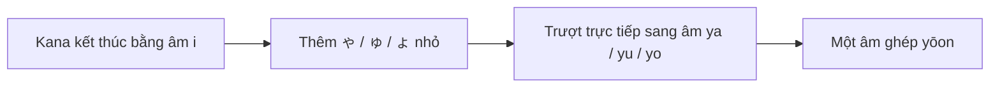

# 017 - The Hiragana Y Column and Digraphs

**Section:** How to Write in Japanese: Hiragana and Katakana
**Type:** Video lesson
**Loại bài:** lesson
**Duration:** 09:34
**Preview:** No

---

## 1. Tóm tắt

Bài học này hoàn thiện **hàng Y trong hiragana** với ba ký tự:

* `や` — `ya`
* `ゆ` — `yu`
* `よ` — `yo`

Ba ký tự này không chỉ được sử dụng độc lập. Khi `ゃ`, `ゅ`, `ょ` được viết ở dạng **nhỏ** sau một số hiragana thuộc hàng âm `i`, chúng tạo thành các **âm ghép** gọi là `yōon` (拗音).

Ví dụ:

```text
き + ゃ → きゃ → kya
し + ゅ → しゅ → shu
ち + ょ → ちょ → cho
```

Đây là một quy tắc quan trọng vì hai ký tự hiragana có thể kết hợp thành **một nhịp âm duy nhất**, và việc viết hoặc phát âm sai kích thước của `ゃ`, `ゅ`, `ょ` có thể tạo ra một cách đọc khác.

---

## 2. Mục tiêu học tập

Sau khi hoàn thành bài này, người học có thể:

* Nhận diện và đọc chính xác `や`, `ゆ`, `よ`.
* Viết `や`, `ゆ`, `よ` theo thứ tự nét ổn định.
* Phân biệt `や`, `ゆ`, `よ` kích thước bình thường với `ゃ`, `ゅ`, `ょ` kích thước nhỏ.
* Giải thích được cách hình thành `yōon`.
* Đọc được 33 âm ghép phổ biến sử dụng `ゃ`, `ゅ`, `ょ`.
* Phân biệt các cách đọc như `きょう` và `きよう`.
* Đọc một số từ tiếng Nhật có chứa hàng Y và âm ghép.

---

## 3. Hàng Y trong hiragana

Hàng Y hiện đại chỉ có ba âm cơ bản:

| Hiragana | Romaji | Âm gần đúng |
| -------- | ------ | ----------- |
| `や`      | `ya`   | ya          |
| `ゆ`      | `yu`   | yu          |
| `よ`      | `yo`   | yo          |

Có thể ghi nhớ theo chuỗi:

```text
や → ya
ゆ → yu
よ → yo
```

Khác với nhiều hàng hiragana khác, hàng Y không có đủ năm nguyên âm `a – i – u – e – o`.

Trong tiếng Nhật hiện đại, ba ký tự cơ bản cần học là:

```text
や　ゆ　よ
ya  yu  yo
```

---

## 4. Hiragana `や` — ya

`や` biểu diễn âm `ya`.

### Cách đọc

```text
や → ya
```

Âm bắt đầu bằng một chuyển động nhẹ từ phụ âm `y` sang nguyên âm `a`.

Không nên đọc tách thành:

```text
y + a
```

mà cần phát âm liền:

```text
ya
```

### Cách viết

`や` được viết bằng **3 nét**.

Khi luyện viết, cần chú ý:

* giữ tỷ lệ ký tự cân đối;
* không kéo các nét quá dài;
* giữ vị trí giao nhau của các nét ổn định;
* luyện cùng một thứ tự nét trong mỗi lần viết.

Có thể dùng hình ảnh liên tưởng để ghi nhớ mặt chữ, nhưng mục tiêu cuối cùng vẫn là nhận diện trực tiếp `や` mà không cần phụ thuộc vào mẹo.

### Ví dụ

```text
やま
yama
山
núi
```

Tách âm:

```text
や + ま
ya + ma
→ yama
```

Một ví dụ khác:

```text
やすい
yasui
安い
rẻ
```

---

## 5. Hiragana `ゆ` — yu

`ゆ` biểu diễn âm `yu`.

### Cách đọc

```text
ゆ → yu
```

Âm `yu` phải được phát âm liền thành một âm tiết ngắn.

### Cách viết

`ゆ` được viết bằng **2 nét**.

Khi viết cần chú ý phần cong lớn của ký tự. Không nên biến các đường cong thành những góc cứng vì `ゆ` có hình dáng khá tròn và mềm.

### Ví dụ

```text
ゆき
yuki
雪
tuyết
```

Tách âm:

```text
ゆ + き
yu + ki
→ yuki
```

Một ví dụ quen thuộc khác là:

```text
おゆ
oyu
お湯
nước nóng
```

Trong đó:

```text
お + ゆ
o + yu
→ oyu
```

`お湯` thường dùng để chỉ nước nóng, đặc biệt trong những ngữ cảnh như tắm hoặc `onsen` — suối nước nóng Nhật Bản.

---

## 6. Hiragana `よ` — yo

`よ` biểu diễn âm `yo`.

### Cách đọc

```text
よ → yo
```

Giống `や` và `ゆ`, âm cần được phát ra liền, không tách thành hai phần.

### Cách viết

`よ` được viết bằng **2 nét**.

Khi luyện viết:

* giữ nét đầu ngắn;
* nét còn lại tạo phần chính của ký tự;
* tránh viết phần cong quá lớn làm ký tự mất cân đối.

### Ví dụ

```text
よる
yoru
夜
ban đêm
```

Tách âm:

```text
よ + る
yo + ru
→ yoru
```

---

## 7. Âm ghép `yōon`

Một chức năng đặc biệt của hàng Y là tạo ra các âm ghép với:

```text
ゃ　ゅ　ょ
```

Đây là các phiên bản **nhỏ** của:

```text
や　ゆ　よ
```

So sánh:

```text
や    ゆ    よ
ゃ    ゅ    ょ
```

Khi `ゃ`, `ゅ`, `ょ` nhỏ xuất hiện sau một kana thuộc nhóm âm kết thúc bằng `i`, hai ký tự kết hợp thành một âm mới.

Ví dụ:

```text
き + ゃ
↓
きゃ
↓
kya
```

Không đọc:

```text
ki-ya
```

mà đọc liền:

```text
kya
```

---

## 8. Cơ chế tạo âm ghép

Cấu trúc cơ bản là:

```text
kana hàng i + ゃ/ゅ/ょ nhỏ
              ↓
           yōon
```

Ví dụ:

```text
き + ゃ → きゃ → kya
き + ゅ → きゅ → kyu
き + ょ → きょ → kyo
```

Có thể hình dung quá trình phát âm:



Điểm quan trọng là âm `i` của kana đầu tiên không được phát âm đầy đủ.

Ví dụ:

```text
きゃ
```

không phải:

```text
kiya
```

mà là:

```text
kya
```

---

## 9. 33 âm ghép phổ biến

Có 11 nhóm phổ biến, mỗi nhóm có ba âm với `ゃ`, `ゅ`, `ょ`.

### 9.1. Nhóm K và G

| Hiragana | Romaji |
| -------- | ------ |
| `きゃ`     | `kya`  |
| `きゅ`     | `kyu`  |
| `きょ`     | `kyo`  |
| `ぎゃ`     | `gya`  |
| `ぎゅ`     | `gyu`  |
| `ぎょ`     | `gyo`  |

Ví dụ:

```text
きょう
kyō
今日
hôm nay
```

### 9.2. Nhóm S, Z và T

| Hiragana | Romaji |
| -------- | ------ |
| `しゃ`     | `sha`  |
| `しゅ`     | `shu`  |
| `しょ`     | `sho`  |
| `じゃ`     | `ja`   |
| `じゅ`     | `ju`   |
| `じょ`     | `jo`   |
| `ちゃ`     | `cha`  |
| `ちゅ`     | `chu`  |
| `ちょ`     | `cho`  |

Cần chú ý cách phiên âm chuẩn:

```text
し + ゃ → しゃ → sha
```

không viết:

```text
shya
```

Tương tự:

```text
ち + ょ → ちょ → cho
```

### 9.3. Nhóm N, H, B và P

| Hiragana | Romaji |
| -------- | ------ |
| `にゃ`     | `nya`  |
| `にゅ`     | `nyu`  |
| `にょ`     | `nyo`  |
| `ひゃ`     | `hya`  |
| `ひゅ`     | `hyu`  |
| `ひょ`     | `hyo`  |
| `びゃ`     | `bya`  |
| `びゅ`     | `byu`  |
| `びょ`     | `byo`  |
| `ぴゃ`     | `pya`  |
| `ぴゅ`     | `pyu`  |
| `ぴょ`     | `pyo`  |

Ví dụ:

```text
びょういん
byōin
病院
bệnh viện
```

Phần đầu được đọc:

```text
びょ
byo
```

chứ không phải:

```text
びよ
biyo
```

### 9.4. Nhóm M và R

| Hiragana | Romaji |
| -------- | ------ |
| `みゃ`     | `mya`  |
| `みゅ`     | `myu`  |
| `みょ`     | `myo`  |
| `りゃ`     | `rya`  |
| `りゅ`     | `ryu`  |
| `りょ`     | `ryo`  |

Ví dụ:

```text
りゅう
ryū
竜 / 龍
rồng
```

Tổng cộng:

```text
11 nhóm × 3 âm = 33 âm ghép
```

---

## 10. `ゃ`, `ゅ`, `ょ` nhỏ không giống `や`, `ゆ`, `よ` bình thường

Đây là điểm rất quan trọng khi đọc và viết tiếng Nhật.

So sánh:

```text
きゃ
kya
```

với:

```text
きや
kiya
```

Hai dạng này không giống nhau.

Trong `きゃ`, ký tự `ゃ` nhỏ kết hợp với `き`.

```text
きゃ
↓
kya
```

Trong `きや`, `や` có kích thước bình thường nên hai kana được đọc riêng.

```text
き + や
↓
ki + ya
↓
kiya
```

Có thể biểu diễn:

| Cách viết | Cách đọc | Cấu trúc         |
| --------- | -------- | ---------------- |
| `きゃ`      | `kya`    | âm ghép          |
| `きや`      | `kiya`   | hai kana độc lập |
| `しゅ`      | `shu`    | âm ghép          |
| `しゆ`      | `shiyu`  | các kana độc lập |

Vì vậy kích thước của `ゃ`, `ゅ`, `ょ` là một phần của chính tả tiếng Nhật, không phải chỉ là cách trình bày.

---

## 11. Một âm ghép vẫn chỉ chiếm một mora

Trong nhịp điệu tiếng Nhật, `yōon` như:

```text
きゃ
しゅ
ちょ
```

được tính là **một mora**.

Ví dụ:

```text
きょう
```

có thể phân tích thành:

```text
きょ + う
kyo + u
```

Trong đó:

* `きょ` là một mora;
* `う` kéo dài nguyên âm `o`.

Cách đọc tự nhiên là:

```text
kyō
```

không phải:

```text
ki-yo-u
```

---

## 12. Phân biệt `きょう` và `きよう`

Sự khác biệt giữa `ょ` nhỏ và `よ` bình thường có thể ảnh hưởng trực tiếp đến cách đọc và nghĩa của từ.

So sánh:

```text
きょう
今日
kyō
hôm nay
```

với:

```text
きよう
器用
kiyō
khéo léo, thành thạo
```

Cấu trúc của từ thứ nhất:

```text
きょ + う
kyo + u
→ kyō
```

Cấu trúc của từ thứ hai:

```text
き + よ + う
ki + yo + u
→ kiyō
```

Đây là lý do người học phải quan sát chính xác kích thước của `ゃ`, `ゅ`, `ょ`.

---

## 13. Một số từ để luyện đọc

Hãy đọc từng từ chậm, sau đó tăng dần tốc độ.

| Tiếng Nhật | Romaji    | Nghĩa     |
| ---------- | --------- | --------- |
| `やま`       | `yama`    | núi       |
| `やすい`      | `yasui`   | rẻ        |
| `ゆき`       | `yuki`    | tuyết     |
| `よる`       | `yoru`    | ban đêm   |
| `きょう`      | `kyō`     | hôm nay   |
| `きゃく`      | `kyaku`   | khách     |
| `しゃしん`     | `shashin` | ảnh       |
| `じゅうどう`    | `jūdō`    | judo      |
| `びょういん`    | `byōin`   | bệnh viện |
| `りゅう`      | `ryū`     | rồng      |

Khi gặp một từ mới, nên phân tích kana trước khi đọc.

Ví dụ:

```text
びょういん
```

Tách thành:

```text
びょ + う + い + ん
```

không tách thành:

```text
び + よ + う + い + ん
```

---

## 14. Phương pháp luyện nghe và phát âm

Có thể luyện mỗi âm theo chu trình:

```text
Nghe mẫu
    ↓
Nhại lại
    ↓
Đọc không nhìn romaji
    ↓
Ghi âm
    ↓
Nghe lại
    ↓
Xác định một lỗi
    ↓
Đọc lại
```

Với hàng Y, luyện:

```text
や　ゆ　よ
ya  yu  yo
```

Sau đó chuyển sang các bộ âm ghép:

```text
きゃ　きゅ　きょ
kya  kyu  kyo
```

```text
しゃ　しゅ　しょ
sha  shu  sho
```

```text
ちゃ　ちゅ　ちょ
cha  chu  cho
```

Không nên chỉ nhìn romaji. Mục tiêu cuối cùng là nhìn trực tiếp kana và phát âm được ngay.

---

## 15. Phương pháp luyện viết

Mỗi ký tự nên được luyện theo ba giai đoạn.

**Giai đoạn 1 — Nhìn mẫu và viết theo**

```text
や × 5
ゆ × 5
よ × 5
```

**Giai đoạn 2 — Nhìn romaji và tự viết**

```text
ya → ?
yu → ?
yo → ?
```

Đáp án cần viết được:

```text
や
ゆ
よ
```

**Giai đoạn 3 — Viết âm ghép**

Ví dụ:

```text
kya → きゃ
shu → しゅ
cho → ちょ
ryu → りゅ
```

Ở bước này, luôn kiểm tra `ゃ`, `ゅ`, `ょ` có được viết nhỏ hơn kana đứng trước hay không.

---

## 16. Lỗi thường gặp

**Hiện tượng:** đọc `きゃ` thành `kiya`.
**Nguyên nhân:** phát âm đầy đủ âm `i` trong `き`.
**Cách xử lý:** luyện chuyển trực tiếp từ `k` sang `ya`: `kya`.

**Hiện tượng:** viết `きや` thay vì `きゃ`.
**Nguyên nhân:** viết `や` với kích thước bình thường.
**Cách xử lý:** giảm kích thước của kana thứ hai khi viết `yōon`.

**Hiện tượng:** đọc `しゅ` thành `shiyu`.
**Nguyên nhân:** xem hai kana như hai âm độc lập.
**Cách xử lý:** nhận diện toàn bộ `しゅ` như một đơn vị âm `shu`.

**Hiện tượng:** nhìn romaji mới đọc được.
**Nguyên nhân:** chưa hình thành liên kết trực tiếp giữa mặt chữ và âm thanh.
**Cách xử lý:** che romaji trong các vòng luyện sau và chỉ sử dụng hiragana.

---

## 17. Bài thực hành

### Bài 1 — Nhận diện hàng Y

Đọc thành tiếng ba lần:

```text
や　ゆ　よ
```

Sau đó viết romaji tương ứng mà không nhìn đáp án.

### Bài 2 — Viết từ romaji

Viết các âm sau bằng hiragana:

```text
ya
yu
yo
kya
kyu
kyo
sha
shu
sho
cha
chu
cho
rya
ryu
ryo
```

### Bài 3 — Phân biệt âm ghép

Đọc hai dạng sau và chú ý sự khác biệt:

```text
きょう
きよう
```

Sau đó giải thích:

* ký tự nào có `ょ` nhỏ;
* ký tự nào có `よ` bình thường;
* vì sao hai từ không được đọc giống nhau.

### Bài 4 — Luyện từ

Đọc các từ sau mà không nhìn romaji:

```text
やま
やすい
ゆき
よる
きょう
しゃしん
じゅうどう
びょういん
りゅう
```

### Bài 5 — Ghi âm

Chọn ít nhất năm từ trong bài và thực hiện:

1. Đọc chậm một lần.
2. Đọc với tốc độ tự nhiên một lần.
3. Ghi âm.
4. Nghe lại.
5. Ghi ra ít nhất một lỗi về trường âm, nhịp hoặc âm ghép cần sửa.

---

## 18. Câu hỏi tự kiểm tra

1. Ba hiragana thuộc hàng Y hiện đại là những ký tự nào?
2. `ゃ`, `ゅ`, `ょ` khác `や`, `ゆ`, `よ` ở điểm nào?
3. Vì sao `きゃ` được đọc là `kya` chứ không phải `kiya`?
4. `しゅ` được phiên âm là gì?
5. Điểm khác nhau về cách đọc giữa `きょう` và `きよう` là gì?

---

## 19. Checklist hoàn thành

* [ ] Nhận diện được `や`, `ゆ`, `よ`.
* [ ] Đọc chính xác `ya`, `yu`, `yo`.
* [ ] Viết được ba ký tự theo thứ tự nét ổn định.
* [ ] Phân biệt được `や` với `ゃ`, `ゆ` với `ゅ`, `よ` với `ょ`.
* [ ] Giải thích được nguyên tắc tạo `yōon`.
* [ ] Đọc được các nhóm `kya/kyu/kyo`, `sha/shu/sho` và `cha/chu/cho`.
* [ ] Nhận diện được 33 âm ghép phổ biến.
* [ ] Phân biệt được `きょう` và `きよう`.
* [ ] Đọc được các từ luyện tập mà không cần phụ thuộc hoàn toàn vào romaji.
* [ ] Hoàn thành ít nhất một lần luyện phát âm có ghi âm.

---

## 20. Tổng kết

Hàng Y trong hiragana gồm:

```text
や　ゆ　よ
ya  yu  yo
```

Khi sử dụng dạng nhỏ:

```text
ゃ　ゅ　ょ
```

sau một số kana thuộc hàng âm `i`, chúng tạo thành `yōon`:

```text
きゃ → kya
きゅ → kyu
きょ → kyo
```

Quy tắc cốt lõi cần ghi nhớ là:

```text
Kana hàng i + ゃ / ゅ / ょ nhỏ
            ↓
      một âm ghép
```

Không được đọc đầy đủ nguyên âm `i` ở giữa và không được nhầm `ゃ`, `ゅ`, `ょ` nhỏ với `や`, `ゆ`, `よ` kích thước bình thường.

Nắm chắc ba ký tự `や`, `ゆ`, `よ` cùng 33 âm ghép phổ biến giúp mở rộng đáng kể khả năng đọc hiragana và là nền tảng để đọc chính xác nhiều từ tiếng Nhật thông dụng.
