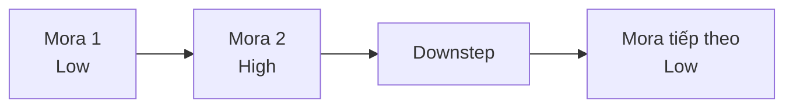

# 005 - Perfecting Pitch Accent in Japanese

**Học phần:** Ultimate Japanese Pronunciation Guide
**Loại bài:** lesson
**Thời lượng:** 05:16
**Preview:** No

---

## 1. Tóm tắt

Trong tiếng Nhật, phát âm đúng từng nguyên âm và phụ âm chưa đủ để lời nói nghe tự nhiên. Một yếu tố quan trọng khác là **pitch accent** — cách cao độ của giọng thay đổi giữa các đơn vị âm trong một từ.

Tiếng Nhật không sử dụng trọng âm bằng cách nhấn mạnh một âm tiết mạnh hơn rõ rệt như tiếng Anh. Thay vào đó, mỗi **mora** thường được phát âm ở một trong hai mức cao độ tương đối:

* **H** — High: cao;
* **L** — Low: thấp.

Ví dụ, hai từ có chuỗi âm gần như giống nhau có thể được phân biệt bằng mẫu cao độ:

```text
雨（あめ）   ame   → H-L → mưa
飴（あめ）   ame   → L-H → kẹo
```

Pitch accent vì vậy ảnh hưởng trực tiếp đến độ tự nhiên của phát âm và đôi khi còn giúp người nghe phân biệt những từ đồng âm.

---

## 2. Mục tiêu học tập

Sau khi hoàn thành bài này, bạn có thể:

* giải thích được pitch accent trong tiếng Nhật là gì;
* phân biệt pitch accent với việc nhấn mạnh âm tiết theo kiểu tiếng Anh;
* nhận biết hai mức cao độ tương đối `H` và `L`;
* hiểu vai trò của **mora** trong pitch accent;
* nhận biết sự thay đổi cao độ trong một từ;
* đọc và bắt chước một số mẫu pitch accent cơ bản;
* luyện pitch accent bằng quy trình nghe, nhại lại, ghi âm và tự sửa lỗi.

---

## 3. Pitch accent là gì?

**Pitch accent** là hệ thống trong đó các mora của một từ được phát âm với cao độ tương đối cao hoặc thấp theo một mẫu nhất định.

Có thể biểu diễn đơn giản:

```text
L = thấp
H = cao
```

Ví dụ giả định một từ bốn mora:

```text
L-H-H-H
```

hoặc:

```text
H-L-L-L
```

Điều quan trọng không phải là giọng phải đạt một tần số cố định. `H` và `L` chỉ biểu thị **quan hệ tương đối** giữa các mora trong cùng một cụm phát âm.

Vì vậy, cùng một người có thể nói ở giọng tổng thể cao hoặc thấp nhưng vẫn giữ đúng pitch accent nếu quan hệ cao–thấp giữa các mora không thay đổi.

> Pitch accent không có nghĩa là phải cố tình hát từng từ. Mục tiêu là duy trì đúng quan hệ cao độ một cách tự nhiên.

---

## 4. Vì sao pitch accent quan trọng?

Tiếng Nhật có nhiều từ có cách đọc giống hoặc rất gần nhau. Pitch accent có thể giúp người nghe phân biệt chúng.

Một ví dụ điển hình là:

| Từ | Cách đọc | Nghĩa | Mẫu cao độ cơ bản |
| -- | -------- | ----- | ----------------- |
| 雨  | あめ `ame` | mưa   | H-L               |
| 飴  | あめ `ame` | kẹo   | L-H               |

Nếu chỉ nhìn vào romaji:

```text
ame
ame
```

hai từ giống hệt nhau.

Nhưng khi phát âm, sự khác biệt về cao độ giúp người nghe nhận ra nghĩa trong nhiều tình huống.

Một nhóm từ thường được dùng để luyện tương tự là các từ đọc là `hashi`, chẳng hạn:

```text
橋（はし） → cây cầu
箸（はし） → đũa
```

Cách phân biệt chính xác còn phụ thuộc vào mẫu pitch accent của phương ngữ và cách từ được đặt trong câu.

Pitch accent không phải lúc nào cũng là yếu tố duy nhất giúp xác định nghĩa. Trong giao tiếp thực tế, người Nhật còn dựa vào:

* ngữ cảnh;
* từ đứng trước và sau;
* cấu trúc ngữ pháp;
* chủ đề của câu.

Tuy nhiên, sử dụng pitch accent phù hợp giúp phát âm rõ ràng và tự nhiên hơn đáng kể.

---

## 5. Mora: đơn vị quan trọng của pitch accent

Khi học pitch accent, nên suy nghĩ theo **mora** thay vì chỉ theo khái niệm âm tiết của tiếng Việt hoặc tiếng Anh.

Mora là một đơn vị nhịp cơ bản trong tiếng Nhật.

Ví dụ:

```text
さくら
sa-ku-ra
```

có ba mora:

```text
さ | く | ら
sa | ku | ra
```

Trong khi đó, nguyên âm dài chiếm nhiều hơn một mora.

Ví dụ:

```text
おとうと
otōto
```

có thể phân tích theo nhịp:

```text
お | と | う | と
o  | to | u  | to
```

Tương tự:

```text
きょうだい
kyōdai
```

có các đơn vị nhịp riêng, trong đó phần nguyên âm dài không nên bị đọc ngắn đi.

Điều này rất quan trọng vì pitch accent có thể thay đổi **giữa các mora**, kể cả giữa hai mora tạo nên một nguyên âm dài.

Do đó, khi luyện:

```text
きょうだい
kyōdai
```

không nên chỉ nghĩ:

```text
kyō | dai
```

mà cần nghe kỹ từng nhịp mora và vị trí xảy ra thay đổi cao độ.

---

## 6. Hai nguyên tắc cơ bản

Có hai nguyên tắc hữu ích khi bắt đầu luyện pitch accent theo hệ thống Tokyo Japanese.

### Nguyên tắc 1: mỗi mora giữ một mức cao độ tương đối

Một mora được cảm nhận là nằm ở mức:

```text
H
```

hoặc:

```text
L
```

Thay vì cố tình uốn giọng lên xuống bên trong cùng một mora, hãy giữ cao độ tương đối ổn định rồi chuyển ở ranh giới giữa các mora.

Ví dụ:

```text
L → H → H → L
```

Có thể hình dung:

```text
低 ──┐
     └── 高 ─── 高 ──┐
                     └── 低
```

Việc chuyển cao độ phải gắn với nhịp của từ, không phải một chuyển động ngẫu nhiên giữa âm.

### Nguyên tắc 2: mora thứ nhất và mora thứ hai thường khác cao độ

Trong hệ thống pitch accent Tokyo tiêu chuẩn, hai mora đầu của một từ thường không bắt đầu cùng một mức.

Có hai khả năng cơ bản:

```text
H-L
```

hoặc:

```text
L-H
```

Ví dụ về dạng bắt đầu cao rồi hạ:

```text
H-L-L
```

Ví dụ về dạng bắt đầu thấp rồi nâng:

```text
L-H-H
```

Điều này tạo ra một đặc trưng rất dễ nghe trong phát âm tiếng Nhật.

Tuy nhiên, đây là nguyên tắc nhập môn để nhận diện hệ thống. Khi từ được đặt vào câu, cao độ còn chịu ảnh hưởng của:

* particle;
* cấu trúc cụm từ;
* ngữ điệu của câu;
* phương ngữ;
* vị trí của từ trong phát ngôn.

---

## 7. Downstep và vị trí rơi cao độ

Một khái niệm quan trọng của pitch accent là **downstep** — vị trí cao độ hạ từ cao xuống thấp.

Ví dụ:

```text
H-L-L
 ^
```

Sau mora cao đầu tiên, giọng hạ xuống và các mora tiếp theo duy trì ở mức thấp tương đối.

Một mẫu khác:

```text
L-H-L
   ^
```

Ở đây:

1. mora đầu thấp;
2. mora thứ hai cao;
3. sau mora thứ hai, cao độ hạ xuống.

Có thể hình dung:



Downstep không đơn giản là một dấu nhấn mạnh. Nó là điểm mà cao độ giảm sau phần cao của từ.

Khi luyện nghe, việc xác định **cao độ rơi ở đâu** thường hữu ích hơn việc cố ghi nhớ từng mora một cách riêng lẻ.

---

## 8. Các mẫu cơ bản cần nhận biết

Một từ tiếng Nhật có thể có nhiều dạng phân bố cao độ khác nhau.

Ví dụ minh họa:

```text
H-L-L-L
```

```text
L-H-L-L
```

```text
L-H-H-L
```

```text
L-H-H-H
```

Các mẫu này không nên được học bằng cách tự đoán từ chữ viết.

Pitch accent của từ cần được:

* nghe từ người bản ngữ;
* tra trong từ điển pitch accent đáng tin cậy;
* luyện trong cả từ đơn lẻ lẫn cụm từ.

Một từ có thể được phát âm chính xác về phụ âm và nguyên âm nhưng vẫn nghe lạ nếu mẫu cao độ bị thay đổi mạnh.

---

## 9. Luyện với từ vựng

Hãy đọc từng từ theo nhịp mora trước khi quan tâm đến tốc độ.

| Từ | Kana  | Romaji   | Nghĩa       |
| -- | ----- | -------- | ----------- |
| 朝  | あさ    | `asa`    | buổi sáng   |
| 桜  | さくら   | `sakura` | hoa anh đào |
| 弟  | おとうと  | `otōto`  | em trai     |
| 兄弟 | きょうだい | `kyōdai` | anh chị em  |

Với `sakura`, trước tiên tách:

```text
sa | ku | ra
```

Sau đó nghe mẫu và gắn cao độ cho từng mora thay vì đọc cả từ thành một khối.

Với:

```text
otōto
```

cần đặc biệt chú ý nguyên âm dài:

```text
o | to | u | to
```

Không được đọc:

```text
ototo
```

nếu điều đó làm mất độ dài nguyên âm.

Tương tự với:

```text
kyōdai
```

hãy giữ đúng trường độ đồng thời nghe xem cao độ thay đổi tại ranh giới mora nào.

> Độ dài âm và pitch accent là hai đặc điểm khác nhau. Khi luyện, phải giữ đúng cả hai.

---

## 10. Phân biệt pitch accent với stress accent

Người học quen tiếng Anh thường mắc lỗi chuyển cách nhấn âm của tiếng Anh sang tiếng Nhật.

Trong tiếng Anh, stress thường kết hợp nhiều đặc điểm:

* âm lượng mạnh hơn;
* âm dài hơn;
* cao độ nổi bật hơn;
* nguyên âm ở âm không nhấn có thể bị giảm.

Ví dụ, khi một âm tiết được nhấn trong tiếng Anh, người nói thường cảm nhận rất rõ một phần của từ nổi bật hơn phần còn lại.

Tiếng Nhật hoạt động khác.

Pitch accent tập trung chủ yếu vào:

```text
quan hệ cao độ giữa các mora
```

Không nên biến:

```text
H
```

thành:

```text
NÓI THẬT TO
```

và:

```text
L
```

thành:

```text
nói rất nhỏ
```

Hai mức `H` và `L` mô tả **cao độ**, không phải âm lượng.

---

## 11. Quy trình luyện pitch accent hiệu quả

Một quy trình đơn giản có thể lặp lại với từng từ:

```text
Nghe mẫu
   ↓
Tách mora
   ↓
Xác định H/L
   ↓
Đọc thật chậm
   ↓
Nhại lại
   ↓
Ghi âm
   ↓
So sánh
   ↓
Sửa một lỗi cụ thể
```

Thực hiện như sau:

1. Nghe người bản ngữ phát âm từ ở tốc độ chậm.
2. Không lặp lại ngay nếu chưa nghe rõ.
3. Tách từ thành các mora.
4. Nghe xem mora đầu bắt đầu thấp hay cao.
5. Xác định vị trí cao độ tăng.
6. Xác định xem có downstep hay không.
7. Nhại lại với tốc độ chậm.
8. Ghi âm phát âm của chính mình.
9. So sánh bản ghi với mẫu.
10. Chỉ chọn một lỗi để sửa trong mỗi lượt luyện.

Ví dụ:

```text
Lần 1: sửa độ dài nguyên âm.
Lần 2: sửa vị trí xuống giọng.
Lần 3: sửa nhịp mora.
Lần 4: tăng tốc độ nhưng giữ nguyên mẫu.
```

Cách này hiệu quả hơn việc cố sửa đồng thời tất cả lỗi.

---

## 12. Lỗi thường gặp

**Hiện tượng:** Từ đúng âm nhưng nghe giống cách đọc tiếng Anh.
**Nguyên nhân:** Người học dùng stress mạnh thay vì thay đổi cao độ.
**Cách xử lý:** Giảm việc nhấn bằng âm lượng và tập trung nghe quan hệ `H`–`L`.

**Hiện tượng:** Cao độ thay đổi liên tục trong một âm.
**Nguyên nhân:** Người học cố “hát” từ thay vì chuyển cao độ theo mora.
**Cách xử lý:** Tách từ thành từng mora và chỉ chuyển cao độ tại ranh giới thích hợp.

**Hiện tượng:** Đọc nguyên âm dài quá ngắn.
**Nguyên nhân:** Chỉ tập trung vào pitch accent mà bỏ qua trường độ.
**Cách xử lý:** Đếm mora trước khi luyện cao độ.

**Hiện tượng:** Mọi từ đều được đọc theo cùng một mẫu.
**Nguyên nhân:** Đoán pitch accent dựa vào trực giác.
**Cách xử lý:** Học pitch accent cùng với từ mới và nghe mẫu chuẩn.

**Hiện tượng:** Pitch accent đúng khi đọc từ riêng lẻ nhưng thay đổi khi nói câu.
**Nguyên nhân:** Người học chưa quen với sự tương tác giữa lexical pitch accent và ngữ điệu câu.
**Cách xử lý:** Sau khi luyện từ đơn, chuyển sang shadowing cả cụm từ và câu hoàn chỉnh.

---

## 13. Best practices

* Học pitch accent cùng lúc với từ mới thay vì bổ sung sau.
* Ưu tiên nghe người bản ngữ trước khi đọc romaji.
* Phân tích từ bằng mora.
* Không đồng nhất pitch accent với thanh điệu của tiếng Trung.
* Không cố nâng giọng quá cao hoặc hạ quá thấp.
* Luôn giữ trường độ đúng khi từ có nguyên âm dài.
* Sau khi luyện từ riêng lẻ, luyện lại trong cụm từ hoặc câu.
* Ghi âm thường xuyên để phát hiện sự khác biệt mà khi đang nói bạn khó tự nghe thấy.
* Tập trung vào vị trí downstep thay vì chỉ cố nhớ một chuỗi `H/L` máy móc.

---

## 14. Bài thực hành

### Bài 1: Nhận biết cao và thấp

Nghe một từ tiếng Nhật từ nguồn phát âm chuẩn ba lần.

Sau mỗi lần nghe, ghi lại mẫu bạn cảm nhận được, chẳng hạn:

```text
L-H-H
```

hoặc:

```text
H-L-L
```

Sau đó nghe lại để kiểm tra.

### Bài 2: Phân tích mora

Tách các từ sau thành mora:

```text
asa
sakura
otōto
kyōdai
```

Đọc từng mora theo nhịp đều trước khi bắt chước pitch accent.

### Bài 3: Shadowing

Chọn ba từ tiếng Nhật.

Với mỗi từ:

1. nghe mẫu ba lần;
2. nhại lại ba lần;
3. ghi âm một lần;
4. nghe lại bản ghi;
5. xác định một lỗi cụ thể.

Ghi theo mẫu:

```text
Từ: __________

Mẫu nghe được: __________

Lỗi của tôi:
________________________________

Điểm cần sửa:
________________________________
```

### Bài 4: So sánh từ đồng âm

Luyện cặp:

```text
雨（あめ） → mưa
飴（あめ） → kẹo
```

Mục tiêu không phải nói thật nhanh mà là làm rõ sự khác nhau về hướng cao độ.

---

## 15. Câu hỏi tự kiểm tra

1. Pitch accent khác stress accent của tiếng Anh ở điểm nào?
2. Vì sao chỉ phát âm đúng phụ âm và nguyên âm vẫn chưa đảm bảo tiếng Nhật nghe tự nhiên?
3. `H` và `L` biểu thị âm lượng hay cao độ?
4. Vì sao mora quan trọng hơn cách chia âm tiết thông thường khi luyện pitch accent?
5. Tại sao cần luyện đồng thời pitch accent và độ dài nguyên âm?

---

## 16. Checklist hoàn thành

* [ ] Giải thích được pitch accent là gì.
* [ ] Phân biệt được `H` và `L`.
* [ ] Phân biệt được pitch accent với stress accent.
* [ ] Hiểu vai trò của mora trong việc xác định cao độ.
* [ ] Nhận biết được khái niệm downstep.
* [ ] Không làm mất nguyên âm dài khi luyện cao độ.
* [ ] Nghe và nhại lại ít nhất ba từ.
* [ ] Ghi âm phát âm của bản thân ít nhất một lần.
* [ ] Xác định được ít nhất một lỗi cần sửa.

---

## 17. Tổng kết

Pitch accent là một thành phần quan trọng của phát âm tiếng Nhật. Thay vì nhấn mạnh một âm tiết bằng lực như trong tiếng Anh, tiếng Nhật tổ chức cao độ theo từng mora ở mức cao hoặc thấp tương đối.

Ba điểm quan trọng cần ghi nhớ là:

* pitch accent dựa trên **cao độ**, không phải âm lượng;
* cần nghe và phân tích theo **mora**;
* vị trí cao độ thay đổi, đặc biệt là **downstep**, có ảnh hưởng lớn đến cách một từ được người nghe cảm nhận.

Cách luyện hiệu quả nhất là:

```text
Nghe → phân tích mora → bắt chước → ghi âm → so sánh → sửa lỗi
```

Khi quy trình này được lặp lại thường xuyên với từ vựng và câu hoàn chỉnh, pitch accent sẽ dần trở thành một phần tự nhiên của cách phát âm tiếng Nhật.
