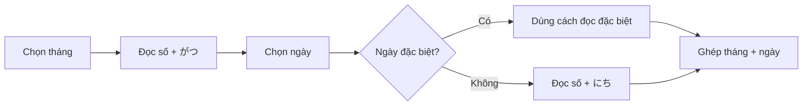

# 003 - How to Say the Months and Days

**Học phần:** Basic Japanese
**Loại bài:** lesson
**Thời lượng:** 03:41
**Preview:** No

---

## 1. Tóm tắt

Trong tiếng Nhật, cách nói **tháng** khá đơn giản: phần lớn chỉ cần ghép số thứ tự của tháng với `月（がつ / gatsu）`.

Cách nói **ngày trong tháng** phức tạp hơn. Các ngày từ mùng 1 đến mùng 10 có cách đọc đặc biệt cần ghi nhớ, trong khi phần lớn các ngày từ 11 trở đi tuân theo mẫu **số + `日（にち / nichi）`**. Tuy nhiên, ngày 14, 20 và 24 vẫn là những ngoại lệ quan trọng.

Khi nói một ngày cụ thể, tiếng Nhật đặt **tháng trước, ngày sau**:

```text
tháng → ngày

8月31日
はちがつ さんじゅういちにち
hachigatsu sanjūichinichi
31 tháng 8
```

## 2. Mục tiêu học tập

Sau bài này, người học có thể:

* đọc đúng 12 tháng trong tiếng Nhật;
* nhận biết các cách đọc đặc biệt của tháng 4, tháng 7 và tháng 9;
* đọc đúng ngày từ mùng 1 đến ngày 31;
* phân biệt các ngày có cách đọc đặc biệt với mẫu `số + にち`;
* ghép tháng và ngày thành một ngày hoàn chỉnh;
* hỏi và trả lời câu hỏi về ngày tháng bằng mẫu `何月何日`;
* nói ngày sinh của mình bằng tiếng Nhật.

## 3. Cách nói tháng trong tiếng Nhật

Từ chỉ **tháng** là:

```text
月
がつ
gatsu
```

Để nói một tháng, thông thường chỉ cần:

```text
số + がつ
```

Ví dụ:

```text
1 + がつ → いちがつ → tháng 1
5 + がつ → ごがつ → tháng 5
12 + がつ → じゅうにがつ → tháng 12
```

Bảng đầy đủ:

| Tháng    | Tiếng Nhật   | Romaji      |
| -------- | ------------ | ----------- |
| Tháng 1  | 一月（いちがつ）     | ichigatsu   |
| Tháng 2  | 二月（にがつ）      | nigatsu     |
| Tháng 3  | 三月（さんがつ）     | sangatsu    |
| Tháng 4  | 四月（しがつ）      | shigatsu    |
| Tháng 5  | 五月（ごがつ）      | gogatsu     |
| Tháng 6  | 六月（ろくがつ）     | rokugatsu   |
| Tháng 7  | 七月（しちがつ）     | shichigatsu |
| Tháng 8  | 八月（はちがつ）     | hachigatsu  |
| Tháng 9  | 九月（くがつ）      | kugatsu     |
| Tháng 10 | 十月（じゅうがつ）    | jūgatsu     |
| Tháng 11 | 十一月（じゅういちがつ） | jūichigatsu |
| Tháng 12 | 十二月（じゅうにがつ）  | jūnigatsu   |

Cần đặc biệt chú ý ba tháng:

```text
4月 → しがつ
7月 → しちがつ
9月 → くがつ
```

Không nên suy luận máy móc thành:

```text
よんがつ
なながつ
きゅうがつ
```

khi nói tên tháng theo cách đọc chuẩn thông dụng.

## 4. Cách nói ngày trong tháng

Khác với tháng, ngày trong tháng không hoàn toàn tuân theo một quy tắc duy nhất.

Có thể chia thành hai nhóm chính:

```text
Ngày 1–10
   ↓
Nhiều cách đọc đặc biệt
   ↓
Phải ghi nhớ

Ngày 11–31
   ↓
Phần lớn: số + にち
   ↓
Ngoại lệ: 14, 20, 24
```

### 4.1. Ngày từ mùng 1 đến mùng 10

Mười ngày đầu tháng có cách đọc đặc biệt:

| Ngày | Tiếng Nhật | Romaji    |
| ---- | ---------- | --------- |
| 1日   | ついたち       | tsuitachi |
| 2日   | ふつか        | futsuka   |
| 3日   | みっか        | mikka     |
| 4日   | よっか        | yokka     |
| 5日   | いつか        | itsuka    |
| 6日   | むいか        | muika     |
| 7日   | なのか        | nanoka    |
| 8日   | ようか        | yōka      |
| 9日   | ここのか       | kokonoka  |
| 10日  | とおか        | tōka      |

Những cách đọc này không thể tạo ra đơn giản bằng công thức `số + にち`, vì vậy cần học như một nhóm từ vựng riêng.

Ví dụ:

```text
5月3日
ごがつ みっか
gogatsu mikka
ngày 3 tháng 5
```

```text
7月8日
しちがつ ようか
shichigatsu yōka
ngày 8 tháng 7
```

### 4.2. Ngày từ 11 đến 31

Từ ngày 11 trở đi, phần lớn ngày được tạo theo công thức:

```text
số + にち
```

Ví dụ:

```text
11日 → じゅういちにち
15日 → じゅうごにち
21日 → にじゅういちにち
30日 → さんじゅうにち
```

Bảng các ngày từ 11 đến 31:

| Ngày | Cách đọc  |
| ---- | --------- |
| 11日  | じゅういちにち   |
| 12日  | じゅうににち    |
| 13日  | じゅうさんにち   |
| 14日  | じゅうよっか    |
| 15日  | じゅうごにち    |
| 16日  | じゅうろくにち   |
| 17日  | じゅうしちにち   |
| 18日  | じゅうはちにち   |
| 19日  | じゅうくにち    |
| 20日  | はつか       |
| 21日  | にじゅういちにち  |
| 22日  | にじゅうににち   |
| 23日  | にじゅうさんにち  |
| 24日  | にじゅうよっか   |
| 25日  | にじゅうごにち   |
| 26日  | にじゅうろくにち  |
| 27日  | にじゅうしちにち  |
| 28日  | にじゅうはちにち  |
| 29日  | にじゅうくにち   |
| 30日  | さんじゅうにち   |
| 31日  | さんじゅういちにち |

Ba ngoại lệ đặc biệt cần nhớ là:

```text
14日 → じゅうよっか
20日 → はつか
24日 → にじゅうよっか
```

Có thể nhận thấy ngày 14 và 24 sử dụng lại cách đọc `よっか` của ngày 4:

```text
4日  → よっか
14日 → じゅうよっか
24日 → にじゅうよっか
```

Riêng ngày 20:

```text
20日 → はつか
```

là một cách đọc đặc biệt cần ghi nhớ riêng.

## 5. Ghép tháng và ngày

Trong tiếng Nhật, thứ tự là:

```text
[tháng] + [ngày]
```

Không đảo thành ngày trước tháng.

Ví dụ:

```text
3月5日
さんがつ いつか
sangatsu itsuka
ngày 5 tháng 3
```

```text
4月14日
しがつ じゅうよっか
shigatsu jūyokka
ngày 14 tháng 4
```

```text
9月20日
くがつ はつか
kugatsu hatsuka
ngày 20 tháng 9
```

```text
12月24日
じゅうにがつ にじゅうよっか
jūnigatsu nijūyokka
ngày 24 tháng 12
```

Luồng đọc có thể ghi nhớ như sau:



Điểm quan trọng là phải xác định cách đọc của **ngày** trước khi ghép. Nếu ngày thuộc nhóm đặc biệt như `4日`, `14日`, `20日` hoặc `24日`, không áp dụng máy móc công thức `số + にち`.

## 6. Hỏi và trả lời ngày tháng

Để hỏi:

> Hôm nay là tháng mấy, ngày mấy?

dùng:

```text
きょうは なんがつ なんにちですか。
今日は何月何日ですか。
Kyō wa nangatsu nannichi desu ka.
```

Trong đó:

* `きょう（今日）`: hôm nay;
* `なんがつ（何月）`: tháng mấy;
* `なんにち（何日）`: ngày mấy;
* `ですか`: cấu trúc câu hỏi lịch sự.

Mẫu câu:

```text
今日は何月何日ですか。
→ Hôm nay là tháng mấy, ngày mấy?

今日は八月三十一日です。
→ Hôm nay là ngày 31 tháng 8.
```

Cách đọc:

```text
きょうは はちがつ さんじゅういちにちです。
Kyō wa hachigatsu sanjūichinichi desu.
```

Khi ngữ cảnh đã rõ, cũng có thể hỏi ngắn:

```text
何月何日ですか。
Nangatsu nannichi desu ka.
Tháng mấy, ngày mấy?
```

## 7. Nói ngày sinh

Từ **sinh nhật** trong tiếng Nhật là:

```text
誕生日
たんじょうび
tanjōbi
```

Để hỏi:

```text
誕生日は何月何日ですか。
たんじょうびは なんがつ なんにちですか。
Tanjōbi wa nangatsu nannichi desu ka.
Sinh nhật của bạn là ngày nào?
```

Có thể trả lời bằng:

```text
誕生日は + [tháng] + [ngày] + です。
```

Ví dụ:

```text
誕生日は五月十日です。
たんじょうびは ごがつ とおかです。
Tanjōbi wa gogatsu tōka desu.
Sinh nhật của tôi là ngày 10 tháng 5.
```

Hoặc:

```text
誕生日は九月二十四日です。
たんじょうびは くがつ にじゅうよっかです。
Tanjōbi wa kugatsu nijūyokka desu.
Sinh nhật của tôi là ngày 24 tháng 9.
```

## 8. Những điểm dễ nhầm

**Nhầm cách đọc tháng 4**

Sai:

```text
よんがつ
```

Cách đọc cần nhớ:

```text
4月 → しがつ
```

**Nhầm cách đọc tháng 7**

Tên tháng dùng:

```text
7月 → しちがつ
```

không áp dụng máy móc cách đọc `なな`.

**Nhầm cách đọc tháng 9**

Tên tháng dùng:

```text
9月 → くがつ
```

không phải `きゅうがつ`.

**Đọc mùng 1 thành `いちにち`**

Khi nói **ngày mùng 1 của tháng**:

```text
1日 → ついたち
```

`いちにち` tồn tại trong tiếng Nhật nhưng thường mang nghĩa **một ngày/cả ngày**, vì vậy cần phân biệt với ngày mùng 1 trong lịch.

**Áp dụng `にち` cho tất cả các ngày**

Không nên đọc:

```text
4日  → よんにち
14日 → じゅうよんにち
20日 → にじゅうにち
24日 → にじゅうよんにち
```

Khi nói ngày trong tháng, phải dùng:

```text
4日  → よっか
14日 → じゅうよっか
20日 → はつか
24日 → にじゅうよっか
```

## 9. Bài thực hành

### Bài 1: Đọc tháng

Đọc thành tiếng các tháng sau:

1. `2月`
2. `4月`
3. `7月`
4. `9月`
5. `11月`

Đặc biệt kiểm tra lại cách đọc của tháng 4, 7 và 9.

### Bài 2: Đọc ngày

Đọc thành tiếng:

1. `1日`
2. `4日`
3. `8日`
4. `10日`
5. `14日`
6. `20日`
7. `24日`
8. `31日`

Sau đó chia chúng thành hai nhóm:

```text
cách đọc đặc biệt
cách đọc theo số + にち
```

### Bài 3: Đọc ngày tháng hoàn chỉnh

Đọc các ngày sau bằng tiếng Nhật:

1. `1月1日`
2. `3月8日`
3. `4月14日`
4. `7月20日`
5. `9月24日`
6. `12月31日`

### Bài 4: Trả lời về ngày sinh

Hoàn thành câu:

```text
誕生日は＿＿月＿＿日です。
```

Sau đó:

1. viết ngày sinh của bạn bằng số;
2. chuyển tháng sang cách đọc tiếng Nhật;
3. chuyển ngày sang cách đọc tiếng Nhật;
4. đọc toàn bộ câu ba lần;
5. thử nói lại mà không nhìn mẫu.

## 10. Checklist hoàn thành

* [ ] Đọc được 12 tháng bằng tiếng Nhật.
* [ ] Nhớ cách đọc `4月`, `7月` và `9月`.
* [ ] Đọc đúng ngày từ mùng 1 đến mùng 10.
* [ ] Nhớ ba ngoại lệ `14日`, `20日` và `24日`.
* [ ] Biết quy tắc `số + にち` cho phần lớn các ngày từ 11 trở đi.
* [ ] Ghép được tháng và ngày theo đúng thứ tự.
* [ ] Hỏi được `今日は何月何日ですか。`
* [ ] Nói được ngày sinh của mình bằng tiếng Nhật.

## 11. Tổng kết

Cách nói tháng trong tiếng Nhật chủ yếu dựa trên công thức:

```text
số + がつ
```

nhưng cần nhớ riêng:

```text
4月 → しがつ
7月 → しちがつ
9月 → くがつ
```

Với ngày trong tháng, mùng 1 đến mùng 10 có nhiều cách đọc đặc biệt. Sau ngày 10, phần lớn có thể dùng:

```text
số + にち
```

nhưng ba ngày quan trọng vẫn phải ghi nhớ:

```text
14日 → じゅうよっか
20日 → はつか
24日 → にじゅうよっか
```

Khi nói một ngày hoàn chỉnh, luôn đặt **tháng trước ngày**:

```text
月 → 日
```

Mẫu câu cốt lõi của bài là:

```text
今日は何月何日ですか。
Kyō wa nangatsu nannichi desu ka.
Hôm nay là tháng mấy, ngày mấy?
```
