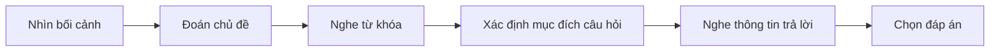

# 001 - Shopping for a Shirt in Japan

**Học phần:** Japanese Listening Comprehension for Absolute Beginners
**Loại bài:** lesson
**Thời lượng:** 01:47
**Preview:** Yes

---

## 1. Tóm tắt

Bài học luyện kỹ năng nghe tiếng Nhật trong tình huống **mua áo tại cửa hàng**. Trọng tâm là nhận diện bối cảnh mua sắm, nghe các từ khóa liên quan đến sản phẩm và giá tiền, đồng thời sử dụng những mẫu câu đơn giản để hỏi giá một món đồ.

Với người mới bắt đầu, mục tiêu không phải nghe được từng âm tiết. Điều quan trọng hơn là xác định được:

* người nói đang ở đâu;
* họ đang nói về món đồ nào;
* người mua muốn biết thông tin gì;
* từ khóa nào quyết định ý nghĩa của câu.

---

## 2. Mục tiêu học tập

Sau khi hoàn thành bài này, người học có thể:

* Nhận diện được tình huống mua sắm khi nghe một đoạn hội thoại tiếng Nhật ngắn.
* Hiểu và sử dụng mẫu câu `これは いくらですか` để hỏi giá.
* Nhận biết các từ khóa cơ bản như `シャツ`, `これ`, `いくら`, `円`.
* Phân biệt vai trò của người mua và nhân viên cửa hàng trong hội thoại.
* Nghe một đoạn hội thoại ngắn và xác định thông tin chính mà không cần hiểu toàn bộ từng từ.
* Thay đổi sản phẩm hoặc giá tiền để tạo hội thoại mới.

---

## 3. Bối cảnh giao tiếp

Một tình huống mua sắm cơ bản thường diễn ra theo luồng:

```text
Nhìn thấy sản phẩm
      ↓
Thu hút sự chú ý của nhân viên
      ↓
Chỉ vào sản phẩm
      ↓
Hỏi giá
      ↓
Nhân viên trả lời
      ↓
Người mua phản hồi
```

Trong tiếng Nhật, người mua có thể bắt đầu bằng:

```text
すみません。
```

Sau đó hỏi:

```text
これは いくらですか。
```

Toàn bộ câu có thể hiểu tự nhiên là:

> Xin lỗi, cái này bao nhiêu tiền?

Trong hội thoại thực tế, chủ ngữ thường không cần được nói rõ vì cả hai người đều nhìn thấy món đồ đang được đề cập.

---

## 4. Từ vựng trọng tâm

| Tiếng Nhật | Cách đọc  | Nghĩa                       |
| ---------- | --------- | --------------------------- |
| シャツ        | shatsu    | áo sơ mi, áo                |
| これ         | kore      | cái này                     |
| それ         | sore      | cái đó, gần người nghe      |
| いくら        | ikura     | bao nhiêu tiền              |
| 円          | えん / en   | yên Nhật                    |
| すみません      | sumimasen | xin lỗi, làm phiền một chút |
| はい         | hai       | vâng                        |
| ありがとう      | arigatou  | cảm ơn                      |

### Ghi nhớ `これ` và `それ`

`これ` được dùng khi món đồ ở gần người nói.

```text
Người mua → [áo]        Nhân viên
             ↑
            これ
```

`それ` thường được dùng khi món đồ ở gần người nghe.

```text
Người mua        [áo] ← Nhân viên
                  ↑
                 それ
```

Trong bài này, `これ` đặc biệt quan trọng vì người mua thường chỉ vào món đồ mình muốn hỏi.

---

## 5. Mẫu câu hỏi giá

Mẫu cơ bản:

```text
これは いくらですか。
```

Cấu trúc:

```text
これ
↓
cái này

は
↓
đánh dấu chủ đề

いくら
↓
bao nhiêu tiền

ですか
↓
biến câu thành câu hỏi lịch sự
```

Có thể hiểu:

```text
これは + いくらですか
   ↓
Cái này + bao nhiêu tiền?
```

Ví dụ:

```text
すみません。これは いくらですか。
Sumimasen. Kore wa ikura desu ka.
Xin lỗi, cái này bao nhiêu tiền?
```

Khi biết tên món đồ, có thể thay `これ` bằng danh từ:

```text
このシャツは いくらですか。
Kono shatsu wa ikura desu ka.
Chiếc áo này bao nhiêu tiền?
```

`この` phải đứng trước danh từ:

```text
この + シャツ
↓
chiếc áo này
```

Không dùng `この` một mình như `これ`.

---

## 6. Hội thoại mẫu

### Hội thoại

**Khách hàng:**

```text
すみません。このシャツは いくらですか。
```

*Sumimasen. Kono shatsu wa ikura desu ka.*

Xin lỗi, chiếc áo này bao nhiêu tiền?

**Nhân viên:**

```text
三千円です。
```

*Sanzen en desu.*

3.000 yên.

**Khách hàng:**

```text
ありがとうございます。
```

*Arigatou gozaimasu.*

Cảm ơn.

### Thông tin cần bắt được khi nghe

Không nhất thiết phải nghe chính xác mọi âm. Chỉ cần bắt được các điểm chính:

```text
シャツ
↓
đang nói về một chiếc áo

いくら
↓
đang hỏi giá

三千円
↓
giá là 3.000 yên
```

Nếu nghe được ba thông tin này, người học đã hiểu được phần quan trọng nhất của hội thoại.

---

## 7. Chiến lược nghe cho người mới bắt đầu

Không nên cố dịch từng từ ngay khi nghe. Hãy xử lý đoạn hội thoại theo thứ tự sau:



Trước khi nghe, hãy quan sát bối cảnh. Nếu hình ảnh cho thấy một người đứng trong cửa hàng và đang cầm áo, có thể dự đoán trước các từ như:

* `シャツ`;
* `いくら`;
* `円`.

Khi hội thoại bắt đầu, hãy ưu tiên nghe những từ này thay vì cố giải mã toàn bộ câu.

### Lần nghe thứ nhất

Chỉ xác định:

> Họ đang nói về chuyện gì?

### Lần nghe thứ hai

Tìm từ khóa:

```text
シャツ
いくら
円
```

### Lần nghe thứ ba

Tập trung vào thông tin cụ thể như:

* sản phẩm;
* giá;
* câu hỏi của khách hàng;
* câu trả lời của nhân viên.

---

## 8. Bài luyện nghe

Giả sử bạn nhìn thấy hình ảnh một khách hàng đang cầm một chiếc áo trong cửa hàng.

Hãy đọc đoạn hội thoại dưới đây như thể bạn đang nghe:

```text
A: すみません。このシャツは いくらですか。

B: 二千五百円です。
```

### Câu hỏi 1

Người A muốn biết điều gì?

* A. Màu của chiếc áo.
* B. Giá của chiếc áo.
* C. Kích cỡ của chiếc áo.
* D. Người sản xuất chiếc áo.

**Đáp án:** B.

Từ khóa quyết định là:

```text
いくら
```

nghĩa là:

> bao nhiêu tiền?

### Câu hỏi 2

Chiếc áo có giá bao nhiêu?

* A. 1.500 yên.
* B. 2.000 yên.
* C. 2.500 yên.
* D. 3.000 yên.

**Đáp án:** C.

```text
二千五百円
にせんごひゃくえん
nisen gohyaku en
```

nghĩa là:

> 2.500 yên.

### Câu hỏi 3

Bối cảnh phù hợp nhất là gì?

* A. Nhà hàng.
* B. Nhà ga.
* C. Cửa hàng quần áo.
* D. Trường học.

**Đáp án:** C.

Từ `シャツ` kết hợp với câu hỏi `いくらですか` cho thấy đây là tình huống mua sắm.

---

## 9. Biến đổi hội thoại

Sau khi thuộc mẫu cơ bản, không nên chỉ lặp lại nguyên câu. Hãy thay đổi sản phẩm.

Ví dụ với túi:

```text
すみません。このバッグは いくらですか。
Sumimasen. Kono baggu wa ikura desu ka.
Xin lỗi, chiếc túi này bao nhiêu tiền?
```

Ví dụ với giày:

```text
すみません。このくつは いくらですか。
Sumimasen. Kono kutsu wa ikura desu ka.
Xin lỗi, đôi giày này bao nhiêu tiền?
```

Có thể luyện theo công thức:

```text
この + [đồ vật] + は + いくらですか。
```

Thay `[đồ vật]` bằng:

* `シャツ` — áo;
* `バッグ` — túi;
* `くつ` — giày;
* `ぼうし` — mũ.

---

## 10. Lỗi thường gặp

**Hiện tượng:** Nghe thấy nhiều âm nhưng không biết câu hỏi đang hỏi gì.
**Nguyên nhân:** Cố dịch toàn bộ câu thay vì tìm từ khóa.
**Cách xử lý:** Ưu tiên nhận diện `いくら`, vì đây là dấu hiệu rất mạnh của câu hỏi về giá.

**Hiện tượng:** Nhầm `これ` với `この`.
**Nguyên nhân:** Cả hai đều liên quan đến nghĩa "này".
**Cách xử lý:** Ghi nhớ:

```text
これ
↓
đứng một mình

この + danh từ
↓
đứng trước danh từ
```

Ví dụ:

```text
これは いくらですか。
```

nhưng:

```text
このシャツは いくらですか。
```

**Hiện tượng:** Nghe được `円` nhưng bỏ lỡ con số phía trước.
**Nguyên nhân:** Chưa quen với số đếm tiếng Nhật.
**Cách xử lý:** Khi nghe thấy `円`, lập tức tập trung vào cụm số đứng ngay trước nó.

---

## 11. Thực hành

Thực hiện bài luyện sau mà không nhìn lại hội thoại mẫu.

1. Nói ba lần:

```text
すみません。これは いくらですか。
```

2. Thay `これ` bằng một chiếc áo:

```text
このシャツは いくらですか。
```

3. Tạo ba câu hỏi mới với ba sản phẩm khác nhau.

4. Tự đặt ba mức giá bằng yên Nhật và đóng vai nhân viên trả lời.

Ví dụ cấu trúc câu trả lời:

```text
[giá tiền] + 円です。
```

5. Đóng cả hai vai và tạo một hội thoại hoàn chỉnh:

```text
Khách hàng
↓
Gọi nhân viên
↓
Hỏi giá
↓
Nhân viên trả lời
↓
Khách hàng cảm ơn
```

---

## 12. Câu hỏi tự kiểm tra

1. Từ nào trong tiếng Nhật thường báo hiệu một câu hỏi về giá?
2. `これは いくらですか` có nghĩa là gì?
3. Tại sao không nên cố dịch từng từ khi luyện nghe ở trình độ mới bắt đầu?
4. `これ` và `この` khác nhau như thế nào?
5. Nếu nghe được `シャツ`, `いくら` và `三千円`, bạn có thể suy ra điều gì về hội thoại?

---

## 13. Checklist hoàn thành

* [ ] Nhận diện được bối cảnh mua áo trong cửa hàng.
* [ ] Hiểu nghĩa của `これは いくらですか`.
* [ ] Sử dụng được `この + danh từ + は いくらですか`.
* [ ] Nhận diện được `いくら` khi nghe.
* [ ] Nhận diện được `円` trong câu nói về giá.
* [ ] Phân biệt được `これ` và `この`.
* [ ] Tạo được ít nhất ba câu hỏi giá mới.
* [ ] Tóm tắt được nội dung một hội thoại mua sắm bằng một câu tiếng Việt.

---

## 14. Tổng kết

Trong tình huống mua sắm tại Nhật Bản, mẫu câu quan trọng nhất của bài là:

```text
すみません。これは いくらですか。
```

hoặc khi muốn nói rõ sản phẩm:

```text
このシャツは いくらですか。
```

Khi luyện nghe, hãy tập trung vào **bối cảnh**, **từ khóa** và **mục đích giao tiếp** trước khi cố hiểu từng từ. Với tình huống hỏi giá, ba nhóm thông tin quan trọng nhất là:

```text
Sản phẩm
+
いくら
+
Giá + 円
```

Nhận diện được ba thành phần này là nền tảng để hiểu những hội thoại mua sắm đơn giản trong tiếng Nhật.
