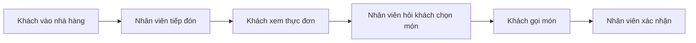

# 011 - Ordering Lunch at a Restaurant in Japan

**Học phần:** Japanese Listening Comprehension for Absolute Beginners
**Chủ đề:** Gọi món ăn trưa tại nhà hàng ở Nhật Bản
**Loại bài:** lesson
**Định dạng:** Video lesson
**Thời lượng:** 01:36
**Preview:** Yes

---

## 1. Tóm tắt

Khi ăn tại một nhà hàng ở Nhật Bản, người học cần nhận ra một số câu ngắn thường xuất hiện trong quá trình gọi món: gọi nhân viên, hỏi hoặc xác nhận món ăn, chọn món và đưa ra yêu cầu một cách lịch sự.

Bài học tập trung vào kỹ năng **nghe lấy ý chính** thay vì cố dịch từng từ. Người học sẽ luyện cách xác định bối cảnh nhà hàng, nhận diện từ khóa liên quan đến món ăn và hiểu mục đích của những mẫu câu cơ bản dùng khi gọi bữa trưa.

Sau bài này, người học có thể xử lý một hội thoại ngắn ở nhà hàng bằng cách tập trung vào:

```text
Bối cảnh
   ↓
Từ khóa
   ↓
Món ăn được nhắc đến
   ↓
Câu hỏi của nhân viên
   ↓
Lựa chọn của khách
   ↓
Ý chính của hội thoại
```

## 2. Mục tiêu học tập

Sau khi hoàn thành bài học, người học có thể:

* Nhận biết được bối cảnh gọi món tại một nhà hàng Nhật Bản.
* Nhận diện các từ khóa cơ bản liên quan đến bữa trưa và món ăn.
* Hiểu được một số câu hỏi phổ biến của nhân viên nhà hàng.
* Sử dụng các mẫu câu đơn giản để chọn và gọi món.
* Nghe một đoạn hội thoại ngắn và xác định món ăn mà người nói lựa chọn.
* Tóm tắt ý chính của một hội thoại nhà hàng bằng tiếng Việt.

## 3. Bối cảnh giao tiếp

Một cuộc hội thoại gọi món cơ bản thường có hai vai:

* **店員（てんいん / ten'in）:** nhân viên nhà hàng.
* **客（きゃく / kyaku）:** khách hàng.

Luồng giao tiếp thường diễn ra như sau:



Trong một bài nghe dành cho người mới bắt đầu, không nhất thiết phải hiểu toàn bộ từng từ. Điều quan trọng hơn là xác định được:

* ai đang nói;
* họ đang ở đâu;
* họ đang nói về món gì;
* khách cuối cùng chọn món nào.

## 4. Từ vựng trọng tâm

| Tiếng Nhật | Cách đọc                | Nghĩa                        |
| ---------- | ----------------------- | ---------------------------- |
| レストラン      | resutoran               | nhà hàng                     |
| ランチ        | ranchi                  | bữa trưa, suất ăn trưa       |
| メニュー       | menyū                   | thực đơn                     |
| 店員         | てんいん / ten'in           | nhân viên cửa hàng, nhà hàng |
| 注文         | ちゅうもん / chūmon          | gọi món, đặt món             |
| カレー        | karē                    | cà ri                        |
| ラーメン       | rāmen                   | ramen                        |
| そば         | soba                    | mì soba                      |
| うどん        | udon                    | mì udon                      |
| 水          | みず / mizu               | nước                         |
| お願いします     | おねがいします / onegaishimasu | làm ơn, xin vui lòng         |

Trong khi nghe, tên món ăn thường là những từ dễ nhận biết nhất. Nếu nghe thấy `カレー`, `ラーメン`, `そば` hoặc `うどん`, hãy ghi nhớ ngay vì chúng có thể quyết định đáp án của bài nghe.

## 5. Các mẫu câu quan trọng

### 5.1. Gọi nhân viên và đưa ra yêu cầu

**すみません。**
*Sumimasen.*
Xin lỗi / Cho tôi hỏi.

`すみません` là một trong những câu hữu ích nhất khi giao tiếp tại Nhật Bản. Trong nhà hàng, câu này có thể được dùng để gọi nhân viên một cách lịch sự.

Ví dụ:

**すみません。メニューをお願いします。**
*Sumimasen. Menyū o onegaishimasu.*
Xin lỗi, cho tôi xin thực đơn.

Một cấu trúc rất hữu ích là:

```text
Danh từ + を + お願いします
```

Ví dụ:

**水をお願いします。**
*Mizu o onegaishimasu.*
Cho tôi xin nước.

**ラーメンをお願いします。**
*Rāmen o onegaishimasu.*
Cho tôi ramen.

### 5.2. Chọn món

Khi được hỏi muốn chọn món nào, có thể sử dụng:

**これをお願いします。**
*Kore o onegaishimasu.*
Cho tôi món này.

Hoặc nói trực tiếp tên món:

**カレーをお願いします。**
*Karē o onegaishimasu.*
Cho tôi cà ri.

Một cách khác để diễn đạt lựa chọn là:

**カレーにします。**
*Karē ni shimasu.*
Tôi chọn cà ri.

Mẫu:

```text
Món ăn + にします
```

Ví dụ:

**ラーメンにします。**
*Rāmen ni shimasu.*
Tôi chọn ramen.

## 6. Hội thoại mẫu

Hãy đọc hội thoại một lần để hiểu bối cảnh, sau đó che phần tiếng Việt và luyện nghe hoặc đọc lại phần tiếng Nhật.

**店員:** ご注文は何にしますか。
*Gochūmon wa nani ni shimasu ka.*
Quý khách muốn gọi món gì?

**客:** カレーをお願いします。
*Karē o onegaishimasu.*
Cho tôi cà ri.

**店員:** カレーですね。
*Karē desu ne.*
Cà ri phải không ạ?

**客:** はい。
*Hai.*
Vâng.

Điểm quan trọng nhất của hội thoại không phải là dịch toàn bộ từng chữ. Chỉ cần nhận diện:

```text
ご注文
   ↓
Hỏi về món muốn gọi

カレー
   ↓
Món khách lựa chọn

お願いします
   ↓
Đưa ra yêu cầu lịch sự
```

Từ đó có thể kết luận rằng **khách gọi món cà ri**.

## 7. Chiến lược làm bài nghe

Với một bài nghe ngắn có hình ảnh và câu hỏi, nên thực hiện theo trình tự:

1. Quan sát hình ảnh trước khi nghe.
2. Xác định bối cảnh có thể là nhà hàng, quán ăn hay cửa hàng.
3. Đọc hoặc nghe câu hỏi để biết thông tin cần tìm.
4. Khi hội thoại bắt đầu, tập trung vào danh từ và từ khóa.
5. Đặc biệt chú ý tên món ăn xuất hiện sau các câu hỏi như `何にしますか`.
6. Không dừng lại vì một từ không hiểu.
7. Chọn đáp án dựa trên thông tin chính của hội thoại.

Ví dụ, nếu nghe được:

```text
何にしますか
...
ラーメンをお願いします
```

thì dù không hiểu mọi từ, vẫn có thể xác định rằng người nói chọn `ラーメン`.

Một lỗi phổ biến của người mới học là cố dịch từng từ ngay khi nghe. Cách này khiến não bị chậm hơn hội thoại. Thay vào đó, hãy ưu tiên:

```text
Nghe toàn câu
   ↓
Bắt từ khóa
   ↓
Xác định ý định
   ↓
Chọn đáp án
```

## 8. Phân biệt một số mẫu câu dễ gặp

| Mẫu câu       | Ý nghĩa               | Tình huống                    |
| ------------- | --------------------- | ----------------------------- |
| `すみません。`      | Xin lỗi / Cho tôi hỏi | Gọi nhân viên                 |
| `これをお願いします。`  | Cho tôi món này       | Chỉ trực tiếp vào món         |
| `カレーをお願いします。` | Cho tôi cà ri         | Gọi món cụ thể                |
| `カレーにします。`    | Tôi chọn cà ri        | Trả lời khi được hỏi lựa chọn |
| `何にしますか。`     | Bạn chọn gì?          | Hỏi lựa chọn                  |
| `いくらですか。`     | Bao nhiêu tiền?       | Hỏi giá                       |

Cần đặc biệt phân biệt:

**これはいくらですか。**
*Kore wa ikura desu ka.*
Cái này bao nhiêu tiền?

với:

**これをお願いします。**
*Kore o onegaishimasu.*
Cho tôi cái này.

Câu thứ nhất dùng để **hỏi giá**, còn câu thứ hai dùng để **yêu cầu hoặc gọi món**.

## 9. Luyện tập

### 9.1. Luyện nghe từ khóa

Đọc chậm mỗi câu ba lần. Sau đó che phần tiếng Nhật và thử nhớ món ăn được nhắc tới.

1. **カレーをお願いします。**
2. **ラーメンにします。**
3. **そばをお願いします。**
4. **うどんにします。**

Sau mỗi câu, hãy trả lời bằng tiếng Việt:

> Người nói chọn món gì?

### 9.2. Tạo hội thoại mới

Thay món ăn trong mẫu sau:

**店員:** 何にしますか。
**客:** ______をお願いします。

Sử dụng ít nhất ba từ:

* `カレー`
* `ラーメン`
* `そば`
* `うどん`

Ví dụ:

**店員:** 何にしますか。
**客:** うどんをお願いします。

### 9.3. Luyện phản xạ không nhìn mẫu

Giả sử nhân viên hỏi:

**何にしますか。**

Hãy tự trả lời ngay bằng tiếng Nhật với một món ăn mà bạn muốn gọi.

Không nhìn lại mẫu câu trong ít nhất ba lần thử.

## 10. Câu hỏi tự kiểm tra

1. Trong nhà hàng, `すみません` thường được sử dụng với mục đích gì?
2. `カレーをお願いします` thể hiện hành động hỏi giá hay gọi món?
3. Nếu nghe thấy `ラーメンにします`, người nói đã chọn món gì?
4. Điểm khác nhau giữa `これはいくらですか` và `これをお願いします` là gì?
5. Khi không hiểu toàn bộ hội thoại, loại thông tin nào nên được ưu tiên nghe trước?

## 11. Checklist hoàn thành

* [ ] Nhận biết được bối cảnh gọi món tại nhà hàng.
* [ ] Nhớ được ý nghĩa của `すみません`.
* [ ] Sử dụng được mẫu `～をお願いします`.
* [ ] Sử dụng được mẫu `～にします`.
* [ ] Nhận diện được tên món ăn trong hội thoại ngắn.
* [ ] Phân biệt được câu hỏi giá và câu gọi món.
* [ ] Tạo được ít nhất ba câu gọi món mới.
* [ ] Tóm tắt được ý chính của một hội thoại gọi món bằng một câu tiếng Việt.

## 12. Tổng kết

Trong một hội thoại gọi bữa trưa tại nhà hàng Nhật Bản, người mới học không cần hiểu mọi từ để xác định được ý chính. Hãy tập trung vào **bối cảnh**, **tên món ăn**, **câu hỏi của nhân viên** và **câu trả lời của khách**.

Hai mẫu câu đặc biệt hữu ích là:

**～をお願いします。**
Cho tôi / Tôi muốn ～.

**～にします。**
Tôi chọn ～.

Khi luyện nghe, hãy hình thành thói quen bắt từ khóa trước, xác định mục đích giao tiếp sau và chỉ phân tích chi tiết khi đã hiểu được ý chính của hội thoại.
