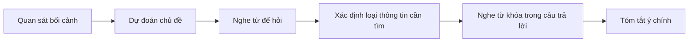

# 001 - Talking About Vacation Plans in Japanese

**Học phần:** Japanese Listening Comprehension for Absolute Beginners
**Loại bài:** lesson
**Thời lượng:** 01:50
**Preview:** Yes

---

## 1. Tóm tắt

Bài học luyện nghe tiếng Nhật trong tình huống **nói về kế hoạch cho kỳ nghỉ**. Trọng tâm là nhận diện thời gian, địa điểm, hoạt động dự định thực hiện và mẫu câu dùng để hỏi hoặc trả lời về kế hoạch tương lai.

Ở trình độ mới bắt đầu, không cần nghe chính xác từng từ. Hãy tập trung vào ba loại thông tin:

```text
Khi nào?
+
Đi đâu?
+
Làm gì?
```

Ví dụ, nếu nghe được:

```text
夏休み
京都
行きます
```

người học có thể suy ra rằng người nói đang đề cập đến việc **đi Kyoto trong kỳ nghỉ hè**.

---

## 2. Mục tiêu học tập

Sau khi hoàn thành bài này, người học có thể:

* Nhận diện được một hội thoại ngắn về kế hoạch kỳ nghỉ.
* Nghe và xác định được thời gian, địa điểm và hoạt động chính.
* Hiểu cách dùng `行きます` để nói về việc đi đến một địa điểm.
* Sử dụng `何をしますか` để hỏi người khác sẽ làm gì.
* Sử dụng `どこへ行きますか` để hỏi nơi người khác sẽ đi.
* Tạo được câu đơn giản về kế hoạch nghỉ của bản thân.
* Tóm tắt được ý chính của một hội thoại về kỳ nghỉ bằng tiếng Việt.

---

## 3. Bối cảnh giao tiếp

Khi hai người nói về kỳ nghỉ, hội thoại thường xoay quanh những câu hỏi như:

* Bạn sẽ làm gì?
* Bạn sẽ đi đâu?
* Bạn đi với ai?
* Bạn đi khi nào?
* Bạn ở đó bao lâu?

Luồng thông tin thường có dạng:

```text
Kỳ nghỉ sắp tới
      ↓
Hỏi kế hoạch
      ↓
Nêu địa điểm
      ↓
Nêu hoạt động
      ↓
Bổ sung thời gian hoặc người đi cùng
```

Ví dụ:

```text
A: 夏休みは何をしますか。
B: 京都へ行きます。
```

Người A hỏi về kế hoạch trong kỳ nghỉ hè, còn người B cho biết sẽ đi Kyoto.

---

## 4. Từ vựng trọng tâm

| Tiếng Nhật | Cách đọc            | Nghĩa              |
| ---------- | ------------------- | ------------------ |
| 休み         | やすみ / yasumi        | kỳ nghỉ, ngày nghỉ |
| 夏休み        | なつやすみ / natsuyasumi | kỳ nghỉ hè         |
| 旅行         | りょこう / ryokou       | du lịch, chuyến đi |
| 行きます       | いきます / ikimasu      | đi                 |
| 来ます        | きます / kimasu        | đến                |
| 帰ります       | かえります / kaerimasu   | trở về             |
| 何          | なに / nani           | cái gì             |
| どこ         | doko                | ở đâu, nơi nào     |
| いつ         | itsu                | khi nào            |
| 友だち        | ともだち / tomodachi    | bạn bè             |
| 家族         | かぞく / kazoku        | gia đình           |
| 一緒に        | いっしょに / issho ni    | cùng nhau          |

Ba từ để hỏi đặc biệt quan trọng:

```text
何
↓
cái gì

どこ
↓
ở đâu / nơi nào

いつ
↓
khi nào
```

Khi nghe hội thoại, nhận diện được những từ này sẽ giúp bạn dự đoán loại thông tin cần tìm trong câu trả lời.

---

## 5. Hỏi về kế hoạch kỳ nghỉ

Mẫu câu cơ bản:

```text
休みは何をしますか。
Yasumi wa nani o shimasu ka.
```

Nghĩa:

> Bạn sẽ làm gì trong kỳ nghỉ?

Cấu trúc:

```text
[thời gian] + は + 何をしますか
```

Ví dụ:

```text
夏休みは何をしますか。
Natsuyasumi wa nani o shimasu ka.
```

> Bạn sẽ làm gì trong kỳ nghỉ hè?

`何をしますか` có thể hiểu là:

```text
何
↓
cái gì

を
↓
đánh dấu đối tượng của hành động

します
↓
làm

か
↓
biến câu thành câu hỏi
```

Trong giao tiếp, người nghe không cần dịch từng thành phần. Khi nghe được `何をしますか`, hãy hiểu nhanh rằng người nói đang hỏi:

> Sẽ làm gì?

---

## 6. Hỏi và trả lời về địa điểm

Khi muốn hỏi người khác sẽ đi đâu, có thể dùng:

```text
どこへ行きますか。
Doko e ikimasu ka.
```

> Bạn sẽ đi đâu?

Cấu trúc:

```text
どこ + へ + 行きますか
```

`へ` đánh dấu hướng hoặc đích đến của chuyển động.

Ví dụ câu trả lời:

```text
京都へ行きます。
Kyouto e ikimasu.
```

> Tôi sẽ đi Kyoto.

Có thể thay địa điểm:

```text
東京へ行きます。
Toukyou e ikimasu.
```

> Tôi sẽ đi Tokyo.

```text
大阪へ行きます。
Oosaka e ikimasu.
```

> Tôi sẽ đi Osaka.

```text
日本へ行きます。
Nihon e ikimasu.
```

> Tôi sẽ đi Nhật Bản.

Khi luyện nghe, hãy chú ý phần đứng trước `へ行きます`, vì đó thường là **địa điểm người nói sẽ đến**.

---

## 7. Nói về hoạt động trong kỳ nghỉ

Không phải mọi kế hoạch đều là đi du lịch. Người nói có thể ở nhà, gặp bạn bè hoặc dành thời gian cho gia đình.

Một số câu cơ bản:

```text
旅行します。
Ryokou shimasu.
```

> Tôi sẽ đi du lịch.

```text
友だちに会います。
Tomodachi ni aimasu.
```

> Tôi sẽ gặp bạn.

```text
家族と旅行します。
Kazoku to ryokou shimasu.
```

> Tôi sẽ đi du lịch cùng gia đình.

```text
家で休みます。
Ie de yasumimasu.
```

> Tôi sẽ nghỉ ngơi ở nhà.

Trong câu:

```text
家族と旅行します。
```

`と` mang nghĩa "với", vì vậy:

```text
家族
+
と
+
旅行します
```

có thể hiểu là:

```text
gia đình
+
cùng với
+
đi du lịch
```

---

## 8. Hỏi thời gian

Để hỏi khi nào một hoạt động sẽ diễn ra, sử dụng:

```text
いつ行きますか。
Itsu ikimasu ka.
```

> Bạn sẽ đi khi nào?

Ví dụ:

```text
来週行きます。
Raishuu ikimasu.
```

> Tôi sẽ đi vào tuần sau.

Một số từ chỉ thời gian hữu ích:

| Tiếng Nhật | Cách đọc        | Nghĩa     |
| ---------- | --------------- | --------- |
| 今日         | きょう / kyou      | hôm nay   |
| 明日         | あした / ashita    | ngày mai  |
| 今週         | こんしゅう / konshuu | tuần này  |
| 来週         | らいしゅう / raishuu | tuần sau  |
| 今月         | こんげつ / kongetsu | tháng này |
| 来月         | らいげつ / raigetsu | tháng sau |

Khi nghe câu hỏi có `いつ`, hãy tập trung tìm một từ hoặc cụm từ chỉ **thời gian** trong câu trả lời.

---

## 9. Hội thoại mẫu

Đọc hội thoại sau và xác định:

* kỳ nghỉ nào;
* người nói sẽ đi đâu;
* đi cùng ai.

```text
A: 夏休みは何をしますか。
B: 家族と旅行します。
A: どこへ行きますか。
B: 京都へ行きます。
```

Nghĩa:

> **A:** Bạn sẽ làm gì trong kỳ nghỉ hè?
> **B:** Tôi sẽ đi du lịch cùng gia đình.
> **A:** Bạn sẽ đi đâu?
> **B:** Tôi sẽ đi Kyoto.

Các từ khóa quan trọng:

```text
夏休み
↓
kỳ nghỉ hè

家族
↓
gia đình

旅行します
↓
đi du lịch

京都
↓
Kyoto

行きます
↓
đi
```

Ngay cả khi bỏ lỡ một số trợ từ, việc nhận diện những từ khóa này vẫn đủ để hiểu nội dung chính.

---

## 10. Chiến lược nghe

Khi bắt đầu một bài nghe ngắn, hãy sử dụng quy trình:



Nếu nghe thấy:

```text
どこ
```

hãy chuẩn bị nghe **địa điểm**.

Nếu nghe thấy:

```text
いつ
```

hãy chuẩn bị nghe **thời gian**.

Nếu nghe thấy:

```text
何をしますか
```

hãy chuẩn bị nghe **hoạt động**.

Cách này hiệu quả hơn việc cố dịch liên tục từng từ sang tiếng Việt.

---

## 11. Bài luyện nghe hiểu

Đọc hội thoại một lần với tốc độ tự nhiên:

```text
A: 休みは何をしますか。
B: 大阪へ行きます。
A: いつ行きますか。
B: 来週行きます。
```

Sau đó trả lời mà không nhìn lại.

1. Người B có kế hoạch làm gì?
2. Người B sẽ đi đâu?
3. Khi nào người B sẽ đi?
4. Từ nào báo hiệu câu hỏi về địa điểm?
5. Từ nào báo hiệu câu hỏi về thời gian?

Thông tin chính có thể rút gọn thành:

```text
大阪
+
来週
+
行きます
```

Tức là:

> Người B sẽ đi Osaka vào tuần sau.

---

## 12. Phân biệt các loại câu hỏi

| Câu hỏi     | Thông tin cần nghe |
| ----------- | ------------------ |
| `何をしますか。`   | hoạt động          |
| `どこへ行きますか。` | địa điểm           |
| `いつ行きますか。`  | thời gian          |

Đây là một chiến lược quan trọng trong nghe hiểu: **từ để hỏi cho biết loại đáp án cần tìm**.

Ví dụ, nếu câu hỏi là:

```text
どこへ行きますか。
```

và bạn nghe được:

```text
来週、家族と京都へ行きます。
```

không cần nhớ toàn bộ câu. Chỉ cần xác định:

```text
京都
```

vì câu hỏi đang yêu cầu **địa điểm**.

---

## 13. Tạo câu về kế hoạch của bản thân

Sử dụng cấu trúc:

```text
[thời gian] + [địa điểm] + へ行きます。
```

Ví dụ:

```text
来週、東京へ行きます。
Raishuu, Toukyou e ikimasu.
```

> Tuần sau tôi sẽ đi Tokyo.

Có thể thêm người đi cùng:

```text
家族と京都へ行きます。
Kazoku to Kyouto e ikimasu.
```

> Tôi sẽ đi Kyoto cùng gia đình.

Hoặc kết hợp cả ba loại thông tin:

```text
来月、友だちと大阪へ行きます。
Raigetsu, tomodachi to Oosaka e ikimasu.
```

> Tháng sau tôi sẽ đi Osaka cùng bạn.

Cấu trúc mở rộng:

```text
[thời gian]
+
[người đi cùng] + と
+
[địa điểm] + へ
+
行きます
```

---

## 14. Lỗi thường gặp

**Hiện tượng:** Nghe được nhiều địa danh nhưng không biết địa danh nào là đáp án.
**Nguyên nhân:** Chưa xác định câu hỏi đang hỏi về thông tin gì.
**Cách xử lý:** Nghe từ để hỏi trước. Nếu nghe `どこ`, tập trung vào địa điểm trong câu trả lời.

**Hiện tượng:** Nhầm `何` với `どこ`.
**Nguyên nhân:** Chưa gắn mỗi từ để hỏi với một loại thông tin.
**Cách xử lý:** Ghi nhớ:

```text
何 → cái gì / làm gì
どこ → nơi nào
いつ → khi nào
```

**Hiện tượng:** Cố dịch toàn bộ câu trong lúc đoạn hội thoại vẫn tiếp tục.
**Nguyên nhân:** Xử lý từng từ khiến người nghe bỏ lỡ phần tiếp theo.
**Cách xử lý:** Chỉ ghi nhận các từ khóa như thời gian, địa điểm và động từ chính.

**Hiện tượng:** Nghe thấy `行きます` nhưng chưa hiểu kế hoạch cụ thể.
**Nguyên nhân:** `行きます` chỉ cho biết hành động "đi"; địa điểm phải được xác định từ phần còn lại của câu.
**Cách xử lý:** Tập trung vào danh từ đứng trước `へ` hoặc `に`.

---

## 15. Thực hành

Tự trả lời ba câu hỏi sau bằng tiếng Nhật:

```text
休みは何をしますか。
```

```text
どこへ行きますか。
```

```text
いつ行きますか。
```

Sau đó tạo một kế hoạch gồm:

* một thời điểm;
* một địa điểm;
* một người đi cùng hoặc một hoạt động.

Ví dụ khung:

```text
来月、________と________へ行きます。
```

Tiếp theo, đóng hai vai và tạo hội thoại ít nhất bốn lượt:

```text
A → hỏi kế hoạch
B → trả lời hoạt động
A → hỏi địa điểm hoặc thời gian
B → trả lời
```

Cuối cùng, nói lại hội thoại mà không nhìn mẫu.

---

## 16. Câu hỏi tự kiểm tra

1. `何をしますか` được dùng để hỏi loại thông tin nào?
2. `どこへ行きますか` có nghĩa là gì?
3. Khi nghe `いつ`, bạn nên tập trung tìm thông tin gì?
4. Trong câu `家族と旅行します`, `と` thể hiện ý nghĩa gì?
5. Nếu nghe được `来週、京都へ行きます`, hãy tóm tắt nội dung bằng tiếng Việt.
6. Hãy tự tạo một câu nói về kế hoạch kỳ nghỉ có thời gian và địa điểm.

---

## 17. Checklist hoàn thành

* [ ] Nhận diện được chủ đề nói về kế hoạch kỳ nghỉ.
* [ ] Hiểu được `何をしますか`.
* [ ] Hiểu được `どこへ行きますか`.
* [ ] Hiểu được `いつ行きますか`.
* [ ] Nhận diện được `行きます` trong hội thoại.
* [ ] Phân biệt được câu hỏi về hoạt động, địa điểm và thời gian.
* [ ] Nghe được các từ khóa quan trọng mà không cần dịch từng câu.
* [ ] Tạo được ít nhất ba câu về kế hoạch kỳ nghỉ.
* [ ] Tạo được một hội thoại ngắn về kế hoạch của bản thân.
* [ ] Tóm tắt được nội dung hội thoại bằng một câu tiếng Việt.

---

## 18. Tổng kết

Khi nghe hội thoại về kế hoạch kỳ nghỉ, hãy tập trung vào ba câu hỏi:

```text
何をしますか。
↓
Sẽ làm gì?

どこへ行きますか。
↓
Sẽ đi đâu?

いつ行きますか。
↓
Sẽ đi khi nào?
```

Từ đó, hãy tìm ba loại thông tin chính:

```text
Thời gian
+
Địa điểm
+
Hoạt động
```

Không cần hiểu mọi từ mới có thể hiểu được hội thoại. Với người mới bắt đầu, khả năng nhận diện đúng **từ để hỏi**, **động từ chính** và **từ khóa trong câu trả lời** là nền tảng quan trọng nhất để phát triển kỹ năng nghe tiếng Nhật.
