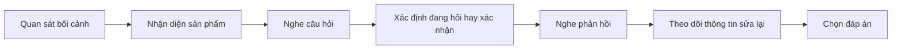

# 001 - At the Jewelry Store in Japan

**Học phần:** Japanese Listening Comprehension for Beginners
**Loại bài:** lesson
**Thời lượng:** 02:43
**Preview:** Yes

---

## 1. Tóm tắt

Bài học luyện kỹ năng nghe tiếng Nhật trong bối cảnh **mua sắm tại cửa hàng trang sức**. Trọng tâm là xác định món đồ đang được nói đến, nghe thông tin mô tả sản phẩm, nhận diện câu hỏi xác nhận và hiểu cách khách hàng phản hồi với nhân viên.

Trong một đoạn hội thoại mua sắm, người học không cần hiểu tất cả từng từ. Hãy tập trung vào những thông tin có khả năng quyết định đáp án:

```text
Sản phẩm
+
Đặc điểm
+
Giá hoặc lựa chọn
+
Xác nhận
```

Ví dụ, nếu nghe được:

```text
ネックレス
+
シルバー
+
これですか
```

có thể suy ra người nói đang xác nhận một **chiếc vòng cổ màu bạc**.

---

## 2. Mục tiêu học tập

Sau khi hoàn thành bài này, người học có thể:

* Nhận diện được bối cảnh giao tiếp tại cửa hàng trang sức.
* Nghe và xác định món trang sức đang được đề cập.
* Hiểu một số từ vựng cơ bản về vòng cổ, nhẫn và hoa tai.
* Nhận diện các mẫu câu hỏi về sản phẩm và giá tiền.
* Hiểu câu hỏi xác nhận như `これですか` và `こちらですか`.
* Phản hồi tự nhiên bằng `はい`, `そうです`, `いいえ` hoặc câu sửa thông tin.
* Dựa vào từ khóa để chọn đúng thông tin trong một đoạn hội thoại ngắn.

---

## 3. Bối cảnh giao tiếp tại cửa hàng trang sức

Một cuộc hội thoại đơn giản tại cửa hàng trang sức thường diễn ra theo trình tự:

```text
Khách quan sát sản phẩm
        ↓
Hỏi hoặc yêu cầu xem một món đồ
        ↓
Nhân viên xác nhận sản phẩm
        ↓
Khách xác nhận hoặc sửa lại
        ↓
Hỏi thêm giá hoặc đặc điểm
        ↓
Quyết định tiếp tục xem hoặc mua
```

Ở trình độ beginner, hai kỹ năng quan trọng nhất là:

* xác định **đang nói về món nào**;
* xác định **người nói đang hỏi hay xác nhận điều gì**.

---

## 4. Từ vựng về trang sức

| Tiếng Nhật | Cách đọc     | Nghĩa               |
| ---------- | ------------ | ------------------- |
| アクセサリー     | akusesarī    | phụ kiện, trang sức |
| ネックレス      | nekkuresu    | vòng cổ             |
| 指輪         | ゆびわ / yubiwa | nhẫn                |
| ピアス        | piasu        | hoa tai dạng xỏ lỗ  |
| イヤリング      | iyaringu     | hoa tai kẹp         |
| ブレスレット     | buresuretto  | vòng tay            |
| 金          | きん / kin     | vàng                |
| 銀          | ぎん / gin     | bạc                 |
| ゴールド       | gōrudo       | màu vàng, gold      |
| シルバー       | shirubā      | màu bạc, silver     |
| 値段         | ねだん / nedan  | giá tiền            |
| 円          | えん / en      | yên Nhật            |

Trong bài nghe, tên sản phẩm thường là từ khóa quan trọng nhất.

Ví dụ:

```text
ネックレス
↓
vòng cổ
```

```text
指輪
↓
nhẫn
```

```text
ピアス
↓
hoa tai
```

Nếu câu hỏi yêu cầu xác định món đồ mà khách hàng muốn mua, hãy ưu tiên nghe những danh từ này.

---

## 5. Chỉ một sản phẩm bằng `これ`, `それ` và `あれ`

Ba từ cơ bản:

| Từ   | Nghĩa   | Vị trí tương đối |
| ---- | ------- | ---------------- |
| `これ` | cái này | gần người nói    |
| `それ` | cái đó  | gần người nghe   |
| `あれ` | cái kia | xa cả hai        |

Ví dụ:

```text
これはきれいですね。
Kore wa kirei desu ne.
```

> Cái này đẹp nhỉ.

Trong cửa hàng, nhân viên có thể cầm một món đồ và hỏi:

```text
これですか。
Kore desu ka.
```

> Là cái này phải không?

Khách có thể trả lời:

```text
はい、そうです。
Hai, sou desu.
```

> Vâng, đúng rồi.

Hoặc:

```text
いいえ、それです。
Iie, sore desu.
```

> Không, là cái đó.

---

## 6. Xác nhận sản phẩm

Câu hỏi xác nhận rất phổ biến khi nhân viên cần chắc chắn khách đang nói đến món nào.

Một mẫu đơn giản:

```text
これですか。
```

> Là cái này phải không?

Cách lịch sự hơn trong giao tiếp dịch vụ:

```text
こちらですか。
Kochira desu ka.
```

> Là món này phải không ạ?

`こちら` có thể được dùng lịch sự hơn `これ` khi nhân viên nói với khách hàng.

Các phản hồi thường gặp:

```text
はい、そうです。
```

> Vâng, đúng rồi.

```text
はい、それです。
```

> Vâng, là cái đó.

```text
いいえ、違います。
Iie, chigaimasu.
```

> Không, không phải.

Khi nghe câu hỏi có ngữ điệu xác nhận, hãy chú ý phần trả lời ngay sau đó vì nó thường quyết định thông tin chính.

---

## 7. Hỏi về sản phẩm

Khi không biết tên hoặc muốn hỏi món đồ là gì:

```text
これは何ですか。
Kore wa nan desu ka.
```

> Cái này là gì?

Nếu muốn hỏi về một món đồ cụ thể:

```text
このネックレスは何ですか。
```

Trong thực tế, câu hỏi thường tập trung vào thông tin cụ thể hơn như vật liệu, giá hoặc màu sắc.

Ví dụ:

```text
これはシルバーですか。
Kore wa shirubā desu ka.
```

> Cái này là bạc phải không?

Phản hồi:

```text
はい、シルバーです。
```

> Vâng, là bạc.

Hoặc:

```text
いいえ、ゴールドです。
```

> Không, là màu vàng.

---

## 8. Hỏi giá

Mẫu câu cơ bản:

```text
これはいくらですか。
Kore wa ikura desu ka.
```

> Cái này bao nhiêu tiền?

Nếu muốn nói rõ sản phẩm:

```text
このネックレスはいくらですか。
Kono nekkuresu wa ikura desu ka.
```

> Chiếc vòng cổ này bao nhiêu tiền?

Câu trả lời thường có dạng:

```text
五千円です。
Gosen en desu.
```

> 5.000 yên.

Khi nghe câu hỏi có:

```text
いくら
```

hãy chuẩn bị nghe:

```text
Số tiền + 円
```

Ví dụ:

```text
八千円です。
```

Từ khóa quan trọng ở đây là:

```text
八千
+
円
```

---

## 9. Hỏi về màu sắc hoặc chất liệu

Trong cửa hàng trang sức, màu sắc và chất liệu thường là thông tin cần phân biệt.

Ví dụ:

```text
ゴールドですか。
Gōrudo desu ka.
```

> Là màu vàng phải không?

```text
シルバーですか。
Shirubā desu ka.
```

> Là màu bạc phải không?

Khách cũng có thể thể hiện mong muốn:

```text
シルバーのネックレスがいいです。
Shirubā no nekkuresu ga ii desu.
```

> Tôi muốn một chiếc vòng cổ màu bạc.

Cấu trúc:

```text
[đặc điểm] + の + [sản phẩm]
```

Ví dụ:

```text
シルバーのネックレス
```

> vòng cổ màu bạc

```text
ゴールドの指輪
```

> nhẫn màu vàng

Khi nghe hai danh từ nối bằng `の`, hãy hiểu rằng phần đứng trước thường bổ nghĩa cho phần đứng sau.

---

## 10. Hội thoại mẫu

Đọc đoạn sau và tập xác định sản phẩm, màu sắc và giá tiền.

```text
店員: こちらですか。

客: いいえ、そのシルバーのネックレスです。

店員: こちらですね。

客: はい、そうです。いくらですか。

店員: 五千円です。
```

Nghĩa:

> **Nhân viên:** Là món này phải không ạ?
> **Khách:** Không, là chiếc vòng cổ màu bạc đó.
> **Nhân viên:** Món này phải không ạ?
> **Khách:** Vâng, đúng rồi. Bao nhiêu tiền vậy?
> **Nhân viên:** 5.000 yên.

Thông tin chính:

```text
Sản phẩm
↓
ネックレス

Đặc điểm
↓
シルバー

Giá
↓
五千円
```

Điểm quan trọng của đoạn hội thoại không phải là nhớ mọi từ mà là theo dõi quá trình:

```text
Xác nhận sai
↓
Khách sửa
↓
Xác nhận lại
↓
Khách đồng ý
↓
Hỏi giá
```

---

## 11. Cách nghe câu hỏi xác nhận

Một câu hỏi xác nhận thường không yêu cầu một câu trả lời dài.

Ví dụ:

```text
これですか。
```

Câu trả lời có thể chỉ là:

```text
はい。
```

hoặc:

```text
いいえ。
```

Tuy nhiên, phần sau mới cung cấp thông tin đầy đủ:

```text
いいえ、それです。
```

Khi nghe `いいえ`, đừng dừng xử lý ngay. Hãy tiếp tục nghe xem người nói **sửa thông tin thành gì**.

Ví dụ:

```text
A: この指輪ですか。

B: いいえ、そのネックレスです。
```

Nếu chỉ nghe `いいえ`, bạn mới biết lựa chọn ban đầu sai.

Thông tin quyết định là:

```text
そのネックレス
```

> chiếc vòng cổ đó.

---

## 12. Chiến lược nghe hiệu quả

Hãy xử lý hội thoại theo thứ tự:



Điểm cần chú ý:

* `はい` thường xác nhận thông tin trước đó.
* `そうです` thể hiện "đúng vậy".
* `いいえ` báo hiệu thông tin trước đó không đúng.
* `違います` cũng thể hiện sự phủ định.
* Sau câu phủ định thường xuất hiện thông tin chính xác.

---

## 13. Bài luyện nghe hiểu

Đọc đoạn hội thoại một lần với tốc độ tự nhiên:

```text
A: この指輪ですか。

B: いいえ、そのネックレスです。

A: シルバーのネックレスですね。

B: はい、そうです。
```

Sau đó trả lời mà không nhìn lại:

1. Người B muốn xem nhẫn hay vòng cổ?
2. Món đồ được chọn có đặc điểm gì?
3. Lựa chọn đầu tiên của người A có đúng không?
4. Từ nào cho biết người B phủ định?
5. Cụm từ nào xác nhận lựa chọn cuối cùng?

Thông tin chính có thể rút gọn thành:

```text
指輪
→ Không

シルバーのネックレス
→ Đúng
```

Đây chính là cách theo dõi sự thay đổi thông tin trong một đoạn nghe có câu hỏi xác nhận.

---

## 14. Chọn đáp án đúng

1. `ネックレス` có nghĩa là:

   * A. Nhẫn.
   * B. Vòng cổ.
   * C. Vòng tay.
   * D. Hoa tai.

2. Câu nào dùng để xác nhận "Là cái này phải không?"

   * A. `どこですか。`
   * B. `これですか。`
   * C. `いくらですか。`
   * D. `何をしますか。`

3. Câu nào thể hiện "Vâng, đúng rồi"?

   * A. `いいえ、違います。`
   * B. `はい、そうです。`
   * C. `どこですか。`
   * D. `いくらですか。`

4. Nếu nghe `シルバーのネックレス`, món đồ nào đang được nói đến?

   * A. Nhẫn vàng.
   * B. Hoa tai bạc.
   * C. Vòng cổ bạc.
   * D. Vòng tay vàng.

5. Nếu nghe `いくらですか`, loại thông tin nào cần được tìm trong câu tiếp theo?

   * A. Địa điểm.
   * B. Thời gian.
   * C. Giá tiền.
   * D. Tên người.

---

## 15. Phân biệt câu hỏi và phản hồi

| Mẫu câu     | Chức năng            |
| ----------- | -------------------- |
| `これですか。`    | xác nhận sản phẩm    |
| `これは何ですか。`  | hỏi sản phẩm là gì   |
| `いくらですか。`   | hỏi giá              |
| `はい、そうです。`  | xác nhận đúng        |
| `いいえ、違います。` | phủ định             |
| `それです。`     | chỉ ra sản phẩm đúng |

Khi luyện nghe, không chỉ cần biết nghĩa của từng câu mà còn phải xác định **vai trò giao tiếp** của câu đó.

Ví dụ:

```text
これですか。
```

không chỉ mang nghĩa "Cái này à?", mà còn cho biết người nói đang **kiểm tra xem mình đã hiểu đúng lựa chọn của người kia chưa**.

---

## 16. Tạo hội thoại mới

Hãy chọn một trong các sản phẩm:

* `ネックレス`;
* `指輪`;
* `ピアス`;
* `ブレスレット`.

Sau đó chọn một đặc điểm:

* `ゴールド`;
* `シルバー`.

Tạo hội thoại có cấu trúc:

```text
Nhân viên
↓
Xác nhận một sản phẩm

Khách
↓
Phủ định và chỉ ra sản phẩm đúng

Nhân viên
↓
Xác nhận lại

Khách
↓
Đồng ý và hỏi giá

Nhân viên
↓
Trả lời giá
```

Ví dụ khung:

```text
A: これですか。

B: いいえ、________________です。

A: こちらですね。

B: はい、そうです。________________。

A: ________________円です。
```

Không sao chép nguyên hội thoại mẫu. Hãy thay sản phẩm, màu sắc và giá tiền.

---

## 17. Lỗi thường gặp

**Hiện tượng:** Chọn ngay sản phẩm đầu tiên được nhắc đến.
**Nguyên nhân:** Không nghe tiếp phản hồi xác nhận hoặc phủ định.
**Cách xử lý:** Nếu sau sản phẩm xuất hiện `いいえ`, sản phẩm đầu tiên thường không phải đáp án cuối cùng.

**Hiện tượng:** Nghe được `はい` nhưng không biết nó đang xác nhận thông tin nào.
**Nguyên nhân:** Không giữ lại nội dung của câu ngay trước đó.
**Cách xử lý:** Khi nghe `はい` hoặc `そうです`, liên kết chúng với thông tin vừa được nhắc đến.

**Hiện tượng:** Nhầm tên sản phẩm với đặc điểm.
**Nguyên nhân:** Chưa quen cấu trúc `A の B`.
**Cách xử lý:** Trong `シルバーのネックレス`, `ネックレス` là sản phẩm còn `シルバー` là đặc điểm.

**Hiện tượng:** Nghe thấy nhiều món đồ và không biết đáp án cuối cùng.
**Nguyên nhân:** Chỉ ghi nhận từ khóa mà chưa theo dõi quan hệ xác nhận/phủ định.
**Cách xử lý:** Theo dõi luồng:

```text
Thông tin
↓
はい / いいえ
↓
Giữ lại hoặc loại bỏ thông tin
```

---

## 18. Thực hành

Thực hiện các nhiệm vụ sau:

1. Nói ba lần:

```text
これですか。
```

2. Trả lời theo hai cách:

```text
はい、そうです。
```

và:

```text
いいえ、違います。
```

3. Tạo ba cụm sản phẩm theo cấu trúc:

```text
[đặc điểm] + の + [trang sức]
```

4. Tạo hai câu hỏi giá bằng `いくらですか`.

5. Viết một hội thoại gồm ít nhất năm lượt nói có:

   * một lần xác nhận sai;
   * một lần sửa thông tin;
   * một lần xác nhận đúng;
   * một câu hỏi về giá.

6. Đọc hội thoại thành tiếng rồi nói lại mà không nhìn mẫu.

---

## 19. Câu hỏi tự kiểm tra

1. `これですか` có chức năng giao tiếp gì?
2. `はい、そうです` thể hiện điều gì?
3. Khi nghe `いいえ`, vì sao cần tiếp tục chú ý phần sau?
4. Trong `ゴールドの指輪`, đâu là sản phẩm và đâu là đặc điểm?
5. `いくらですか` yêu cầu loại thông tin nào?
6. Nếu sản phẩm đầu tiên bị phủ định và sản phẩm thứ hai được xác nhận, bạn nên chọn sản phẩm nào?
7. Hãy tự tạo một câu xác nhận về một món trang sức.
8. Hãy tự tạo một câu hỏi giá.

---

## 20. Checklist hoàn thành

* [ ] Nhận diện được bối cảnh tại cửa hàng trang sức.
* [ ] Phân biệt được `ネックレス`, `指輪`, `ピアス` và `ブレスレット`.
* [ ] Hiểu được `これ`, `それ` và `こちら` trong bối cảnh mua sắm.
* [ ] Hiểu chức năng của `これですか`.
* [ ] Nhận diện được `はい、そうです` khi xác nhận.
* [ ] Nhận diện được `いいえ` và `違います` khi phủ định.
* [ ] Hiểu cấu trúc `[đặc điểm] の [sản phẩm]`.
* [ ] Nhận diện được câu hỏi `いくらですか`.
* [ ] Theo dõi được quá trình xác nhận và sửa thông tin trong hội thoại.
* [ ] Tạo được một hội thoại ngắn tại cửa hàng trang sức.
* [ ] Tóm tắt được thông tin chính mà không cần dịch từng từ.

---

## 21. Tổng kết

Trong một đoạn hội thoại tại cửa hàng trang sức, chỉ nhận diện tên sản phẩm là chưa đủ. Người nghe còn phải theo dõi xem thông tin đó được **xác nhận hay phủ định**.

Luồng quan trọng nhất là:

```text
Sản phẩm được đề cập
        ↓
Câu hỏi xác nhận
        ↓
はい / いいえ
        ↓
Giữ lại hoặc sửa thông tin
        ↓
Xác định sản phẩm cuối cùng
```

Các mẫu cần ghi nhớ:

```text
これですか。
↓
Là cái này phải không?

はい、そうです。
↓
Vâng, đúng rồi.

いいえ、違います。
↓
Không, không phải.

いくらですか。
↓
Bao nhiêu tiền?
```

Khi luyện nghe, hãy tập trung vào **sản phẩm**, **đặc điểm**, **câu xác nhận** và **phản hồi sau xác nhận**. Đây là những tín hiệu giúp xác định chính xác thông tin cuối cùng trong các hội thoại mua sắm ngắn.
