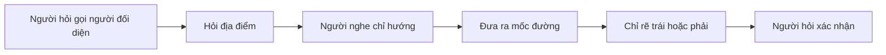

# 011 - Getting Japanese Directions

**Học phần:** Japanese Listening Comprehension for Beginners
**Chủ đề:** Hỏi và nghe chỉ đường bằng tiếng Nhật
**Loại bài:** lesson
**Định dạng:** Video lesson
**Thời lượng:** 01:58
**Preview:** Yes

---

## 1. Tóm tắt

Khi hỏi đường ở Nhật Bản, người học không chỉ cần biết cách hỏi một địa điểm ở đâu mà còn phải nghe được những từ chỉ **hướng**, **mốc đường** và **thứ tự di chuyển**.

Một câu trả lời chỉ đường thường chứa những thông tin như:

```text
Đi thẳng
   ↓
Đến giao lộ hoặc đèn giao thông
   ↓
Rẽ trái / rẽ phải
   ↓
Đi thêm một đoạn
   ↓
Xác định địa điểm cần tìm
```

Trong bài nghe, không cần dịch chính xác mọi từ. Hãy tập trung vào các tín hiệu như `まっすぐ`, `右`, `左`, `交差点`, `信号` và tên địa điểm.

## 2. Mục tiêu học tập

Sau khi hoàn thành bài học, người học có thể:

* Hỏi vị trí của một địa điểm bằng mẫu `～はどこですか`.
* Nhận diện được các hướng cơ bản `右`, `左` và `まっすぐ`.
* Hiểu các động từ thường dùng khi chỉ đường như `行きます` và `曲がります`.
* Xác định được thứ tự các bước trong một lời chỉ đường ngắn.
* Sử dụng mốc như giao lộ hoặc đèn giao thông để hiểu tuyến đường.
* Phản hồi và xác nhận lại hướng đi khi chưa nghe rõ.
* Tóm tắt được tuyến đường bằng tiếng Việt sau khi nghe hội thoại.

## 3. Bối cảnh giao tiếp

Một tình huống hỏi đường thường có hai vai:

* người đang tìm một địa điểm;
* người cung cấp chỉ dẫn.

Người hỏi có thể đang tìm:

* nhà ga;
* cửa hàng;
* khách sạn;
* ngân hàng;
* bưu điện;
* đồn cảnh sát;
* nhà hàng.

Một hội thoại cơ bản thường diễn ra theo luồng:



Khi nghe, điều quan trọng là tái tạo được **đường đi**, không phải ghi nhớ từng câu nguyên văn.

## 4. Từ vựng chỉ hướng quan trọng

| Tiếng Nhật | Cách đọc        | Nghĩa          |
| ---------- | --------------- | -------------- |
| 右          | みぎ / migi       | bên phải       |
| 左          | ひだり / hidari    | bên trái       |
| まっすぐ       | massugu         | thẳng          |
| 前          | まえ / mae        | phía trước     |
| 後ろ         | うしろ / ushiro    | phía sau       |
| 隣          | となり / tonari    | bên cạnh       |
| 近く         | ちかく / chikaku   | gần            |
| 道          | みち / michi      | đường          |
| 角          | かど / kado       | góc đường      |
| 交差点        | こうさてん / kōsaten | giao lộ        |
| 信号         | しんごう / shingō   | đèn giao thông |

Ba từ cần phản xạ nhanh nhất là:

```text
まっすぐ → đi thẳng
右       → phải
左       → trái
```

Nếu bỏ lỡ một số từ khác nhưng nghe chính xác ba tín hiệu này, người học vẫn có thể hiểu phần lớn tuyến đường đơn giản.

## 5. Hỏi vị trí của một địa điểm

Mẫu cơ bản:

```text
Địa điểm + は + どこですか。
```

Ví dụ:

**すみません、駅はどこですか。**
*Sumimasen, eki wa doko desu ka.*
Xin lỗi, nhà ga ở đâu?

Trong đó:

* `すみません` dùng để mở đầu lịch sự;
* `駅` là nhà ga;
* `は` đánh dấu chủ đề;
* `どこ` nghĩa là ở đâu;
* `ですか` tạo câu hỏi lịch sự.

Có thể thay `駅` bằng địa điểm khác:

**銀行はどこですか。**
*Ginkō wa doko desu ka.*
Ngân hàng ở đâu?

**ホテルはどこですか。**
*Hoteru wa doko desu ka.*
Khách sạn ở đâu?

## 6. Những động từ quan trọng khi chỉ đường

### 6.1. `行きます` và `曲がります`

**行きます（いきます / ikimasu）** nghĩa là đi.

Ví dụ:

**まっすぐ行きます。**
*Massugu ikimasu.*
Đi thẳng.

**曲がります（まがります / magarimasu）** nghĩa là rẽ.

Ví dụ:

**右に曲がります。**
*Migi ni magarimasu.*
Rẽ phải.

**左に曲がります。**
*Hidari ni magarimasu.*
Rẽ trái.

Mẫu cần ghi nhớ:

```text
右 + に + 曲がります
左 + に + 曲がります
```

### 6.2. `あります` và vị trí địa điểm

`あります` được dùng để nói về sự tồn tại hoặc vị trí của đồ vật, địa điểm và những thứ không phải người hoặc động vật.

Ví dụ:

**駅は右にあります。**
*Eki wa migi ni arimasu.*
Nhà ga ở bên phải.

**銀行は駅の隣にあります。**
*Ginkō wa eki no tonari ni arimasu.*
Ngân hàng ở bên cạnh nhà ga.

Trong bài nghe, `あります` thường xuất hiện gần phần cuối của lời chỉ đường, khi người nói mô tả vị trí đích.

## 7. Nghe chỉ dẫn theo thứ tự

Một chỉ dẫn thực tế thường chứa nhiều hành động liên tiếp.

Ví dụ:

**まっすぐ行って、信号を右に曲がってください。**
*Massugu itte, shingō o migi ni magatte kudasai.*
Hãy đi thẳng rồi rẽ phải tại đèn giao thông.

Thay vì cố phân tích toàn bộ ngữ pháp ngay khi nghe, hãy rút gọn thành:

```text
まっすぐ
   ↓
信号
   ↓
右
```

Tức là:

```text
Đi thẳng
   ↓
Đến đèn giao thông
   ↓
Rẽ phải
```

Đây là cách ghi nhớ hiệu quả hơn trong bài nghe chỉ đường.

## 8. Các mốc thường xuất hiện trong lời chỉ đường

Đường đi thường được mô tả dựa trên một mốc dễ nhìn thấy.

| Từ     | Nghĩa             |
| ------ | ----------------- |
| `信号`   | đèn giao thông    |
| `交差点`  | giao lộ           |
| `角`    | góc đường         |
| `駅`    | nhà ga            |
| `コンビニ` | cửa hàng tiện lợi |
| `銀行`   | ngân hàng         |
| `ホテル`  | khách sạn         |

Ví dụ:

**次の交差点を左に曲がってください。**
*Tsugi no kōsaten o hidari ni magatte kudasai.*
Hãy rẽ trái ở giao lộ tiếp theo.

Trong câu này, hai thông tin quan trọng nhất là:

```text
交差点 → giao lộ
左     → trái
```

Nếu câu hỏi yêu cầu chọn tuyến đường đúng, hai từ này có thể đủ để loại các đáp án sai.

## 9. Cách xác nhận khi nghe chưa rõ

### 9.1. Yêu cầu nhắc lại

Nếu không nghe rõ, có thể nói:

**すみません、もう一度お願いします。**
*Sumimasen, mō ichido onegaishimasu.*
Xin lỗi, vui lòng nói lại một lần nữa.

`もう一度` nghĩa là một lần nữa.

Đây là mẫu câu rất hữu ích khi người đối diện nói quá nhanh.

### 9.2. Xác nhận hướng đi

Nếu muốn kiểm tra xem mình đã nghe đúng hay chưa:

**右ですか。**
*Migi desu ka.*
Bên phải phải không?

Hoặc:

**左ですか。**
*Hidari desu ka.*
Bên trái phải không?

Một câu xác nhận ngắn như vậy thường tự nhiên hơn việc cố lặp lại toàn bộ lời chỉ đường.

## 10. Hội thoại mẫu

**A:** すみません、駅はどこですか。
*Sumimasen, eki wa doko desu ka.*
Xin lỗi, nhà ga ở đâu?

**B:** この道をまっすぐ行ってください。
*Kono michi o massugu itte kudasai.*
Hãy đi thẳng theo con đường này.

**B:** 次の信号を左に曲がってください。
*Tsugi no shingō o hidari ni magatte kudasai.*
Hãy rẽ trái ở đèn giao thông tiếp theo.

**A:** 左ですか。
*Hidari desu ka.*
Bên trái phải không?

**B:** はい。駅はすぐそこです。
*Hai. Eki wa sugu soko desu.*
Vâng. Nhà ga ở ngay gần đó.

Không cần ghi nhớ toàn bộ hội thoại. Hãy rút ra chuỗi chính:

```text
駅
 ↓
まっすぐ
 ↓
信号
 ↓
左
 ↓
到着
```

Tức là:

> Tìm nhà ga → đi thẳng → đến đèn giao thông → rẽ trái → đến gần nhà ga.

## 11. Chiến lược làm bài nghe chỉ đường

### 11.1. Trước khi nghe

Quan sát hình và xác định:

* điểm xuất phát;
* địa điểm cần tìm;
* các giao lộ;
* các mốc dễ nhận diện;
* những tuyến đường có thể đi.

Nếu câu hỏi có bản đồ, hãy chuẩn bị theo dõi tuyến đường ngay từ đầu.

### 11.2. Trong khi nghe

Không ghi lại cả câu. Chỉ giữ các từ chỉ hành động và mốc.

Ví dụ nghe được:

```text
まっすぐ
二つ目
交差点
右
```

hãy chuyển ngay thành:

```text
Đi thẳng
→ giao lộ thứ hai
→ rẽ phải
```

Nếu nghe:

```text
左
```

thì đừng giữ trong đầu dưới dạng từ tiếng Nhật quá lâu. Hãy hình dung ngay **một cú rẽ sang trái**.

Điều này biến việc nghe ngôn ngữ thành việc theo dõi không gian.

## 12. Những điểm dễ nhầm

**Hiện tượng:** Nhầm `右` và `左`.

**Nguyên nhân:** Người học cố dịch từ trong đầu thay vì tạo phản xạ trực tiếp.

**Cách xử lý:** Khi luyện, vừa đọc `右` vừa chỉ tay sang phải, vừa đọc `左` vừa chỉ tay sang trái.

---

**Hiện tượng:** Nghe đúng hướng nhưng rẽ tại sai vị trí.

**Nguyên nhân:** Chỉ tập trung vào `右` hoặc `左` mà bỏ qua mốc.

**Cách xử lý:** Luôn ghép thành cặp:

```text
信号 + 右
交差点 + 左
```

Không ghi nhớ hướng rẽ riêng lẻ.

---

**Hiện tượng:** Bỏ lỡ phần còn lại vì không hiểu một từ.

**Nguyên nhân:** Dừng lại để dịch.

**Cách xử lý:** Tiếp tục nghe và ưu tiên các từ thuộc ba nhóm:

```text
Hành động
+
Mốc
+
Hướng
```

## 13. Bài thực hành

### 13.1. Nhận diện hướng

Hãy nói nghĩa tiếng Việt ngay khi nhìn thấy:

1. `右`
2. `左`
3. `まっすぐ`
4. `右に曲がります`
5. `左に曲がります`

Mục tiêu là phản xạ mà không cần dịch từng thành phần.

### 13.2. Tạo lời chỉ đường

Dùng các thành phần:

```text
まっすぐ
信号
交差点
右
左
```

để tạo ít nhất ba chỉ dẫn khác nhau.

Ví dụ:

**まっすぐ行って、信号を右に曲がってください。**
Hãy đi thẳng rồi rẽ phải ở đèn giao thông.

Sau đó đổi:

* `右` thành `左`;
* `信号` thành `交差点`;
* địa điểm đích thành `駅`, `銀行` hoặc `ホテル`.

## 14. Câu hỏi tự kiểm tra

1. `まっすぐ` thể hiện hướng di chuyển nào?
2. `右に曲がります` có nghĩa là gì?
3. `交差点` và `信号` có vai trò gì trong lời chỉ đường?
4. Vì sao không nên chỉ nghe `右` hoặc `左` mà bỏ qua mốc đường?
5. Bạn sẽ nói gì khi muốn người đối diện nhắc lại lời chỉ đường?
6. Nếu nghe được `まっすぐ → 信号 → 左`, bạn sẽ di chuyển như thế nào?

## 15. Checklist hoàn thành

* [ ] Hỏi được `駅はどこですか`.
* [ ] Nhận diện ngay `右` và `左`.
* [ ] Hiểu được `まっすぐ`.
* [ ] Hiểu cách dùng `曲がります`.
* [ ] Nhận diện được `信号` và `交差点`.
* [ ] Theo dõi được thứ tự các bước trong một lời chỉ đường ngắn.
* [ ] Ghép được mốc đường với hướng rẽ tương ứng.
* [ ] Biết yêu cầu người đối diện nói lại.
* [ ] Biết xác nhận bằng `右ですか` hoặc `左ですか`.
* [ ] Tạo được ít nhất ba câu chỉ đường mới.
* [ ] Tóm tắt được một tuyến đường ngắn bằng tiếng Việt.

## 16. Tổng kết

Để nghe hiểu chỉ đường bằng tiếng Nhật, người học cần tập trung vào ba loại thông tin:

```text
Hành động
+
Mốc đường
+
Hướng
```

Ví dụ:

```text
まっすぐ
   ↓
信号
   ↓
右
```

có thể được hiểu nhanh là:

> Đi thẳng đến đèn giao thông rồi rẽ phải.

Các từ `右`, `左`, `まっすぐ`, `交差点` và `信号` cần được luyện đến mức tạo ra phản xạ trực tiếp. Khi nghe, hãy chuyển lời nói thành một tuyến đường trong đầu thay vì cố dịch toàn bộ câu sang tiếng Việt.

Kỹ năng cốt lõi là:

```text
Nghe hành động
      ↓
Xác định mốc
      ↓
Nhận diện hướng
      ↓
Theo dõi trên bản đồ hoặc trong đầu
      ↓
Xác nhận điểm đến
```

Khi làm được điều này, người học có thể hiểu những lời chỉ đường ngắn và xử lý tình huống hỏi đường thực tế bằng tiếng Nhật hiệu quả hơn.
