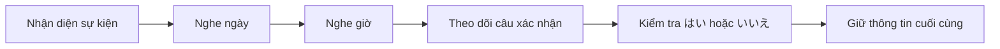

# 001 - Talking About Your Schedule in Japanese

**Học phần:** Japanese Listening Comprehension for Beginners
**Loại bài:** lesson
**Thời lượng:** 01:56
**Preview:** Yes

---

## 1. Tóm tắt

Bài học luyện kỹ năng nghe tiếng Nhật trong tình huống **trao đổi về lịch trình và kế hoạch cá nhân**. Trọng tâm là xác định ngày hoặc thời điểm, hoạt động đã lên lịch, nhận diện câu hỏi xác nhận và phản hồi tự nhiên khi thông tin đúng hoặc cần sửa lại.

Khi nghe một cuộc hội thoại về lịch trình, hãy tập trung vào ba thành phần:

```text
Khi nào?
+
Có hoạt động gì?
+
Thông tin có đúng không?
```

Ví dụ:

```text
火曜日
+
会議
+
あります
```

có thể giúp người nghe suy ra:

> Có một cuộc họp vào thứ Ba.

Người học không cần hiểu từng từ để nắm được ý chính. Điều quan trọng là nhận diện đúng **mốc thời gian**, **hoạt động** và **phản hồi xác nhận**.

---

## 2. Mục tiêu học tập

Sau khi hoàn thành bài này, người học có thể:

* Nhận diện được một hội thoại liên quan đến lịch trình.
* Nghe và xác định được ngày, thời gian hoặc hoạt động chính.
* Hiểu các từ chỉ ngày trong tuần thường gặp.
* Sử dụng `予定` để nói về kế hoạch hoặc lịch trình.
* Hiểu cách dùng `あります` khi nói về sự kiện hoặc cuộc hẹn.
* Nhận diện câu hỏi xác nhận như `〜ですね` và `〜ですか`.
* Phản hồi bằng `はい、そうです` khi thông tin đúng.
* Sửa lại ngày hoặc thời gian khi thông tin chưa chính xác.
* Tóm tắt được lịch trình đơn giản từ một đoạn hội thoại ngắn.

---

## 3. Bối cảnh giao tiếp

Trao đổi về lịch trình xuất hiện thường xuyên trong:

* công việc;
* trường học;
* cuộc hẹn;
* kế hoạch gặp bạn bè;
* sự kiện;
* hoạt động cá nhân.

Một cuộc hội thoại có thể diễn ra theo luồng:

```text
Hỏi lịch trình
      ↓
Nêu ngày hoặc thời gian
      ↓
Nêu hoạt động
      ↓
Người nghe xác nhận
      ↓
Xác nhận đúng hoặc sửa thông tin
```

Ví dụ:

```text
A: 火曜日は予定がありますか。

B: はい、会議があります。
```

> **A:** Thứ Ba bạn có lịch gì không?
> **B:** Có, tôi có một cuộc họp.

---

## 4. Từ vựng trọng tâm

| Tiếng Nhật | Cách đọc        | Nghĩa                   |
| ---------- | --------------- | ----------------------- |
| 予定         | よてい / yotei     | kế hoạch, lịch trình    |
| スケジュール     | sukejūru        | lịch, schedule          |
| 会議         | かいぎ / kaigi     | cuộc họp                |
| 仕事         | しごと / shigoto   | công việc               |
| 約束         | やくそく / yakusoku | cuộc hẹn, lời hẹn       |
| 授業         | じゅぎょう / jugyō   | tiết học, buổi học      |
| あります       | arimasu         | có, tồn tại             |
| 今日         | きょう / kyō       | hôm nay                 |
| 明日         | あした / ashita    | ngày mai                |
| 今週         | こんしゅう / konshū  | tuần này                |
| 来週         | らいしゅう / raishū  | tuần sau                |
| 午前         | ごぜん / gozen     | buổi sáng, trước 12 giờ |
| 午後         | ごご / gogo       | buổi chiều, sau 12 giờ  |
| 何時         | なんじ / nanji     | mấy giờ                 |
| いつ         | itsu            | khi nào                 |

Trong bài nghe về lịch trình, những từ chỉ **thời gian** thường quan trọng ngang với động từ.

Ví dụ:

```text
来週
↓
tuần sau
```

```text
午後
↓
buổi chiều
```

```text
三時
↓
3 giờ
```

---

## 5. Các ngày trong tuần

| Tiếng Nhật | Cách đọc          | Nghĩa    |
| ---------- | ----------------- | -------- |
| 月曜日        | げつようび / getsuyōbi | thứ Hai  |
| 火曜日        | かようび / kayōbi     | thứ Ba   |
| 水曜日        | すいようび / suiyōbi   | thứ Tư   |
| 木曜日        | もくようび / mokuyōbi  | thứ Năm  |
| 金曜日        | きんようび / kin'yōbi  | thứ Sáu  |
| 土曜日        | どようび / doyōbi     | thứ Bảy  |
| 日曜日        | にちようび / nichiyōbi | Chủ nhật |

Tất cả đều kết thúc bằng:

```text
曜日
ようび
yōbi
```

nghĩa là:

> ngày trong tuần.

Khi nghe một từ kết thúc bằng `ようび`, hãy kiểm tra xem câu hỏi có đang yêu cầu xác định **ngày nào** hay không.

---

## 6. Hỏi về lịch trình

Một mẫu đơn giản:

```text
予定がありますか。
Yotei ga arimasu ka.
```

> Bạn có kế hoạch/lịch gì không?

Có thể thêm ngày:

```text
火曜日は予定がありますか。
Kayōbi wa yotei ga arimasu ka.
```

> Thứ Ba bạn có lịch gì không?

Cấu trúc:

```text
[thời gian] + は + 予定がありますか
```

Ví dụ:

```text
明日は予定がありますか。
Ashita wa yotei ga arimasu ka.
```

> Ngày mai bạn có kế hoạch gì không?

Người nghe cần ưu tiên nhận diện phần đứng đầu câu:

```text
明日
```

vì nó xác định **thời điểm đang được hỏi**.

---

## 7. Nói rằng có một hoạt động trong lịch

`あります` được dùng để nói một sự kiện, cuộc họp hoặc lịch hẹn **có tồn tại**.

Ví dụ:

```text
会議があります。
Kaigi ga arimasu.
```

> Có một cuộc họp.

```text
授業があります。
Jugyō ga arimasu.
```

> Có buổi học.

```text
約束があります。
Yakusoku ga arimasu.
```

> Tôi có một cuộc hẹn.

Có thể thêm ngày:

```text
月曜日に会議があります。
Getsuyōbi ni kaigi ga arimasu.
```

> Tôi có cuộc họp vào thứ Hai.

Cấu trúc:

```text
[thời gian] + に + [sự kiện] + があります
```

Trong đó `に` có thể đánh dấu thời điểm một sự kiện diễn ra.

---

## 8. Hỏi giờ

Khi cần xác định giờ của một hoạt động:

```text
何時ですか。
Nanji desu ka.
```

> Mấy giờ?

Hoặc:

```text
会議は何時ですか。
Kaigi wa nanji desu ka.
```

> Cuộc họp lúc mấy giờ?

Ví dụ trả lời:

```text
三時です。
Sanji desu.
```

> 3 giờ.

Có thể thêm `午後`:

```text
午後三時です。
Gogo sanji desu.
```

> 3 giờ chiều.

Khi nghe:

```text
何時
```

hãy chuẩn bị tìm:

```text
Con số
+
時
```

Ví dụ:

```text
十時
```

> 10 giờ.

---

## 9. Hỏi thời điểm bằng `いつ`

`いつ` được dùng khi câu hỏi rộng hơn một giờ cụ thể.

```text
会議はいつですか。
Kaigi wa itsu desu ka.
```

> Cuộc họp diễn ra khi nào?

Câu trả lời có thể là:

```text
火曜日です。
```

> Thứ Ba.

Hoặc:

```text
来週です。
```

> Tuần sau.

Phân biệt:

| Từ để hỏi | Thông tin cần tìm   |
| --------- | ------------------- |
| `いつ`      | thời điểm nói chung |
| `何曜日`     | ngày nào trong tuần |
| `何時`      | mấy giờ             |

Đây là một kỹ năng nghe quan trọng: **từ để hỏi cho biết loại đáp án cần tìm**.

---

## 10. Hỏi ngày trong tuần

Để hỏi một sự kiện diễn ra vào thứ mấy:

```text
何曜日ですか。
Nan'yōbi desu ka.
```

> Thứ mấy?

Ví dụ:

```text
会議は何曜日ですか。
Kaigi wa nan'yōbi desu ka.
```

> Cuộc họp vào thứ mấy?

Câu trả lời:

```text
水曜日です。
Suiyōbi desu.
```

> Thứ Tư.

Khi nghe câu hỏi có `何曜日`, không cần tập trung vào giờ hoặc hoạt động khác. Mục tiêu chính là tìm một từ kết thúc bằng:

```text
〜曜日
```

---

## 11. Xác nhận lịch trình

Trong giao tiếp, người nghe thường lặp lại thông tin để kiểm tra mình đã nghe đúng.

Ví dụ:

```text
火曜日ですね。
Kayōbi desu ne.
```

> Thứ Ba phải không?

Hoặc:

```text
三時ですね。
Sanji desu ne.
```

> 3 giờ phải không?

`ね` ở cuối câu có thể tạo sắc thái:

> Đúng là ... nhỉ? / ... phải không?

Nếu thông tin đúng:

```text
はい、そうです。
Hai, sō desu.
```

> Vâng, đúng rồi.

Đây là tín hiệu quan trọng trong bài nghe:

```text
Thông tin
↓
ですね
↓
はい、そうです
↓
Thông tin được xác nhận
```

---

## 12. Sửa thông tin khi xác nhận sai

Nếu người nghe xác nhận sai:

```text
A: 火曜日ですね。

B: いいえ、水曜日です。
```

> **A:** Thứ Ba phải không?
> **B:** Không, là thứ Tư.

Luồng thông tin:

```text
火曜日
↓
いいえ
↓
Loại bỏ

水曜日
↓
Thông tin chính xác
```

Khi gặp dạng hội thoại này, không nên chọn ngay ngày đầu tiên được nghe thấy.

Hãy tiếp tục theo dõi:

```text
はい
hay
いいえ
```

để biết thông tin đó được giữ lại hay sửa đổi.

---

## 13. Hội thoại mẫu

Đọc đoạn hội thoại:

```text
A: 来週、会議がありますか。

B: はい、あります。

A: 火曜日ですか。

B: いいえ、水曜日です。

A: 水曜日の午後三時ですね。

B: はい、そうです。
```

Nghĩa:

> **A:** Tuần sau có cuộc họp phải không?
> **B:** Vâng, có.
> **A:** Thứ Ba phải không?
> **B:** Không, thứ Tư.
> **A:** Thứ Tư lúc 3 giờ chiều phải không?
> **B:** Vâng, đúng rồi.

Thông tin cuối cùng:

```text
Sự kiện
↓
会議

Ngày
↓
水曜日

Thời gian
↓
午後三時
```

Điểm cần chú ý là `火曜日` xuất hiện trong hội thoại nhưng **không phải thông tin cuối cùng**, vì nó bị phủ định bằng `いいえ`.

---

## 14. Chiến lược nghe lịch trình

Hãy sử dụng quy trình:



Khi nghe, có thể ghi nhanh:

```text
Sự kiện: ?
Ngày: ?
Giờ: ?
```

Sau mỗi câu xác nhận, cập nhật thông tin nếu cần.

Ví dụ:

```text
Ngày: 火曜日
```

sau đó nghe:

```text
いいえ、水曜日です。
```

hãy sửa thành:

```text
Ngày: 水曜日
```

Không giữ cả hai ngày như hai đáp án ngang nhau.

---

## 15. Bài luyện nghe hiểu

Đọc hội thoại một lần:

```text
A: 明日は予定がありますか。

B: はい、会議があります。

A: 午前十時ですか。

B: いいえ、午後二時です。

A: 午後二時ですね。

B: はい。
```

Che đoạn hội thoại và trả lời:

1. Cuộc hội thoại đang nói về ngày nào?
2. Người B có hoạt động gì?
3. `午前十時` có phải thời gian chính xác không?
4. Hoạt động thực sự diễn ra lúc mấy giờ?
5. Từ nào cho biết thời gian đầu tiên không đúng?
6. Câu cuối cùng xác nhận thông tin nào?

Thông tin cuối cùng cần giữ là:

```text
明日
+
会議
+
午後二時
```

---

## 16. Chọn đáp án đúng

1. `予定` có nghĩa là:

   * A. Địa điểm.
   * B. Kế hoạch hoặc lịch trình.
   * C. Giá tiền.
   * D. Phương tiện.

2. `何時ですか` dùng để hỏi:

   * A. thứ mấy;
   * B. ở đâu;
   * C. mấy giờ;
   * D. làm gì.

3. `何曜日ですか` dùng để hỏi:

   * A. ngày nào trong tuần;
   * B. thời gian theo giờ;
   * C. giá tiền;
   * D. người tham gia.

4. Trong hội thoại:

```text
A: 月曜日ですか。
B: いいえ、火曜日です。
```

ngày chính xác là:

* A. Thứ Hai.
* B. Thứ Ba.
* C. Cả thứ Hai và thứ Ba.
* D. Không xác định.

5. Nếu nghe:

```text
三時ですね。
はい、そうです。
```

có thể kết luận:

* A. 3 giờ bị phủ định.
* B. 3 giờ được xác nhận.
* C. Chưa biết thời gian.
* D. Người nói đang hỏi địa điểm.

---

## 17. Phân biệt các câu hỏi về thời gian

| Mẫu câu     | Mục tiêu                       |
| ----------- | ------------------------------ |
| `いつですか。`    | hỏi thời điểm nói chung        |
| `何曜日ですか。`   | hỏi thứ mấy                    |
| `何時ですか。`    | hỏi mấy giờ                    |
| `予定がありますか。` | hỏi có lịch/kế hoạch hay không |

Ví dụ:

```text
会議はいつですか。
```

có thể được trả lời bằng:

```text
来週です。
```

Trong khi:

```text
会議は何時ですか。
```

cần một câu trả lời như:

```text
三時です。
```

Việc phân biệt loại câu hỏi giúp người nghe bỏ qua những thông tin không cần thiết.

---

## 18. Tạo lịch trình cá nhân

Hãy tự chọn:

* một ngày;
* một hoạt động;
* một giờ.

Sau đó tạo câu:

```text
[ngày] に [hoạt động] があります。
```

Ví dụ:

```text
金曜日に会議があります。
```

Tiếp tục thêm thời gian:

```text
金曜日の午後三時に会議があります。
```

> Tôi có cuộc họp lúc 3 giờ chiều thứ Sáu.

Tạo ít nhất ba câu mới với:

* các ngày khác nhau;
* các giờ khác nhau;
* các hoạt động khác nhau.

---

## 19. Tạo hội thoại xác nhận

Xây dựng một hội thoại theo luồng:

```text
A → hỏi lịch trình
B → nêu hoạt động
A → xác nhận ngày
B → sửa ngày nếu cần
A → xác nhận giờ
B → xác nhận cuối cùng
```

Hội thoại phải có:

* một ngày trong tuần;
* một sự kiện;
* một thời gian;
* ít nhất một câu `〜ですか` hoặc `〜ですね`;
* một phản hồi `はい`;
* một phản hồi `いいえ`;
* một lần sửa thông tin.

Không sao chép nguyên hội thoại mẫu.

---

## 20. Lỗi thường gặp

**Hiện tượng:** Chọn ngày đầu tiên nghe được.
**Nguyên nhân:** Không theo dõi câu phủ định sau đó.
**Cách xử lý:** Nếu xuất hiện `いいえ`, hãy kiểm tra thông tin sửa lại ngay sau đó.

**Hiện tượng:** Nhầm `何曜日` với `何時`.
**Nguyên nhân:** Cả hai đều liên quan đến thời gian.
**Cách xử lý:** Ghi nhớ:

```text
曜日
↓
ngày trong tuần

時
↓
giờ
```

**Hiện tượng:** Nghe được giờ nhưng bỏ qua `午前` hoặc `午後`.
**Nguyên nhân:** Chỉ tập trung vào con số.
**Cách xử lý:** Luôn nghe cả cụm thời gian:

```text
午前 + giờ
hoặc
午後 + giờ
```

**Hiện tượng:** Cố nhớ tất cả các mốc thời gian xuất hiện.
**Nguyên nhân:** Không phân biệt thông tin thử xác nhận và thông tin cuối cùng.
**Cách xử lý:** Chỉ giữ lại dữ kiện cuối cùng đã được xác nhận.

---

## 21. Thực hành

Thực hiện các nhiệm vụ sau:

1. Đọc toàn bộ bảy ngày trong tuần theo thứ tự.

2. Tự nói ba giờ khác nhau theo cấu trúc:

```text
[con số] + 時
```

3. Tạo ba câu với `予定があります`.

4. Tạo hai câu hỏi bằng `何時ですか`.

5. Tạo hai câu hỏi bằng `何曜日ですか`.

6. Viết một hội thoại có một lần xác nhận sai rồi sửa lại.

7. Đọc hội thoại thành tiếng ba lần.

8. Che nội dung và nói lại mà không nhìn mẫu.

9. Tóm tắt lịch trình của nhân vật bằng một câu tiếng Việt.

---

## 22. Câu hỏi tự kiểm tra

1. `予定` có nghĩa là gì?
2. `会議があります` diễn đạt điều gì?
3. `いつ` hỏi loại thông tin nào?
4. `何曜日` hỏi loại thông tin nào?
5. `何時` hỏi loại thông tin nào?
6. `〜ですね` thường có chức năng gì trong hội thoại?
7. Khi nghe `いいえ` sau một ngày hoặc giờ, bạn nên làm gì với thông tin trước đó?
8. `はい、そうです` cho biết điều gì?
9. Trong `午後三時`, đâu là thông tin buổi và đâu là giờ?
10. Hãy tự tạo một câu mô tả lịch trình có ngày, giờ và hoạt động.

---

## 23. Checklist hoàn thành

* [ ] Nhận diện được chủ đề trao đổi về lịch trình.
* [ ] Nhớ được các ngày trong tuần cơ bản.
* [ ] Hiểu được `予定`.
* [ ] Hiểu được `あります` khi nói về sự kiện hoặc lịch hẹn.
* [ ] Phân biệt được `いつ`, `何曜日` và `何時`.
* [ ] Nhận diện được `午前` và `午後`.
* [ ] Hiểu chức năng xác nhận của `〜ですね`.
* [ ] Nhận diện được `はい、そうです`.
* [ ] Nhận diện được `いいえ` và thông tin sửa lại phía sau.
* [ ] Xác định được ngày cuối cùng đã được xác nhận.
* [ ] Xác định được giờ cuối cùng đã được xác nhận.
* [ ] Tạo được ít nhất ba câu về lịch trình.
* [ ] Tạo được một hội thoại có hỏi, xác nhận và sửa thông tin.
* [ ] Tóm tắt được lịch trình mà không cần dịch từng từ.

---

## 24. Tổng kết

Khi nghe một hội thoại về lịch trình, hãy tổ chức thông tin theo ba trường:

```text
Ngày
+
Giờ
+
Hoạt động
```

Đồng thời phải theo dõi các tín hiệu xác nhận:

```text
はい、そうです
↓
Thông tin đúng

いいえ
↓
Thông tin trước chưa đúng
↓
Nghe tiếp thông tin sửa lại
```

Các mẫu câu cần ghi nhớ:

```text
予定がありますか。
↓
Có lịch/kế hoạch không?

何曜日ですか。
↓
Thứ mấy?

何時ですか。
↓
Mấy giờ?

〜ですね。
↓
... phải không?
```

Trong các bài nghe về lịch trình, **dữ kiện xuất hiện đầu tiên chưa chắc là đáp án cuối cùng**. Hãy theo dõi toàn bộ quá trình hỏi, xác nhận và sửa thông tin để xác định chính xác lịch trình được thống nhất.
