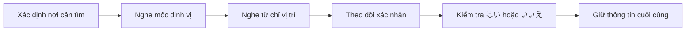

# 001 - Finding A Friend's Apartment in Japan

**Học phần:** Japanese Listening Comprehension for Beginners
**Loại bài:** lesson
**Thời lượng:** 02:03
**Preview:** Yes

---

## 1. Tóm tắt

Bài học luyện kỹ năng nghe tiếng Nhật trong tình huống **tìm căn hộ của một người bạn**. Trọng tâm là nhận diện địa điểm, hiểu các chỉ dẫn vị trí cơ bản, xác nhận mình đang ở đúng nơi và phản hồi tự nhiên khi cần hỏi lại.

Trong những hội thoại dạng này, người nghe nên tập trung vào ba nhóm thông tin:

```text
Địa điểm cần tìm
+
Mốc định vị
+
Quan hệ vị trí
```

Ví dụ:

```text
アパート
+
コンビニ
+
となり
```

có thể giúp suy ra:

> Căn hộ nằm cạnh cửa hàng tiện lợi.

Mục tiêu không phải dịch được toàn bộ hội thoại mà là xác định chính xác **địa điểm nào**, **nằm ở đâu** và **người nói có xác nhận vị trí đó hay không**.

---

## 2. Mục tiêu học tập

Sau khi hoàn thành bài này, người học có thể:

* Nhận diện được hội thoại liên quan đến việc tìm nhà hoặc căn hộ.
* Hiểu câu hỏi `どこですか` khi hỏi vị trí.
* Nhận diện các từ chỉ vị trí như `となり`, `まえ`, `うしろ`, `みぎ`, `ひだり`.
* Hiểu cách sử dụng các địa điểm làm mốc định vị.
* Nghe và xác định được căn hộ nằm cạnh, trước, sau hoặc gần một địa điểm nào đó.
* Nhận diện câu hỏi xác nhận như `ここですか` hoặc `このアパートですか`.
* Phản hồi bằng `はい、そうです` hoặc `いいえ`.
* Tóm tắt được chỉ dẫn vị trí bằng một câu tiếng Việt.

---

## 3. Bối cảnh giao tiếp

Khi đến thăm một người bạn lần đầu, người nói có thể đã đến đúng khu vực nhưng chưa biết chính xác căn hộ hoặc tòa nhà nào.

Một cuộc hội thoại thường diễn ra theo luồng:

```text
Đến khu vực gần nhà bạn
        ↓
Không xác định được căn hộ
        ↓
Hỏi vị trí
        ↓
Nhận một mốc định vị
        ↓
Tìm tòa nhà
        ↓
Xác nhận lại
```

Ví dụ:

```text
A: アパートはどこですか。

B: コンビニのとなりです。
```

> **A:** Căn hộ ở đâu?
> **B:** Nó ở cạnh cửa hàng tiện lợi.

Trong bài nghe, chỉ cần nhận diện được `アパート`, `コンビニ` và `となり` là đã có thể hiểu phần lớn thông tin quan trọng.

---

## 4. Từ vựng trọng tâm

| Tiếng Nhật | Cách đọc        | Nghĩa                         |
| ---------- | --------------- | ----------------------------- |
| アパート       | apāto           | căn hộ, khu căn hộ nhỏ        |
| マンション      | manshon         | chung cư/căn hộ trong tòa nhà |
| 家          | いえ / ie         | nhà                           |
| 建物         | たてもの / tatemono | tòa nhà                       |
| 入口         | いりぐち / iriguchi | lối vào                       |
| 駅          | えき / eki        | nhà ga                        |
| コンビニ       | konbini         | cửa hàng tiện lợi             |
| スーパー       | sūpā            | siêu thị                      |
| 銀行         | ぎんこう / ginkō    | ngân hàng                     |
| 公園         | こうえん / kōen     | công viên                     |
| どこ         | doko            | ở đâu                         |
| ここ         | koko            | ở đây                         |
| そこ         | soko            | ở đó                          |
| あそこ        | asoko           | đằng kia                      |

Các địa điểm như `駅`, `コンビニ`, `スーパー` hoặc `公園` thường được sử dụng làm **mốc định vị**.

---

## 5. Hỏi một địa điểm ở đâu

Mẫu cơ bản:

```text
アパートはどこですか。
Apāto wa doko desu ka.
```

> Căn hộ ở đâu?

Cấu trúc:

```text
[địa điểm] + は + どこですか
```

Ví dụ:

```text
駅はどこですか。
Eki wa doko desu ka.
```

> Nhà ga ở đâu?

```text
入口はどこですか。
Iriguchi wa doko desu ka.
```

> Lối vào ở đâu?

`どこ` là từ khóa quan trọng. Khi nghe thấy nó, hãy chuẩn bị tìm **thông tin về vị trí** trong câu trả lời.

---

## 6. Các từ chỉ vị trí

Một số từ rất thường gặp:

| Tiếng Nhật | Cách đọc | Nghĩa      |
| ---------- | -------- | ---------- |
| となり        | tonari   | bên cạnh   |
| まえ         | mae      | phía trước |
| うしろ        | ushiro   | phía sau   |
| みぎ         | migi     | bên phải   |
| ひだり        | hidari   | bên trái   |
| なか         | naka     | bên trong  |
| そと         | soto     | bên ngoài  |
| ちかく        | chikaku  | gần        |
| むかい        | mukai    | đối diện   |

Các từ này thường xuất hiện trong cấu trúc:

```text
[Mốc định vị] + の + [vị trí]
```

Ví dụ:

```text
コンビニのとなり
```

> cạnh cửa hàng tiện lợi

```text
駅のまえ
```

> trước nhà ga

```text
スーパーのうしろ
```

> phía sau siêu thị

---

## 7. Cấu trúc `A の B`

Khi mô tả vị trí, tiếng Nhật thường dùng:

```text
A の B
```

Trong đó:

* `A` là mốc tham chiếu;
* `B` là vị trí tương đối.

Ví dụ:

```text
コンビニのとなり
```

có thể hiểu:

```text
コンビニ
↓
cửa hàng tiện lợi

の
↓
liên kết

となり
↓
bên cạnh
```

Toàn bộ cụm có nghĩa:

> bên cạnh cửa hàng tiện lợi.

Một ví dụ khác:

```text
銀行のまえ
```

> phía trước ngân hàng.

Khi nghe, hãy xác định cả hai phần thay vì chỉ nghe từ chỉ vị trí.

---

## 8. Nói một địa điểm nằm ở đâu

Mẫu đơn giản:

```text
コンビニのとなりです。
Konbini no tonari desu.
```

> Nó ở cạnh cửa hàng tiện lợi.

Có thể nói đầy đủ hơn:

```text
アパートはコンビニのとなりです。
Apāto wa konbini no tonari desu.
```

> Căn hộ ở cạnh cửa hàng tiện lợi.

Ví dụ khác:

```text
アパートは公園のむかいです。
Apāto wa kōen no mukai desu.
```

> Căn hộ ở đối diện công viên.

```text
入口は建物のうしろです。
Iriguchi wa tatemono no ushiro desu.
```

> Lối vào ở phía sau tòa nhà.

---

## 9. Xác nhận mình đã tìm đúng nơi

Sau khi tìm thấy một tòa nhà, người nói có thể hỏi:

```text
ここですか。
Koko desu ka.
```

> Là ở đây phải không?

Hoặc cụ thể hơn:

```text
このアパートですか。
Kono apāto desu ka.
```

> Là căn hộ/tòa căn hộ này phải không?

Nếu đúng:

```text
はい、そうです。
Hai, sō desu.
```

> Vâng, đúng rồi.

Nếu chưa đúng:

```text
いいえ、違います。
Iie, chigaimasu.
```

> Không, không phải.

Sau `いいえ`, thông tin sửa lại thường rất quan trọng.

Ví dụ:

```text
A: このアパートですか。

B: いいえ、となりのアパートです。
```

> **A:** Là tòa căn hộ này phải không?
> **B:** Không, là tòa bên cạnh.

---

## 10. Sử dụng `ここ`, `そこ` và `あそこ`

Ba từ này đều chỉ nơi chốn nhưng khác nhau về khoảng cách.

| Từ    | Nghĩa cơ bản         |
| ----- | -------------------- |
| `ここ`  | ở đây, gần người nói |
| `そこ`  | ở đó, gần người nghe |
| `あそこ` | đằng kia, xa cả hai  |

Ví dụ:

```text
ここです。
```

> Ở đây.

```text
そこです。
```

> Ở đó.

```text
あそこです。
```

> Ở đằng kia.

Trong bài nghe có hình minh họa, hướng nhìn hoặc vị trí của người nói có thể giúp phân biệt những từ này.

---

## 11. Hỏi căn hộ của một người cụ thể

Khi muốn hỏi căn hộ của một người bạn, có thể dùng cấu trúc:

```text
[người] + の + アパート
```

Ví dụ:

```text
田中さんのアパート
Tanaka-san no apāto
```

> căn hộ của anh/chị Tanaka.

Câu hỏi:

```text
田中さんのアパートはどこですか。
Tanaka-san no apāto wa doko desu ka.
```

> Căn hộ của anh/chị Tanaka ở đâu?

Cấu trúc `A の B` ở đây thể hiện **quan hệ sở hữu**:

```text
田中さん
+
の
+
アパート
```

> căn hộ của Tanaka.

Trong khi ở:

```text
コンビニのとなり
```

`の` dùng để liên kết mốc định vị với vị trí.

Ý nghĩa cụ thể của `の` phụ thuộc vào hai thành phần mà nó nối.

---

## 12. Hội thoại mẫu

Đọc đoạn hội thoại:

```text
A: もしもし。今、駅の近くです。

B: そうですか。

A: アパートはどこですか。

B: コンビニのとなりです。

A: このアパートですか。

B: はい、そうです。
```

Nghĩa:

> **A:** A lô. Bây giờ tôi đang ở gần nhà ga.
> **B:** Vậy à.
> **A:** Căn hộ ở đâu?
> **B:** Nó ở cạnh cửa hàng tiện lợi.
> **A:** Là tòa căn hộ này phải không?
> **B:** Vâng, đúng rồi.

Thông tin chính:

```text
Vị trí hiện tại
↓
Gần nhà ga

Mốc định vị
↓
Cửa hàng tiện lợi

Quan hệ vị trí
↓
Bên cạnh

Xác nhận cuối cùng
↓
Đúng
```

Người nghe không nhất thiết phải nhớ toàn bộ hội thoại. Nếu câu hỏi là "Căn hộ nằm ở đâu?", thông tin quyết định là:

```text
コンビニのとなり
```

---

## 13. Theo dõi thông tin khi có phủ định

Đọc đoạn sau:

```text
A: 銀行のとなりですか。

B: いいえ、スーパーのとなりです。
```

Thông tin diễn biến:

```text
銀行のとなり
↓
いいえ
↓
Sai

スーパーのとなり
↓
Thông tin sửa lại
↓
Đúng
```

Nếu bài nghe hỏi vị trí cuối cùng, đáp án là:

> cạnh siêu thị.

Không nên chọn `銀行` chỉ vì đây là mốc địa điểm xuất hiện đầu tiên.

---

## 14. Chiến lược nghe chỉ dẫn vị trí

Có thể xử lý hội thoại bằng quy trình:



Khi nghe, hãy thử ghi theo mẫu:

```text
Nơi cần tìm: ?
Mốc: ?
Vị trí: ?
```

Ví dụ:

```text
Nơi cần tìm: アパート
Mốc: コンビニ
Vị trí: となり
```

Từ đó suy ra:

> Căn hộ nằm cạnh cửa hàng tiện lợi.

---

## 15. Bài luyện nghe hiểu

Đọc đoạn hội thoại một lần, sau đó che lại:

```text
A: アパートはどこですか。

B: 公園のむかいです。

A: この建物ですか。

B: いいえ、となりの建物です。

A: あそこですか。

B: はい、そうです。
```

Trả lời:

1. Người A đang tìm gì?
2. Mốc định vị ban đầu là địa điểm nào?
3. Căn hộ nằm ở vị trí nào so với công viên?
4. Tòa nhà đầu tiên có đúng không?
5. Từ nào cho biết lựa chọn đầu tiên sai?
6. Tòa nhà cuối cùng có được xác nhận không?

Thông tin quan trọng:

```text
公園
+
むかい
+
となりの建物
```

---

## 16. Chọn đáp án đúng

1. `どこですか` dùng để hỏi:

   * A. giá tiền;
   * B. thời gian;
   * C. vị trí;
   * D. người.

2. `となり` có nghĩa là:

   * A. bên cạnh;
   * B. phía sau;
   * C. bên trong;
   * D. bên trái.

3. `駅のまえ` có nghĩa là:

   * A. sau nhà ga;
   * B. trước nhà ga;
   * C. trong nhà ga;
   * D. bên trái nhà ga.

4. `公園のむかい` có nghĩa là:

   * A. trong công viên;
   * B. phía sau công viên;
   * C. đối diện công viên;
   * D. cạnh công viên.

5. Nếu nghe:

```text
この建物ですか。
いいえ、となりの建物です。
```

tòa nhà đúng là:

* A. tòa đang được chỉ ban đầu;
* B. tòa bên cạnh;
* C. tòa đối diện;
* D. không thể xác định.

---

## 17. Phân biệt các từ chỉ vị trí

Ghép từ với nghĩa phù hợp:

| Tiếng Nhật | Nghĩa |
| ---------- | ----- |
| `となり`      | ?     |
| `まえ`       | ?     |
| `うしろ`      | ?     |
| `みぎ`       | ?     |
| `ひだり`      | ?     |
| `むかい`      | ?     |
| `ちかく`      | ?     |

Sau đó tự tạo ít nhất ba cụm theo cấu trúc:

```text
[địa điểm] + の + [vị trí]
```

Ví dụ loại cấu trúc:

```text
駅の________
スーパーの________
公園の________
```

---

## 18. Sắp xếp câu

Sắp xếp các thành phần thành câu đúng.

1.

```text
どこですか / アパートは
```

2.

```text
です / コンビニの / となり
```

3.

```text
このアパート / ですか
```

4.

```text
そうです / はい
```

5.

```text
違います / いいえ
```

6.

```text
スーパーのとなりです / いいえ
```

Sau khi sắp xếp, hãy xác định câu nào:

* hỏi vị trí;
* mô tả vị trí;
* xác nhận;
* phủ định.

---

## 19. Tạo chỉ dẫn mới

Chọn:

* một nơi cần tìm;
* một mốc định vị;
* một quan hệ vị trí.

Ví dụ các mốc:

* `駅`;
* `コンビニ`;
* `スーパー`;
* `銀行`;
* `公園`.

Ví dụ các vị trí:

* `となり`;
* `まえ`;
* `うしろ`;
* `むかい`;
* `ちかく`.

Tạo câu theo cấu trúc:

```text
[Nơi cần tìm] は [mốc] の [vị trí] です。
```

Tạo ít nhất ba câu khác nhau.

---

## 20. Tạo hội thoại tìm căn hộ

Viết một hội thoại ít nhất sáu lượt nói theo luồng:

```text
A → hỏi căn hộ ở đâu
B → đưa ra mốc định vị
A → xác nhận một tòa nhà
B → phủ định
B → sửa lại vị trí
A → xác nhận lần nữa
B → đồng ý
```

Hội thoại phải có:

* `どこですか`;
* ít nhất một địa điểm làm mốc;
* ít nhất một từ chỉ vị trí;
* `いいえ`;
* `はい`;
* một câu hỏi xác nhận;
* một lần sửa thông tin.

Sau khi viết xong:

1. Đọc thành tiếng.
2. Che phần hội thoại.
3. Nói lại bằng trí nhớ.
4. Tóm tắt vị trí cuối cùng bằng một câu tiếng Việt.

---

## 21. Lỗi thường gặp

**Hiện tượng:** Nghe được tên một địa điểm nhưng chưa biết nó liên quan thế nào đến căn hộ.
**Nguyên nhân:** Chỉ nghe mốc mà bỏ qua từ chỉ vị trí.
**Cách xử lý:** Luôn nghe cả cụm:

```text
[Mốc] + の + [vị trí]
```

**Hiện tượng:** Nhầm `まえ` và `うしろ`.
**Nguyên nhân:** Chưa gắn từ vựng với hình ảnh không gian.
**Cách xử lý:** Ghi nhớ theo cặp:

```text
まえ
↔
うしろ

trước
↔
sau
```

**Hiện tượng:** Chọn tòa nhà đầu tiên được nhắc tới.
**Nguyên nhân:** Không theo dõi câu xác nhận.
**Cách xử lý:** Nếu nghe `いいえ`, hãy loại bỏ lựa chọn trước và nghe thông tin thay thế.

**Hiện tượng:** Nghe `はい` nhưng không biết đang xác nhận điều gì.
**Nguyên nhân:** Không giữ nội dung câu ngay trước đó trong trí nhớ.
**Cách xử lý:** Liên kết `はい` hoặc `そうです` với địa điểm vừa được người kia nhắc đến.

---

## 22. Thực hành

Thực hiện các nhiệm vụ sau:

1. Nói ba lần:

```text
アパートはどこですか。
```

2. Tạo ba câu với:

```text
〜のとなりです。
```

3. Tạo hai câu với:

```text
〜のまえです。
```

4. Tạo hai câu với:

```text
〜のむかいです。
```

5. Tạo một câu hỏi xác nhận bằng `ここですか`.

6. Tạo một câu phủ định và sửa vị trí.

7. Viết một đoạn hội thoại tìm căn hộ.

8. Đọc lại mà không nhìn bản dịch.

9. Tóm tắt vị trí cuối cùng bằng một câu tiếng Việt.

---

## 23. Câu hỏi tự kiểm tra

1. `どこ` dùng để hỏi loại thông tin nào?
2. `となり` có nghĩa là gì?
3. `むかい` có nghĩa là gì?
4. Trong `コンビニのとなり`, đâu là mốc định vị?
5. `ここですか` có chức năng giao tiếp gì?
6. `はい、そうです` cho biết điều gì?
7. Khi nghe `いいえ`, bạn nên làm gì với vị trí vừa được đề cập?
8. `ここ`, `そこ` và `あそこ` khác nhau về điểm nào?
9. Hãy tạo một câu mô tả căn hộ nằm cạnh siêu thị.
10. Hãy tự tạo một câu hỏi và một câu trả lời về vị trí.

---

## 24. Checklist hoàn thành

* [ ] Hiểu được `アパートはどこですか`.
* [ ] Nhận diện được `どこ` khi nghe câu hỏi về vị trí.
* [ ] Hiểu được `ここ`, `そこ` và `あそこ`.
* [ ] Nhận diện được `となり`, `まえ`, `うしろ` và `むかい`.
* [ ] Hiểu cấu trúc `[mốc] の [vị trí]`.
* [ ] Sử dụng được địa điểm như `駅`, `コンビニ`, `スーパー` và `公園` làm mốc.
* [ ] Nhận diện được câu hỏi xác nhận.
* [ ] Hiểu được `はい、そうです`.
* [ ] Theo dõi được thông tin sửa lại sau `いいえ`.
* [ ] Xác định được vị trí cuối cùng trong một hội thoại.
* [ ] Tạo được ít nhất ba câu mô tả vị trí.
* [ ] Tạo được một hội thoại ngắn về tìm căn hộ.
* [ ] Tóm tắt được chỉ dẫn bằng một câu tiếng Việt.

---

## 25. Tổng kết

Khi nghe một hội thoại về việc tìm căn hộ, hãy tập trung vào:

```text
Nơi cần tìm
+
Mốc định vị
+
Quan hệ vị trí
```

Các mẫu quan trọng:

```text
アパートはどこですか。
↓
Căn hộ ở đâu?

コンビニのとなりです。
↓
Ở cạnh cửa hàng tiện lợi.

ここですか。
↓
Là ở đây phải không?

はい、そうです。
↓
Vâng, đúng rồi.

いいえ、違います。
↓
Không, không phải.
```

Chiến lược nghe hiệu quả nhất là xác định **mốc địa điểm**, sau đó nghe **từ chỉ vị trí**, rồi tiếp tục theo dõi xem thông tin đó được `はい` xác nhận hay bị `いいえ` phủ định. Nhờ vậy, người học có thể xác định chính xác địa điểm cuối cùng mà không cần hiểu từng từ trong toàn bộ cuộc hội thoại.
