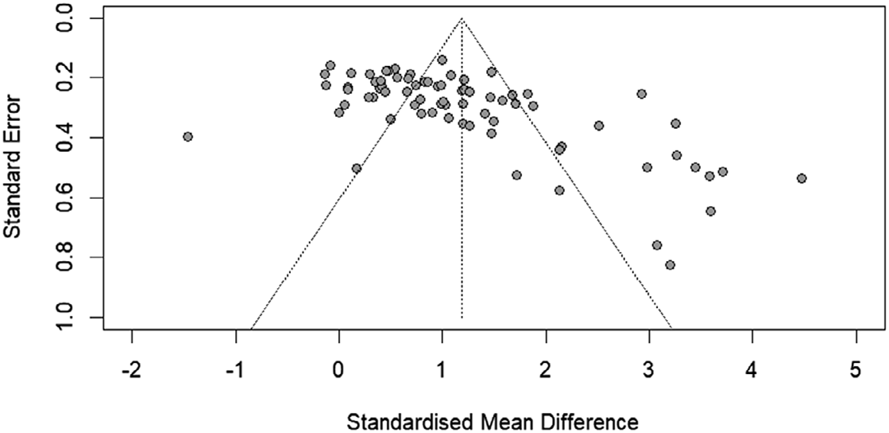

# 01. Hiệu quả tổng thể, heterogeneity và funnel plot

## Kết quả chính

Meta-analysis tổng hợp **75 effect sizes từ 56 experiments, n = 1954**. Kết quả pooled effect là:

- **Hedges’ g = 0.89**
- **95% CI = [0.69, 1.09]**

Theo benchmark mà paper sử dụng cho within-group designs, tác giả diễn giải đây là **small effect**, với sự cải thiện rõ ràng từ pre-test đến post-test.

## Nhưng heterogeneity rất cao

Paper báo **I² = 86.8%** (95% CI [.842, .891]). Nghĩa là effect sizes khác nhau nhiều giữa các nghiên cứu; không nên đọc g = .89 như thể mọi learner và mọi video đều tạo ra hiệu quả gần như nhau.

## Funnel plot và publication bias

Figure 1 ở trang PDF 13 cho thấy sự bất đối xứng. Egger’s test cũng cho kết quả asymmetry đáng kể. Tác giả lưu ý điều này **có thể** liên quan publication bias hoặc heterogeneity thực giữa các studies; within-group comparisons cũng làm việc diễn giải phức tạp hơn.

Một moderator analysis theo publication status lại không thấy effect đáng kể của publication status lên effect size (p = .66). Vì vậy paper không kết luận đơn giản rằng toàn bộ kết quả là do publication bias.

## Kiểm tra testing effect

Trong discussion, tác giả thực hiện thêm hai analyses trên subset:

- Between-groups với test-only control: **g = .65**, 95% CI [.32, .98], k = 15.
- Pre-post trên test-only conditions: **g = .15**, 95% CI [-.08, .38], k = 19.

Paper xem hai phân tích này như bằng chứng rằng hiệu quả chính không chỉ đơn thuần do việc làm test trước và sau, nhưng vẫn nhấn mạnh giới hạn của thiết kế pre-post.

## Tự kiểm tra

1. Vì sao g = .89 không có nghĩa “89% cải thiện”?
2. I² cao nói gì về việc áp dụng kết quả cho một learner cụ thể?
3. Funnel plot bất đối xứng có tự động chứng minh publication bias không?

**Nguồn trong PDF:** trang 12-13 và discussion trang 16.
