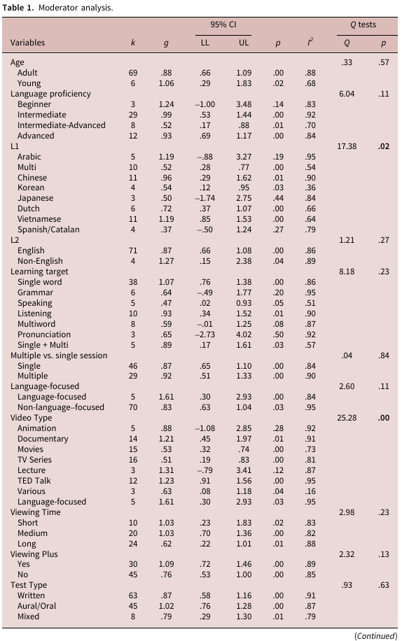
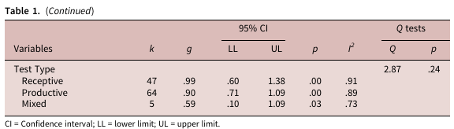

# 04. Video type, viewing time và viewing plus

## Bảng moderator chính

## Loại video - moderator nổi bật nhất

**Audiovisual input type có khác biệt đáng kể: Q = 25.28, p ≈ .00.**

Các estimates chính:

- Documentary: **g = 1.21**, 95% CI [.45, 1.97]
- TED Talk: **g = 1.23**, 95% CI [.91, 1.56]
- Movies: **g = .53**, 95% CI [.32, .74]
- TV Series: **g = .51**, 95% CI [.19, .83]
- Various clips: **g = .63**, 95% CI [.08, 1.18]
- Language-focused: **g = 1.61**, nhưng CI rất rộng [.30, 2.93] do k nhỏ

Animation và lecture có CIs rộng cắt zero, nên paper không xem estimates đó là ổn định.

## Language-focused vs non-language-focused

So sánh nhị phân này **không đạt significance** (Q = 2.60, p = .11), dù estimate language-focused lớn hơn. Đây là ví dụ quan trọng về việc không nên chỉ nhìn điểm estimate mà bỏ qua CI và Q-test.

## Viewing time

Không significant (**Q = 2.98, p = .23**): short và medium đều g ≈ 1.03; long g = .62. Paper gợi ý một khả năng là video dài làm target features “loãng” hơn hoặc tăng tải xử lý, nhưng đây là giải thích giả thuyết, không phải kết luận nhân quả được chứng minh.

## Viewing plus

Không significant ở mức subgroup difference (**Q = 2.32, p = .13**), nhưng pooled estimates là:

- viewing plus: **g = 1.09**;
- viewing alone: **g = .76**.

CIs overlap, vì vậy không thể nói chắc viewing plus vượt trội. Tuy nhiên discussion xem đây là tín hiệu có giá trị thực hành: hoạt động hỗ trợ có thể giúp tăng cognitive effort có ích và giảm ngại dùng video trong lớp.

## Tự kiểm tra

1. Moderator nào ở bài này có Q-test significant rõ ràng?
2. Tại sao “language-focused g = 1.61” chưa đủ để tuyên bố language-focused luôn tốt hơn?
3. CIs overlap có ý nghĩa gì khi so subgroup?

**Nguồn trong PDF:** trang 14-15, 18-20.
