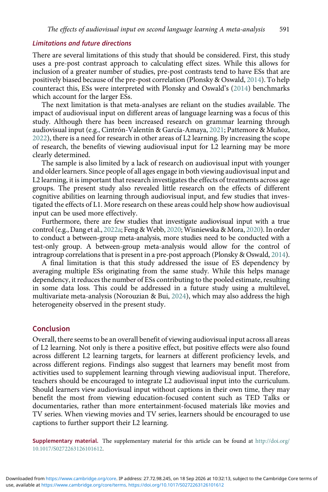

# 01. Limitations và future directions

## 1. Bias của pre-post effect sizes

Thiết kế chính dùng pre-post contrast. Paper lưu ý loại effect size này có thể **positively biased** do pre-post correlation. Tác giả bù một phần bằng benchmark phù hợp với within-group research, nhưng đây vẫn là limitation.

## 2. Meta-analysis bị giới hạn bởi literature sẵn có

Một số lĩnh vực có ít studies hơn, đặc biệt pronunciation và speaking. Vì vậy, lack of significant difference giữa learning targets không nên được đọc như bằng chứng hoàn hảo rằng mọi lĩnh vực đều giống nhau.

## 3. Thiếu dữ liệu theo nhóm tuổi và cognitive abilities

Literature nghiêng mạnh về adult learners; thiếu younger và older learners. Paper cũng thấy ít nghiên cứu về cognitive abilities và L1 effects.

## 4. Thiếu true control groups

Ít study có **test-only control**. Nhiều control conditions trong caption studies lại chính là unenhanced video, nên phân tích chính phải dựa vào within-group pre-post. Tác giả kêu gọi nhiều thiết kế có true control để có between-group meta-analysis tốt hơn.

## 5. Effect-size dependency

Paper average nhiều effect sizes từ cùng study để giảm dependency. Cách này làm mất một phần dữ liệu. Future work có thể dùng **multilevel, multivariate meta-analysis** để xử lý dependency và heterogeneity tốt hơn.

## Tự kiểm tra

1. Limitation nào ảnh hưởng trực tiếp đến khả năng suy luận causal effect?
2. Vì sao multilevel meta-analysis có thể tốt hơn việc đơn giản average effect sizes?
3. Thiếu young learners ảnh hưởng đến external validity như thế nào?

**Nguồn trong PDF:** trang 21.
