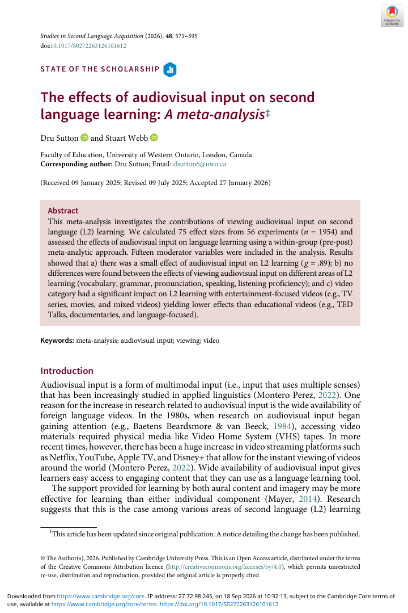

# Khóa học: Học ngôn ngữ thứ hai qua video - đọc và ứng dụng một meta-analysis

Khóa học này được chuyển thể từ bài báo **“The effects of audiovisual input on second language learning: A meta-analysis”** của **Dru Sutton & Stuart Webb (2026)**, đăng trên *Studies in Second Language Acquisition*.

## Khóa học trả lời điều gì?

Sau khi hoàn thành, người học có thể:

1. Giải thích “audiovisual input” trong phạm vi bài báo và phân biệt video có/không có chữ trên màn hình.
2. Hiểu cách một meta-analysis tổng hợp kết quả từ nhiều nghiên cứu.
3. Diễn giải các khái niệm chính: **Hedges’ g, confidence interval, heterogeneity (I²), moderator analysis, funnel plot**.
4. Tóm tắt kết quả về từ vựng, ngữ pháp, phát âm, nói và nghe.
5. Hiểu yếu tố nào **có** và **không có** bằng chứng là moderator đáng kể trong nghiên cứu này.
6. Chuyển các phát hiện thành một cách dùng video hợp lý cho việc học L2 mà không vượt quá bằng chứng của bài báo.
7. Nhận diện các giới hạn của thiết kế pre-post và những khoảng trống nghiên cứu còn lại.

## Cấu trúc

- **Module 01 - Nền tảng:** video là input ngôn ngữ như thế nào, các nghiên cứu trước đã thấy gì.
- **Module 02 - Thiết kế nghiên cứu:** câu hỏi nghiên cứu, tìm tài liệu, tiêu chí chọn nghiên cứu, coding và phân tích.
- **Module 03 - Kết quả:** hiệu quả tổng thể, moderator theo người học, mục tiêu học, loại video và cách kiểm tra.
- **Module 04 - Ứng dụng:** diễn giải kết quả cho người học và giáo viên.
- **Module 05 - Đọc phản biện:** giới hạn, hướng nghiên cứu tương lai và tổng kết.
- **Quiz:** bài kiểm tra cuối khóa + đáp án.

## Cách học đề xuất

Đọc theo thứ tự module. Mỗi bài có mục tiêu, nội dung cốt lõi, phần “Đọc số liệu”, và câu hỏi tự kiểm tra. Đây là **bản biên soạn học tập**, không phải bản dịch toàn văn của paper. Mọi con số nghiên cứu đều bám theo paper; các hoạt động học tập và cách diễn giải sư phạm được tổ chức lại để dễ học.

## Nguồn

Xem `source/SOURCE.md` và bản PDF gốc trong thư mục `source/`.
