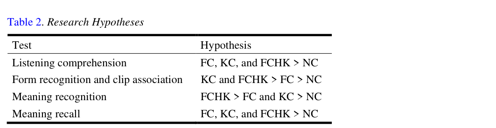

# Bài 03 - Research Questions và giả thuyết

## Mục tiêu

- Nắm hai research questions.
- Phân biệt dự đoán cho comprehension và bốn loại vocabulary test.
- Biết giả thuyết nào sau đó được xác nhận hoặc bác bỏ.

## 1. Research Question 1

Paper hỏi: **loại captioning có tạo ảnh hưởng khác nhau đến hiểu nội dung video L2 không?**

Comprehension được đo bằng ba bài kiểm tra gồm câu hỏi global và detailed.

Giả thuyết ban đầu: **FC, KC, FCHK > NC**. Giữa ba kiểu captioning, tác giả dùng null hypothesis vì nghiên cứu trước chưa nhất quán.

## 2. Research Question 2

Paper hỏi: **loại captioning có tạo ảnh hưởng khác nhau đến học từ vựng ngẫu nhiên không?**

Bốn thành phần được đo:

1. Form recognition
2. Clip association
3. Meaning recognition
4. Meaning recall

## 3. Logic của các giả thuyết

- **Form recognition & clip association:** tác giả kỳ vọng KC/FCHK mạnh nhất vì salience có thể kéo attention vào từ mục tiêu.
- **Meaning recognition:** FCHK được kỳ vọng mạnh vì vừa có full context vừa có highlighted words.
- **Meaning recall:** đây là yêu cầu khó hơn; tác giả dự đoán khoảng cách giữa các nhóm caption sẽ thu hẹp, nhưng vẫn kỳ vọng các nhóm caption hơn NC.

## 4. Học cách đọc paper

Một kỹ năng quan trọng là tách:

- **Giả thuyết trước dữ liệu** khỏi
- **Kết quả thực tế**.

Ở paper này, nhiều giả thuyết không được xác nhận hoàn toàn. Điều đó không làm nghiên cứu “thất bại”; nó cho biết cơ chế tác động của captioning phức tạp hơn dự kiến.

## Tự kiểm tra

1. RQ1 đo cái gì?
2. RQ2 chia vocabulary learning thành những thành phần nào?
3. Tại sao meaning recall được xem là khó hơn meaning recognition?

**Nguồn:** PDF trang 4–5, Research Questions và Table 2.
