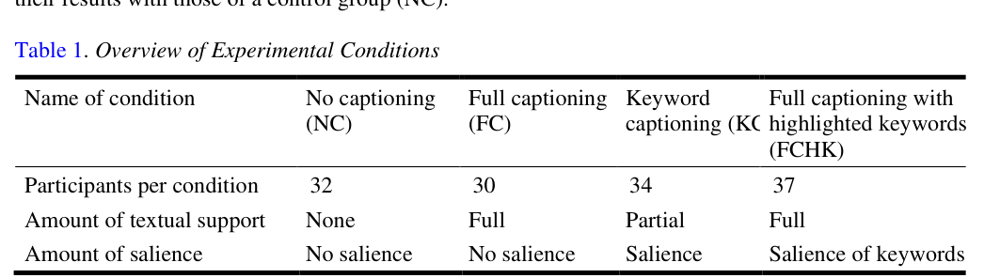

# Bài 04 - Participants, video materials và các điều kiện

## Mục tiêu

- Hiểu mẫu nghiên cứu và bối cảnh học tập.
- Biết ba video được chọn như thế nào.
- Hiểu các điều kiện thực nghiệm được phân bổ ra sao.

## 1. Participants

Paper phân tích **133 sinh viên luật bậc đại học** tại một đại học Flemish. Người học có khóa Legal French bắt buộc và được mô tả ở mức **intermediate đến high-intermediate** theo vocabulary size test của nghiên cứu.

Bốn điều kiện NC, FC, KC và FCHK được phân bổ ngẫu nhiên theo các nhóm lớp để đạt thành phần tương đối cân bằng.

## 2. Video materials

Nghiên cứu dùng ba clip tiếng Pháp tự nhiên từ chương trình thời sự dành cho người bản ngữ:

- Clip 1: nhà máy bia Pháp, **2:25**, 376 từ.
- Clip 2: chiến lược marketing Lego, **4:24**, 772 từ.
- Clip 3: lịch sử Lego, phiên bản dùng trong nghiên cứu **3:32**, 576 từ; một đoạn dài khoảng 2 phút được bỏ vì đòi hỏi quá nhiều kiến thức kinh tế.

Các clip có narrator và phỏng vấn ngắn. Transcript được tạo thủ công và captions được thêm bằng MAGpie.

## 3. Tại sao chọn video tự nhiên?

Paper muốn làm việc trong bối cảnh lớp học thực tế và với nội dung tương đối xác thực. Nhưng lựa chọn video tự nhiên cũng kéo theo trade-off: tác giả không thể kiểm soát hoàn toàn tần suất xuất hiện của target words.

## 4. Bốn điều kiện nhìn lại

Tổng số người theo điều kiện trong Table 1:

- NC: 32
- FC: 30
- KC: 34
- FCHK: 37

## Tự kiểm tra

1. Người tham gia học L2 nào?
2. Ba clip nói về chủ đề gì?
3. Việc dùng authentic video tạo ra hạn chế kiểm soát nào?

**Nguồn:** PDF trang 5–6, Methods → Participants, Materials, Video Selection.
