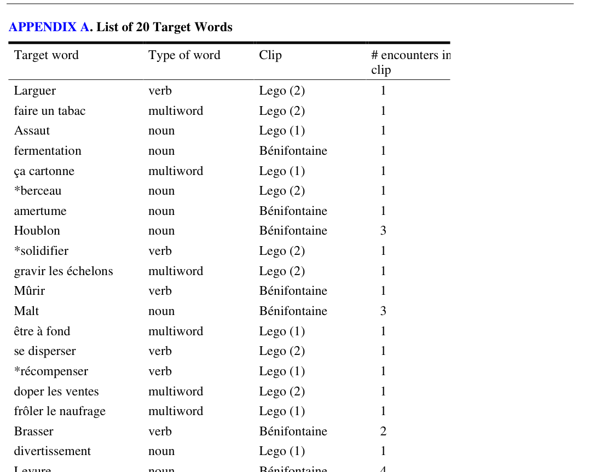
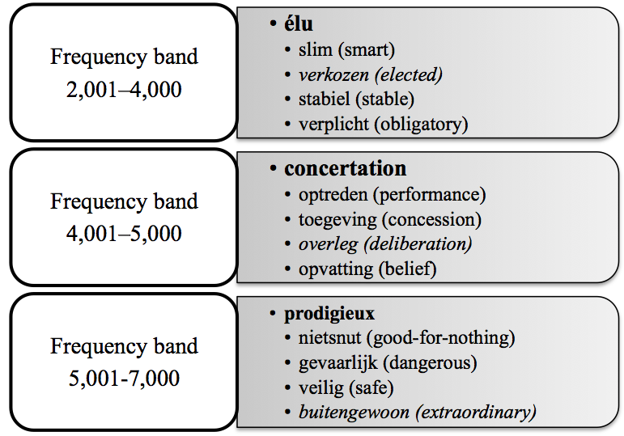
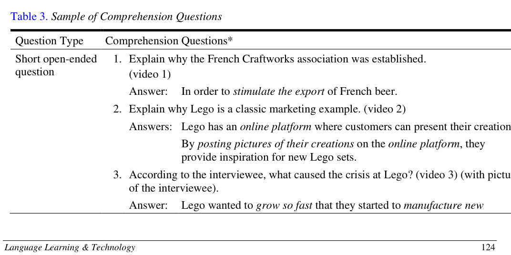
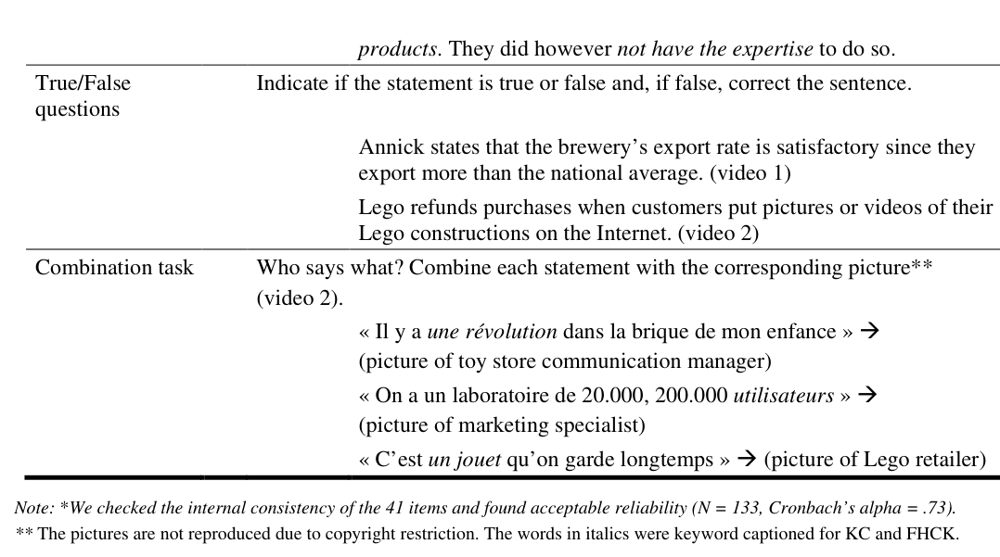
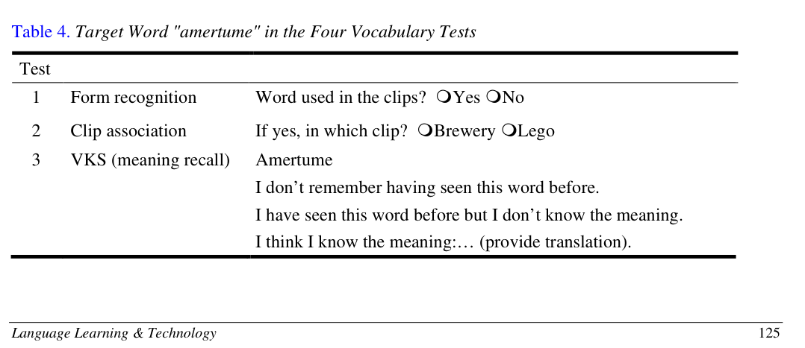
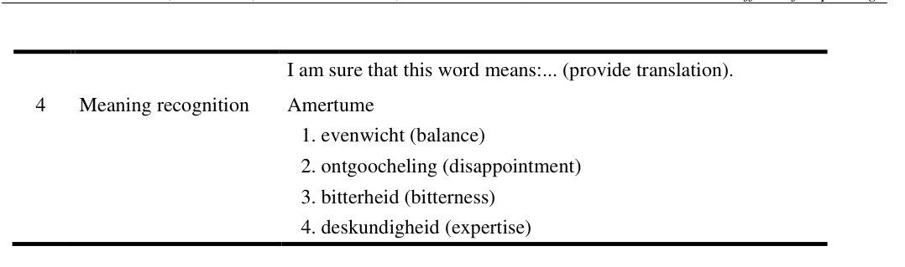

# Bài 05 - Target words, keywords và hệ thống bài kiểm tra

## Mục tiêu

- Hiểu quy trình chọn target words.
- Hiểu cách xác định keywords.
- Phân biệt từng công cụ đo vocabulary learning.

## 1. Chọn target words

Nhóm nghiên cứu bắt đầu từ 140 từ khả dĩ và kiểm tra mức quen thuộc trên một nhóm sinh viên có trình độ tương tự. Các từ mà ít nhất 70% sinh viên không biết được giữ lại, tạo thành 20 target words. Sau pretest, ba từ mà người tham gia đã biết được loại khỏi phân tích, còn **17 TWs**.

17 TWs gồm:

- 7 nouns
- 4 verbs
- 6 multiword units

Không có target word nào là cognate. Bốn từ xuất hiện nhiều hơn một lần trong clip.

## 2. Chọn keywords

Keywords được định nghĩa là các từ quan trọng đối với nghĩa của câu hoặc đoạn. Năm giảng viên tiếng Pháp có kinh nghiệm cùng đánh dấu keywords trên transcript.

Bộ keyword cuối cùng chiếm **17.11%**, tức **295/1,724 từ** trong ba video.

## 3. Vocabulary size test

Bài test 50 câu trắc nghiệm bao phủ ba dải tần suất:

- 2,001–4,000: 21 items
- 4,001–5,000: 15 items
- 5,001–7,000: 14 items

## 4. Ba comprehension tests

Tổng cộng có **41 items**:

- 19 short open-ended
- 14 true/false
- 8 combination items

Câu hỏi tập trung vào main ideas và các chi tiết liên quan; paper không dùng inferencing questions. Câu hỏi cũng tránh các đoạn chứa TWs để giảm nguy cơ bài comprehension tự nó thúc đẩy học từ.

## 5. Bốn vocabulary tests

Paper coi từ vựng là kiến thức phát triển theo nhiều mức, không phải “biết/không biết” đơn giản.

- **Form recognition:** từ này có xuất hiện trong clip không?
- **Clip association:** nếu có, xuất hiện ở clip Brewery hay Lego?
- **Meaning recall:** tự cung cấp bản dịch/nghĩa qua VKS.
- **Meaning recognition:** chọn đúng nghĩa trong bốn phương án.

## Tự kiểm tra

1. Vì sao chỉ còn 17 TWs được dùng trong phân tích?
2. Keywords chiếm bao nhiêu phần trăm transcript?
3. Form recognition khác meaning recognition ở đâu?

**Nguồn:** PDF trang 6–9, Target Word Selection, Keyword Determination Procedure, Instruments.
