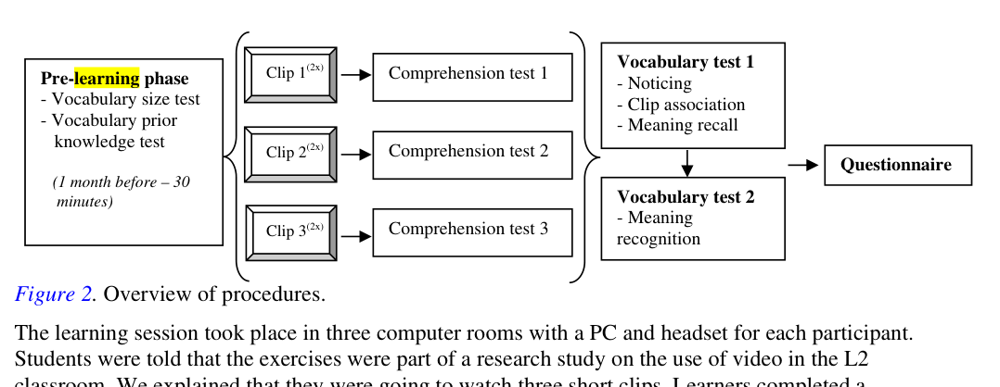
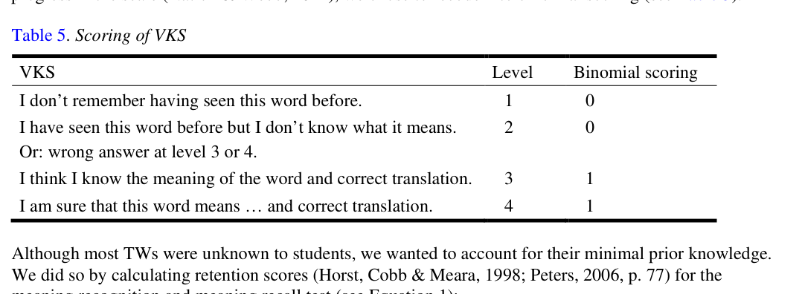

# Bài 06 - Procedure, scoring và MANCOVA

## Mục tiêu

- Theo dõi toàn bộ experimental procedure.
- Hiểu cách scoring các bài test.
- Biết vì sao vocabulary size được đưa vào như covariate.

## 1. Pilot và pre-learning

Ba tháng trước thí nghiệm chính, materials/procedure được pilot với 22 học sinh cuối cấp trung học. Comprehension test ban đầu quá dễ nên một số câu được sửa và thêm open-ended questions.

Một tháng trước learning session, người tham gia hoàn thành:

- vocabulary size test
- prior knowledge test

## 2. Experimental phase

Mỗi clip được xem **hai lần**, sau đó làm comprehension test tương ứng. Người học biết trước có comprehension tests nhưng **không được báo trước về vocabulary tests**, nhằm giữ tính incidental của việc học từ.

Buổi thực nghiệm kéo dài khoảng 90 phút; các bài kiểm tra dùng giấy-bút.

## 3. Scoring

### Comprehension

- Đúng hoàn toàn: 1 điểm.
- Open-ended đúng một phần: 0.5 điểm.
- True/False có hai nhiệm vụ: chọn đúng/sai và sửa câu sai; tối đa 2 điểm/item.

### Vocabulary

Form recognition, clip association và meaning recognition: 1 điểm cho mỗi câu đúng.

Meaning recall dùng VKS nhưng được mã hóa thành nhị phân để đo khả năng nhớ nghĩa:

## 4. Retention score

Với meaning recognition và meaning recall, nghiên cứu điều chỉnh theo prior knowledge: phần tăng thực tế được tính trên số từ thực sự chưa biết trước đó. Như vậy người học không được “tính công” cho từ vốn đã biết.

## 5. Phân tích thống kê

Với mỗi research question, tác giả dùng **MANCOVA**:

- Independent variable: type of captioning (NC, FC, KC, FCHK)
- Covariate: vocabulary size score
- Dependent variables: comprehension tests hoặc vocabulary tests
- Significance threshold: p = .05

Effect size dùng **partial eta squared (ηp²)**, với quy tắc tham chiếu Cohen được paper dùng: khoảng > .0099 nhỏ, > .0588 trung bình, > .1379 lớn.

## Tự kiểm tra

1. Tại sao người tham gia không được báo trước vocabulary tests?
2. Vocabulary size đóng vai trò gì trong MANCOVA?
3. Retention score giúp xử lý vấn đề prior knowledge ra sao?

**Nguồn:** PDF trang 9–11, Procedure, Scoring, Analyses.
